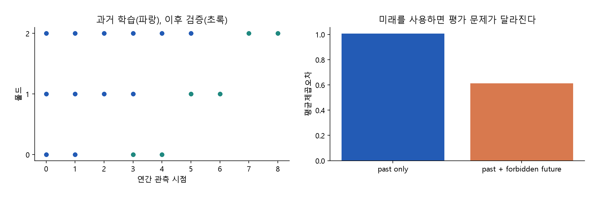
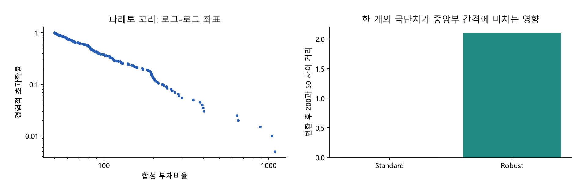
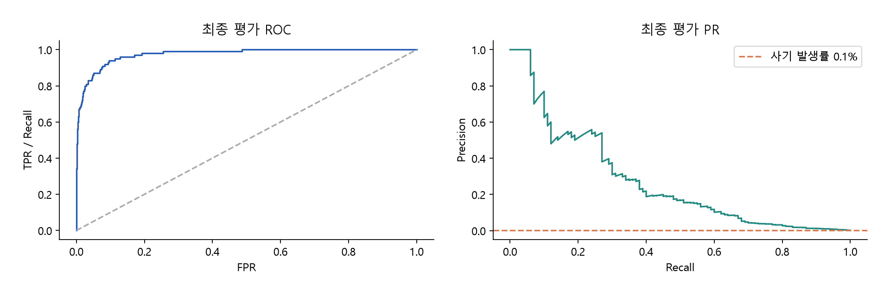
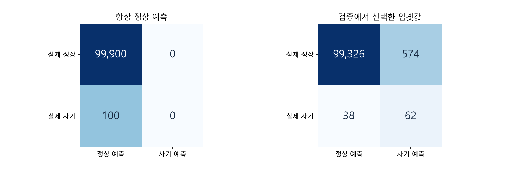
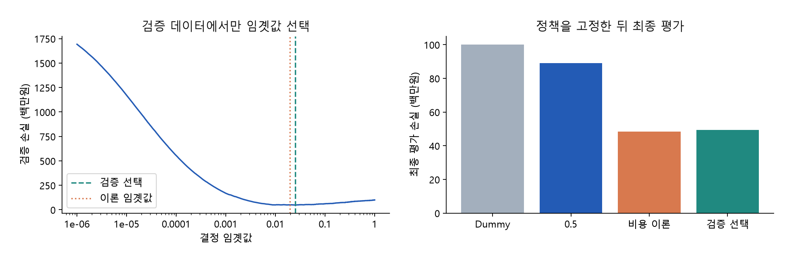

# Chapter 02 & Chapter 03. 사이킷런 전처리 프레임워크 및 불균형 평가 지표

> 금융 머신러닝 교재 · 개정 1.0 · Chapter 01 후속 · 개념 → 수식 유도 → 전체 코드 → 실제 실행 결과 → 금융 해석

## 집필 범위와 읽는 순서

Chapter 01에서 가격·피처·타깃의 시간 관계를 정의했다면, 이번 두 장에서는 그 데이터를 학습 가능한 형태로 변환하고, 모델의 예측이 실제 의사결정 비용을 줄이는지 확인한다. **Chapter 02는 기업 부실 예측**, **Chapter 03은 FDS(Fraud Detection System, 이상거래탐지)**를 중심으로 구성한다. 기업의 재무건전성과 결제 사기는 관측 단위와 발생률이 다른 문제이므로 데이터셋을 구분한다.

200개사 자료는 상장 기업의 재무 분석 상황을 모사한 **합성 자료**다. 실제 상장 기업을 수집한 자료가 아니며 식별자도 가상이다. 200개사를 한 번 관측한 200행 스냅샷과, 같은 200개사를 12개 연간 공시 시점에서 관측한 2,400행 패널을 함께 제공한다. 미래 검증을 위해 패널이 필요한 이유는 200개의 기업 번호를 시간 순서로 정렬하는 것만으로는 시계열 검증이 되지 않기 때문이다.

이 문서의 코드 블록은 순서대로 실행하는 **하나의 완전한 스크립트**다. 임포트, 함수, 데이터 생성, 학습, 그래프, 파일 저장까지 모두 포함한다. 동봉한 `chapter02_03_examples.py`와 같은 코드이며, 중간 블록만 독립적으로 실행할 때는 앞 블록의 정의가 먼저 필요하다. CSV와 결과표는 실제 실행에서 생성했다. 수치는 모사하거나 임의로 맞추지 않았다.

별도의 마스터 지침 원문은 제공된 자료에서 확인되지 않았다. 따라서 기존 Chapter 01의 다섯 단계 구성과 이번 요청의 필수 항목을 편집 기준으로 적용했다.

## 원본 슬라이드와 본문 매핑

쪽수는 첨부 *Machine Learning with Python*의 PDF 파일 기준이다. 원본의 일반적인 머신러닝 절차를 금융 사례로 재구성했으며, 금융 수식·비용 가정·합성 실험은 추가 집필 내용이다.

| 원본 PDF | 원본 주제 | 이번 장의 대응 내용 |
|---|---|---|
| 69–81쪽 | 데이터셋·Estimator·학습과 예측 | 2.1의 재무 4비율, pandas, 2.4의 Pipeline |
| 82–99쪽 | 데이터 분할, 교차 검증, GridSearchCV | 2.2의 시간 누수 증명과 Expanding Window, 2.4의 탐색 |
| 100–110쪽 | 전처리, 스케일링 | 2.3의 결측값·StandardScaler·RobustScaler 비교 |
| 111–122쪽 | 데이터 정리부터 예측까지의 통합 예제 | 2.1–2.4의 기업 부실 예측 통합 실습 |
| 124–132쪽 | 정확도, 단순 기준 분류기, 혼동행렬 | 3.1의 0.1% 사기 데이터와 DummyClassifier |
| 133–144쪽 | 정밀도·재현율, 임곗값, Binarizer, F1 | 3.2–3.4의 지표·비용 함수·임곗값 최적화 |
| 145–150쪽 | ROC와 AUC | 3.2의 ROC·PR·AP 비교 |
| 151–159쪽 | 분류 평가 종합 실습 | 3.4의 FDS 검증·정책 고정·최종 평가 |

# Chapter 02. 사이킷런 전처리 프레임워크

## 2.0 학습 목표와 공통 실행 환경

이 장을 마치면 재무비율의 분모와 단위를 설명하고, 기업별·시점별 패널에서 미래 정보가 들어가지 않는 학습 구간을 만들 수 있다. 또한 스케일링이 분포와 극단치에 어떤 영향을 받는지 계산하고, 전처리와 모델 선택을 동일한 검증 체계 안에 넣을 수 있다.

필요한 패키지는 NumPy, pandas, Matplotlib, scikit-learn이다. 아래는 두 장에서 사용하는 모든 임포트와 공통 설정이다. Python과 패키지 버전은 부록에 실행 환경 그대로 기록했다.

```python
from pathlib import Path
import json
import platform
import importlib.metadata
import numpy as np
import pandas as pd
import matplotlib
matplotlib.use('Agg')
import matplotlib.pyplot as plt
from matplotlib.ticker import FuncFormatter
from sklearn.base import clone
from sklearn.impute import SimpleImputer
from sklearn.preprocessing import StandardScaler, RobustScaler, Binarizer
from sklearn.pipeline import Pipeline
from sklearn.linear_model import LogisticRegression
from sklearn.model_selection import KFold, TimeSeriesSplit, GridSearchCV
from sklearn.dummy import DummyClassifier
from sklearn.metrics import (confusion_matrix, accuracy_score, precision_score,
    recall_score, f1_score, balanced_accuracy_score, roc_auc_score,
    average_precision_score, precision_recall_curve, roc_curve, brier_score_loss)

OUT = Path(__file__).resolve().parent
ASSETS = OUT / 'assets'
ASSETS.mkdir(exist_ok=True)
plt.rcParams.update({'font.family': 'Malgun Gothic', 'axes.unicode_minus': False,
    'font.size': 11, 'axes.spines.top': False, 'axes.spines.right': False,
    'figure.facecolor': 'white', 'savefig.dpi': 160})
FEATURES = ['Debt_Ratio', 'Current_Ratio', 'Operating_Margin', 'Interest_Coverage']
def save(fig, filename):
    fig.tight_layout(pad=2)
    fig.savefig(ASSETS / filename)
    plt.close(fig)
def emit(name, value):
    print(name)
    print(value.to_string(index=False) if isinstance(value, pd.DataFrame) else value)
```

`FEATURES`에는 네 재무비율만 지정한다. 기업 번호, 기간 번호, 미래 라벨, 재무제표 원시 계정은 입력에 자동 포함되지 않는다. `Path(__file__)`는 스크립트 실행 기준이다. 노트북에서 직접 실행할 경우 이 한 줄만 `OUT = Path.cwd()`로 바꾸면 된다. Matplotlib의 글꼴은 Windows의 맑은 고딕을 사용한다.

## 2.1 상장 기업 200개사의 재무건전성 데이터셋

### 단계 1. 금융 비즈니스와 타깃 정의

부실 예측은 ‘재무비율이 나쁘다’는 현재 상태를 분류하는 것과 구분해야 한다. 여기서는 **공시를 확인할 수 있는 시점 이후 1년 동안 부실 사건이 발생했는가**를 예측한다. 실무에서는 부도, 지급불이행, 회생절차 개시 등 사건의 정의를 먼저 고정해야 한다. 관리종목 지정이나 적자만을 같은 라벨로 섞으면 서로 다른 사건을 학습하게 된다.

합성 자료에서는 이 사건을 확률적으로 생성한 이진 라벨로 표현한다. 실제 기업의 법적 부실 여부를 판정하는 자료가 아니다. 연간 공시 가용일을 매년 5월 1일로 통일하고, 그로부터 1년 뒤를 라벨 종료일로 둔다. 날짜는 설명을 위한 가정이며 실제 기업의 공시 일정과 다르다.

### 단계 2. 네 재무비율의 정의와 계산

기업 i, 공시 시점 t에 대해 L은 총부채, E는 자본총계, CA는 유동자산, CL은 유동부채, S는 매출액, OP는 영업이익, IE는 이자비용이다. 같은 회계 기준·연결 범위·기간의 값을 사용한다.

$$DebtRatio_{i,t}=100\frac{L_{i,t}}{E_{i,t}}$$

국내 재무 분석에서 흔히 사용하는 부채/자본 정의를 채택했다. 영문 Debt Ratio가 부채/총자산을 뜻하는 자료도 있으므로 데이터 사전에 분모를 명시한다. 여기서 자본이 100억원, 부채가 150억원이면 150%다. 자본이 0이면 정의되지 않고, 음수 자본을 정상적인 저부채비율로 해석해서는 안 된다. 합성 데이터는 양수 자본으로 범위를 제한한다.

$$CurrentRatio_{i,t}=100\frac{CA_{i,t}}{CL_{i,t}}$$

유동자산 120억원, 유동부채 80억원이면 150%다. 높을수록 단기 지급 여력이 넓다고 해석할 수 있지만, 회수 불가능한 매출채권이나 재고 비중을 무시할 수는 없다. 유동부채 0인 경우를 무조건 큰 숫자로 바꾸지 말고 별도 결측·예외 규칙을 정한다.

$$OperatingMargin_{i,t}=100\frac{OP_{i,t}}{S_{i,t}}$$

매출액 200억원에 영업이익 −10억원이면 −5%다. 음수 값은 적자를 나타내므로 정상적인 관측값이다. 0 이하 매출이나 회계 변경에 따른 비교 가능성은 별도로 검토한다.

$$InterestCoverage_{i,t}=\frac{OP_{i,t}}{IE_{i,t}}$$

영업이익 12억원, 이자비용 4억원이면 3배다. 이자비용이 양수이고 영업이익이 음수이면 배율도 음수다. 자료에 따라 EBIT을 쓰는 경우도 있으나 이 장은 영업이익을 분자로 고정한다. 이자비용 0을 임의의 매우 작은 수로 바꾸면 거대한 가짜 배율이 생길 수 있다.

앞의 세 변수는 **퍼센트 수치**, 마지막은 **배수**다. 데이터에서 150은 150%를 나타내며 1.5와 혼용하지 않는다. 실습의 원시 회계 금액 단위는 10억원이다. 완전한 재무제표를 구성하는 모형은 아니며, 네 비율을 생성하는 데 필요한 계정만 사용한다.

#### 합성 생성 과정과 타깃

기업 고유 위험 uᵢ는 평균 0, 표준편차 0.7의 정규분포에서 한 번 뽑는다. 각 시점 위험은 다음과 같다.

$$q_{i,t}=u_i+v_{i,t}+0.035t,\qquad v_{i,t}\sim N(0,0.5^2)$$

자본은 로그정규분포, 부채비율은 파레토 꼬리를 가진 양수 변수와 위험 계수의 곱으로 생성한다. 유동비율은 위험이 높을수록 낮아지는 로그정규 형태, 영업이익률은 위험이 높을수록 낮아지는 정규 형태다. 다음 단계에서 부채·유동자산·영업이익·이자비용을 구성하고 네 비율을 다시 계산한다. 따라서 표에 저장한 비율의 산식과 원시 계정의 산식이 일치한다.

라벨 생성용 점수 η와 부실 확률 p는 다음과 같다. DR, CR, OM, IC는 각각 위 네 비율의 약칭이다.

$$\eta_{i,t}=-1.8+0.8\log(DR_{i,t}/100)-0.9\log(CR_{i,t}/100)-0.09OM_{i,t}-0.35\operatorname{asinh}(IC_{i,t})+0.04t$$

$$p_{i,t}=\frac{1}{1+\exp(-\eta_{i,t})},\qquad y_{i,t}\sim Bernoulli(p_{i,t})$$

asinh는 음수 이자보상배율에도 정의되며 큰 절댓값을 완만하게 변환한다. 이 생성식은 교육용 가정이고 실증적으로 추정한 기업 부도 모형이 아니다. 같은 생성식으로 부실 라벨을 만든 뒤 학습하므로, 실습의 성능은 실제 기업에 대한 일반화 근거가 아니다. 미래 결과를 관측 피처에 복사하지 않으며, 라벨 확률 계산 이후 피처 일부에 독립적인 결측을 넣는다.

### 단계 3. 전체 데이터 생성 코드와 pandas 연동

```python
def make_companies(n_companies=200, n_periods=12, seed=2026):
    rng = np.random.default_rng(seed)
    company_risk = rng.normal(0, 0.7, n_companies)
    frames = []
    for period in range(n_periods):
        risk = company_risk + rng.normal(0, 0.5, n_companies) + 0.035 * period
        equity = rng.lognormal(5, 0.7, n_companies)  # positive, billion KRW
        debt_ratio = 55 * (1 + rng.pareto(1.8, n_companies)) * np.exp(0.3*risk)
        liabilities = equity * debt_ratio / 100
        current_liabilities = liabilities * rng.uniform(0.25, 0.65, n_companies)
        current_ratio = 100 * np.exp(0.5 - 0.3*risk + rng.normal(0, 0.35, n_companies))
        current_assets = current_liabilities * current_ratio / 100
        revenue = (equity + liabilities) * rng.uniform(0.35, 1.1, n_companies)
        op_margin = 7 - 3.2*risk + rng.normal(0, 4, n_companies)
        operating_profit = revenue * op_margin / 100
        interest_expense = liabilities * rng.uniform(0.02, 0.07, n_companies)
        coverage = operating_profit / interest_expense
        score = (-1.8 + 0.8*np.log(debt_ratio/100)
                 - 0.9*np.log(current_ratio/100) - 0.09*op_margin
                 - 0.35*np.arcsinh(coverage) + 0.04*period)
        probability = 1 / (1 + np.exp(-score))
        distress = rng.binomial(1, probability)
        available = pd.Timestamp(year=2012+period, month=5, day=1)
        frame = pd.DataFrame({
            'company_id': [f'SYN{i:03d}' for i in range(n_companies)],
            'period': period, 'available_at': available,
            'label_end': available + pd.DateOffset(years=1),
            'Equity': equity, 'Liabilities': liabilities,
            'Current_Liabilities': current_liabilities, 'Current_Assets': current_assets,
            'Revenue': revenue, 'Operating_Profit': operating_profit,
            'Interest_Expense': interest_expense,
            'Debt_Ratio': 100*liabilities/equity,
            'Current_Ratio': 100*current_assets/current_liabilities,
            'Operating_Margin': 100*operating_profit/revenue,
            'Interest_Coverage': coverage, 'distress_next_year': distress})
        # Simulated missing inputs, applied after latent outcome generation.
        for col in FEATURES:
            frame.loc[rng.random(n_companies) < 0.025, col] = np.nan
        frames.append(frame)
    return pd.concat(frames, ignore_index=True).sort_values(
        ['available_at', 'company_id']).reset_index(drop=True)

companies = make_companies()
snapshot = companies.loc[companies['period'] == 11].copy()
assert snapshot['company_id'].nunique() == 200 and len(snapshot) == 200
assert len(companies) == 2400
companies.to_csv(OUT/'companies_panel_2400.csv', index=False, encoding='utf-8-sig')
snapshot.to_csv(OUT/'companies_snapshot_200.csv', index=False, encoding='utf-8-sig')
company_summary = companies.groupby('period', as_index=False).agg(
    rows=('company_id','size'), distressed=('distress_next_year','sum'))
emit('Company panel', company_summary)
```

`company_id`는 200개 고유 기업을 구별하고 `period`는 연간 시점을 나타낸다. 같은 기업이 여러 해에 나타나므로 2,400행이 2,400개의 독립 기업을 뜻하지 않는다. `available_at`은 피처를 사용할 수 있는 시각, `label_end`는 미래 사건 관측 구간의 끝이다. 실전에서는 사건 확정·수신 지연까지 반영한 별도 `label_available_at`이 필요하다. 기업 예제에서는 종료일 즉시 라벨이 알려진다고 단순화한다.

### 단계 4. 실제 생성 결과

| 공시 시점 | 기업 수 | 다음 1년 부실 라벨 |
| --- | --- | --- |
| 0 | 200 | 11 |
| 1 | 200 | 14 |
| 2 | 200 | 11 |
| 3 | 200 | 24 |
| 4 | 200 | 14 |
| 5 | 200 | 17 |
| 6 | 200 | 14 |
| 7 | 200 | 16 |
| 8 | 200 | 17 |
| 9 | 200 | 21 |
| 10 | 200 | 13 |
| 11 | 200 | 25 |


마지막 시점의 200행 표는 `companies_snapshot_200.csv`, 전체 패널은 `companies_panel_2400.csv`에 저장했다. 모델에는 `development[FEATURES]`로 4개 피처만 전달하고 `distress_next_year`를 타깃으로 전달한다. 결측은 전체 데이터 평균으로 채우지 않고 각 학습 폴드 안에서 중앙값으로 채운다.

### 단계 5. 금융 해석

재무비율의 큰 값이 항상 입력 오류인 것은 아니다. 자본이 작아지거나 이자비용이 작아지면 배율이 커질 수 있다. 먼저 분모와 회계 상태를 점검하고, 그다음 통계적 변환을 적용한다. 실제 자료로 교체할 때는 당시 상장 종목 집합, 상장폐지 기업, 수정 공시의 발표 시각과 연결·별도 재무제표 구분을 유지한다. 같은 기업의 미래를 예측하는 평가와 처음 보는 기업을 예측하는 평가는 서로 다른 배포 목표다.

## 2.2 교차 검증의 함정: 미래 데이터 누수의 수리적 증명

### 단계 1. 평가하려는 문제부터 구분한다

표본이 시간에 무관하게 교환 가능하고 새 표본도 같은 분포에서 나온다면 무작위 교차 검증이 합리적일 수 있다. 그러나 t 시점에서 미래를 예측하는 배포 목표에서는 t 이후에야 알 수 있는 표본을 학습에 넣을 수 없다. **KFold의 기본값은 shuffle=False**다. 이 절은 명시적으로 `shuffle=True`를 둔 경우를 분석한다. 셔플을 끈 일반 KFold도 앞쪽 검증 블록을 평가할 때 뒤쪽 블록을 학습에 사용하는 문제가 남는다.

### 단계 2-A. 정보 집합과 누수 정의

시간 t까지 사용할 수 있는 정보의 집합을 Fₜ라고 하자. 올바른 예측은 Fₜ에 대해 측정 가능한 함수여야 한다. 즉, 같은 Fₜ를 가진 두 상황에서 아직 모르는 미래 값만 바꿨다고 현재 예측이 달라져서는 안 된다.

$$\hat y_t=A(D_t)(X_t),\qquad D_t=\{(X_i,y_i):a_i<t\}$$

aᵢ는 학습 라벨이 사용 가능해진 시점이다. 피처 관측 시점 sᵢ가 t보다 이르더라도 미래 1년 라벨은 아직 완성되지 않았을 수 있다. 따라서 sᵢ<t만으로 충분하지 않고 aᵢ<t도 확인한다. 이 장에서는 경계일 당일 라벨도 사용하지 않는 보수적인 엄격 부등식을 쓴다.

무작위 폴드 k의 학습 집합 D₋ₖ에 aᵢ≥t인 관측이 포함되고 학습 알고리즘이 그 관측에 의존한다면, A(D₋ₖ)(Xₜ)는 Fₜ로 구현할 수 없는 예측이다. 이것이 시간 누수다. 미래 표본을 포함해도 무조건 모든 점수가 높아진다는 별개의 명제까지 증명되는 것은 아니다.

### 단계 2-B. 무작위 분할의 미래 포함 확률

시간 순서가 있는 N개 관측과 크기가 동일한 K개 폴드를 생각하자. N은 K로 나누어떨어지고, 시점 t의 표본이 검증 폴드에 속한다고 조건을 둔다. 그 표본을 제외한 N−1개 중 학습 표본 수는 n=N−N/K다. 각 다른 관측이 학습에 들어갈 조건부 확률은 다음과 같다.

$$P(i\in Train\mid t\in Valid)=\frac{n}{N-1}$$

t보다 미래인 표본 수를 m이라 하고, 미래 학습 표본 수를 Zₜ라 하자. 지시변수의 기대값을 더하면 다음을 얻는다.

$$Z_t=\sum_{i:s_i>s_t}1\{i\in Train\},\qquad E[Z_t\mid t\in Valid]=m\frac{n}{N-1}$$

예를 들어 N=200, K=5, n=160, 미래 관측 m=100이면 기대 미래 학습 표본 수는 100×160/199≈80.40개다. 이는 기업 수 200을 시간으로 간주한 실습 설계가 아니라, 시간 표본 N개에 대한 일반적인 조합 계산 예다.

미래 표본이 하나도 학습에 들어가지 않으려면 N−1−m개의 비미래 표본만으로 n개를 골라야 한다. 따라서

$$P(Z_t=0\mid t\in Valid)=\frac{\binom{N-1-m}{n}}{\binom{N-1}{n}}$$

위에서 n>N−1−m이면 분자를 0으로 정의한다. 그러면 최소 한 개의 미래 표본을 포함할 확률은 1에서 위 값을 뺀 것이다. 조합식은 폴드 배치의 위험을 정량화하며, 특정 모델의 낙관 편향 크기까지 결정하지는 않는다.

### 단계 2-C. 미래 관측이 오차를 실제로 낮추는 반례의 완전한 유도

미래 정보의 효과를 분리하기 위해 정상 AR(1)을 사용한다.

$$y_t=\rho y_{t-1}+\epsilon_t,\qquad |\rho|<1,\qquad \epsilon_t\sim N(0,\sigma^2)$$

과거 값 a=yₜ₋₁만 알면 yₜ의 조건부 분포는 N(ρa,σ²)다. 제곱오차를 최소화하는 예측은 조건부 평균이므로

$$\hat y_t^{past}=\rho a,\qquad E[(y_t-\hat y_t^{past})^2\mid a]=\sigma^2$$

이제 사용할 수 없는 미래 b=yₜ₊₁까지 주어졌다고 하자. b=ρyₜ+εₜ₊₁이므로 조건부 밀도는 다음에 비례한다.

$$p(y_t\mid a,b)\propto\exp\left[-\frac{(y_t-\rho a)^2+(b-\rho y_t)^2}{2\sigma^2}\right]$$

분자의 제곱합을 전개하면

$$ (y_t-\rho a)^2+(b-\rho y_t)^2=(1+\rho^2)y_t^2-2\rho(a+b)y_t+\rho^2a^2+b^2$$

완전제곱을 만들면 yₜ에 관한 항은 (1+ρ²)[yₜ−ρ(a+b)/(1+ρ²)]²가 된다. 나머지는 yₜ에 의존하지 않는 상수다. 따라서

$$E[y_t\mid a,b]=\frac{\rho(a+b)}{1+\rho^2},\qquad Var(y_t\mid a,b)=\frac{\sigma^2}{1+\rho^2}$$

ρ=0.8, σ²=1이면 정당한 예측의 MSE는 1, 미래를 사용한 평활화의 MSE는 1/1.64≈0.609756이다. **약 39.02%의 오차 감소가 미래 관측만으로 생긴다.** 이것은 예측 능력 개선이 아니라 다른 정보를 사용하는 문제로 바뀐 결과다. 아래 실험은 무작위 KFold의 특정 모델을 그대로 재현하는 코드가 아니라 이 조건부 오차 계산을 독립적으로 검증하는 실험이다.

### 단계 3-A. 날짜 단위 Expanding Window 구현

12개 공시 시점 중 마지막 두 시점 10·11을 최종 평가로 남긴다. 시점 9의 라벨은 시점 10에 끝나므로 엄격한 비중첩 기준에 따라 9를 경계 완충 구간으로 제외한다. 개발 구간은 0–8이다. `TimeSeriesSplit`은 2,400개의 행에 직접 적용하지 않고 **고유 공시 날짜 배열**에 적용한 뒤 기업 행으로 확장한다.

```python
# Final test: periods 10,11. Period 9 excluded because its label ends at test start.
development = companies.loc[companies['period'] <= 8].reset_index(drop=True)
company_test = companies.loc[companies['period'] >= 10].reset_index(drop=True)
unique_dates = np.sort(development['available_at'].unique())
time_cv = TimeSeriesSplit(n_splits=3, test_size=2, gap=1)
folds, fold_rows = [], []
for fold, (past_dates, next_dates) in enumerate(time_cv.split(unique_dates), start=1):
    train_rows = np.flatnonzero(development['available_at'].isin(unique_dates[past_dates]))
    valid_rows = np.flatnonzero(development['available_at'].isin(unique_dates[next_dates]))
    train = development.iloc[train_rows]
    valid = development.iloc[valid_rows]
    assert train['available_at'].max() < valid['available_at'].min()
    assert train['label_end'].max() < valid['available_at'].min()
    assert set(train['available_at']).isdisjoint(set(valid['available_at']))
    assert train['distress_next_year'].nunique() == 2
    assert valid['distress_next_year'].nunique() == 2
    folds.append((train_rows, valid_rows))
    fold_rows.append({'fold':fold, 'train_periods':','.join(map(str,past_dates)),
        'valid_periods':','.join(map(str,next_dates)),
        'train_rows':len(train_rows), 'valid_rows':len(valid_rows)})
assert development['label_end'].max() < company_test['available_at'].min()
fold_table = pd.DataFrame(fold_rows)
emit('Expanding window', fold_table)

# Audit a shuffled K-Fold; this is a deliberately invalid deployment evaluation.
bad_cv = KFold(n_splits=3, shuffle=True, random_state=2026)
bad_rows=[]
for fold,(tr,va) in enumerate(bad_cv.split(development),start=1):
    train_dates=development.iloc[tr]['available_at'].to_numpy()
    valid_dates=development.iloc[va]['available_at'].to_numpy()
    future_pairs = int((train_dates[:,None] > valid_dates[None,:]).sum())
    immature_pairs = int((development.iloc[tr]['label_end'].to_numpy()[:,None]
                          >= valid_dates[None,:]).sum())
    bad_rows.append({'fold':fold,'future_feature_pairs':future_pairs,
        'unavailable_label_pairs':immature_pairs,'all_pairs':len(tr)*len(va)})
bad_table=pd.DataFrame(bad_rows)
emit('Shuffled KFold time violations',bad_table)
```

`max_train_size=None`이므로 학습 구간의 시작점은 고정되고 끝점만 앞으로 늘어난다. `gap=1`은 이 코드에서 기업 한 개의 행이 아니라 날짜 배열의 한 구간, 즉 1년을 제외한다. 실제 라벨 기간이 다르거나 발표 지연이 불규칙하면 고정 gap만 믿지 말고 코드처럼 라벨 가용 시점을 직접 검사해야 한다. [TimeSeriesSplit 공식 문서](https://scikit-learn.org/stable/modules/generated/sklearn.model_selection.TimeSeriesSplit.html).

### 단계 3-B. AR(1) 수학 실증 코드

```python
def ar1_leakage_demo(n=100000, rho=0.8, sigma=1.0, seed=812):
    rng=np.random.default_rng(seed)
    previous=rng.normal(0,sigma/np.sqrt(1-rho*rho),n)
    current=rho*previous+rng.normal(0,sigma,n)
    future=rho*current+rng.normal(0,sigma,n)
    past_prediction=rho*previous
    leaked_prediction=rho/(1+rho*rho)*(previous+future)
    return pd.DataFrame({
        'estimator':['past only','past + forbidden future'],
        'theoretical_MSE':[sigma*sigma,sigma*sigma/(1+rho*rho)],
        'empirical_MSE':[np.mean((current-past_prediction)**2),
                         np.mean((current-leaked_prediction)**2)]})
leakage_table=ar1_leakage_demo()
emit('AR1 conditional error',leakage_table)
```

### 단계 4. 실행 결과

| 폴드 | 학습 시점 | 검증 시점 | 학습 행 | 검증 행 |
| --- | --- | --- | --- | --- |
| 1 | 0,1 | 3,4 | 400 | 400 |
| 2 | 0,1,2,3 | 5,6 | 800 | 400 |
| 3 | 0,1,2,3,4,5 | 7,8 | 1200 | 400 |


학습 행 수가 증가해도 검증은 매번 2개 시점, 400행으로 고정된다. 아래 표는 의도적으로 잘못된 무작위 폴드에서 미래 피처 쌍과 사용 불가능한 라벨 쌍을 센 결과다. 쌍의 개수이므로 서로 다른 표본의 개수로 읽지 않는다.

| 폴드 | 미래 피처 쌍 | 사용 불가 라벨 쌍 | 전체 학습·검증 쌍 |
| --- | --- | --- | --- |
| 1 | 307700 | 459750 | 720000 |
| 2 | 326639 | 476122 | 720000 |
| 3 | 326239 | 477291 | 720000 |


| 예측 정보 | 이론 MSE | 실측 MSE |
| --- | --- | --- |
| past only | 1.000000 | 1.006021 |
| past + forbidden future | 0.609756 | 0.612564 |




*그림 2-1. 왼쪽의 빈 시점은 라벨 중첩을 피하기 위한 간격이다. 오른쪽은 동일한 AR(1)에서 미래 정보를 허용했을 때 조건부 오차가 낮아지는 실험이다.*

### 단계 5. 결과의 금융 해석

시간 검증은 과거만 사용한다는 기본 제약을 지키지만 모든 편향을 없애지는 않는다. 미래에 수정된 공시가 과거 데이터에 덮어써졌거나 생존 기업만 남았다면 날짜 분할 후에도 문제가 남는다. 또한 같은 기업을 미래에 평가하는 이 설계는 신규 기업 일반화를 검증하지 않는다. 신규 기업 성능이 목적이라면 기업 그룹까지 분리하는 추가 설계가 필요하다.

## 2.3 멱법칙 꼬리와 극단치: StandardScaler 대 RobustScaler

### 단계 1. 금융 변수의 분포를 먼저 본다

재무배율은 분모가 작아질 때 매우 커질 수 있다. 금융 변수 중 일부는 두꺼운 꼬리를 보이지만, 모든 금융 변수가 정확한 멱법칙을 따른다는 뜻은 아니다. 이 절에서는 극단치 민감도를 분석하기 위해 파레토 분포를 **명시적으로 가정**한다. 분포의 형태를 바꾸는 변환과 스케일의 위치·크기만 조정하는 변환도 구분한다.

### 단계 2-A. 파레토 꼬리와 모멘트

최솟값 xₘ>0, 꼬리 지수 α>0인 파레토 변수 X의 생존함수와 밀도는 다음과 같다.

$$P(X>x)=\left(\frac{x_m}{x}\right)^\alpha,\qquad f(x)=\alpha x_m^\alpha x^{-(\alpha+1)},\quad x\geq x_m$$

q차 모멘트는 적분으로 구한다.

$$E[X^q]=\alpha x_m^\alpha\int_{x_m}^{\infty}x^{q-\alpha-1}dx$$

q<α일 때만 무한대 끝점이 수렴한다. 이때 적분하면

$$E[X^q]=\frac{\alpha x_m^q}{\alpha-q}$$

따라서 α>1이면 평균이 존재하고 α>2이면 분산이 존재한다.

$$E[X]=\frac{\alpha x_m}{\alpha-1},\qquad Var(X)=\frac{\alpha x_m^2}{(\alpha-1)^2(\alpha-2)}\quad (\alpha>2)$$

실험의 α=1.5에서는 평균은 유한하지만 모집단 분산은 무한하다. 유한 표본에서 표준편차를 계산할 수 없는 것이 아니라, 안정적인 유한 모집단 표준편차를 추정한다는 해석이 성립하지 않는다는 의미다.

### 단계 2-B. StandardScaler와 극단치 영향의 유도

열 j에 대해 학습 표본 n개의 평균 μⱼ와 모집단식 표준편차 sⱼ를 계산한다. 기본 StandardScaler는 `ddof=0`을 사용한다.

$$\mu_j=\frac{1}{n}\sum_{i=1}^{n}x_{ij},\qquad s_j=\sqrt{\frac{1}{n}\sum_{i=1}^{n}(x_{ij}-\mu_j)^2},\qquad z_{ij}=\frac{x_{ij}-\mu_j}{s_j}$$

검증 데이터에는 학습에서 구한 μⱼ와 sⱼ를 그대로 적용한다. 표준화는 평균과 분산을 조정할 뿐 데이터를 정규분포로 만들지 않는다. 분산이 0이면 단순 나눗셈은 정의되지 않으므로 구현은 0으로 나누지 않도록 해당 스케일을 처리한다. [StandardScaler 공식 문서](https://scikit-learn.org/stable/modules/generated/sklearn.preprocessing.StandardScaler.html).

한 열에서 n−1개 관측은 유한한 크기로 고정하고 마지막 값만 M→+∞로 보낸다. 평균과 분산의 지배항은

$$\mu_M\sim\frac{M}{n}$$

$$s_M^2\sim\frac{1}{n}\left[(n-1)\left(\frac{M}{n}\right)^2+\left(M-\frac{M}{n}\right)^2\right]=\frac{n-1}{n^2}M^2$$

따라서 sₘ∼M√(n−1)/n이고, 고정된 일반 관측 xᵢ의 변환값은

$$z_i\longrightarrow-\frac{1}{\sqrt{n-1}},\qquad z_M\longrightarrow\sqrt{n-1}$$

두 일반 관측 xₐ와 xᵦ 사이의 거리는 다음처럼 0으로 줄어든다.

$$|z_a-z_b|=\frac{|x_a-x_b|}{s_M}\longrightarrow0$$

즉, 하나의 극단치 때문에 중앙부 값들이 거의 같은 위치로 압축될 수 있다. 순서가 뒤집히는 것은 아니지만, 거리 기반 모델이나 정규화가 있는 모델의 학습 조건이 달라진다.

### 단계 2-C. Median·IQR과 RobustScaler

표본을 정렬해 x₍₁₎≤⋯≤x₍ₙ₎이라고 하자. n이 홀수이면 중앙값은 x₍₍ₙ₊₁₎/₂₎, 짝수이면 가운데 두 값의 평균이다. 예를 들어 [1,2,3,100]의 중앙값은 2.5이며 평균 26.5보다 극단값의 크기에 덜 영향을 받는다.

일반 분위수 Qₚ를 선형 보간으로 계산할 때 0부터 시작하는 정렬 배열에서 h=(n−1)p, k=floor(h), δ=h−k라고 두면

$$Q_p=(1-\delta)x_{(k+1)}+\delta x_{(k+2)}$$

끝점에서는 마지막 관측을 그대로 사용한다. IQR은 Q₀.₇₅−Q₀.₂₅다. 기본 RobustScaler는 각 열에 대해

$$m_j=Q_{0.5,j},\qquad IQR_j=Q_{0.75,j}-Q_{0.25,j},\qquad z_{ij}^{robust}=\frac{x_{ij}-m_j}{IQR_j}$$

를 적용한다. `quantile_range=(25,75)`, `unit_variance=False`의 기본 설정에 해당한다. 이 변환은 IQR을 1로 맞추지만 표준편차를 반드시 1로 만들지는 않는다. IQR이 0이면 구현상의 0 나눗셈 방지와 더불어 상수에 가까운 변수인지 점검해야 한다. [RobustScaler 공식 문서](https://scikit-learn.org/stable/modules/generated/sklearn.preprocessing.RobustScaler.html).

중앙부 순서통계량이 변하지 않는 범위에서 큰 값 하나를 더 크게 만들어도 중앙값과 IQR은 거의 바뀌지 않는다. 그러나 RobustScaler는 **극단값을 잘라내지 않는다**. 변환된 극단치는 여전히 매우 클 수 있고 모델에 영향을 줄 수 있다. 중앙값의 높은 강건성과 IQR의 강건성도 같은 오염 한계로 취급하지 않는다. 오염이 사분위 범위까지 침범하면 IQR도 불안정해질 수 있다.

### 단계 3. 변환 비교 전체 코드

```python
def scaling_demo(seed=92):
    rng=np.random.default_rng(seed)
    clean=50*(1+rng.pareto(1.5,200))
    contaminated=clean.copy()
    contaminated[0]=1_000_000
    rows=[]
    probes=np.array([50.,100.,200.,1_000_000.]).reshape(-1,1)
    for label,values in [('clean',clean),('one extreme',contaminated)]:
        for name,scaler in [('Standard',StandardScaler()),('Robust',RobustScaler())]:
            scaler.fit(values.reshape(-1,1))
            center=scaler.mean_[0] if name=='Standard' else scaler.center_[0]
            transformed=scaler.transform(probes).ravel()
            rows.append({'sample':label,'scaler':name,'center':center,
                'scale':scaler.scale_[0],'z50':transformed[0],
                'z100':transformed[1],'z200':transformed[2],
                'z1000000':transformed[3],
                'middle_gap':transformed[2]-transformed[0]})
    return clean,contaminated,pd.DataFrame(rows)
clean_tail,dirty_tail,scaling_table=scaling_demo()
emit('Scaler sensitivity',scaling_table)
```

‘clean’은 극단치가 전혀 없는 표본을 뜻하지 않는다. 원래의 파레토 표본이며, ‘one extreme’은 여기에 1,000,000이라는 추가 극단값을 하나 주입한 표본이다. 두 스케일러를 같은 입력에 적합한 뒤 50, 100, 200, 1,000,000이라는 공통 탐침 값을 변환한다.

### 단계 4. 실제 변환 결과

| 표본 | 변환 | 중심 | 척도 | 200−50 변환 간격 |
| --- | --- | --- | --- | --- |
| clean | Standard | 127.938166 | 140.785847 | 1.065448 |
| clean | Robust | 82.555733 | 71.329327 | 2.102922 |
| one extreme | Standard | 5122.480683 | 70525.104918 | 0.002127 |
| one extreme | Robust | 82.555733 | 71.329327 | 2.102922 |

| 표본 | 변환 | 50 변환 | 100 변환 | 200 변환 | 1,000,000 변환 |
| --- | --- | --- | --- | --- | --- |
| clean | Standard | -0.553594 | -0.198444 | 0.511854 | 7102.077966 |
| clean | Robust | -0.456414 | 0.244560 | 1.646507 | 14018.321578 |
| one extreme | Standard | -0.071924 | -0.071216 | -0.069798 | 14.106714 |
| one extreme | Robust | -0.456414 | 0.244560 | 1.646507 | 14018.321578 |




*그림 2-2. 오른쪽은 극단값 주입 후 원래 값 50과 200 사이의 변환 거리를 비교한다. RobustScaler에서 중앙부가 덜 압축된다고 해서 변환된 극단치가 제거된 것은 아니다.*

### 단계 5. 전처리 선택과 금융 해석

음수 영업이익률에 단순 log를 적용할 수는 없다. 분모 오류인지 정상 적자인지 확인한 뒤, 필요하면 부호를 보존하는 변환을 검토한다. 윈저라이징을 사용한다면 컷오프도 학습 구간에서만 추정하고, 부실을 알려주는 실제 극단 신호를 제거하는지 평가한다.

원본 슬라이드의 MinMaxScaler는 (x−최솟값)/(최댓값−최솟값)으로 범위를 조정하므로 극단치에 민감하다. Normalizer의 L2 방식은 각 **행**을 그 행의 벡터 길이로 나누는 x/√Σxⱼ²이며, 열별 재무비율 스케일링과 목적이 다르다. 범주형 업종을 추가할 때는 정수 코드를 크기 순서처럼 해석하지 않도록 인코딩을 별도로 설계한다. 이번 모델은 요청한 네 수치 비율만 사용하므로 범주형 입력이 없다.

## 2.4 전처리·모델·하이퍼파라미터 탐색을 하나의 틀로 묶기

### 단계 1. fit·transform·predict의 역할

`fit`은 학습 표본에서 파라미터를 추정한다. 결측 대체기는 학습 중앙값을, 스케일러는 학습 위치·척도를, 분류기는 가중치를 추정한다. `transform`은 이미 추정한 규칙으로 입력을 바꾸고, `predict_proba`는 학습된 모델로 클래스 확률 점수를 만든다. 검증 데이터에 다시 fit하면 평가의 의미가 바뀐다.

Pipeline은 `SimpleImputer → Scaler → LogisticRegression`을 묶는다. GridSearchCV는 각 후보·각 폴드마다 복제된 Pipeline을 학습하므로 전처리가 해당 학습 폴드 안에서 이루어진다. 스케일러를 전체 데이터에 먼저 적합한 뒤 변환 배열만 GridSearchCV에 넣는 방식은 피한다.

### 단계 2. 로지스틱 회귀의 목적함수

변환된 입력을 zᵢ, 가중치를 w, 절편을 b라고 하자.

$$a_i=w^Tz_i+b,\qquad p_i=\frac{1}{1+e^{-a_i}}$$

독립 베르누이 조건부 모형에서 우도는 ∏pᵢʸⁱ(1−pᵢ)¹⁻ʸⁱ다. 음의 로그를 취하면 이진 교차엔트로피가 된다.

$$J(w,b)=-\sum_{i=1}^{n}\left[y_i\log p_i+(1-y_i)\log(1-p_i)\right]+\frac{1}{2C}\|w\|_2^2$$

동일 가중치·L2 규제에서 합계 손실 형태로 쓴 목적함수다. 평균 손실 형태로 쓰면 규제항도 n으로 나누어 같은 최적점을 유지해야 한다. C가 작으면 규제가 강하다. 이 예제의 절편에는 이 규제항을 적용하지 않는다.

시그모이드의 미분은 dpᵢ/daᵢ=pᵢ(1−pᵢ)이고, 각 샘플의 교차엔트로피를 aᵢ로 미분하면 pᵢ−yᵢ다. 연쇄법칙으로

$$\nabla_w J=\sum_i(p_i-y_i)z_i+\frac{w}{C},\qquad \frac{\partial J}{\partial b}=\sum_i(p_i-y_i)$$

가 된다. w에 관한 헤시안은 Σpᵢ(1−pᵢ)zᵢzᵢᵀ+I/C다. 사이킷런의 최적화기는 이 목적을 수치적으로 최소화하며, 학습을 위해 손으로 미분 코드를 다시 구현할 필요는 없다.

교차 검증에서는 두 스케일러와 세 C값으로 총 6개 후보를 평가한다. 후보 λ의 점수는 3개 시간 검증 AP의 평균이다.

$$\hat\lambda=\arg\max_{\lambda}\frac{1}{3}\sum_{k=1}^{3}AP\left(y_{V_k},\hat p_{\lambda,T_k}(X_{V_k})\right)$$

AP는 Chapter 03에서 정의한다. 마지막 두 시점의 평가 성능은 후보 선택에 쓰지 않는다.

### 단계 3. 전체 탐색 코드

```python
credit_pipeline=Pipeline([
    ('impute',SimpleImputer(strategy='median')),
    ('scale',RobustScaler()),
    ('model',LogisticRegression(C=1.0,max_iter=4000,solver='lbfgs'))])
# A fresh imputer and scaler are fitted within every training fold.
credit_search=GridSearchCV(
    estimator=credit_pipeline,
    param_grid={'scale':[StandardScaler(),RobustScaler()],
                'model__C':[0.1,1.0,10.0]},
    scoring='average_precision',cv=folds,refit=True,n_jobs=1,error_score='raise')
credit_search.fit(development[FEATURES],development['distress_next_year'])
credit_cv=pd.DataFrame(credit_search.cv_results_)
credit_cv['scaler']=credit_cv['param_scale'].map(lambda v:type(v).__name__)
credit_cv_table=credit_cv[['scaler','param_model__C','mean_test_score','std_test_score']]
credit_prob=credit_search.predict_proba(company_test[FEATURES])[:,1]
credit_y=company_test['distress_next_year'].to_numpy()
credit_result={'best_scaler':type(credit_search.best_estimator_.named_steps['scale']).__name__,
    'best_C':float(credit_search.best_params_['model__C']),
    'test_AP':float(average_precision_score(credit_y,credit_prob)),
    'test_ROC_AUC':float(roc_auc_score(credit_y,credit_prob)),
    'test_prevalence':float(credit_y.mean())}
emit('Credit cross validation',credit_cv_table)
emit('Credit final test',credit_result)
```

`cv=folds`는 앞에서 날짜·라벨 경계를 검증한 행 인덱스 쌍이다. `refit=True`는 선택이 끝난 뒤 개발 구간 전체로 최종 전처리와 모델을 다시 학습한다. 최종 평가 시점보다 라벨이 모두 먼저 확정되므로 이 재학습이 가능하다. `error_score='raise'`는 실패한 폴드를 조용히 무시하지 않도록 한다.

### 단계 4. 실제 학습·평가 결과

| 스케일러 | C | 시간 검증 AP 평균 | AP 표준편차 |
| --- | --- | --- | --- |
| StandardScaler | 0.100000 | 0.265174 | 0.012996 |
| RobustScaler | 0.100000 | 0.263722 | 0.011004 |
| StandardScaler | 1.000000 | 0.265467 | 0.011804 |
| RobustScaler | 1.000000 | 0.264710 | 0.011732 |
| StandardScaler | 10.000000 | 0.265235 | 0.011376 |
| RobustScaler | 10.000000 | 0.263489 | 0.010582 |


선택된 모형은 **StandardScaler, C=1**다. 최종 400행의 부실 비율은 **9.50%**, AP는 **0.526145**, ROC-AUC는 **0.874237**다. 이는 해당 합성 실험의 결과이며 실제 기업 예측 실적이 아니다.

### 단계 5. 결과 해석

이번 합성 자료에서 선택된 스케일러가 모든 금융 데이터에서 우월한 것은 아니다. RobustScaler가 평균·표준편차의 오염을 줄이는 성질과 특정 모델의 AP를 최대화하는지는 다른 문제다. 특히 규제와 입력 척도가 함께 바뀌므로 스케일러만 따로 평가하지 않고 C와 함께 검증한다. 세 폴드의 표준편차는 성능 변동의 기술 통계이며 독립 표본 기반 신뢰구간이 아니다.

# Chapter 03. 불균형 평가 지표와 비대칭 비용

## 3.0 학습 목표와 문제 전환

이 장에서는 거래 100,000건 중 사기 100건인 FDS를 다룬다. 기업 부실 라벨과 사기 라벨을 합치지 않는다. 목표는 정확도가 높은 모델을 고르는 데서 끝나지 않고, **정상 거래를 막는 비용과 사기를 놓치는 비용을 함께 줄이는 정책**을 검증하는 것이다.

## 3.1 사기 0.1%에서 정확도 99.9%가 의미하는 것

### 단계 1. FDS의 관측 단위와 가용 정보

각 행은 결제 한 건이다. 입력은 거래액의 로그 척도 점수, 최근 거래 빈도 점수, 이동 거리 점수, 기기 위험 점수 네 개다. 합성 생성 과정에서는 각 클래스가 같은 공분산을 가진 정규분포에서 나온다. 실제 금액·거리·기기 식별 정보를 수집한 자료가 아니다. 점수는 결제 의사결정 전에 계산된 것으로 가정하고, 사기 라벨은 거래 7일 후 확정된다고 둔다.

학습·검증·평가 구간을 각각 100,000건으로 만들고, 각 구간에 사기를 **정확히 100건 배치**한다. 이는 불균형의 효과를 분명하게 보이기 위한 실험 통제다. 실전에서는 구간마다 발생률이 달라지고 사기가 군집해 발생할 수 있다.

### 단계 2. 정확도의 역설 유도

정상은 y=0, 사기는 y=1, 사기 경보는 예측 1이다. 혼동행렬은 실제 클래스를 행, 예측 클래스를 열로 둔다.

| 실제 / 예측 | 정상 0 | 사기 경보 1 |
|---|---:|---:|
| 정상 0 | TN | FP |
| 사기 1 | FN | TP |

전체 N=TN+FP+FN+TP이고

$$Accuracy=\frac{TN+TP}{N}$$

사기 비율을 π라 하고 항상 정상으로 예측하면 TP=FP=0, TN=(1−π)N, FN=πN이다. 따라서

$$Accuracy_{dummy}=\frac{(1-\pi)N}{N}=1-\pi$$

π=0.001이면 1−0.001=0.999, 즉 **99.9%**다. 그러나 탐지한 사기는 0건이다. 이 정확도는 사기 탐지 능력을 보여주지 않는다.

### 단계 3-A. 불균형 데이터 전체 생성 코드

```python
FDS_FEATURES=['amount_log_z','velocity_z','distance_z','device_risk_z']
def make_fds_block(n=100000,seed=1,start='2025-01-01'):
    if n%1000 != 0:
        raise ValueError('Use a multiple of 1000 for exactly 0.1% fraud.')
    rng=np.random.default_rng(seed)
    y=np.zeros(n,dtype=int)
    y[rng.choice(n,size=n//1000,replace=False)]=1
    # Equal-covariance Gaussian class conditionals; no outcome-derived inputs.
    shift=np.array([2.0,1.4,1.2,0.8])
    X=rng.normal(size=(n,4))+y[:,None]*shift
    frame=pd.DataFrame(X,columns=FDS_FEATURES)
    frame['transaction_at']=pd.date_range(start,periods=n,freq='min')
    frame['label_available_at']=frame['transaction_at']+pd.Timedelta(days=7)
    frame['fraud']=y
    return frame
fds_train=make_fds_block(seed=11,start='2025-01-01')
fds_valid=make_fds_block(seed=22,start='2025-04-01')
fds_test=make_fds_block(seed=33,start='2025-07-01')
assert fds_train['label_available_at'].max() < fds_valid['transaction_at'].min()
assert fds_valid['label_available_at'].max() < fds_test['transaction_at'].min()
for name,frame in [('train',fds_train),('validation',fds_valid),('test',fds_test)]:
    assert frame['fraud'].sum()==100
    frame.to_csv(OUT/f'fds_{name}.csv',index=False,encoding='utf-8-sig')
```

라벨을 먼저 생성한 뒤 조건부 분포에서 X를 뽑는 것은 합성 결합분포를 표본화하는 방법이다. 운영 시 입력에 실제 라벨을 사용한다는 뜻이 아니다. `fraud`와 두 시각 열은 `FDS_FEATURES`에서 제외되어 있다. 학습 라벨 확정일이 검증 시작일보다 이르고, 검증 라벨 확정일도 최종 평가 시작일보다 이른지 검증한다.

### 단계 3-B. DummyClassifier와 공통 평가 코드

```python
C_FP=20_000
C_FN=1_000_000
def classification_report_row(y_true,y_pred,probability,name):
    tn,fp,fn,tp=confusion_matrix(y_true,y_pred,labels=[0,1]).ravel()
    return {'policy':name,'TN':int(tn),'FP':int(fp),'FN':int(fn),'TP':int(tp),
        'accuracy':accuracy_score(y_true,y_pred),
        'precision':precision_score(y_true,y_pred,zero_division=0),
        'recall':recall_score(y_true,y_pred,zero_division=0),
        'F1':f1_score(y_true,y_pred,zero_division=0),
        'balanced_accuracy':balanced_accuracy_score(y_true,y_pred),
        'ROC_AUC':roc_auc_score(y_true,probability),
        'AP':average_precision_score(y_true,probability),
        'loss_KRW':int(C_FP*fp+C_FN*fn),
        'alerts':int(tp+fp)}
dummy=DummyClassifier(strategy='most_frequent')
dummy.fit(fds_train[FDS_FEATURES],fds_train['fraud'])
dummy_pred=dummy.predict(fds_test[FDS_FEATURES])
dummy_prob=dummy.predict_proba(fds_test[FDS_FEATURES])[:,1]
dummy_row=classification_report_row(fds_test['fraud'],dummy_pred,dummy_prob,'Dummy')
assert dummy_row['accuracy']==0.999
assert dummy_row['FN']==100 and dummy_row['TP']==0
assert dummy_row['loss_KRW']==100_000_000
emit('Dummy final test',dummy_row)
```

`zero_division=0`은 예측 양성이 0개라 정밀도의 분모가 0일 때 출력값을 0으로 정하는 규칙이다. 수학적으로 정의되지 않는 비율을 0으로 보고한다는 사실을 해석에 남겨야 한다. `labels=[0,1]`로 혼동행렬 순서를 고정한다. [사이킷런 평가 지표와 DummyClassifier 설명](https://scikit-learn.org/stable/modules/model_evaluation.html).

### 단계 4. 실제 실행 결과

최종 평가 100,000건에서 **TN=99,900, FP=0, FN=100, TP=0**이다. 정확도는 **99.9%**, 재현율은 **0%**, 균형 정확도는 **50%**, AP는 **0.001**, ROC-AUC는 **0.5**다. 미탐지 100건의 합계 손실은 **100,000,000원(1억원)**이다.

### 단계 5. 금융 해석

정확도에만 의존하면 거래를 전부 승인하는 정책이 좋아 보인다. 그래서 사기 재현율, 정상 거래의 오탐률, 경보 건수, 비용을 함께 보고한다. 극단적 불균형은 모델을 사용하지 말아야 한다는 뜻이 아니라, 목표와 평가 지표를 업무에 맞게 정해야 한다는 뜻이다.

## 3.2 정밀도·재현율·F1·ROC·PR를 연결해서 읽기

### 단계 1. 같은 예측도 다른 질문으로 평가한다

재현율은 실제 사기 중 얼마나 잡았는지, 정밀도는 경보 중 실제 사기가 얼마나 되는지 묻는다. 오탐률은 정상 고객이 불필요한 검증을 받는 비율이다. 발생률이 매우 낮으면 작은 오탐률도 많은 정상 고객을 뜻한다.

### 단계 2-A. 지표의 분모와 유도

$$Precision=\frac{TP}{TP+FP},\qquad Recall=TPR=\frac{TP}{TP+FN}$$

$$Specificity=TNR=\frac{TN}{TN+FP},\qquad FPR=\frac{FP}{TN+FP}=1-TNR$$

F1은 두 비율의 조화평균이다.

$$F1=\frac{2}{1/Precision+1/Recall}=\frac{2TP}{2TP+FP+FN}$$

일반화한 Fβ는 재현율의 상대적 가중치를 β²로 둔다.

$$F_\beta=\frac{(1+\beta^2)TP}{(1+\beta^2)TP+\beta^2 FN+FP}$$

균형 정확도는 클래스별 재현율의 평균이다.

$$BalancedAccuracy=\frac{TPR+TNR}{2}$$

항상 정상인 분류기는 TPR=0, TNR=1이므로 균형 정확도는 0.5다. F1과 Fβ는 금액 단위 비용을 직접 나타내지 않는다. FN이 FP보다 50배 비싸다고 해서 Fβ에서 β²=50을 설정하는 것이 곧바로 총손실 최소화와 같아지지는 않는다. 분모도 예측에 따라 바뀌기 때문이다.

#### 베이스레이트와 정밀도의 연결

TP=NπTPR, FP=N(1−π)FPR를 정밀도 식에 대입하면

$$Precision=\frac{\pi TPR}{\pi TPR+(1-\pi)FPR}$$

이다. π=0.001, TPR=0.9, FPR=0.01이면 분자는 0.0009, 분모는 0.01089이므로 정밀도는 약 **8.26%**다. 재현율이 90%이고 정상 거래의 99%를 맞혀도 경보 대부분은 정상 거래일 수 있다.

### 단계 2-B. ROC-AUC와 PR·AP

확률 점수 p̂를 임곗값 τ보다 클 때 양성으로 판정하면 τ마다 TPR과 FPR이 달라진다. ROC는 FPR을 가로축, TPR을 세로축으로 그린 곡선이다. ROC-AUC는 무작위 양성 점수가 무작위 음성 점수보다 클 확률에 동점의 절반을 더한 순위 통계로 해석할 수 있다.

$$AUC=P(s^+>s^-)+\frac{1}{2}P(s^+=s^-)$$

PR 곡선은 재현율을 가로축, 정밀도를 세로축으로 둔다. AP(Average Precision)는 재현율이 증가하는 계단 구간별 정밀도를 가중 합산한다.

$$AP=\sum_k(R_k-R_{k-1})P_k$$

사이킷런의 AP와 PR 곡선을 사다리꼴로 적분한 값은 일반적으로 같지 않다. 일정한 점수의 기준 분류기는 ROC-AUC가 0.5이고 AP는 양성 비율 0.001이다. 무작위 순위의 PR 기준선도 모집단 관점에서 발생률에 대응하지만, 유한 표본의 무작위 AP가 항상 정확히 0.001인 것은 아니다.

ROC-AUC는 중요한 순위 정보지만 FDS의 정상 거래 수가 압도적으로 크다는 업무량을 직접 표현하지 않는다. PR, 비용, 경보 수와 함께 읽는다. `precision_recall_curve`가 반환하는 precision·recall은 thresholds보다 원소가 하나 더 많다는 점도 주의한다. 마지막 경계점을 같은 길이의 임곗값 배열처럼 다루면 안 된다.

### 단계 2-C. 확률 보정과 Brier 점수

순위가 좋아도 점수 0.02가 실제 사기 확률 2%를 뜻하지 않을 수 있다. 보정된 확률이라면 비슷한 점수 구간의 실제 발생 비율이 그 점수와 맞아야 한다. Brier 점수는

$$Brier=\frac{1}{N}\sum_{i=1}^{N}(\hat p_i-y_i)^2$$

로 계산한다. 작을수록 확률 오차가 작지만 불균형에서는 항상 낮은 확률을 주는 모형도 낮은 점수를 얻으므로 Brier 하나만으로 보정이 충분하다고 판정하지 않는다. 이 장에서는 로지스틱 모형과 동일 발생률의 합성 분포를 쓰지만 확률의 완벽한 보정을 가정하지 않고, 임곗값을 별도 검증 구간에서 선택한다.

### 단계 3–5. 계산 코드·그림·해석의 연결

이 절의 모든 지표 계산은 3.1의 `classification_report_row`에 포함되어 있다. ROC·PR 전체 생성 코드는 부록 A에 포함하고, 최종 결과는 3.4의 고정된 정책 평가와 연결한다. 임곗값을 바꿔도 같은 확률 점수의 ROC-AUC와 AP는 바뀌지 않는다. 달라지는 것은 혼동행렬, 정밀도·재현율, 경보 수와 비용이다.



*그림 3-2. 최종 평가 점수로 그린 진단 그림이다. 이 그림을 보고 임곗값을 다시 고르면 최종 평가가 추가 검증으로 바뀐다.*

## 3.3 비대칭 비용 행렬과 최적 의사결정

### 단계 1. FP·FN과 가설검정의 대응

귀무가설 H₀를 ‘정상 거래’, 대립가설 H₁을 ‘사기 거래’로 두면 정상인데 경보를 내는 FP는 제1종 오류, 사기인데 정상 처리하는 FN은 제2종 오류에 대응한다. 이 대응은 H₀의 정의에 의존한다.

요청한 비용 가정은 FP 1건당 본인인증·고객 마찰 비용 20,000원, FN 1건당 미탐지 손실 1,000,000원이다. 비용의 비는 50:1이다. 이는 사용자 지정 실험 비용이며 실제 결제사의 측정 비용으로 제시하지 않는다.

### 단계 2-A. 비용 행렬과 표본 총손실 유도

정확히 분류한 거래의 추가 손실은 0이라고 가정한다. TP에서는 사기가 완전히 차단되고 별도 인증 비용도 없다는 단순화가 포함된다.

| 실제 / 조치 | 정상 승인 0 | 경보·인증 1 |
|---|---:|---:|
| 정상 0 | C₀₀=0원 | C₀₁=20,000원 |
| 사기 1 | C₁₀=1,000,000원 | C₁₁=0원 |

임곗값 정책을 δτ(p̂)=1{p̂>τ}라 하자. 거래 i의 손실은

$$\ell_i(\tau)=20000(1-y_i)1\{\hat p_i>\tau\}+1000000y_i1\{\hat p_i\leq\tau\}$$

이다. 이를 N건에 대해 더하면 첫 합계는 FP, 두 번째 합계는 FN이므로

$$L(\tau)=\sum_i\ell_i(\tau)=20000FP(\tau)+1000000FN(\tau)$$

가 된다. 거래 수가 같은 검증 집합에서는 총손실 L과 건당 손실 L/N의 최솟값이 같은 임곗값에서 나온다. 서로 다른 구간 크기를 비교할 때는 건당 손실과 거래량도 함께 제시한다.

발생률 π, 오탐률 FPR, 재현율 TPR로 표현하면

$$E[L]/N=20000(1-\pi)FPR+1000000\pi(1-TPR)$$

이다. 전부 정상 처리하면 π=0.001에서 건당 1,000원, 100,000건에서 **1억원**이다. 전부 경보 처리하면 정상 99,900건×20,000원=**19억 9,800만원**이다. 사기를 놓치지 않는 것만 극대화해도 총손실이 커질 수 있다.

### 단계 2-B. 보정 확률에서의 이론적 임곗값

x가 주어졌을 때 사기 확률을 p=P(y=1|x)라고 하자. 정상으로 처리할 조건부 기대손실은

$$R(0\mid x)=pC_{10}+(1-p)C_{00}=1000000p$$

이고, 경보를 낼 기대손실은

$$R(1\mid x)=(1-p)C_{01}+pC_{11}=20000(1-p)$$

이다. 경보를 내는 것이 더 저렴하려면

$$20000(1-p)<1000000p$$

이어야 한다. 전개하면 20000<1020000p이므로

$$p>\frac{20000}{1020000}=\frac{1}{51}\approx0.019607843$$

를 얻는다. 즉 이 비용과 보정 확률 가정에서는 약 **1.9608%**가 이론적 경계다. 비용이 50배라고 단순히 0.5/50으로 계산하지 않는다.

이 확률은 이미 발생률을 반영한 사후확률이므로 여기에 0.1%를 다시 곱하지 않는다. 클래스 가중치나 재표본화로 학습 분포를 바꾸었다면 `predict_proba`가 원래 발생률의 사후확률인지 별도로 확인해야 한다. 이번 실습은 `class_weight=None`을 사용하고 사기를 과표집하지 않는다.

일반 비용 행렬에서는

$$R(1\mid x)-R(0\mid x)=(1-p)(C_{01}-C_{00})-p(C_{10}-C_{11})$$

이므로 두 비용 차이가 양수이면 다음 임곗값을 얻는다.

$$\tau^*=\frac{C_{01}-C_{00}}{(C_{01}-C_{00})+(C_{10}-C_{11})}$$

실제로 사기 탐지 TP에도 동일한 인증비 20,000원이 든다면 C₁₁=20,000원을 넣어 임곗값은 20,000/(20,000+980,000)=0.02가 된다. 본 실습은 요청한 FP·FN 손실만 합산하는 첫 번째 행렬을 사용한다.

### 단계 2-C. 이론과 실증 최적화가 다른 이유

이론값은 실제 확률을 알고 비용이 정확하며 처리 용량 제약이 없다는 조건에서 최적이다. 모델 확률 오차, 유한한 검증 표본, 분포 변화가 있으면 관측 손실의 최소점은 달라질 수 있다. 실증 선택은

$$\hat\tau=\arg\min_{\tau\in G}\left[20000FP_{valid}(\tau)+1000000FN_{valid}(\tau)\right]$$

이다. G는 미리 정한 유한 임곗값 집합이다. 손실 함수는 점수가 임곗값을 통과할 때만 변하므로 계단함수다. 연속적인 미분 최적화보다 후보를 직접 비교하는 방식이 자연스럽다. 유한 그리드에서 찾은 최적값을 모든 실수 임곗값에 대한 전역 최적이라고 부르지는 않는다.

### 단계 3–5. 실습 연결

앞 절의 `C_FP`, `C_FN`은 이 행렬을 코드로 옮긴 값이다. 다음 절에서 같은 비용을 모든 후보에 적용하고, 손실이 동률이면 경보 건수가 작은 후보, 그래도 같으면 임곗값이 큰 후보를 선택한다. 동률 규칙을 결과를 본 뒤 유리하게 바꾸지 않는다.

## 3.4 Binarizer 기반 임곗값 그리드 탐색 파이프라인

### 단계 1. 학습과 정책 선택을 분리한다

전체 흐름은 **과거 학습 → 이후 검증 확률 생성 → 비용 그리드 탐색 → 모델·임곗값 고정 → 마지막 기간 평가**다. 분류기의 입력 피처를 Binarizer로 0·1화하는 것이 아니라, `predict_proba`의 사기 클래스 확률을 Binarizer에 전달한다.

사이킷런의 일반 Pipeline에서 분류기 뒤에 Binarizer를 그대로 붙이는 것은 이 흐름과 다르다. 앞 단계가 필요한 변환 인터페이스를 제공해야 하기 때문이다. 여기서는 전처리·확률 모형을 Pipeline으로 묶고, 확률을 받은 별도의 명시적인 결정 단계에서 Binarizer를 사용한다. 두 단계가 합쳐서 의사결정 파이프라인을 이룬다.

### 단계 2. Binarizer 경계와 후보 집합

`Binarizer`는 **strict greater-than** 규칙을 사용한다. 입력이 임곗값과 같으면 0이다.

$$\delta_\tau(p)=1\{p>\tau\}$$

따라서 0.49, 0.50, 0.51을 임곗값 0.50으로 변환하면 0, 0, 1이 된다. 입력은 (N,1) 배열로 전달하고 결과를 1차원으로 되돌린다. [Binarizer 공식 문서](https://scikit-learn.org/stable/modules/generated/sklearn.preprocessing.Binarizer.html).

후보 G는 0부터 1까지 0.001 간격의 1,001개 값, 10⁻⁶부터 0.1까지 로그 간격의 201개 값, 이론값 1/51의 합집합이다. 중복은 제거한다. 작은 확률 구간에 후보를 더 촘촘하게 둔 이유는 사기 발생률이 낮기 때문이다. 0은 엄밀히 p>0인 거래만 경보하므로 모든 점수가 정확히 0인 경우까지 전부 경보하는 정책과 같지는 않다. 1은 [0,1] 범위의 확률에서 항상 정상 처리하는 후보다.

### 단계 3. 전체 학습·탐색·최종 평가 코드

```python
fds_model=Pipeline([
    ('impute',SimpleImputer(strategy='median')),
    ('scale',StandardScaler()),
    ('model',LogisticRegression(C=1.0,class_weight=None,max_iter=2000))])
fds_model.fit(fds_train[FDS_FEATURES],fds_train['fraud'])
valid_p=fds_model.predict_proba(fds_valid[FDS_FEATURES])[:,1]
valid_y=fds_valid['fraud'].to_numpy()
bayes_threshold=C_FP/(C_FP+C_FN)
thresholds=np.unique(np.r_[np.linspace(0,1,1001),
                          np.geomspace(1e-6,0.1,201),bayes_threshold])
grid_rows=[]
for threshold in thresholds:
    predicted=Binarizer(threshold=float(threshold)).transform(
        valid_p.reshape(-1,1)).astype(int).ravel()
    fp=int(np.sum((valid_y==0)&(predicted==1)))
    fn=int(np.sum((valid_y==1)&(predicted==0)))
    tp=int(np.sum((valid_y==1)&(predicted==1)))
    grid_rows.append({'threshold':float(threshold),'FP':fp,'FN':fn,'TP':tp,
        'loss_KRW':C_FP*fp+C_FN*fn,'alerts':int(predicted.sum())})
grid=pd.DataFrame(grid_rows)
# Predeclared tie break: minimum loss, fewer alerts, then larger threshold.
ranked_grid=grid.sort_values(['loss_KRW','alerts','threshold'],
                            ascending=[True,True,False])
selected_threshold=float(ranked_grid.iloc[0]['threshold'])
grid.to_csv(OUT/'threshold_grid_validation.csv',index=False,encoding='utf-8-sig')
emit('Validation top 10',ranked_grid.head(10))
# No refit after threshold selection: keep the same scoring model.
test_p=fds_model.predict_proba(fds_test[FDS_FEATURES])[:,1]
test_y=fds_test['fraud'].to_numpy()
test_rows=[dummy_row]
for name,threshold in [('fixed 0.5',0.5),('Bayes cost',bayes_threshold),
                       ('validation selected',selected_threshold)]:
    test_pred=Binarizer(threshold=threshold).transform(
        test_p.reshape(-1,1)).astype(int).ravel()
    row=classification_report_row(test_y,test_pred,test_p,name)
    row['threshold']=threshold
    test_rows.append(row)
fds_results=pd.DataFrame(test_rows)
assert np.array_equal(Binarizer(threshold=0.5).transform(
    np.array([[0.49],[0.5],[0.51]])).ravel(),[0,0,1])
emit('Frozen policies final test',fds_results)
emit('Validation Brier score',brier_score_loss(valid_y,valid_p))
```

학습에서 모델을 한 번 적합하고, 검증에서 임곗값만 선택한다. 이후 학습+검증으로 확률 모델을 다시 적합하지 않는다. 다시 적합하면 점수의 분포가 달라져 선택한 임곗값과의 관계를 다시 확인해야 하기 때문이다. 이 선택은 필수적인 유일한 방법이 아니라 이번 실습에서 모델과 정책을 일관되게 고정하는 설계다. [임곗값 선택과 평가 분리 공식 설명](https://scikit-learn.org/stable/modules/classification_threshold.html).

### 단계 4-A. 실제 검증 선택 결과

중복을 제거한 후보는 **1,200개**다. 검증에서 선택된 임곗값은 **0.0251188643(2.5119%)**, 이론적 비용 임곗값은 **0.0196078431(1.9608%)**다. 검증 Brier 점수는 **0.0008382566**다.

| 임곗값 | FP | FN | TP | 경보 수 | 검증 손실(원) |
| --- | --- | --- | --- | --- | --- |
| 0.025119 | 601 | 36 | 64 | 665 | 48,020,000 |
| 0.025000 | 604 | 36 | 64 | 668 | 48,080,000 |
| 0.024000 | 628 | 36 | 64 | 692 | 48,560,000 |
| 0.026000 | 584 | 37 | 63 | 647 | 48,680,000 |
| 0.023714 | 635 | 36 | 64 | 699 | 48,700,000 |
| 0.023000 | 654 | 36 | 64 | 718 | 49,080,000 |
| 0.008913 | 1504 | 19 | 81 | 1585 | 49,080,000 |
| 0.017000 | 857 | 32 | 68 | 925 | 49,140,000 |
| 0.027000 | 561 | 38 | 62 | 623 | 49,220,000 |
| 0.016788 | 863 | 32 | 68 | 931 | 49,260,000 |


위 상위 후보는 모두 **검증 구간** 손실로 정렬했다. 전체 후보별 FP, FN, TP, 경보 수와 손실은 `threshold_grid_validation.csv`에 저장했다. 검증 Brier 값도 함께 기록했지만 이것만으로 보정이 완벽하다고 결론 내리지 않는다.

### 단계 4-B. 모델·정책을 고정한 최종 평가

| 정책 | 임곗값 | TN | FP | FN | TP | 손실(원) |
| --- | --- | --- | --- | --- | --- | --- |
| Dummy | 해당 없음 | 99900 | 0 | 100 | 0 | 100,000,000 |
| fixed 0.5 | 0.50000000 | 99893 | 7 | 89 | 11 | 89,140,000 |
| Bayes cost | 0.01960784 | 99181 | 719 | 34 | 66 | 48,380,000 |
| validation selected | 0.02511886 | 99326 | 574 | 38 | 62 | 49,480,000 |

| 정책 | 정확도 | 정밀도 | 재현율 | F1 | 균형 정확도 | 경보 수 |
| --- | --- | --- | --- | --- | --- | --- |
| Dummy | 0.999000 | 0.000000 | 0.000000 | 0.000000 | 0.500000 | 0 |
| fixed 0.5 | 0.999040 | 0.611111 | 0.110000 | 0.186441 | 0.554965 | 18 |
| Bayes cost | 0.992470 | 0.084076 | 0.660000 | 0.149153 | 0.826401 | 785 |
| validation selected | 0.993880 | 0.097484 | 0.620000 | 0.168478 | 0.807127 | 636 |

| 정책 | ROC-AUC | AP |
| --- | --- | --- |
| Dummy | 0.500000 | 0.001000 |
| fixed 0.5 | 0.974664 | 0.271334 |
| Bayes cost | 0.974664 | 0.271334 |
| validation selected | 0.974664 | 0.271334 |


검증 선택 정책의 최종 손실은 **49,480,000원**으로 Dummy의 1억원보다 **50.52%** 낮다. 기본 0.5 정책의 손실은 **89,140,000원**이다. 이번 최종 구간에서는 이론 비용 정책의 **48,380,000원**이 검증 선택 정책보다 낮았다. 이 결과를 근거로 최종 구간에서 재선택하지 않는다. 검증 선택 정책은 정확도가 Dummy보다 낮지만 총손실은 더 낮다는 점이 핵심이다.



*그림 3-1. 실제 정상·사기를 행, 예측 정상·사기를 열로 배치했다. 극단적인 건수 차이를 읽기 위해 배경 색은 log(1+건수)이며, 셀의 숫자는 원래 건수다.*



*그림 3-3. 왼쪽에서 임곗값을 선택하고 오른쪽에서는 미리 고정한 정책들의 결과만 비교한다. 최종 평가에서 가장 낮은 값이 나왔다는 이유로 정책을 다시 고르지 않는다.*

### 단계 5. 결과의 금융 해석과 한계

검증에서 선택한 임곗값이 최종 평가에서도 항상 최소 손실을 보장하지는 않는다. 마지막 구간은 선택에 참여하지 않았기 때문에 이런 차이가 드러나는 것이 정상이다. 최종 평가를 보고 다시 임곗값을 고르면 그 구간은 더 이상 최종 평가 구간이 아니다.

평가 구간에는 사기가 100건뿐이다. 한 건의 미탐지가 100만원 차이를 만들며 재현율도 1%포인트 변한다. 작은 성능 차이를 안정적인 개선으로 단정하지 않는다. 합성 자료는 구간별 발생률과 조건부 분포를 통제했으므로 실제 사기 수법 변화, 지연된 차지백, 고객별 연속 거래 상관, 변동하는 결제 금액은 다루지 않는다.

실무에서 미탐지 손실이 거래별로 다르면 1,000,000원을 C_FN,i로 바꾸어 표본별 손실을 합산해야 한다. 한정된 인증·조사 용량이 있다면 경보 건수≤용량이라는 제약도 함께 넣는다. 고객 이탈 비용이나 TP 인증비를 추가하면 비용 행렬과 이론 임곗값부터 수정한다.

## 3.5 두 장을 관통하는 검증 체크와 확인 문제

### 실행에서 확인한 조건

1. 스냅샷은 서로 다른 기업 200개·200행, 패널은 2,400행이다.
2. 각 시간 폴드의 학습 피처와 라벨 종료 시점이 검증 시작보다 이르다.
3. 같은 공시 날짜가 학습·검증에 동시에 포함되지 않는다.
4. 기업 개발 구간의 라벨이 최종 평가 시작 전에 끝난다.
5. FDS의 각 구간은 100,000건·사기 100건이며 라벨 가용 시점이 다음 구간보다 이르다.
6. Dummy 정확도는 0.999, FN은 100건, 손실은 1억원이다.
7. 임곗값 동점 규칙은 고정되어 있고 Binarizer의 등호 경계도 검증했다.
8. 코드의 모든 결과와 본문 표는 같은 실행 산출물을 사용한다.

### 확인 문제

1. 자본 80억원, 부채 200억원, 유동자산 90억원, 유동부채 60억원, 매출 500억원, 영업이익 −20억원, 이자비용 10억원이라면 네 비율은 얼마인가?
2. 2020년에 관측한 피처의 라벨이 2021년 5월에 확정된다. 2021년 1월 예측 모형의 학습에 그 라벨을 사용할 수 있는가?
3. 극단치 M 하나가 커질 때 StandardScaler의 일반 관측 간 거리는 왜 0으로 수렴하는가?
4. RobustScaler를 사용하면 변환값이 −1과 1 사이로 제한되는가?
5. 사기 0.1%, TPR 90%, FPR 1%일 때 정밀도는 얼마인가?
6. FP 300건, FN 40건이면 요청한 비용 행렬의 총손실은 얼마인가?
7. 이론적 임곗값 1/51과 검증 최소 손실 임곗값이 다른 이유는 무엇인가?
8. 검증에서 선택한 임곗값으로 최종 평가를 한 뒤, 최종 평가 손실을 최소화하도록 임곗값을 다시 고르면 어떤 문제가 생기는가?

### 해설

1. 부채비율 250%, 유동비율 150%, 영업이익률 −4%, 이자보상배율 −2배다.
2. 아직 확정되지 않았으므로 사용할 수 없다. 피처 날짜만 확인해서는 부족하다.
3. 두 값의 차이는 고정되어 있지만 분모 표준편차가 M에 비례해 커지기 때문이다.
4. 아니다. 중앙값과 IQR로 위치·척도를 조정하며 범위 제한이나 극단치 삭제를 하지 않는다.
5. 0.0009/(0.0009+0.00999)≈8.26%다.
6. 300×20,000+40×1,000,000=46,000,000원, 즉 4,600만원이다.
7. 이론은 참 사후확률과 정확한 비용을 가정하지만 검증은 추정 점수와 유한 표본에서 계산한다.
8. 최종 평가를 정책 선택에 사용했으므로 독립적인 최종 평가 역할을 잃는다.

### 다음 장 연결

Chapter 04에서는 같은 날짜 분할과 비용 평가를 유지한 채 결정트리·앙상블로 확률 모형을 확장할 수 있다. 모델을 바꾸면 검증 확률과 임곗값도 다시 선택하되 최종 평가 구간을 반복적으로 소모하지 않는 연구 절차가 필요하다. 다음 장 본문은 이번 산출물에 포함하지 않았다.

# 부록 A. 그림과 산출물 생성 코드 전체

아래 코드는 본문 실습 뒤에 이어 실행한다. 그림의 데이터는 앞 절에서 계산한 배열과 결과표이며, 별도의 성과 수치를 만들어 넣지 않는다.

```python
fig,axes=plt.subplots(1,2,figsize=(12,4))
for k,(tr,va) in enumerate(folds):
    axes[0].scatter(development.iloc[tr]['period'],np.full(len(tr),k),s=28,c='#235bb5')
    axes[0].scatter(development.iloc[va]['period'],np.full(len(va),k),s=28,c='#208980')
axes[0].set(xlabel='연간 관측 시점',ylabel='폴드',title='과거 학습(파랑), 이후 검증(초록)',yticks=[0,1,2])
axes[1].bar(leakage_table['estimator'],leakage_table['empirical_MSE'],color=['#235bb5','#d8794e'])
axes[1].set(ylabel='평균제곱오차',title='미래를 사용하면 평가 문제가 달라진다')
save(fig,'fig_02_01.png')
fig,axes=plt.subplots(1,2,figsize=(12,4))
v=np.sort(clean_tail)
axes[0].loglog(v,np.arange(len(v),0,-1)/len(v),'.',color='#235bb5')
axes[0].xaxis.set_major_formatter(FuncFormatter(lambda value,pos:f'{value:g}'))
axes[0].yaxis.set_major_formatter(FuncFormatter(lambda value,pos:f'{value:g}'))
axes[0].set(xlabel='합성 부채비율',ylabel='경험적 초과확률',title='파레토 꼬리: 로그-로그 좌표')
subset=scaling_table.loc[scaling_table['sample']=='one extreme']
axes[1].bar(subset['scaler'],subset['middle_gap'],color=['#d8794e','#208980'])
axes[1].set(ylabel='변환 후 200과 50 사이 거리',title='한 개의 극단치가 중앙부 간격에 미치는 영향')
save(fig,'fig_02_02.png')
fig,axes=plt.subplots(1,2,figsize=(12,4))
for ax,row,title in [(axes[0],dummy_row,'항상 정상 예측'),
    (axes[1],test_rows[-1],'검증에서 선택한 임곗값')]:
    matrix=np.array([[row['TN'],row['FP']],[row['FN'],row['TP']]])
    ax.imshow(np.log1p(matrix),cmap='Blues')
    for (i,j),value in np.ndenumerate(matrix):
        ax.text(j,i,f'{value:,}',ha='center',va='center',fontsize=18,
                color='white' if np.log1p(value)>7 else '#172941')
    ax.set(xticks=[0,1],yticks=[0,1],xticklabels=['정상 예측','사기 예측'],
           yticklabels=['실제 정상','실제 사기'],title=title)
save(fig,'fig_03_01.png')
fig,axes=plt.subplots(1,2,figsize=(12,4))
precision,recall,_=precision_recall_curve(test_y,test_p)
fpr,tpr,_=roc_curve(test_y,test_p)
axes[0].plot(fpr,tpr,color='#235bb5');axes[0].plot([0,1],[0,1],'--',color='#aaa')
axes[0].set(xlabel='FPR',ylabel='TPR / Recall',title='최종 평가 ROC')
axes[1].plot(recall,precision,color='#208980')
axes[1].axhline(0.001,color='#d8794e',linestyle='--',label='사기 발생률 0.1%')
axes[1].set(xlabel='Recall',ylabel='Precision',title='최종 평가 PR');axes[1].legend()
save(fig,'fig_03_02.png')
fig,axes=plt.subplots(1,2,figsize=(12,4))
display=grid.loc[grid['threshold']>0].sort_values('threshold')
axes[0].semilogx(display['threshold'],display['loss_KRW']/1e6,color='#235bb5')
axes[0].xaxis.set_major_formatter(FuncFormatter(lambda value,pos:f'{value:g}'))
axes[0].axvline(selected_threshold,color='#208980',linestyle='--',label='검증 선택')
axes[0].axvline(bayes_threshold,color='#d8794e',linestyle=':',label='이론 임곗값')
axes[0].set(xlabel='결정 임곗값',ylabel='검증 손실 (백만원)',title='검증 데이터에서만 임곗값 선택');axes[0].legend()
axes[1].bar(['Dummy','0.5','비용 이론','검증 선택'],fds_results['loss_KRW']/1e6,
            color=['#a3afbd','#235bb5','#d8794e','#208980'])
axes[1].set(ylabel='최종 평가 손실 (백만원)',title='정책을 고정한 뒤 최종 평가')
save(fig,'fig_03_03.png')
```

```python
result={'companies':company_summary.to_dict('records'),'folds':fold_table.to_dict('records'),
    'bad_folds':bad_table.to_dict('records'),'leakage':leakage_table.to_dict('records'),
    'scaling':scaling_table.to_dict('records'),'credit_cv':credit_cv_table.to_dict('records'),
    'credit_test':credit_result,'dummy':dummy_row,'selected_threshold':selected_threshold,
    'bayes_threshold':bayes_threshold,'grid_size':len(grid),
    'validation_top10':ranked_grid.head(10).to_dict('records'),
    'fds_test':fds_results.fillna(-1).to_dict('records'),
    'brier_validation':float(brier_score_loss(valid_y,valid_p)),
    'versions':{p:importlib.metadata.version(p) for p in ['numpy','pandas','scikit-learn','matplotlib']},
    'python':platform.python_version(),'checks':'passed'}
(OUT/'results.json').write_text(json.dumps(result,ensure_ascii=False,indent=2),encoding='utf-8')
(OUT/'requirements.txt').write_text('\n'.join(k+'=='+v for k,v in result['versions'].items())+'\n',encoding='utf-8')
fds_results.to_csv(OUT/'fds_test_metrics.csv',index=False,encoding='utf-8-sig')
emit('Checks','passed')
```

# 부록 B. 재실행과 파일 구성

Python **3.12.14**에서 실행했다.

| 패키지 | 실행 버전 |
| --- | --- |
| numpy | 2.3.5 |
| pandas | 3.0.1 |
| scikit-learn | 1.9.0 |
| matplotlib | 3.11.1 |


```bash
python -m pip install -r requirements.txt
python chapter02_03_examples.py
```

코드 파일과 같은 폴더에 데이터 CSV, 검증 그리드, 최종 지표, 그림, 실행 버전 기록이 저장된다. 본문의 숫자는 동봉한 기본 설정으로 실행한 결과다. 비용·시드·모형을 바꾸면 원고의 결과와 해석도 함께 갱신해야 한다.

| 파일 | 역할 |
|---|---|
| Chapter02_03.html | 그림·수식을 내장한 오프라인 열람본 |
| Chapter02_03.md | 편집 가능한 통합 원고 |
| chapter02_03_examples.py | 본문·부록의 모든 실행 코드 |
| companies_snapshot_200.csv | 마지막 시점의 기업 200개사 |
| companies_panel_2400.csv | 200개사 × 12개 시점 |
| fds_train.csv / fds_validation.csv / fds_test.csv | 기간별 FDS 합성 자료 |
| threshold_grid_validation.csv | 모든 임곗값 후보의 검증 손실 |
| fds_test_metrics.csv | 고정 정책의 최종 평가 지표 |
| results.json / requirements.txt | 실제 결과·검증 상태와 버전 |
| assets/ | 본문 그림과 수식 SVG |

# 부록 C. 출처와 편집 원칙

주 자료는 첨부 *Machine Learning with Python*의 Chapter 02·03이며, 슬라이드 매핑은 서두에 명시했다. 사이킷런 인터페이스, 스케일링과 지표 정의는 각 절의 공식 문서 링크로 확인할 수 있다. 금융 비용은 사용자가 지정한 값, 기업·FDS 데이터는 교육용 합성, AR(1)·파레토 계산은 본문의 명시적 가정에 따른 수학 실험이다. 이 세 종류의 근거를 혼동하지 않는다.

외부 문서 확인일: 2026년 9월 4일. 원본의 범용 데이터 예제는 금융 데이터로 대체했다. Chapter 01의 파일과 내용은 변경하지 않았으며 장 번호, 그림 번호, 실행 산출물을 분리해 이후 장을 추가할 수 있도록 구성했다.
