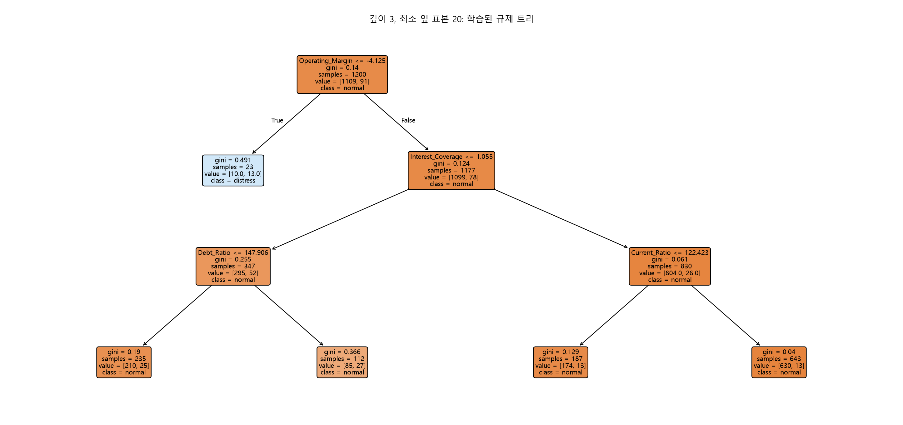
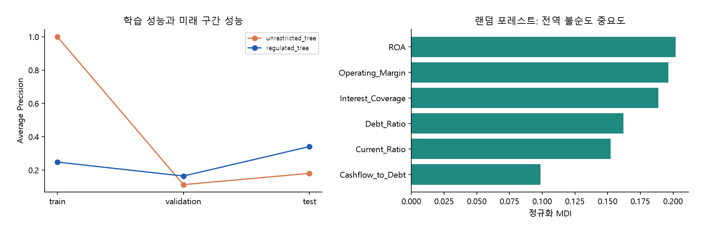
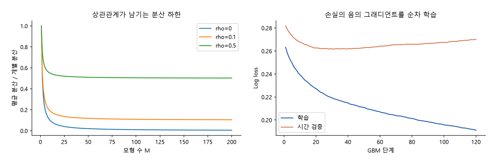
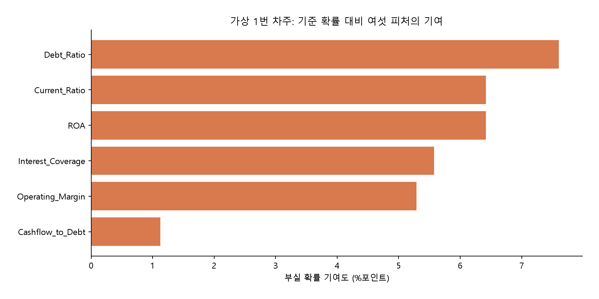

# Chapter 04. 금융 머신러닝 분류(Classification)와 앙상블

> 금융 머신러닝 교재 · 개정 1.0 · 본문 서술 → 수식 유도 → 완전한 코드 → 실제 실행 결과 → 금융 리스크 해석

## 이 장을 시작하며

앞 장에서는 재무비율을 학습 데이터로 바꾸고, 미래 정보가 섞이지 않는 검증 구간을 구성했으며, 불균형 분류에서 예측 확률과 의사결정을 구분했다. 이번 장에서는 같은 데이터 계약을 유지하면서 모델 자체를 확장한다. 사람이 읽을 수 있는 하나의 결정트리에서 출발해 여러 트리를 결합하는 랜덤 포레스트와 부스팅으로 이동하고, 마지막에는 특정 차주의 예측 확률을 피처별 기여도로 분해한다.

핵심 질문은 세 가지다. 첫째, 트리는 어떤 수학적 기준으로 금융 표본을 나누는가? 둘째, 복잡한 모델이 시장과 기업의 우연한 변동을 외우지 않게 하려면 무엇을 제한해야 하는가? 셋째, 앙상블의 예측을 심사 담당자가 설명하려면 어떤 정보를 보존해야 하는가?

이 장의 모든 기업 자료와 1번 차주는 **교육용 합성 사례**다. 특정 실존 기업이나 개인의 대출을 승인·거절하는 작업은 아니다. ‘규제된 트리’의 규제는 모델 복잡도 제한을 뜻한다. `max_depth=3`과 `min_samples_leaf=20`이 금융감독원이 정한 법정 기준이라는 뜻은 아니다. 감독 대응용 규칙 추출은 설명 자료를 만드는 과정이며, 코드 출력만으로 규제 준수나 심사 적정성이 입증되지는 않는다.

별도 마스터 지침 파일은 이전 작업에서 확인되지 않았으므로, 기존 장의 다섯 단계 구성과 이번 일곱 필수 요구사항을 집필 기준으로 삼았다. 본문과 부록에 실행 코드 전체를 수록했으며 코드 블록은 위에서부터 순서대로 실행한다. 최종 표와 그림은 그 실행에서 생성한 값이다.

## 원본 슬라이드 매핑과 학습 목표

PDF 파일 기준 쪽수를 사용한다. 원본의 범용 데이터 실습은 기업 재무 데이터로 대체했고, 감독 설명과 SHAP는 요청에 따라 추가한 확장 내용이다.

| 원본 PDF | 주제 | 이번 본문 |
|---|---|---|
| 160–162쪽 | 분류와 앙상블 개요 | 4.1의 금융 문제 정의 |
| 163–166쪽 | 결정트리, 순수도, 불순도 | 4.2의 지니·엔트로피·정보 이득 유도 |
| 167–177쪽 | 트리 성질, 하이퍼파라미터, 시각화 | 4.3의 규제 비교와 규칙 추출 |
| 178–179쪽 | 피처 중요도 | 4.4의 MDI 직접 계산 |
| 180–194쪽 | 과적합과 분류 실습 | 4.3의 동일 재무 패널 비교 |
| 195–208쪽 | 투표, 배깅, 랜덤 포레스트 | 4.5의 배심원 정리·분산·OOB·실습 |
| 209–211쪽 | AdaBoost | 4.6의 지수 손실과 가중치 갱신 |
| 212–216쪽 | GBM | 4.7의 음의 그래디언트·뉴턴 잎 갱신 |
| 217–228쪽 | SVM·최근접 이웃 등 | 4.9의 분류기 선택 범위 설명 |
| 요청에 따른 확장 | 금융 XAI와 차주별 설명 | 4.8의 Shapley 공리·TreeExplainer·정확 계산 대조 |

이 장을 마치면 분류의 타깃·손실·결정 규칙을 분리하고, 트리의 분할 이득을 계산하며, 과적합 제약과 앙상블의 분산 감소를 설명할 수 있다. 여섯 재무 피처의 전역 중요도와 한 차주의 국소 기여도를 혼동하지 않고, 실제 예측과 일치하는 설명 자료도 만들 수 있다.

## 4.0 실행 환경과 공통 설정

아래 코드의 `FEATURES` 순서가 모델 입력과 규칙·SHAP 출력의 공통 기준이다. 거절 정책은 모형 학습 전 **예측 부실 확률이 20%를 초과하면 거절**로 고정한다. 20%는 설명용 임의 기준이며 앞 장의 FDS 비용에서 가져온 값이 아니다. 기업 여신에는 별도의 손실률·한도·수익·담보 조건이 필요하기 때문이다.

```python
from pathlib import Path
from itertools import combinations
from math import factorial, comb
import json
import platform
import importlib.metadata
import numpy as np
import pandas as pd
import matplotlib
matplotlib.use('Agg')
import matplotlib.pyplot as plt
from sklearn.impute import SimpleImputer
from sklearn.tree import DecisionTreeClassifier, DecisionTreeRegressor, export_text, plot_tree
from sklearn.ensemble import RandomForestClassifier, AdaBoostClassifier, GradientBoostingClassifier
from sklearn.metrics import (accuracy_score, precision_score, recall_score,
    roc_auc_score, average_precision_score, brier_score_loss, log_loss)
import shap

OUT=Path(__file__).resolve().parent
ASSETS=OUT/'assets'
ASSETS.mkdir(exist_ok=True)
BASE_FEATURES=['Debt_Ratio','Current_Ratio','Operating_Margin','Interest_Coverage']
FEATURES=BASE_FEATURES+['ROA','Cashflow_to_Debt']
FEATURE_LABELS=['부채비율','유동비율','영업이익률','이자보상배율','영업이익/총자산','영업현금흐름/부채']
POLICY_THRESHOLD=0.20  # illustrative, declared before model fitting
plt.rcParams.update({'font.family':'Malgun Gothic','axes.unicode_minus':False,
    'font.size':10,'axes.spines.top':False,'axes.spines.right':False,'savefig.dpi':170})
def emit(title,value):
    print(title)
    print(value.to_string(index=False) if isinstance(value,pd.DataFrame) else value)
def save(fig,name):
    fig.tight_layout(pad=2)
    fig.savefig(ASSETS/name)
    plt.close(fig)
```

`OUT`은 실행 스크립트가 있는 폴더다. 노트북에서 붙여 넣어 실행한다면 해당 줄을 `OUT=Path.cwd()`로 바꾼다. 한글 그림은 맑은 고딕을 사용하므로 다른 운영체제에서는 설치된 한글 글꼴로 설정한다. 코드의 정확한 실행 버전은 부록에 기록한다.

## 4.1 분류의 수리적 정의와 금융 도메인 매핑

### 단계 1. 확률 추정과 업무 의사결정을 분리한다

분류는 입력 벡터 X에서 이산 결과 Y를 예측하는 문제다. 기업 부도와 개인 연체는 둘 다 이진 분류로 만들 수 있지만, 관측 단위와 사건 정의가 다르다. 주가 방향은 수익률의 부호를, 신용등급은 여러 범주 중 하나를 예측한다. 같은 분류 알고리즘을 사용할 수 있다고 해서 같은 타깃이나 비용을 사용할 수 있는 것은 아니다.

모형은 미래 사건 확률을 추정하고, 심사 정책은 그 확률과 업무 제약을 사용해 행동을 결정한다. 부도 확률이 높다는 출력이 자동으로 모든 조건의 대출 거절을 뜻하지는 않는다. 담보와 보증, 한도 조정, 추가 서류 확인 등 다른 조치가 가능하다.

### 단계 2-A. 이진 분류의 수식

피처 공간을 실수 d차원 공간, 타깃 공간을 {0,1}로 두자. 학습 자료는 다음과 같다.

$$D=\{(x_i,y_i)\}_{i=1}^{n},\qquad x_i\in\mathbb{R}^{d},\quad y_i\in\{0,1\}$$

모형의 확률 함수와 임곗값 정책을 각각 정의한다.

$$p(x)=P(Y=1\mid X=x),\qquad \hat y(x)=1\{\hat p(x)>\tau\}$$

부실 여부를 y=1로 놓으면 큰 p가 높은 부실 위험을 뜻한다. 상승 여부를 y=1로 놓으면 큰 p가 상승 가능성을 뜻한다. 숫자 1의 의미를 데이터 사전에 명시하지 않으면 서로 반대인 판단을 같은 방향으로 읽을 수 있다.

0–1 오분류 손실이 대칭이면 조건부 기대손실은 정상 예측에서 p, 양성 예측에서 1−p이므로 p>1/2일 때 양성 예측이 유리하다. 비용 C₀₁·C₁₀가 비대칭이면 앞 장에서 유도한 비용 임곗값을 사용해야 한다. 이 장의 모델 비교 표는 사이킷런 기본 `predict`를 사용하고, 별도의 여신 정책 설명에서만 20% 기준을 사용한다.

### 단계 2-B. 금융 문제 네 가지를 정확히 정의하기

**기업 부도 예측.** 공시 가용 시각 t에서 앞으로 h기간 안에 사전에 정의한 부도 사건이 발생하면 1이다.

$$Y_{i,t}^{default}=1\{T_i^{default}\in(t,t+h]\}$$

T는 사건 시각이다. 적자·관리종목 지정·법적 부도는 같은 사건이 아니므로 라벨을 섞지 않는다. 데이터 관측 종료가 t+h보다 이르면 사건이 없었다고 바로 0으로 채우지 않는다. 예측 기간을 끝까지 관측하지 못한 경우 검열 문제를 별도로 다뤄야 한다.

**개인 대출 연체 심사.** 대출 실행 또는 신청 시각 t의 정보로, h기간 안에 연체일수 DPD가 사전 기준 q일 이상이 되는지 정의할 수 있다.

$$Y_{i,t}^{delinquency}=1\left\{\max_{u\in(t,t+h]}DPD_{i,u}\geq q\right\}$$

예를 들어 q=90은 교육용 사건 정의일 뿐 모든 상품의 보편적인 기준이 아니다. 이미 승인된 대출에서만 연체 결과가 관측된다면 거절된 신청자에 대한 라벨은 없으므로 승인 표본의 선택 편향도 고려한다. 기업 재무 모형을 개인 대출에 그대로 적용하지 않는다.

**주가 상승·하락 이진 분류.** 조정 가격 P를 사용하고 h기간 수익률의 부호로 정한다.

$$r_{t,h}=\log\left(\frac{P_{t+h}}{P_t}\right),\qquad Y_t^{up}=1\{r_{t,h}>0\}$$

정확히 0인 경우는 여기서 비상승 클래스에 포함한다. 거래비용을 넘는 상승을 예측하려면 0 대신 비용에 맞는 경계를 별도로 정의한다. 종가를 보고 신호를 만든 뒤 같은 종가에 무조건 체결된 것으로 처리해서는 안 된다. 방향 정확도와 전략 손익도 다르다.

**신용등급 다중 분류.** K개 등급으로 정의하면

$$Y\in\{1,\ldots,K\},\qquad p_k(x)=P(Y=k\mid X=x),\qquad \sum_{k=1}^{K}p_k(x)=1$$

이다. 등급명을 정수로 바꾸어도 등급 간 경제적 거리가 같은 것은 아니다. 대칭 0–1 손실에서는 가장 높은 확률의 클래스를 선택하지만, 등급 간 오판 비용이 다르면 비용 행렬을 사용한다.

$$\hat y=\arg\max_k\hat p_k(x),\qquad a^*=\arg\min_a\sum_{k=1}^{K}C_{k,a}\hat p_k(x)$$

등급의 서열을 활용하려면 순서형 모형도 고려할 수 있다. 다중분류 확률의 학습 손실로는 다음 교차엔트로피가 쓰인다.

$$\mathcal{L}=-\sum_{i=1}^{n}\sum_{k=1}^{K}1\{y_i=k\}\log\hat p_k(x_i)$$

### 단계 3. 여섯 재무 피처와 동일 데이터 생성 코드

이 장의 실제 비교 실습은 기업 부실 이진 분류로 통일한다. 앞 장의 부채비율·유동비율·영업이익률·이자보상배율에 두 비율을 더한다.

$$ROA_{op}=100\frac{OperatingProfit}{Equity+Liabilities},\qquad CFDR=100\frac{OperatingCashflow}{Liabilities}$$

`ROA`는 이번 코드에서 **영업이익/총자산**이다. 순이익을 쓰는 다른 ROA 정의와 구분한다. CFDR은 영업현금흐름/총부채다. 총자산은 자본+부채로 계산하고, 영업현금흐름은 합성 영업이익에 잡음을 더해 생성한다. 이 두 추가 변수는 기존 변수와 상관되어 있으므로 피처 중요도 해석에서 중요한 사례가 된다.

기존 라벨 생성식은 앞 장과 동일하다. 부채비율 등의 비선형 결합으로 정한 잠재 확률에서 베르누이 라벨을 생성한다. 추가 피처 때문에 실제 기업 부도 예측의 실증 근거가 생기는 것은 아니다. 기존 생성 함수를 생략하지 않고 아래에 다시 수록한다.

```python
def make_companies(n_companies=200, n_periods=12, seed=2026):
    rng = np.random.default_rng(seed)
    company_risk = rng.normal(0, 0.7, n_companies)
    frames = []
    for period in range(n_periods):
        risk = company_risk + rng.normal(0, 0.5, n_companies) + 0.035 * period
        equity = rng.lognormal(5, 0.7, n_companies)  # positive, billion KRW
        debt_ratio = 55 * (1 + rng.pareto(1.8, n_companies)) * np.exp(0.3*risk)
        liabilities = equity * debt_ratio / 100
        current_liabilities = liabilities * rng.uniform(0.25, 0.65, n_companies)
        current_ratio = 100 * np.exp(0.5 - 0.3*risk + rng.normal(0, 0.35, n_companies))
        current_assets = current_liabilities * current_ratio / 100
        revenue = (equity + liabilities) * rng.uniform(0.35, 1.1, n_companies)
        op_margin = 7 - 3.2*risk + rng.normal(0, 4, n_companies)
        operating_profit = revenue * op_margin / 100
        interest_expense = liabilities * rng.uniform(0.02, 0.07, n_companies)
        coverage = operating_profit / interest_expense
        score = (-1.8 + 0.8*np.log(debt_ratio/100)
                 - 0.9*np.log(current_ratio/100) - 0.09*op_margin
                 - 0.35*np.arcsinh(coverage) + 0.04*period)
        probability = 1 / (1 + np.exp(-score))
        distress = rng.binomial(1, probability)
        available = pd.Timestamp(year=2012+period, month=5, day=1)
        frame = pd.DataFrame({
            'company_id': [f'SYN{i:03d}' for i in range(n_companies)],
            'period': period, 'available_at': available,
            'label_end': available + pd.DateOffset(years=1),
            'Equity': equity, 'Liabilities': liabilities,
            'Current_Liabilities': current_liabilities, 'Current_Assets': current_assets,
            'Revenue': revenue, 'Operating_Profit': operating_profit,
            'Interest_Expense': interest_expense,
            'Debt_Ratio': 100*liabilities/equity,
            'Current_Ratio': 100*current_assets/current_liabilities,
            'Operating_Margin': 100*operating_profit/revenue,
            'Interest_Coverage': coverage, 'distress_next_year': distress})
        # Simulated missing inputs, applied after latent outcome generation.
        for col in BASE_FEATURES:
            frame.loc[rng.random(n_companies) < 0.025, col] = np.nan
        frames.append(frame)
    return pd.concat(frames, ignore_index=True).sort_values(
        ['available_at', 'company_id']).reset_index(drop=True)

companies=make_companies()
rng=np.random.default_rng(404)
assets=companies['Equity']+companies['Liabilities']
companies['ROA']=100*companies['Operating_Profit']/assets
companies['Operating_Cashflow']=companies['Operating_Profit']+rng.normal(0,0.035,len(companies))*assets
companies['Cashflow_to_Debt']=100*companies['Operating_Cashflow']/companies['Liabilities']
for col in ['ROA','Cashflow_to_Debt']:
    companies.loc[rng.random(len(companies))<0.025,col]=np.nan
train=companies.loc[companies['period']<=5].reset_index(drop=True)
valid=companies.loc[companies['period'].isin([7,8])].reset_index(drop=True)
test=companies.loc[companies['period'].isin([10,11])].reset_index(drop=True)
assert companies['company_id'].nunique()==200 and len(companies)==2400
assert train['label_end'].max()<valid['available_at'].min()
assert valid['label_end'].max()<test['available_at'].min()
imputer=SimpleImputer(strategy='median')
X_train=pd.DataFrame(imputer.fit_transform(train[FEATURES]),columns=FEATURES)
X_valid=pd.DataFrame(imputer.transform(valid[FEATURES]),columns=FEATURES)
X_test=pd.DataFrame(imputer.transform(test[FEATURES]),columns=FEATURES)
y_train=train['distress_next_year'].to_numpy()
y_valid=valid['distress_next_year'].to_numpy()
y_test=test['distress_next_year'].to_numpy()
split_summary=pd.DataFrame([{'split':name,'rows':len(frame),
    'start':str(frame['available_at'].min().date()),
    'end':str(frame['available_at'].max().date()),
    'distressed':int(frame['distress_next_year'].sum())}
    for name,frame in [('train',train),('validation',valid),('test',test)]])
companies.to_csv(OUT/'companies_six_features.csv',index=False,encoding='utf-8-sig')
emit('Data split',split_summary)
```

기업별 12개 연간 관측을 만들고, 학습은 시점 0–5, 검증은 7–8, 최종 비교는 10–11로 둔다. 시점 6·9는 직전 라벨의 확정 시점이 다음 구간과 겹치지 않도록 제외한다. 네 비율과 추가 두 비율의 결측을 모두 **학습 중앙값**으로 대체한다. 트리에서는 임계값을 원래 재무 단위로 해석하기 위해 스케일러를 사용하지 않는다.

### 단계 4. 실제 데이터 분할

| 구간 | 행 수 | 최초 공시일 | 마지막 공시일 | 부실 라벨 수 |
| --- | --- | --- | --- | --- |
| train | 1200 | 2012-05-01 | 2017-05-01 | 91 |
| validation | 400 | 2019-05-01 | 2020-05-01 | 33 |
| test | 400 | 2022-05-01 | 2023-05-01 | 38 |


### 단계 5. 해석과 데이터 한계

기업 수는 200개, 전체 행은 2,400개다. 반복 관측을 독립 기업 수로 세지 않는다. 이 장은 앞 장과 같은 합성 패널을 재사용하므로, 여러 장에 걸쳐 결과를 이미 관찰한 사람이 이 비교 구간을 새 연구의 미개봉 최종 평가라고 주장할 수 없다. 교육상 동일 조건 비교용 구간이다. 실제 신규 모형 검증에는 별도 미사용 기간과 검증 절차가 필요하다.

## 4.2 결정트리의 분할 기준: 지니·엔트로피·정보 이득

### 단계 1. 노드는 조건부 위험 집단이다

결정트리는 입력 공간을 조건문으로 나누고 각 잎의 표본에서 클래스 비율을 추정한다. ‘부채비율이 경계 이하인가’ 같은 질문을 반복해 여러 차주 집단을 만든다. 하나의 노드에 정상·부실이 섞여 있으면 다음 분할이 그 혼합을 얼마나 줄이는지 평가한다.

노드의 순수도가 올라간다는 것은 학습 표본에서 클래스 분포가 한쪽으로 집중된다는 뜻이다. 순수한 정상 노드는 관측된 부실이 적은 집단이고, 순수한 부실 노드는 집중 관리할 위험 집단이다. **순수도가 높다와 위험이 낮다는 같은 뜻이 아니다.** 모두 부실인 잎도 불순도는 0이다.

### 단계 2-A. 노드의 클래스 비율

노드 A의 표본 수를 nₐ, 클래스 k의 수를 nₐₖ라고 두면

$$p_{A,k}=\frac{n_{A,k}}{n_A},\qquad \sum_{k=1}^{K}p_{A,k}=1$$

이다. 표본 가중치 wᵢ를 사용한다면 개수 대신 가중합 Wₐ와 Wₐₖ를 사용한다. 아래 기본 트리 실습에는 별도 클래스 가중치를 쓰지 않는다.

### 단계 2-B. 지니 불순도의 유도

같은 노드의 클래스 분포에서 실제 클래스와 무작위 예측 클래스를 독립적으로 뽑는다고 생각하자. 둘 다 k일 확률은 pₐₖ²이므로 같은 클래스일 확률은 Σpₐₖ²이다. 다를 확률은

$$G(A)=1-\sum_{k=1}^{K}p_{A,k}^2=\sum_{k=1}^{K}p_{A,k}(1-p_{A,k})$$

이다. 이것이 지니 불순도다. 경제학의 소득 불평등 지니 계수와 같은 계산식으로 취급하지 않는다. 이진 분류에서 부실 비율이 p라면

$$G(p)=1-p^2-(1-p)^2=2p(1-p)$$

이고, 미분하면 G′(p)=2−4p, G″(p)=−4다. 따라서 p=1/2에서 최대 1/2이고 p=0 또는 1에서 0이다. 일반 K클래스에서도 Σpₖ²≥1/K이므로 최댓값은 균등 분포의 1−1/K다.

### 단계 2-C. 엔트로피의 유도

확률 p인 사건의 놀라움을 −log₂p로 정의하면, 노드에서 평균적으로 필요한 정보량은

$$H(A)=E[-\log_2p_{A,Y}]=-\sum_{k=1}^{K}p_{A,k}\log_2p_{A,k}$$

이다. p=0인 항은 극한에 따라 0log0=0으로 둔다. 이진 분류에서는

$$H(p)=-p\log_2p-(1-p)\log_2(1-p)$$

이며

$$H'(p)=\log_2\frac{1-p}{p},\qquad H''(p)=-\frac{1}{\ln2}\left(\frac{1}{p}+\frac{1}{1-p}\right)<0$$

이다. 따라서 1/2에서 최대 1비트, 0과 1에서 0이다. 일반 K클래스의 최대는 log₂K다. 로그 밑을 바꾸면 값의 단위만 상수배로 바뀌므로 같은 조건에서 분할 순위는 바뀌지 않는다.

### 단계 2-D. 분할 후 가중 불순도와 정보 이득

피처 j의 임계값 s로 왼쪽 L={x:xⱼ≤s}, 오른쪽 R={x:xⱼ>s}로 나눈다. 자식 표본의 비중을 wL=nL/nA, wR=nR/nA라고 하면

$$I_{after}=w_LI(L)+w_RI(R),\qquad \Delta I=I(A)-I_{after}$$

이다. I에 지니를 넣으면 지니 감소, 엔트로피를 넣으면 정보 이득이다. 크기가 작은 순수 잎 하나만 만들고 큰 혼합 집단을 남긴 분할을 과대평가하지 않도록 표본 수로 가중한다.

$$IG=H(A)-w_LH(L)-w_RH(R)$$

부모 분포는 pA=wLpL+wRpR이다. 엔트로피 차이를 전개하면

$$IG=w_LD_{KL}(p_L\Vert p_A)+w_RD_{KL}(p_R\Vert p_A)\geq0$$

가 된다. 이 식에서 KL의 로그 밑도 2로 맞춘다. 즉 분할 결과를 알았을 때 클래스 불확실성이 얼마나 줄어드는지를 측정한다. 자식 분포가 부모와 같으면 정보 이득은 0이다.

지니 감소도 직접 전개할 수 있다.

$$\Delta G=w_L\sum_kp_{L,k}^2+w_R\sum_kp_{R,k}^2-\sum_k(w_Lp_{L,k}+w_Rp_{R,k})^2$$

wL+wR=1을 이용해 같은 항끼리 모으면

$$\Delta G=w_Lw_R\sum_{k=1}^{K}(p_{L,k}-p_{R,k})^2$$

다. 자식 집단의 클래스 분포가 다를수록 감소량이 커진다. 이진 분류에서는 두 클래스 차이가 부호만 반대이므로 2wLwR(pL−pR)²가 된다.

### 단계 2-E. 100개 차주의 수치 예제

부모가 정상 80·부실 20이라고 하자. 왼쪽은 정상 60·부실 0, 오른쪽은 정상 20·부실 20으로 나뉜다. 부모 지니는 1−0.8²−0.2²=0.32다. 왼쪽 지니는 0, 오른쪽은 0.5다. 자식 가중 지니는 0.6×0+0.4×0.5=0.2이므로 감소량은 0.12다.

엔트로피도 부모 −0.8log₂0.8−0.2log₂0.2≈0.721928, 자식 가중 엔트로피 0.4, 정보 이득 약 0.321928비트다. 아래 코드가 같은 계산을 수행한다.

### 단계 3. 지니·엔트로피 계산 전체 코드

```python
def impurity(counts,criterion='gini'):
    p=np.asarray(counts,dtype=float)/np.sum(counts)
    if criterion=='gini':
        return float(1-np.sum(p*p))
    p=p[p>0]
    return float(-np.sum(p*np.log2(p)))
split_example=[]
for criterion in ['gini','entropy']:
    parent=impurity([80,20],criterion)
    left=impurity([60,0],criterion)
    right=impurity([20,20],criterion)
    after=0.6*left+0.4*right
    split_example.append({'criterion':criterion,'parent':parent,
        'left':left,'right':right,'weighted_children':after,'gain':parent-after})
split_example=pd.DataFrame(split_example)
emit('Impurity example',split_example)
```

### 단계 4. 실제 계산 결과

| 기준 | 부모 | 왼쪽 | 오른쪽 | 자식 가중합 | 감소량 |
| --- | --- | --- | --- | --- | --- |
| gini | 0.320000 | 0.000000 | 0.500000 | 0.200000 | 0.120000 |
| entropy | 0.721928 | -0.000000 | 1.000000 | 0.400000 | 0.321928 |


### 단계 5. 금융 리스크 해석

왼쪽 잎에서 학습 부실이 0건이어도 미래 부실 확률이 정확히 0이라고 확신해서는 안 된다. 작은 잎에서는 드문 사건이 관측되지 않았을 수 있다. 순수도는 훈련 자료의 조건부 집중도를 설명하는 값이고, 위험 추정의 신뢰도에는 표본 수·기간·대표성이 함께 필요하다.

트리는 가능한 분할 중 당장 불순도를 가장 많이 줄이는 것을 탐욕적으로 선택한다. 전체 트리에 대한 전역 최적이나 미래 손실 최소화를 보장하지 않는다. 관련 구현은 [사이킷런 결정트리 문서](https://scikit-learn.org/stable/modules/tree.html)에서 확인할 수 있다.

## 4.3 과적합 제어와 설명 가능한 여신 규칙

### 단계 1. 시장의 우연한 패턴을 외우는 트리

한 기업의 일회성 손실이나 관측 잡음에 맞추어 분할을 계속하면 잎당 표본이 1개까지 줄어들 수 있다. 이 경우 학습 정확도는 높지만 미래의 비슷한 차주에 대해 불안정한 결정을 내릴 수 있다. 데이터가 조금 바뀌었을 때 경계가 크게 움직이는 것이 트리의 높은 분산이다.

모델 제약은 실제 법적 규정과 구분한다. 금융 업무에서는 복잡한 규칙이 재현·검증·설명을 어렵게 만들 수 있으므로, 표본 수와 성능을 고려해 내부 기준을 정할 수 있다. 다음 값들은 그러한 모델 선택을 실습하는 예다.

### 단계 2. 세 하이퍼파라미터의 작동 메커니즘

**max_depth.** 루트 깊이를 0으로 두면 최대 깊이 D인 이진 트리의 잎 수는 최대 2ᴰ다. D=3이면 최대 8개의 위험 집단만 만든다. 더 깊은 조건의 상호작용을 포기하는 대신 소수 표본을 위한 복잡한 분기를 제한한다. 깊이 제한만으로 잎의 최소 표본 수가 보장되지는 않는다.

**min_samples_split.** 내부 노드를 분할할 수 있는 최소 표본 수다. 값이 40이면 39개 이하인 노드는 더 나눌 수 없다. 그러나 이것만으로 자식 표본이 20·20으로 나뉜다는 뜻은 아니다. 한쪽 1개, 다른 쪽 39개를 막으려면 잎 제약이 필요하다.

**min_samples_leaf.** 분할 후 양쪽 자식 모두 최소 m개 표본을 가져야 한다. m=20이면 한두 관측을 고립시키는 분기가 허용되지 않는다. 총 n개 표본의 잎 수는 최대 floor(n/m)이고, 깊이 제한까지 함께 적용하면

$$L\leq\min\left(2^D,\left\lfloor\frac{n}{m}\right\rfloor\right)$$

이다. 이는 가능한 잎 수의 상한이며 실제 트리가 꼭 그만큼 자란다는 뜻은 아니다. 잎에서 추정하는 부실률 p̂=n₁/n의 단순 이항 표준오차는

$$SE(\hat p)\approx\sqrt{\frac{p(1-p)}{n_{leaf}}}$$

이므로 다른 조건이 같다면 더 큰 잎은 표본 잡음을 줄인다. 다만 같은 기업의 반복 관측과 시계열 상관이 있으면 이 식의 독립 가정이 맞지 않으므로 실제 불확실성을 과소평가할 수 있다.

부실이 드문 상황에서 `min_samples_leaf=20`은 부실 20건을 보장하지 않는다. 총 표본이 20건일 뿐이다. 따라서 잎의 사건 수를 함께 확인해야 한다. 강한 제약은 희소하지만 중요한 고위험 집단을 합쳐 버리는 과소적합도 만들 수 있다. [하이퍼파라미터 공식 정의](https://scikit-learn.org/stable/modules/generated/sklearn.tree.DecisionTreeClassifier.html).

### 단계 3-A. 제약 없는 트리와 규제 트리의 완전한 비교 코드

```python
def metrics(model,X,y,model_name,split):
    positive=int(np.flatnonzero(model.classes_==1)[0])
    p=model.predict_proba(X)[:,positive]
    predicted=model.predict(X)
    return {'model':model_name,'split':split,'accuracy':accuracy_score(y,predicted),
        'precision':precision_score(y,predicted,zero_division=0),
        'recall':recall_score(y,predicted,zero_division=0),
        'AP':average_precision_score(y,p),'ROC_AUC':roc_auc_score(y,p),
        'Brier':brier_score_loss(y,p),'log_loss':log_loss(y,p,labels=[0,1])}
unrestricted=DecisionTreeClassifier(random_state=404)
regulated=DecisionTreeClassifier(max_depth=3,min_samples_split=40,
    min_samples_leaf=20,random_state=404)
tree_models={'unrestricted_tree':unrestricted,'regulated_tree':regulated}
all_metrics=[]
tree_structure=[]
for name,model in tree_models.items():
    model.fit(X_train,y_train)
    tree_structure.append({'model':name,'depth':model.get_depth(),
        'leaves':model.get_n_leaves(),'nodes':model.tree_.node_count})
    for split,X,y in [('train',X_train,y_train),('validation',X_valid,y_valid),('test',X_test,y_test)]:
        all_metrics.append(metrics(model,X,y,name,split))
tree_structure=pd.DataFrame(tree_structure)
assert regulated.get_depth()<=3
assert min(regulated.tree_.n_node_samples[regulated.tree_.children_left==-1])>=20
emit('Tree structure',tree_structure)
emit('Tree metrics',pd.DataFrame(all_metrics))
```

두 모델은 정확히 같은 학습 행과 여섯 피처를 사용한다. 규제 트리는 요청한 깊이 3·최소 잎 20에 내부 분할 최소 40을 함께 명시했다. 확률 평가에는 AP, ROC-AUC, Brier, log loss를 사용하고 기본 분류의 정확도·정밀도·재현율도 출력한다. 순수 잎의 0·1 확률에 대한 log loss는 라이브러리의 수치적 클리핑을 거치므로 잘못된 확신에 큰 벌점이 생긴다.

### 단계 4-A. 실제 깊이와 성능

| 모델 | 깊이 | 잎 수 | 전체 노드 |
| --- | --- | --- | --- |
| unrestricted_tree | 18 | 109 | 217 |
| regulated_tree | 3 | 5 | 9 |


| 모델 | 구간 | 정확도 | 재현율 | AP | ROC-AUC | Brier |
| --- | --- | --- | --- | --- | --- | --- |
| unrestricted_tree | train | 1.000000 | 1.000000 | 1.000000 | 1.000000 | 0.000000 |
| unrestricted_tree | validation | 0.860000 | 0.242424 | 0.112228 | 0.578978 | 0.140000 |
| unrestricted_tree | test | 0.867500 | 0.368421 | 0.179951 | 0.644155 | 0.132500 |
| regulated_tree | train | 0.926667 | 0.142857 | 0.247758 | 0.782989 | 0.061098 |
| regulated_tree | validation | 0.902500 | 0.060606 | 0.163800 | 0.744447 | 0.075281 |
| regulated_tree | test | 0.915000 | 0.263158 | 0.340711 | 0.813754 | 0.069493 |


제약 없는 트리는 학습 정확도 100%지만 최종 비교 AP가 **0.179951**다. 규제 트리는 최종 비교 AP **0.340711**, Brier **0.069493**를 기록했다. 이번 데이터에서는 규제가 미래 구간 성능을 개선했지만 모든 시장·표본에서 같은 결과가 보장되지는 않는다.



*그림 4-1. 여섯 재무 피처로 학습한 실제 트리다. 노드에는 분할 조건, 지니, 표본 수, 클래스별 표본 수가 표시된다. 잎의 class는 기본 최빈 클래스이며 20% 여신 정책과 별개다.*

### 단계 3-B. export_text와 실제 여신 정책의 if-else 추출

감독 설명 자료에서는 어떤 입력이 어떤 경계를 통과해 어떤 판단으로 이어졌는지 재현할 수 있어야 한다. `export_text`는 학습된 트리의 조건과 기본 클래스 정보를 사람이 읽을 수 있게 출력한다. 다만 소수점 표시 반올림과 업무 임곗값의 차이를 구분해야 한다.

아래 코드는 두 종류의 규칙을 저장한다. 첫 번째는 `export_text`의 기본 분류 규칙이다. 두 번째는 각 잎의 부실 확률을 계산해 **PD>0.20**이라는 별도 여신 정책을 적용한 if-else 규칙이다. 기초 트리의 잎 확률은 다음과 같다.

$$\hat p_{leaf}=\frac{n_{leaf,1}}{n_{leaf,0}+n_{leaf,1}}$$

표본 가중치를 사용한다면 n 대신 가중합으로 바뀐다. 클래스 0·1의 배열 위치는 `classes_`에서 찾아 고정한다.

```python
default_rules=export_text(regulated,feature_names=FEATURES,
    max_depth=regulated.get_depth(),decimals=6,show_weights=True)
(OUT/'tree_default_class_rules.txt').write_text(default_rules,encoding='utf-8')
tree=regulated.tree_
class_index=int(np.flatnonzero(regulated.classes_==1)[0])
def probability_at_leaf(node):
    values=tree.value[node][0]
    return float(values[class_index]/values.sum())
def policy_rule_lines(node=0,depth=0):
    prefix='    '*depth
    if tree.children_left[node]==-1:
        p=probability_at_leaf(node)
        return [prefix+f'return {int(p>POLICY_THRESHOLD)}  # node={node}, '
            f'PD={p:.10f}, samples={tree.n_node_samples[node]}, '
            f'policy: PD > {POLICY_THRESHOLD:.2f}']
    feature=FEATURES[tree.feature[node]]
    threshold=repr(float(tree.threshold[node]))
    return ([prefix+f'if x[{feature!r}] <= {threshold}:']
        +policy_rule_lines(tree.children_left[node],depth+1)
        +[prefix+'else:']+policy_rule_lines(tree.children_right[node],depth+1))
policy_rules='\n'.join(policy_rule_lines())
(OUT/'credit_policy_if_else.txt').write_text(policy_rules,encoding='utf-8')
def traverse_policy(row):
    # sklearn trees cast input features to float32 before comparison.
    values=np.asarray(row,dtype=np.float32)
    node=0
    while tree.children_left[node]!=-1:
        left=values[tree.feature[node]]<=tree.threshold[node]
        node=tree.children_left[node] if left else tree.children_right[node]
    return int(probability_at_leaf(node)>POLICY_THRESHOLD)
rule_predictions=np.array([traverse_policy(row) for row in X_test.to_numpy()])
model_policy=(regulated.predict_proba(X_test)[:,class_index]>POLICY_THRESHOLD).astype(int)
assert np.array_equal(rule_predictions,model_policy)
emit('export_text: default class rules',default_rules)
emit('Business policy if-else rules',policy_rules)
```

`export_text`의 숫자는 여섯 자리로 표시해도 여전히 사람이 읽는 요약 표현이다. 별도 정책 파일에는 저장된 임계값의 정밀도를 보존한다. 입력은 먼저 학습 중앙값으로 대체되어야 하고, 트리의 비교와 동일하게 float32로 변환해야 경계 근처에서 재현할 수 있다. 코드에서는 직접 순회한 정책 결과가 평가 400행 전체에서 모델 확률에 정책을 적용한 결과와 같은지 확인한다.

### 단계 4-B. 실제 규칙 출력

아래는 규제 트리에서 추출한 기본 규칙 전체다.

```text
|--- Operating_Margin <= -4.124933
|   |--- weights: [10.000000, 13.000000] class: 1
|--- Operating_Margin >  -4.124933
|   |--- Interest_Coverage <= 1.055253
|   |   |--- Debt_Ratio <= 147.905907
|   |   |   |--- weights: [210.000000, 25.000000] class: 0
|   |   |--- Debt_Ratio >  147.905907
|   |   |   |--- weights: [85.000000, 27.000000] class: 0
|   |--- Interest_Coverage >  1.055253
|   |   |--- Current_Ratio <= 122.423447
|   |   |   |--- weights: [174.000000, 13.000000] class: 0
|   |   |--- Current_Ratio >  122.423447
|   |   |   |--- weights: [630.000000, 13.000000] class: 0
```

다음은 동일한 트리에 여신 정책을 결합한 if-else 전체다. 반환값 1은 이 교육용 정책의 거절, 0은 해당 모형 기준 통과를 뜻한다. 모든 여신 심사가 최종 승인되었다는 뜻은 아니다.

```text
if x['Operating_Margin'] <= -4.124932527542114:
    return 1  # node=1, PD=0.5652173913, samples=23, policy: PD > 0.20
else:
    if x['Interest_Coverage'] <= 1.0552530884742737:
        if x['Debt_Ratio'] <= 147.9059066772461:
            return 0  # node=4, PD=0.1063829787, samples=235, policy: PD > 0.20
        else:
            return 1  # node=5, PD=0.2410714286, samples=112, policy: PD > 0.20
    else:
        if x['Current_Ratio'] <= 122.42344665527344:
            return 0  # node=7, PD=0.0695187166, samples=187, policy: PD > 0.20
        else:
            return 0  # node=8, PD=0.0202177294, samples=643, policy: PD > 0.20
```

### 단계 5. 감독 설명 자료로 읽는 방법

규칙마다 피처 정의·단위, 결측 대체 값, 모델 버전, 잎 표본과 부실 건수, 예측 확률, 정책 임곗값을 연결한다. 예를 들어 같은 잎에 도달하더라도 임곗값이 바뀌면 조치는 바뀔 수 있다. 그래서 ‘모델이 부실 확률을 이렇게 계산했다’와 ‘기관 정책이 이 확률에서 거절했다’를 나누어 설명한다.

추출한 트리 규칙은 **규제 트리 자체**의 설명이다. 이를 랜덤 포레스트나 GBM의 정확한 설명으로 대신 제시하지 않는다. 다음 절의 전역 중요도와 마지막 절의 국소 SHAP는 각각 다른 정보를 제공한다.

## 4.4 MDI 피처 중요도의 산출 원리와 여섯 재무 피처

### 단계 1. 중요도는 학습 중 어느 변수가 분할에 기여했는가를 묻는다

`feature_importances_`는 불순도 감소를 피처별로 모은 전역 요약이다. 이 장의 `criterion='gini'`에서는 지니 감소 기반 MDI(Mean Decrease in Impurity)다. 값을 크기순으로 정렬하면 전체 학습 과정에서 어떤 변수가 많이 사용되었는지 알 수 있다.

MDI는 계수처럼 양·음 방향이 없다. 부채비율이 0.3의 중요도를 가졌다고 해서 부채비율이 1 증가할 때 부도 확률이 0.3 증가한다는 뜻이 아니다. 큰 값과 작은 값 중 어느 쪽이 위험한지도 이 숫자 하나로 알 수 없다.

### 단계 2. 가중 불순도 감소의 유도

전체 학습 가중합을 W, 노드 t와 자식의 가중합을 Wₜ, W_L, W_R라고 하자. 노드 t의 분할이 전체 자료에 기여한 감소량은

$$\Delta_t=\frac{W_t}{W}\left[I(t)-\frac{W_L}{W_t}I(L)-\frac{W_R}{W_t}I(R)\right]$$

이다. 괄호를 풀면

$$\Delta_t=\frac{W_tI(t)-W_LI(L)-W_RI(R)}{W}$$

이다. 같은 지니 감소라도 표본이 많은 상단 노드가 더 큰 전역 가중치를 받는다. 피처 j로 분할한 노드 집합 Tⱼ에 대해

$$U_j=\sum_{t\in T_j}\Delta_t,\qquad MDI_j=\frac{U_j}{\sum_{r=1}^{d}U_r}$$

로 정규화한다. 분할이 하나도 없어 감소량 합이 0이면 중요도 벡터는 0으로 둔다. 정규화된 중요도가 있는 경우 합은 1이다.

전체 노드의 감소량 합은 중간 부모·자식 항이 상쇄되어 루트 불순도에서 잎들의 표본 가중 불순도를 뺀 값이 된다. 이 망원합 구조 때문에 MDI는 학습 자료에서 줄인 불순도를 피처별로 배분하는 방식으로 이해할 수 있다.

### 단계 3. 내부 트리 배열로 직접 계산하고 검증하기

```python
def manual_mdi(model):
    structure=model.tree_
    weighted=structure.weighted_n_node_samples
    importance=np.zeros(model.n_features_in_)
    for node in range(structure.node_count):
        left,right=structure.children_left[node],structure.children_right[node]
        if left==-1:
            continue
        decrease=(weighted[node]*structure.impurity[node]
            -weighted[left]*structure.impurity[left]
            -weighted[right]*structure.impurity[right])/weighted[0]
        importance[structure.feature[node]]+=decrease
    return importance/importance.sum() if importance.sum()>0 else importance
assert np.allclose(manual_mdi(regulated),regulated.feature_importances_)
mdi_tree=pd.DataFrame({'feature':FEATURES,'MDI':regulated.feature_importances_})
mdi_tree=mdi_tree.sort_values('MDI',ascending=False).reset_index(drop=True)
emit('Six-feature tree MDI',mdi_tree)
```

`weighted_n_node_samples`를 사용하므로 이후 가중치가 있는 트리에도 같은 산식을 적용할 수 있다. 코드가 직접 만든 벡터와 `feature_importances_`가 일치하는지 확인한다.

### 단계 4. 여섯 피처의 실제 정렬 결과

| 재무 피처 | 규제 트리 MDI |
| --- | --- |
| Operating_Margin | 0.520871 |
| Interest_Coverage | 0.318853 |
| Debt_Ratio | 0.127619 |
| Current_Ratio | 0.032658 |
| ROA | 0.000000 |
| Cashflow_to_Debt | 0.000000 |


### 단계 5. MDI의 한계

학습 데이터 기반이므로 잡음에 과적합한 분할도 중요도를 얻을 수 있다. 고유값과 가능한 분할점이 많은 연속 변수는 선택 기회가 많아 중요도가 커질 수 있다. 부채비율·이자보상배율·ROA처럼 관련된 변수는 서로 대체 가능하므로 중요도가 나뉘거나 한 변수로 몰릴 수 있다.

미래 검증 구간의 permutation importance는 다른 관점의 보완 자료가 될 수 있지만, 상관된 변수를 하나만 섞으면 비현실적인 조합이 생기는 문제도 있다. MDI와 SHAP 모두 인과 효과나 차주의 개선 행동 효과를 자동으로 제공하지 않는다.

## 4.5 앙상블, 배깅, 랜덤 포레스트

### 단계 1. 여러 모형을 결합하는 이유

앙상블은 여러 모형의 예측을 결합한다. 서로 다른 종류의 모형을 같은 데이터에 학습해 투표할 수도 있고, 같은 종류의 모형에 다른 재표본을 주어 결합할 수도 있다. 하드 투표는 클래스 표를 합치고, 소프트 투표는 확률 점수를 평균한다. 높은 확률의 의미가 모델마다 다르면 단순 평균에도 주의가 필요하다.

배깅은 같은 학습 자료에서 복원 추출 표본을 여러 번 만들어 각 모형을 학습한다. 불안정한 단일 트리의 표본 민감도를 평균화하는 것이 주요 목적이다. 부스팅은 이전 단계의 부족한 부분을 다음 단계가 순차적으로 보완하므로 학습 방식이 다르다.

### 단계 2-A. 콩도르세 배심원 정리

정답 확률이 모두 p이고 정답 여부가 독립인 이진 판단자 M명을 생각하자. 동점을 피하기 위해 M은 홀수다. 맞힌 판단자 수 Sₘ은 이항분포를 따른다.

$$S_M\sim Binomial(M,p),\qquad P(majority\ correct)=\sum_{k=(M+1)/2}^{M}\binom{M}{k}p^k(1-p)^{M-k}$$

p>1/2이면 대수의 법칙에 따라 Sₘ/M이 p로 수렴하므로 과반이 정답일 확률은 1로 간다. 더 구체적으로 독립 베르누이에 대한 Hoeffding 경계를 적용하면

$$P\left(\frac{S_M}{M}\leq\frac{1}{2}\right)\leq\exp\left[-2M\left(p-\frac{1}{2}\right)^2\right]\longrightarrow0$$

이다. p<1/2이면 오히려 다수결이 오답으로 수렴하고, p=1/2이면 홀수 M의 정답 확률은 1/2다. 따라서 ‘모델 수만 늘리면 정확해진다’는 정리가 아니다. 모형들의 오류가 강하게 연관되거나 공통으로 잘못된 데이터를 사용하면 독립성 가정이 깨진다.

랜덤 포레스트가 이 정리의 가정을 그대로 만족하는 것도 아니다. 실제 트리는 같은 원천 자료를 공유하고 사이킷런의 포레스트는 트리별 클래스 확률을 평균한다. 배심원 정리는 다양성과 개별 유용성의 중요성을 보여주는 이상화된 출발점이다.

### 단계 2-B. 평균 예측의 분산 감소 공식

한 입력 x에 대한 모형 출력 T₁,…,Tₘ의 분산이 모두 σ²이고 서로 다른 쌍의 공분산이 ρσ²라고 가정한다. 평균은 T̄=(1/M)ΣTₘ이다.

$$Var(\bar T)=\frac{1}{M^2}Var\left(\sum_{m=1}^{M}T_m\right)$$

분산 합과 공분산 합으로 풀면

$$Var(\bar T)=\frac{1}{M^2}\left[\sum_m Var(T_m)+2\sum_{m<r}Cov(T_m,T_r)\right]$$

개별 분산 항은 M개, 서로 다른 순서 없는 쌍은 M(M−1)/2개이므로

$$Var(\bar T)=\frac{M\sigma^2+M(M-1)\rho\sigma^2}{M^2}=\rho\sigma^2+\frac{1-\rho}{M}\sigma^2$$

이다. ρ=0이면 σ²/M, ρ=1이면 σ²로 전혀 감소하지 않는다. ρ>0을 고정하면 M→∞에서 ρσ²가 남는다. 유효한 동일상관 행렬에는 ρ≥−1/(M−1)라는 제약도 있으므로 음의 ρ를 임의로 고정한 채 무한히 M을 늘릴 수는 없다.

금융 포트폴리오의 분산 효과와 닮았지만 여기서 다루는 것은 **모형 출력의 추정 변동**이다. 여러 트리를 평균한다고 실제 투자 손실을 헤지하거나 시장 공통 충격을 없애는 것은 아니다. 공통 편향은 분산 감소식에 포함되어 있지 않다.

### 단계 2-C. 부트스트랩에서 OOB가 약 36.8%인 이유

n개 학습 행에서 n번 복원 추출할 때 특정 행 i를 한 번 뽑지 않을 확률은 1−1/n이다. 추출을 독립적으로 반복하므로 한 번도 뽑지 않을 확률은

$$P(i\in OOB)=\left(1-\frac{1}{n}\right)^n$$

이다. 로그를 취하면

$$\log P(i\in OOB)=n\log\left(1-\frac{1}{n}\right)$$

이고 log(1−u)=−u−u²/2−⋯를 대입하면

$$n\log\left(1-\frac{1}{n}\right)=-1-\frac{1}{2n}-\frac{1}{3n^2}-\cdots\longrightarrow-1$$

이다. 다시 지수화하면

$$\lim_{n\to\infty}\left(1-\frac{1}{n}\right)^n=e^{-1}\approx0.367879$$

이다. OOB 행 수의 기대값은 n(1−1/n)ⁿ, 서로 다른 학습 포함 행 수의 기대값은 n[1−(1−1/n)ⁿ]로 약 63.2%다. 매번 정확히 36.8%가 남는다는 뜻은 아니다. `max_samples`를 n보다 작게 바꾸면 지수도 실제 추출 횟수로 바뀐다.

여러 트리에서 특정 관측이 OOB일 때의 예측만 모아 OOB 점수를 계산할 수 있다. 그러나 시간 패널에서는 그 트리가 해당 행보다 미래의 다른 행을 학습했을 수 있다. 동일 기업의 다른 해가 포함될 수도 있다. 따라서 OOB는 이 교재의 시간 검증을 대체하지 않는다. 더구나 이 코드의 결측 대체기는 전체 학습 자료로 한 번 적합하므로 OOB 전처리까지 완전히 분리한 추정치가 아니다. OOB는 참고 진단으로만 출력한다.

### 단계 2-D. 피처 무작위 선택과 상관관계

모든 트리가 동일한 강한 피처를 루트에서 선택하면 부트스트랩을 달리해도 비슷한 예측을 할 수 있다. 랜덤 포레스트는 각 분할에서 후보 피처를 무작위로 제한해 다른 분기 기회를 만든다. 분류에서 흔히 사용하는 `max_features='sqrt'`는 d개 중 약 √d개를 후보로 삼는다. d=6이면 사이킷런에서 후보 수는 2다.

이는 각 트리 전체에서 두 피처만 쓴다는 뜻이 아니다. 분할마다 후보가 다시 선택되므로 전체 트리에는 여섯 변수가 모두 나타날 수 있다. 유효한 분할을 찾는 구현상 예외도 있어 ‘항상 딱 두 변수만 조사한다’는 엄격한 계산량 보장으로 해석하지 않는다. 후보 제한은 상관을 낮추는 경향이 있지만 개별 트리를 약하게 만들 수도 있어 최종 성능은 확인해야 한다.

### 단계 3. 배심원·OOB 실험과 랜덤 포레스트 전체 코드

```python
def majority_correct(M,p):
    return sum(comb(M,k)*p**k*(1-p)**(M-k) for k in range(M//2+1,M+1))
condorcet=pd.DataFrame([{'M':M,'p':p,'majority_correct':majority_correct(M,p)}
    for p in [0.45,0.55,0.65] for M in [1,5,21,101]])
rng=np.random.default_rng(405)
oob_rows=[]
for n in [20,200,1200]:
    fractions=[]
    for repeat in range(300):
        indices=rng.integers(0,n,size=n)
        fractions.append(1-len(np.unique(indices))/n)
    oob_rows.append({'n':n,'theoretical':(1-1/n)**n,
        'simulation_mean':float(np.mean(fractions)),'limit':float(np.exp(-1))})
oob_table=pd.DataFrame(oob_rows)
forest=RandomForestClassifier(n_estimators=200,max_features='sqrt',
    min_samples_leaf=10,bootstrap=True,oob_score=True,n_jobs=1,random_state=404)
all_features_forest=RandomForestClassifier(n_estimators=200,max_features=None,
    min_samples_leaf=10,bootstrap=True,oob_score=True,n_jobs=1,random_state=404)
forest_diagnostics=[]
for name,model in [('random_forest_sqrt',forest),('bagged_all_features',all_features_forest)]:
    model.fit(X_train,y_train)
    for split,X,y in [('train',X_train,y_train),('validation',X_valid,y_valid),('test',X_test,y_test)]:
        all_metrics.append(metrics(model,X,y,name,split))
    predictions=np.array([est.predict_proba(X_valid.to_numpy())[:,1] for est in model.estimators_])
    usable=predictions.std(axis=1)>0
    correlation=np.corrcoef(predictions[usable])
    avg_correlation=correlation[np.triu_indices_from(correlation,k=1)].mean()
    forest_diagnostics.append({'model':name,'OOB_accuracy_diagnostic':model.oob_score_,
        'mean_validation_prediction_correlation':float(avg_correlation),
        'features_considered':model.estimators_[0].max_features_,
        'mean_tree_depth':float(np.mean([t.get_depth() for t in model.estimators_]))})
forest_diagnostics=pd.DataFrame(forest_diagnostics)
mdi_forest=pd.DataFrame({'feature':FEATURES,'MDI':forest.feature_importances_})
mdi_forest=mdi_forest.sort_values('MDI',ascending=False).reset_index(drop=True)
emit('Condorcet',condorcet)
emit('OOB simulation',oob_table)
emit('Forest diagnostics',forest_diagnostics)
emit('Six-feature forest MDI',mdi_forest)
```

`max_features=None` 포레스트는 모든 피처를 후보로 사용하는 배깅 트리 비교군이다. 두 포레스트는 같은 트리 수·잎 제약·부트스트랩 시드를 사용한다. 검증 행들에 대한 트리별 확률의 평균 쌍별 상관을 계산한다. 이는 출력 유사도의 경험적 진단이며, 고정된 x에서 학습 표본을 반복 추출해 정의한 위 공식의 ρ와 동일한 추정량은 아니다. [앙상블 공식 문서](https://scikit-learn.org/stable/modules/ensemble.html).

### 단계 4. 실제 실행 결과

| 판단자 수 | 개별 정답 확률 | 다수결 정답 확률 |
| --- | --- | --- |
| 1 | 0.450000 | 0.450000 |
| 5 | 0.450000 | 0.406873 |
| 21 | 0.450000 | 0.320997 |
| 101 | 0.450000 | 0.156245 |
| 1 | 0.550000 | 0.550000 |
| 5 | 0.550000 | 0.593127 |
| 21 | 0.550000 | 0.679003 |
| 101 | 0.550000 | 0.843755 |
| 1 | 0.650000 | 0.650000 |
| 5 | 0.650000 | 0.764831 |
| 21 | 0.650000 | 0.922818 |
| 101 | 0.650000 | 0.999013 |


| 학습 표본 수 | 유한 표본 이론 | 300회 평균 | 무한 표본 극한 |
| --- | --- | --- | --- |
| 20 | 0.358486 | 0.359667 | 0.367879 |
| 200 | 0.366958 | 0.365367 | 0.367879 |
| 1200 | 0.367726 | 0.369436 | 0.367879 |


| 모델 | 후보 피처 수 | 평균 깊이 | OOB 정확도(참고) | 검증 출력 평균 상관 |
| --- | --- | --- | --- | --- |
| random_forest_sqrt | 2 | 10.110000 | 0.920833 | 0.421357 |
| bagged_all_features | 6 | 9.840000 | 0.917500 | 0.454315 |


랜덤 포레스트의 여섯 피처 MDI 정렬은 다음과 같다. 개별 트리의 정규화 중요도를 평균하고 필요시 다시 정규화한 전역 값이다.

| 재무 피처 | 포레스트 MDI |
| --- | --- |
| ROA | 0.201854 |
| Operating_Margin | 0.196334 |
| Interest_Coverage | 0.188634 |
| Debt_Ratio | 0.162172 |
| Current_Ratio | 0.152262 |
| Cashflow_to_Debt | 0.098743 |




*그림 4-2. 학습 AP와 미래 구간 AP의 차이를 보며, 오른쪽 중요도는 랜덤 포레스트의 전역 학습 요약으로 읽는다.*

### 단계 5. 금융 해석

앙상블은 공통 오류를 지워 주지 않는다. 모든 모델에 미래 정보가 섞였으면 평균도 잘못된 평가를 갖는다. 부트스트랩이 특정 위험 유형을 충분히 담지 못하는 경우도 있다. 모형 수와 피처 무작위성의 효과를 비용·보정·시간 검증과 함께 판단한다.

## 4.6 AdaBoost: 오답 표본의 가중치를 갱신한다

### 단계 1. 순차적으로 어려운 표본을 학습한다

AdaBoost는 약한 분류기를 여러 번 학습하되 이전 단계에서 틀린 표본에 더 큰 학습 가중치를 준다. 금융 데이터에서는 드문 부실을 무시하는 단순 모형을 보완할 수 있지만, 라벨 오류나 예측 불가능한 특이 사건에 지나치게 집중할 위험도 있다. 오답이라고 모두 ‘더 학습하면 맞힐 수 있는 유용한 신호’는 아니다.

### 단계 2-A. 지수 손실에서 가중치와 α 유도

이 절의 수학에서는 클래스 yᵢ와 약한 분류기 hₘ(xᵢ)를 −1,+1로 표기한다. 합성 점수는

$$F_M(x)=\sum_{m=1}^{M}\alpha_mh_m(x),\qquad \hat y=sign(F_M(x))$$

이고 지수 손실은 Σexp[−yᵢFₘ(xᵢ)]다. m−1단계까지의 점수를 고정하면 그때의 정규화 표본 가중치는

$$w_i^{(m)}=\frac{\exp[-y_iF_{m-1}(x_i)]}{\sum_r\exp[-y_rF_{m-1}(x_r)]}$$

로 볼 수 있다. 이 가중치로 hₘ을 학습하고 가중 오분류율을 계산한다.

$$\epsilon_m=\sum_iw_i^{(m)}1\{y_i\ne h_m(x_i)\}$$

새 α에 대해 최소화할 항은 정답의 경우 yᵢhₘ=1, 오답은 −1이므로

$$J(\alpha)=(1-\epsilon_m)e^{-\alpha}+\epsilon_me^{\alpha}$$

이다. 미분하여 0으로 놓으면

$$-(1-\epsilon_m)e^{-\alpha}+\epsilon_me^{\alpha}=0$$

이고 exp(2α)=(1−ε)/ε이므로

$$\alpha_m=\frac{1}{2}\log\frac{1-\epsilon_m}{\epsilon_m}$$

를 얻는다. ε<1/2이면 α>0이다. ε=1/2이면 기여가 없고, ε>1/2이면 이 형태의 약한 학습 조건을 만족하지 않는다. ε=0의 무한 가중치를 그대로 계산하지 않도록 완전 적합 시 종료하거나 수치 처리를 한다.

### 단계 2-B. 가중치 갱신과 정규화

새로운 표본 가중치는

$$w_i^{(m+1)}=\frac{w_i^{(m)}\exp[-\alpha_my_ih_m(x_i)]}{Z_m}$$

이며 정규화 상수는

$$Z_m=(1-\epsilon_m)e^{-\alpha_m}+\epsilon_me^{\alpha_m}=2\sqrt{\epsilon_m(1-\epsilon_m)}$$

이다. 정답 표본은 exp(−α), 오답 표본은 exp(α)가 곱해진다. 기존 가중치가 같은 정답·오답 표본의 상대 배율은 exp(2α)=(1−ε)/ε이다. ε=0.2이면 α≈0.693147이고 오답은 정답에 비해 4배의 상대 가중치를 갖게 된다.

### 단계 2-C. 사이킷런 SAMME와 표기 차이

현재 실행 버전의 AdaBoostClassifier는 SAMME 형태를 사용한다. K개 클래스에서 약한 분류기의 가중치는

$$\alpha_m^{SAMME}=\nu\left[\log\frac{1-\epsilon_m}{\epsilon_m}+\log(K-1)\right]$$

이며 오답 표본의 가중치에 exp(α)가 곱해진다. K=2, 학습률 ν=1이면 이 계수는 앞의 고전적 이진 α의 두 배다. 정규화 후 오답·정답 상대 가중치가 같은 이유는 앞 방식의 exp(α)/exp(−α)=exp(2α) 때문이다. 서로 다른 관례의 계수를 그대로 비교해 구현이 틀렸다고 판단하지 않는다.

SAMME의 약한 학습 조건은 ε<1−1/K다. 학습률 ν는 각 단계의 영향력을 줄이거나 늘리며 단계 수와 함께 조정한다. 과거 버전의 `algorithm='SAMME.R'` 설정을 최신 코드에 그대로 넣지 않는다. [AdaBoostClassifier 공식 문서](https://scikit-learn.org/stable/modules/generated/sklearn.ensemble.AdaBoostClassifier.html).

### 단계 3. 수식 검증과 실제 AdaBoost 학습 코드

```python
def classic_adaboost_steps(X,y,n_rounds=8):
    signed_y=2*y-1
    weights=np.full(len(y),1/len(y))
    margin=np.zeros(len(y))
    rows=[]
    for iteration in range(n_rounds):
        stump=DecisionTreeClassifier(max_depth=1,random_state=600+iteration)
        stump.fit(X,signed_y,sample_weight=weights)
        predicted=stump.predict(X)
        missed=predicted!=signed_y
        error=float(np.dot(weights,missed))
        if error>=0.5:
            break
        clipped=np.clip(error,1e-12,1-1e-12)
        alpha=0.5*np.log((1-clipped)/clipped)
        unnormalized=weights*np.exp(-alpha*signed_y*predicted)
        normalizer=unnormalized.sum()
        weights=unnormalized/normalizer
        margin+=alpha*predicted
        rows.append({'round':iteration+1,'weighted_error':error,'alpha_classic':alpha,
            'Z':float(normalizer),'exp_loss':float(np.exp(-signed_y*margin).mean()),
            'effective_weight_samples':float(1/np.sum(weights**2))})
        assert np.isclose(weights.sum(),1)
        if error==0:
            break
    return pd.DataFrame(rows)
ada_steps=classic_adaboost_steps(X_train,y_train)
ada=AdaBoostClassifier(estimator=DecisionTreeClassifier(max_depth=1,min_samples_leaf=20),
    n_estimators=120,learning_rate=0.3,random_state=404)
ada.fit(X_train,y_train)
for split,X,y in [('train',X_train,y_train),('validation',X_valid,y_valid),('test',X_test,y_test)]:
    all_metrics.append(metrics(ada,X,y,'AdaBoost',split))
emit('Classic binary AdaBoost derivation check',ada_steps)
```

앞 함수는 고전적 이진 수식을 8단계 직접 계산하며 가중치 합이 1인지 검사한다. 뒤의 실무 모형은 사이킷런 AdaBoost를 120단계·학습률 0.3으로 실행한다. 두 코드는 약한 학습기의 잎 제약과 학습률도 다르므로 동일한 단계별 출력을 기대하지 않는다.

### 단계 4. 실제 가중 오차와 계수

| 단계 | 가중 오차 | 고전 α | 정규화 Z | 지수 손실 | 가중 유효 표본 |
| --- | --- | --- | --- | --- | --- |
| 1 | 0.073333 | 1.268289 | 0.521366 | 0.521366 | 326.186667 |
| 2 | 0.339642 | 0.332445 | 0.947175 | 0.493825 | 284.311262 |
| 3 | 0.429359 | 0.142233 | 0.989969 | 0.488871 | 237.152726 |
| 4 | 0.423744 | 0.153710 | 0.988302 | 0.483153 | 303.867798 |
| 5 | 0.380825 | 0.243024 | 0.971179 | 0.469228 | 260.507637 |
| 6 | 0.449974 | 0.100387 | 0.994982 | 0.466873 | 226.128568 |
| 7 | 0.435044 | 0.130651 | 0.991525 | 0.462917 | 279.628276 |
| 8 | 0.444232 | 0.112002 | 0.993760 | 0.460028 | 235.308062 |


`effective_weight_samples`는 1/Σwᵢ²다. 가중치가 소수 표본에 집중될수록 작아지며, 실제 독립 기업 수나 일반화 표본 수를 뜻하지 않는다. AdaBoost의 미래 성능은 뒤의 동일 구간 비교표에 함께 제시한다.

### 단계 5. 금융 해석

연체 라벨의 수정, 일회성 회계 오류, 구조적으로 예측 불가능한 사건이 있다면 가중치 집중이 바람직하지 않을 수 있다. 높은 가중치 표본을 점검하는 것은 데이터 품질 관리와 연결된다. AdaBoost 점수를 그대로 부도 확률이라고 해석하기 전에는 시간 검증에서의 확률 보정도 확인해야 한다.

## 4.7 Gradient Boosting: 손실 함수의 음의 그래디언트를 학습한다

### 단계 1. 잔차의 의미는 손실에 따라 달라진다

GBM은 지금의 예측 함수가 손실을 줄이려면 어느 방향으로 움직여야 하는지 계산하고, 그 방향을 작은 회귀트리로 근사한다. 제곱오차에서는 그 방향이 관측값−예측값과 같지만, 모든 분류 문제에서 ‘클래스 라벨−클래스 예측’이 잔차가 되는 것은 아니다. 로지스틱 손실에서는 y−p라는 확률 잔차가 나온다.

### 단계 2-A. 함수 공간의 경사 하강

예측 점수를 F(x), 손실을 ℓ(y,F)라고 두자. 초기 상수 함수는

$$F_0=\arg\min_c\sum_i\ell(y_i,c)$$

다. m단계의 의사 잔차는 현재 함수에 대한 음의 미분이다.

$$r_{i,m}=-\left.\frac{\partial\ell(y_i,F)}{\partial F}\right|_{F=F_{m-1}(x_i)}$$

회귀트리는 이 r을 목표로 피팅해 각 잎 영역 Rⱼₘ을 만든다. 잎별 갱신량 γ는 원래 손실을 줄이는 값으로 구하고

$$\gamma_{j,m}=\arg\min_\gamma\sum_{x_i\in R_{j,m}}\ell(y_i,F_{m-1}(x_i)+\gamma)$$

$$F_m(x)=F_{m-1}(x)+\nu\sum_j\gamma_{j,m}1\{x\in R_{j,m}\}$$

로 갱신한다. ν는 shrinkage 또는 학습률이다. 작은 ν는 한 단계의 수정을 줄이지만 너무 많은 단계를 쌓으면 다시 과적합할 수 있다.

### 단계 2-B. 제곱오차의 경우

ℓ=(y−F)²/2이면 ∂ℓ/∂F=F−y이므로 r=y−F다. 이 경우 익숙한 잔차 회귀와 일치한다. 그러나 이 장의 부실 타깃은 이진이므로 다음 로지스틱 손실을 쓴다.

### 단계 2-C. 이진 로지스틱 손실의 유도

F는 로그오즈이고 p=σ(F)=1/(1+exp(−F))다. 베르누이 음의 로그우도는

$$\ell(y,F)=-y\log p-(1-y)\log(1-p)=\log(1+e^F)-yF$$

이다. F로 미분하면

$$\frac{\partial\ell}{\partial F}=\frac{e^F}{1+e^F}-y=p-y,\qquad r=y-p$$

이고 2차 미분은 p(1−p)다. 초기 상수 확률은 학습 부실률 p̄, 초기 점수는

$$F_0=\log\frac{\bar p}{1-\bar p}$$

다. 클래스가 하나뿐인 학습 집합에서는 이 식과 이진 분류가 정상적으로 성립하지 않으므로 학습 전 클래스 구성을 확인해야 한다.

### 단계 2-D. 잎별 뉴턴 갱신

각 잎에 같은 γ를 더할 때 손실을 2차 테일러 근사로 전개하면

$$L_j(\gamma)\approx L_j(0)+\gamma\sum_{i\in R_j}(p_i-y_i)+\frac{\gamma^2}{2}\sum_{i\in R_j}p_i(1-p_i)$$

다. γ로 미분해 0으로 놓으면

$$\gamma_j\approx\frac{\sum_{i\in R_j}(y_i-p_i)}{\sum_{i\in R_j}p_i(1-p_i)}$$

를 얻는다. 이 값은 일반적으로 정확한 전체 선형 탐색 해가 아니라 국소 뉴턴 근사다. 분모가 아주 작아지는 경우에는 수치 안정화가 필요하다. 다음 첫 단계 실험은 같은 초기 확률에서 계산하므로 분모가 명확하게 양수다.

### 단계 3. 첫 단계 수식 실증과 GBM 전체 학습 코드

```python
initial_p=float(y_train.mean())
initial_F=np.log(initial_p/(1-initial_p))
residual=y_train-initial_p
gradient_tree=DecisionTreeRegressor(max_depth=2,min_samples_leaf=20,random_state=404)
gradient_tree.fit(X_train,residual)
leaf_index=gradient_tree.apply(X_train)
increment=np.zeros(len(y_train))
leaf_updates=[]
for leaf in np.unique(leaf_index):
    selected=leaf_index==leaf
    numerator=float(residual[selected].sum())
    denominator=float(selected.sum()*initial_p*(1-initial_p))
    gamma=numerator/denominator
    increment[selected]=gamma
    leaf_updates.append({'leaf':int(leaf),'samples':int(selected.sum()),
        'sum_negative_gradient':numerator,'sum_hessian':denominator,'newton_step':gamma})
learning_rate=0.05
one_step_F=initial_F+learning_rate*increment
one_step_p=1/(1+np.exp(-one_step_F))
gbm_step={'initial_log_loss':float(log_loss(y_train,np.full(len(y_train),initial_p))),
    'after_one_step_log_loss':float(log_loss(y_train,one_step_p)),
    'initial_log_odds':float(initial_F)}
gbm=GradientBoostingClassifier(loss='log_loss',n_estimators=120,
    learning_rate=0.05,max_depth=2,min_samples_leaf=20,
    subsample=1.0,n_iter_no_change=None,random_state=404)
gbm.fit(X_train,y_train)
for split,X,y in [('train',X_train,y_train),('validation',X_valid,y_valid),('test',X_test,y_test)]:
    all_metrics.append(metrics(gbm,X,y,'GBM',split))
stage_rows=[]
for stage,(p_train,p_valid) in enumerate(zip(gbm.staged_predict_proba(X_train),
        gbm.staged_predict_proba(X_valid)),start=1):
    stage_rows.append({'stage':stage,'train_log_loss':log_loss(y_train,p_train),
        'validation_log_loss':log_loss(y_valid,p_valid)})
stages=pd.DataFrame(stage_rows)
leaf_updates=pd.DataFrame(leaf_updates)
emit('GBM first-step Newton leaf updates',leaf_updates)
emit('GBM first-step loss',gbm_step)
metric_table=pd.DataFrame(all_metrics)
emit('All models: same split',metric_table)
```

첫 실험은 잔차에 깊이 2의 회귀트리를 적합하고 잎별 뉴턴 갱신을 직접 계산한다. 뒤의 GradientBoostingClassifier는 같은 개념으로 120단계를 학습한다. 수동 실험이 라이브러리의 모든 분할 세부 구현을 복제한다는 뜻은 아니다. `n_iter_no_change=None`으로 내부 무작위 조기 종료 분할을 사용하지 않고, 별도로 정한 시간 검증 구간의 손실을 관찰한다. 이번에는 120단계를 사전 고정해 결과를 보고 다시 고르지 않는다.

### 단계 4-A. 실제 첫 단계 계산

| 잎 번호 | 표본 수 | 음의 그래디언트 합 | 헤시안 합 | 뉴턴 갱신값 |
| --- | --- | --- | --- | --- |
| 1 | 23 | 11.255833 | 1.611901 | 6.982957 |
| 3 | 347 | 25.685833 | 24.318676 | 1.056218 |
| 4 | 830 | -36.941667 | 58.168590 | -0.635079 |


초기 로그오즈는 **-2.500354**다. 학습 log loss는 상수 모형의 **0.268473**에서 학습률 0.05의 첫 뉴턴 갱신 후 **0.263234**로 감소했다.

### 단계 4-B. 모든 모델의 동일 구간 비교

| 모델 | 구간 | AP | ROC-AUC | Brier | Log loss |
| --- | --- | --- | --- | --- | --- |
| unrestricted_tree | train | 1.000000 | 1.000000 | 0.000000 | 0.000000 |
| unrestricted_tree | validation | 0.112228 | 0.578978 | 0.140000 | 5.046111 |
| unrestricted_tree | test | 0.179951 | 0.644155 | 0.132500 | 4.775784 |
| regulated_tree | train | 0.247758 | 0.782989 | 0.061098 | 0.223353 |
| regulated_tree | validation | 0.163800 | 0.744447 | 0.075281 | 0.263329 |
| regulated_tree | test | 0.340711 | 0.813754 | 0.069493 | 0.245585 |
| random_forest_sqrt | train | 0.574384 | 0.949296 | 0.049346 | 0.167838 |
| random_forest_sqrt | validation | 0.206116 | 0.743787 | 0.072341 | 0.259977 |
| random_forest_sqrt | test | 0.469691 | 0.841378 | 0.067953 | 0.237867 |
| bagged_all_features | train | 0.605147 | 0.956232 | 0.047683 | 0.161492 |
| bagged_all_features | validation | 0.199123 | 0.732970 | 0.074547 | 0.269360 |
| bagged_all_features | test | 0.513020 | 0.835199 | 0.067432 | 0.238598 |
| AdaBoost | train | 0.342540 | 0.826638 | 0.096598 | 0.356619 |
| AdaBoost | validation | 0.199104 | 0.760053 | 0.105173 | 0.376570 |
| AdaBoost | test | 0.500448 | 0.871801 | 0.104136 | 0.374627 |
| GBM | train | 0.483363 | 0.877407 | 0.052839 | 0.191100 |
| GBM | validation | 0.187956 | 0.734663 | 0.076395 | 0.269967 |
| GBM | test | 0.459586 | 0.853918 | 0.065799 | 0.230459 |

| 모델 | 최종 비교 정확도 | 정밀도 | 재현율 |
| --- | --- | --- | --- |
| unrestricted_tree | 0.867500 | 0.325581 | 0.368421 |
| regulated_tree | 0.915000 | 0.625000 | 0.263158 |
| random_forest_sqrt | 0.912500 | 0.714286 | 0.131579 |
| bagged_all_features | 0.920000 | 0.800000 | 0.210526 |
| AdaBoost | 0.912500 | 0.800000 | 0.105263 |
| GBM | 0.910000 | 0.583333 | 0.184211 |




*그림 4-3. 왼쪽은 동일 분산·동일 상관의 이론적 민감도 곡선이다. 오른쪽은 실제 합성 데이터의 단계별 학습·시간 검증 log loss다.*

### 단계 5. 금융 해석

학습 손실의 감소가 미래 손실의 지속적 감소를 의미하지 않는다. 부스팅 단계 수·잎 크기·학습률·표본 비율은 복잡도와 안정성의 교환 관계를 만든다. `subsample<1`의 확률적 부스팅은 표본을 달리해 변동을 줄이는 데 도움이 될 수 있지만 자동으로 시간 분할을 보장하지 않는다.

모델별 AP와 ROC-AUC는 순위 능력을, Brier와 log loss는 확률 오차를, 기본 재현율은 기본 결정 정책을 보여준다. 하나의 숫자로 모두 대체하지 않는다. 최종 비교표에서 가장 높은 값을 보았다는 이유만으로 그 모델의 배포 적합성이 확정되는 것도 아니다.

## 4.8 금융 XAI: Shapley Value와 1번 차주의 설명

### 단계 1. 전역 중요도와 개별 거절 설명의 차이

MDI는 전체 트리에서 어떤 피처가 많이 기여했는지를 요약하지만, 특정 차주의 점수가 왜 높았는지 설명하지 못한다. 개별 설명에서는 같은 모델과 기준 집단을 고정한 뒤, 그 차주의 입력이 기준 예측에서 얼마나 벗어나게 했는지 분해한다.

SHAP 값은 선택한 가치 함수와 배경 자료에 대해 모형 출력을 배분한 값이다. 실제 세계의 인과 효과, 차주가 수치를 바꿨을 때 반드시 일어날 변화, 법적으로 충분한 거절 사유와 동일하지 않다. 특히 관련된 재무비율들의 조합을 바꿀 때 회계적으로 불가능한 조합이 생길 수 있다.

### 단계 2-A. 협력 게임으로서의 설명

피처 집합 N={1,…,d}에서 부분집합 S를 생각하자. 설명 대상 차주 x의 S에 속한 피처는 고정하고 나머지는 배경 표본 Z에서 채운 모델 평균을 가치 함수로 정의한다.

$$v_x(S)=E_{Z\sim B}[f(x_S,Z_{N\setminus S})]$$

여기서 f는 부실 클래스 확률이다. B는 학습 구간에서 뽑은 배경 분포다. 따라서 v(∅)는 배경의 평균 예측, v(N)=f(x)다. 이 정의는 이번 코드의 interventional 방식에 대응한다. 관측 조건부 기대값 E[f(X)|X_S=x_S]를 사용하는 다른 게임과는 상관관계를 처리하는 방식이 다르다.

### 단계 2-B. 섀플리 공식의 완전한 유도

피처가 들어오는 순서를 d!개 모두 고려하자. 어떤 순서에서 피처 j보다 먼저 등장한 집합을 S라고 하면 j의 한계 기여는 v(S∪{j})−v(S)다. 정확히 S가 앞에 오려면 S 내부 순서는 |S|!개, j 뒤 나머지 순서는 (d−|S|−1)!개다. 모든 순서 d!로 나누면 그 선행 집합의 가중치를 얻는다.

$$\phi_j(x)=\sum_{S\subseteq N\setminus\{j\}}\frac{|S|!(d-|S|-1)!}{d!}\left[v_x(S\cup\{j\})-v_x(S)\right]$$

기준값을 φ₀=v(∅)로 두면 효율성에 의해

$$f(x)=\phi_0+\sum_{j=1}^{d}\phi_j(x)$$

이다. 확률을 설명하는 경우 φ의 단위는 확률 차이다. φ=0.03이면 3%포인트 기여이며, ‘위험이 3% 상대 증가했다’와 다르다. 로그오즈를 설명하는 SHAP에서는 합도 로그오즈 공간에서 이루어지므로 확률 기여도로 섞어 쓰면 안 된다.

### 단계 2-C. 네 가지 공리

**효율성(Efficiency).** 모든 기여도의 합은 v(N)−v(∅)다. 한 순서에서 피처를 차례로 더하면 한계 기여가 망원합으로 v(N)−v(∅)가 되고, 순서 평균에서도 같다.

**대칭성(Symmetry).** 두 피처가 모든 다른 연합에서 같은 한계 기여를 하면 같은 값을 받는다. 이름이나 열 순서 자체가 중요도를 결정해서는 안 된다.

**영 기여 또는 더미(Null player/Dummy).** 모든 S에서 j를 추가해도 가치가 변하지 않으면 φⱼ=0이다. ‘원시 데이터에서 모델이 직접 읽지 않은 피처’와 항상 같은 개념은 아니다. 어떤 조건부 게임에서는 상관관계로 정보를 전달할 수 있으므로 반드시 가치 함수를 명시한다.

**가법성(Additivity).** 두 게임 v와 w를 합친 게임에서 기여도는 각 게임의 기여도 합이다. 한계 기여 식이 v에 대해 선형이기 때문이다. 같은 가치 함수 정의 아래에서 이 공리들은 섀플리 배분을 특징짓는다. 출력의 비선형 변환을 적용하면 단순히 기여도를 같은 비율로 변환할 수 있는 것은 아니다.

### 단계 2-D. TreeExplainer의 설정과 재무 피처 의존성

TreeExplainer는 트리 구조를 활용해 섀플리 계산을 효율적으로 수행한다. 코드에서는 `model_output='probability'`, `feature_perturbation='interventional'`을 명시하고 학습 배경 100행을 전달한다. 배경 선택이 바뀌면 기준 확률과 개별 기여도도 바뀔 수 있다. 모델 입력은 이미 중앙값 대체를 끝낸 공간으로 통일한다.

이름이 interventional이라고 해서 이 실험이 인과 개입 효과를 추정한다는 뜻은 아니다. 조건을 혼합한 배경 값이 비현실적인 재무제표를 만들 수 있다는 제약이 남는다. 종속 피처를 함께 묶는 설명이나 조건부 설명도 다른 선택지지만 그때는 가치 함수부터 달라진다. [TreeExplainer 공식 문서](https://shap.readthedocs.io/en/stable/generated/shap.TreeExplainer.html).

### 단계 3. 가상 1번 차주와 완전한 SHAP 실행 코드

1번 차주는 모델 결과를 본 뒤 골라낸 평가 실패 사례가 아니라 사전에 지정한 합성 신청자다. 입력은 부채비율 350%, 유동비율 75%, 영업이익률 −3%, 이자보상배율 −0.5배, 영업이익/총자산 −2%, 영업현금흐름/부채 −4%다. 기업 여신 신청 사례이며 개인 신용정보를 다루지 않는다.

설명 모형은 4.5의 랜덤 포레스트로 고정한다. 규제 트리의 if-else와 같은 모형이라고 바꾸어 말하지 않는다. 최신 SHAP의 랜덤 포레스트 이진 분류 출력은 보통 (샘플, 피처, 클래스) 구조이므로 부실 클래스의 축을 명시적으로 선택한다.

```python
# A predeclared synthetic applicant, not a real borrower or selected test failure.
borrower_raw=pd.DataFrame([[350.,75.,-3.,-0.5,-2.,-4.]],columns=FEATURES)
borrower=pd.DataFrame(imputer.transform(borrower_raw),columns=FEATURES)
background=X_train.sample(n=100,random_state=404).copy()
explainer=shap.TreeExplainer(forest,data=background,model_output='probability',
    feature_perturbation='interventional')
explanation=explainer(borrower)
positive_index=int(np.flatnonzero(forest.classes_==1)[0])
values=np.asarray(explanation.values)
if values.ndim==3:
    phi=values[0,:,positive_index]
    base=float(np.asarray(explanation.base_values)[0,positive_index])
else:
    raise ValueError(f'Unexpected SHAP shape for the pinned random-forest version: {values.shape}')
borrower_pd=float(forest.predict_proba(borrower)[0,positive_index])
reconstructed=float(base+phi.sum())
assert np.isclose(reconstructed,borrower_pd,atol=1e-6)
contributions=pd.DataFrame({'feature':FEATURES,'input':borrower.iloc[0].to_numpy(),
    'SHAP_probability':phi,'SHAP_percentage_points':100*phi})
contributions['absolute_SHAP']=np.abs(phi)
contributions=contributions.sort_values('absolute_SHAP',ascending=False).reset_index(drop=True)
decision='DECLINE' if borrower_pd>POLICY_THRESHOLD else 'PASS_MODEL_SCREEN'
borrower_result={'borrower':'synthetic applicant 1','background_rows':len(background),
    'base_probability':base,'predicted_probability':borrower_pd,
    'sum_SHAP':float(phi.sum()),'reconstructed_probability':reconstructed,
    'policy_threshold':POLICY_THRESHOLD,'decision':decision}
emit('Applicant 1 probability decomposition',borrower_result)
emit('Applicant 1 feature contributions',contributions)

# Independent exact Shapley audit: six features imply only 64 coalitions.
d=len(FEATURES)
coalition_values={}
for mask in range(1<<d):
    hybrid=background.copy()
    for j in range(d):
        if mask & (1<<j):
            hybrid.iloc[:,j]=float(borrower.iloc[0,j])
    coalition_values[mask]=float(forest.predict_proba(hybrid)[:,positive_index].mean())
exact_phi=np.zeros(d)
for j in range(d):
    for mask in range(1<<d):
        if mask & (1<<j):
            continue
        size=mask.bit_count()
        weight=factorial(size)*factorial(d-size-1)/factorial(d)
        exact_phi[j]+=weight*(coalition_values[mask|(1<<j)]-coalition_values[mask])
assert np.allclose(exact_phi,phi,atol=1e-6)
assert np.isclose(coalition_values[0],base,atol=1e-6)
borrower_result['max_exact_SHAP_difference']=float(np.max(np.abs(exact_phi-phi)))
contributions.to_csv(OUT/'applicant1_shap.csv',index=False,encoding='utf-8-sig')
(OUT/'applicant1_explanation.json').write_text(json.dumps(borrower_result,indent=2),encoding='utf-8')
```

두 검증을 수행한다. 첫째, 기준값+SHAP 합이 해당 차주의 `predict_proba`와 일치하는지 확인한다. 둘째, d=6이므로 가능한 연합이 2⁶=64개뿐이라는 점을 이용해 가치 함수와 섀플리 공식을 직접 계산한다. 동일한 배경과 출력 공간에서 이 정확 열거값이 TreeExplainer와 일치하는지 별도로 검증한다.

### 단계 4. 실제 차주 확률과 기여도 출력

배경 기준 확률은 **7.722735%**, 여섯 SHAP 기여 합은 **32.438532%포인트**, 모델의 직접 예측은 **40.161266%**다. 합산 복원값은 **40.161267%**이며 수치 허용오차 내에서 일치한다. 64개 연합의 직접 계산과 TreeExplainer의 피처별 최대 차이는 **1.39e-09**다. 직접 예측이 사전 설정한 20%를 초과하므로 교육용 정책 출력은 **거절(DECLINE)**이다.

| 피처 | 차주 입력 | 확률 기여 | 기여도(%포인트) |
| --- | --- | --- | --- |
| Debt_Ratio | 350.000000 | 0.076065 | 7.606479 |
| Current_Ratio | 75.000000 | 0.064191 | 6.419121 |
| ROA | -2.000000 | 0.064191 | 6.419071 |
| Interest_Coverage | -0.500000 | 0.055772 | 5.577192 |
| Operating_Margin | -3.000000 | 0.052910 | 5.290963 |
| Cashflow_to_Debt | -4.000000 | 0.011257 | 1.125706 |


이 차주에서는 여섯 피처가 모두 기준 집단 대비 양의 기여를 보였다. 가장 큰 기여는 **Debt_Ratio의 7.6065%포인트**였다. 이는 이 모델과 배경에서의 기여이며, 해당 피처만 고치면 그만큼 실제 위험이 줄어든다는 뜻은 아니다. 전체 확률 약 40.16%와 정책 20%를 함께 제시해야 거절 과정이 재현된다.



*그림 4-4. 양수는 선택한 배경 대비 부실 확률을 높이는 모형 기여, 음수는 낮추는 기여다. 여신 거절은 합산된 확률과 별도 정책 임곗값을 비교한 결과다.*

### 단계 5. 감독 대응 설명 문서에 무엇을 포함하는가

감독 대응용 자료에는 입력의 출처·시점·단위와 결측 처리, 모델 버전, 검증 기간, 사용한 기준 집단, 예측 확률, 적용 임곗값, 기여도의 출력 공간을 함께 기록한다. 양수 기여만 나열하면 위험을 낮춘 변수와 기준값을 숨기게 되므로 여섯 피처를 모두 제시한다. 이 교재의 CSV와 JSON은 그 수학적 설명 부분을 재현하기 위한 산출물이다.

금융위원회의 2026년 6월 발표 자료는 금융분야 인공지능 가이드라인의 개정 내용과 거버넌스·보조수단성·신뢰성 등을 제시한다. 모델 설명값을 만든 것과 기관의 책임·검증·소비자 대응 체계를 갖춘 것은 별도 과제다. 이 장은 감독당국이 SHAP나 특정 트리 깊이를 필수 방법으로 지정했다고 주장하지 않는다. [금융위원회 공식 발표](https://www.fsc.go.kr/po010101/87142).

고객에게 제공할 문장은 ‘이 모델에서는 현재 입력 중 어떤 변수가 기준 대비 위험 점수를 높였는지’에 집중해야 한다. ‘그 변수를 바꾸면 반드시 승인된다’는 인과적 약속으로 바꾸면 안 된다. 설명의 사실관계 오류나 새로운 정보가 있으면 재검토할 수 있도록 원자료와 계산 과정을 보존한다.

## 4.9 분류기 선택의 범위와 다음 장 연결

원본 후반 슬라이드는 SVM과 최근접 이웃도 소개한다. SVM은 경계의 마진과 오분류 벌점을 조절하고, kNN은 이웃 표본의 클래스로 판단한다. 둘 다 금융에 적용할 수 있지만 거리·마진의 의미가 피처 척도에 영향을 받으므로 앞 장의 전처리 원칙이 특히 중요하다. 이번 요청의 실습 중심은 결정트리·앙상블·설명가능성이므로 비교 코드는 동일 재무 입력의 여섯 트리 계열 모형에 집중했다.

모형을 고르는 순서는 예측 목표와 정보 가용성, 평가 기준, 모델 복잡도, 확률 보정과 결정 정책, 설명 및 재검증의 순서다. 알고리즘 이름부터 고른 뒤 데이터·타깃을 맞추면 평가 목적이 흔들리기 쉽다. 다음 장에서는 연속적인 수익률이나 손실률을 예측하는 회귀로 확장할 수 있다.

## 4.10 확인 문제와 해설

### 확인 문제

1. 부실 비율 0.2인 노드의 지니와 엔트로피는 얼마인가? 모두 부실인 노드의 불순도는 무엇인가?
2. 분할 후 불순도를 자식 표본 수로 가중해야 하는 이유는 무엇인가?
3. `min_samples_split=40`만 설정하면 잎에 20개 이상의 표본이 보장되는가?
4. 1,200개 학습 표본에서 깊이 3, 최소 잎 20이면 잎 수의 상한은 얼마인가?
5. MDI가 큰 피처가 특정 차주의 부실 확률을 반드시 높이는가?
6. 서로 독립인 모형 100개의 분산이 각각 1이면 평균의 분산은 얼마인가? 상관이 0.2이면 얼마인가?
7. 부트스트랩 OOB 비율 36.8%를 시간 검증의 대체 점수로 사용할 수 있는가?
8. 고전적 이진 AdaBoost에서 가중 오차 0.2의 α와 오답/정답 상대 가중치 배율은 얼마인가?
9. 로지스틱 GBM의 잔차는 y−클래스 예측인가, y−확률인가?
10. SHAP 합산이 맞았다는 사실만으로 그 설명이 인과적인가?

### 해설

1. 지니 0.32, 엔트로피 약 0.721928비트다. 모두 부실이면 두 불순도는 0이며 위험이 낮다는 뜻은 아니다.
2. 작은 순수 자식만 만들고 대부분의 표본을 혼합된 상태로 남기는 분할을 과대평가하지 않기 위해서다.
3. 아니다. 각 자식의 표본을 제한하려면 `min_samples_leaf`가 필요하다.
4. min(2³,floor(1200/20))=min(8,60)=8개다.
5. 아니다. MDI는 전역 감소량이며 방향과 국소 효과를 담지 않는다.
6. 독립이면 0.01, 상관 0.2이면 0.2+0.8/100=0.208이다.
7. 아니다. 미래 행과 동일 기업의 다른 행을 학습했을 수 있어 시간 검증을 대체하지 못한다.
8. α=0.5ln4≈0.693147, 상대 배율 exp(2α)=4다.
9. y−p다. 점수 공간은 로그오즈이고 음의 그래디언트가 확률 잔차로 나온다.
10. 아니다. 합산은 선택한 게임과 출력 공간의 수학적 일관성을 검증한다. 인과성과 현실적인 개입 가능성은 별도 문제다.

# 부록 A. 그림 생성 및 결과 저장 코드 전체

다음 코드는 본문 실습 뒤에 그대로 이어 실행한다. 그림을 만드는 데 사용한 자료와 저장 파일의 구조까지 포함한다.

```python
fig,ax=plt.subplots(figsize=(17,8))
plot_tree(regulated,feature_names=FEATURES,class_names=['normal','distress'],
    filled=True,rounded=True,fontsize=9,ax=ax)
ax.set_title('깊이 3, 최소 잎 표본 20: 학습된 규제 트리')
save(fig,'fig_04_01.png')
fig,axes=plt.subplots(1,2,figsize=(12,4))
for name,color in [('unrestricted_tree','#d8794e'),('regulated_tree','#235bb5')]:
    subset=metric_table.loc[metric_table['model']==name]
    axes[0].plot(subset['split'],subset['AP'],'o-',label=name,color=color)
axes[0].set(ylabel='Average Precision',title='학습 성능과 미래 구간 성능');axes[0].legend(fontsize=8)
axes[1].barh(mdi_forest['feature'][::-1],mdi_forest['MDI'][::-1],color='#208980')
axes[1].set(xlabel='정규화 MDI',title='랜덤 포레스트: 전역 불순도 중요도')
save(fig,'fig_04_02.png')
fig,axes=plt.subplots(1,2,figsize=(12,4))
M=np.arange(1,201)
for rho in [0,0.1,0.5]:
    axes[0].plot(M,rho+(1-rho)/M,label=f'rho={rho}')
axes[0].set(xlabel='모형 수 M',ylabel='평균 분산 / 개별 분산',title='상관관계가 남기는 분산 하한');axes[0].legend()
axes[1].plot(stages['stage'],stages['train_log_loss'],label='학습',color='#235bb5')
axes[1].plot(stages['stage'],stages['validation_log_loss'],label='시간 검증',color='#d8794e')
axes[1].set(xlabel='GBM 단계',ylabel='Log loss',title='손실의 음의 그래디언트를 순차 학습');axes[1].legend()
save(fig,'fig_04_03.png')
fig,ax=plt.subplots(figsize=(10,5))
display=contributions.iloc[::-1]
ax.barh(display['feature'],display['SHAP_percentage_points'],
    color=['#d8794e' if value>0 else '#235bb5' for value in display['SHAP_percentage_points']])
ax.axvline(0,color='#999',linewidth=0.8)
ax.set(xlabel='부실 확률 기여도 (%포인트)',title='가상 1번 차주: 기준 확률 대비 여섯 피처의 기여')
save(fig,'fig_04_04.png')
```

```python
report={'split':split_summary.to_dict('records'),'impurity':split_example.to_dict('records'),
    'tree_structure':tree_structure.to_dict('records'),'metrics':metric_table.to_dict('records'),
    'default_rules':default_rules,'policy_rules':policy_rules,
    'mdi_tree':mdi_tree.to_dict('records'),'mdi_forest':mdi_forest.to_dict('records'),
    'condorcet':condorcet.to_dict('records'),'oob':oob_table.to_dict('records'),
    'forest_diagnostics':forest_diagnostics.to_dict('records'),
    'ada_steps':ada_steps.to_dict('records'),'gbm_step':gbm_step,
    'gbm_leaves':leaf_updates.to_dict('records'),'borrower':borrower_result,
    'shap':contributions.to_dict('records'),
    'versions':{p:importlib.metadata.version(p) for p in ['numpy','pandas','matplotlib','scikit-learn','shap']},
    'python':platform.python_version(),'checks':'passed'}
(OUT/'results.json').write_text(json.dumps(report,ensure_ascii=False,indent=2),encoding='utf-8')
(OUT/'requirements.txt').write_text('\n'.join(k+'=='+v for k,v in report['versions'].items())+'\n',encoding='utf-8')
metric_table.to_csv(OUT/'model_metrics.csv',index=False,encoding='utf-8-sig')
stages.to_csv(OUT/'gbm_stages.csv',index=False,encoding='utf-8-sig')
emit('Checks','passed')
```

# 부록 B. 실행 환경과 산출물

Python **3.12.14**에서 실행했다.

| 패키지 | 실행 버전 |
| --- | --- |
| numpy | 2.3.5 |
| pandas | 3.0.1 |
| matplotlib | 3.11.1 |
| scikit-learn | 1.9.0 |
| shap | 0.52.0 |


```bash
python -m pip install -r requirements.txt
python chapter04_examples.py
```

| 파일 | 내용 |
|---|---|
| Chapter04.html | 본문·수식·도표가 내장된 오프라인 열람본 |
| Chapter04.md | 이후 편집을 위한 원고 |
| chapter04_examples.py | 본문과 부록의 전체 실행 코드 |
| companies_six_features.csv | 200개사·12시점·여섯 재무 피처와 원시 계정 |
| model_metrics.csv | 동일 구간의 모든 모델 지표 |
| tree_default_class_rules.txt | export_text로 추출한 기본 규칙 |
| credit_policy_if_else.txt | 20% 여신 정책을 반영한 전체 규칙 |
| applicant1_shap.csv | 1번 차주의 여섯 피처 기여도 |
| applicant1_explanation.json | 기준 확률·합산·임곗값·정확 계산 오차 |
| gbm_stages.csv | 단계별 학습·시간 검증 손실 |
| results.json / requirements.txt | 본문 결과·버전·검증 상태 |

모든 코드 블록은 하나의 스크립트 순서대로 실행된다. 비용·임곗값·배경 집단·데이터 시드 등을 바꾸면 실행 결과와 설명 문장도 함께 바꿔야 한다. 이전 장의 파일은 수정하지 않았으며 이 장의 그림 번호와 파일은 별도로 관리한다.

# 부록 C. 출처와 검증 범위

기본 슬라이드 출처는 첨부 *Machine Learning with Python*의 Chapter 04다. 각 절의 링크는 알고리즘 인터페이스·설명과 금융 AI 공식 자료를 확인하는 원문이다. 수식은 본문의 가정 아래 전개했고, 실험은 합성 자료를 사용했다. 출처 확인일은 2026년 9월 4일이다.

검증한 사항은 기업 수와 시간 경계, 규제 트리의 깊이·잎 표본 수, 규칙 순회와 예측 정책의 일치, MDI 직접 계산 일치, AdaBoost 가중치 정규화, SHAP의 확률 합산, 64개 연합을 이용한 정확 섀플리 계산과 TreeExplainer의 일치다. 이 검증은 교육용 구현의 일관성을 확인하며 실존 차주의 심사 타당성이나 법률 적합성을 인증하는 것은 아니다.
