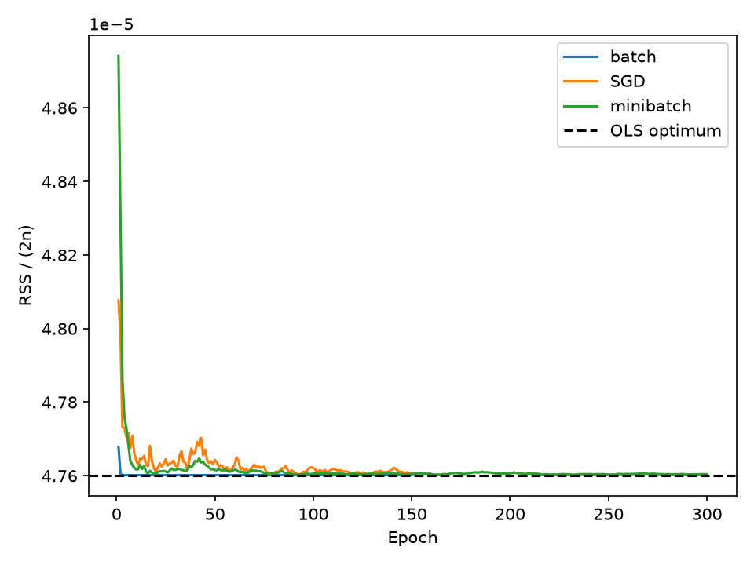
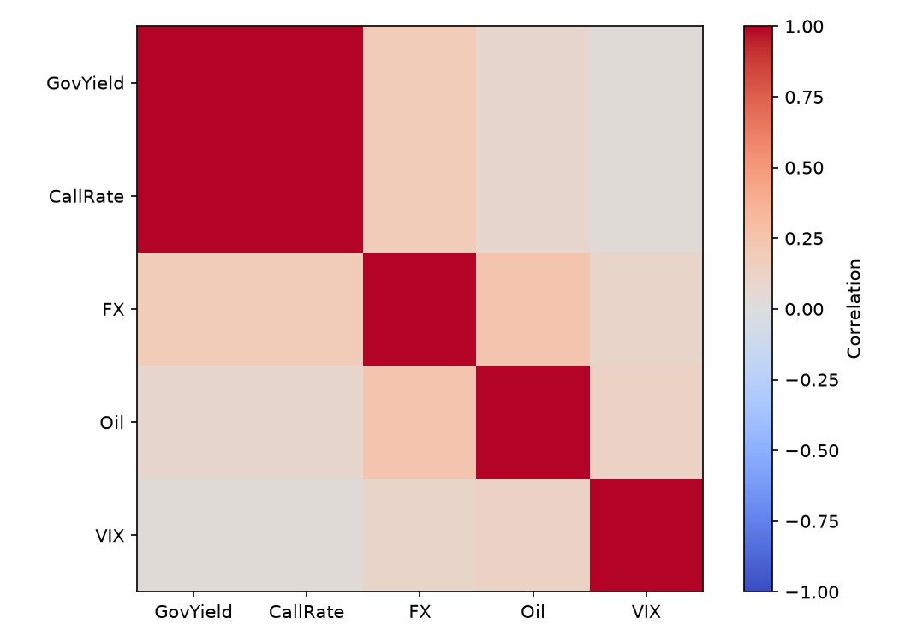
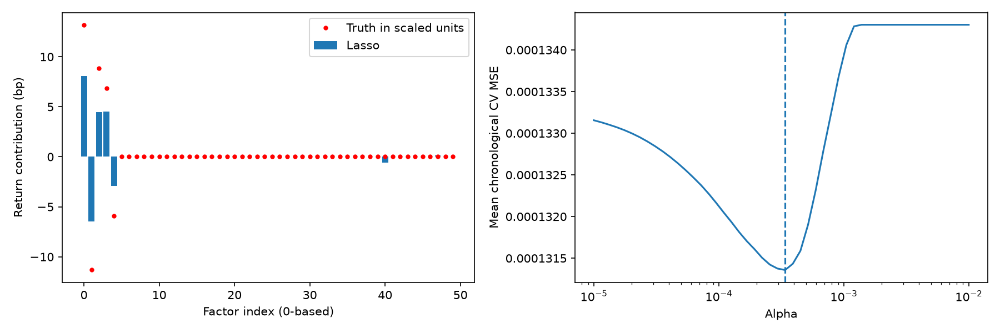
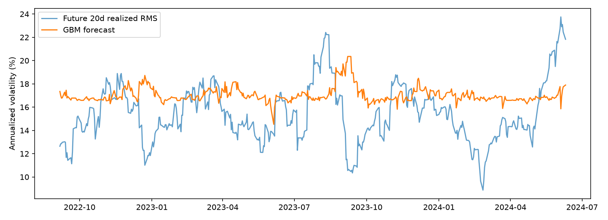
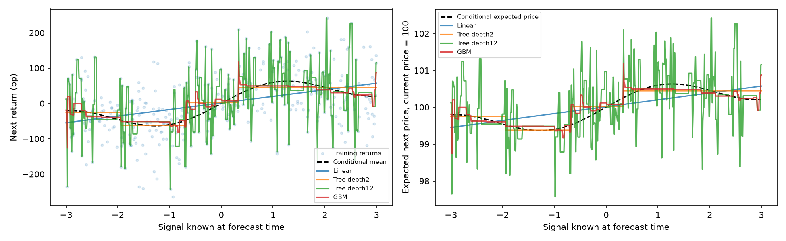

# Chapter 05. 금융 회귀(Regression) 분석 및 퀀트 팩터 셀렉션

> 금융 머신러닝 교재 · 본문 서술 → 수식 유도 → 완전한 코드 → 실행 결과 → 금융 해석

## 이 장에서 해결할 문제

앞 장의 분류가 “부도가 발생하는가?”를 물었다면, 회귀는 “내일 수익률은 어느 정도이며 앞으로 20일의 변동성은 얼마나 큰가?”를 묻는다. 출력이 연속값이라는 차이만 있는 것은 아니다. 수익률의 조건부 평균은 작고 잡음은 크며, 변동성은 음수가 될 수 없고 시간에 따라 군집한다. 따라서 모델의 수학적 성질, 표적의 정의, 정보의 이용 가능 시점을 함께 설계해야 한다.

이 장은 주요 주식 포트폴리오에 적용할 수 있는 분석 구조를 **5개 대형주 대용 합성 종목**으로 구현한다. `LARGE_01`부터 `LARGE_05`는 실존 종목의 시세가 아니다. 실제 수익률을 관측했다고 꾸미지 않고, 생성 과정의 참 계수를 알고 있는 실험으로 팩터 선택의 성공과 실패를 검증한다. 50개 변수도 실제 공시에서 계산한 지표가 아니라 후보 팩터 점수의 대용값이다. 실거래 자료로 교체할 때 지켜야 할 데이터 계약은 마지막 절에서 설명한다.

원본의 주택가격·대여 수요 예제는 사용하지 않는다. 기존 장의 편집 구조와 이번 필수 요구사항을 기준으로 작성했으며, 별도 마스터 지침 파일에서 확인하지 못한 규칙을 임의로 추가하지 않았다. 코드 블록은 위에서부터 순서대로 실행하며, 같은 내용의 단독 실행 파일도 제공한다. 표와 그림은 이 코드의 실제 실행 결과다.

## 원본 슬라이드 매핑

| 원본 PDF 쪽 | 원본 주제 | 금융 회귀 본문 |
|---|---|---|
| 229–237 | 회귀·RSS | 5.1–5.2: 미래 수익률과 OLS |
| 238–252 | 미분·경사하강법·미니배치 | 5.3: NumPy 직접 최적화 |
| 253–267 | 선형회귀·다중공선성·평가·실습 | 5.2, 5.4: CAPM, VIF, 수익률 평가 |
| 268–283 | 비선형성·편향과 분산 | 5.6: 신호와 조건부 가격 곡선 |
| 284–296 | Ridge·Lasso·ElasticNet | 5.5: 50개 팩터의 규제 회귀 |
| 297–304 | 변환·스케일링 | 5.1, 5.5: 사전 보정·원단위 계수 복원 |
| 305–309 | 로지스틱 회귀 | 분류 장과 연결: 확률 분류와 연속값 예측의 구분 |
| 310–318 | 회귀 트리 | 5.6: 잎 평균·계단 예측·GBM |
| 319–330 | 범용 회귀 실습 | 5.6–5.7: 미래 변동성 예측으로 전면 교체 |

## 5.1 예측 시점, 표적, 데이터 구성

### 5.1.1 실현 수익률과 기대수익률

종목 i의 t일 종가를 P라고 할 때 다음 거래일 단순 수익률은 다음과 같다. 배당과 기업행사를 반영한 일관된 가격 계열을 사용해야 한다.

$$r_{i,t+1}=\frac{P_{i,t+1}}{P_{i,t}}-1.$$

t일 정보 집합을 F라고 하자. 모델이 목표로 하는 것은 실제 미래 수익률 자체를 정확히 맞히는 일이 아니라 그 정보에 조건부인 평균을 추정하는 일이다.

$$r_{i,t+1}=\mu_{i,t}+\epsilon_{i,t+1},\qquad \mu_{i,t}=E[r_{i,t+1}\mid\mathcal{F}_t],\qquad E[\epsilon_{i,t+1}\mid\mathcal{F}_t]=0.$$

학습 라벨은 관측 가능한 실현 수익률이다. 기대수익률은 직접 관측되지 않는다. 제곱오차를 최소화하면 조건부 평균을 목표로 하게 되는 이유도 확인할 수 있다. 임의의 예측값 a에 대해 다음 분해의 첫 항은 a와 무관하다.

$$E[(r-a)^2\mid\mathcal{F}_t]=\operatorname{Var}(r\mid\mathcal{F}_t)+(E[r\mid\mathcal{F}_t]-a)^2.$$

따라서 최소점은 조건부 평균이다. 작은 예측 R²가 자동으로 모델 오류를 의미하지 않는 이유는 수익률의 예측 불가능한 분산이 크기 때문이다. 반대로 높은 학습 R²가 경제적 알파의 증거인 것도 아니다.

변동성 표적은 앞으로 20일 수익률의 제곱평균제곱근을 연율화한다.

$$v_{i,t}^{(20)}=\sqrt{\frac{252}{20}\sum_{k=1}^{20}r_{i,t+k}^2}.$$

이는 평균을 차감한 표준편차가 아니라 **실현 RMS 변동성 대용값**이다. 연율화 상수 252는 교육용 관례이며 시장의 실제 거래일 수를 그대로 뜻하지 않는다. 표적을 이렇게 정의했다면 모델도 이 대용값의 조건부 평균을 학습한다. 미래 분산의 조건부 기댓값에 제곱근을 씌운 값과는 일반적으로 다르다.

### 5.1.2 합성 금융 패널과 시간 분리

합성 수익률에는 시장 노출, 다섯 개의 참 알파 팩터, 상태 의존적인 잡음이 들어간다.

$$r_{i,t+1}=r_f+a_i+\beta_i(r_{M,t+1}-r_f)+\boldsymbol{x}_{i,t}^{T}\boldsymbol{w}^{*}+\sigma_{i,t}z_{i,t+1}.$$

여기서 시장의 미래 수익률은 **데이터 생성과 사후 CAPM 회귀**에만 쓰인다. 예측 피처에는 넣지 않는다. 시장 초과수익의 평균을 일정한 프리미엄으로 생성했으므로, 이 실험의 조건부 평균은 무위험 수익률, 종목 절편, 베타 곱하기 시장 프리미엄, 팩터 효과의 합이다. `oracle_mean`과 `true_beta`는 정답 감사용 열이며 모델 입력에서 제외한다.

전체 1,700개 영업일 중 초기 180일은 팩터 스케일의 사전 보정에 사용한다. 다음 1,000일을 개발 구간으로 사용하고 20일을 비운 뒤 미래 평가 구간을 둔다. 영업일은 월요일부터 금요일까지의 합성 달력으로 실제 거래소 휴장일을 반영하지 않는다.

`LassoCV` 내부 검증에 전체 개발 구간으로 계산한 표준화를 넣으면 검증 구간의 분포가 전처리에 반영될 수 있다. 여기서는 모든 내부 검증보다 앞선 보정 구간에서 표준화기를 한 번 학습해 고정한다. 실무에서 매 학습창마다 스케일을 재계산하고 싶다면 `Lasso`와 `StandardScaler`를 묶은 Pipeline 전체를 `GridSearchCV`로 검증해야 한다. 두 설계를 혼동하지 않는다.

동일 날짜의 모든 종목은 같은 fold로 이동한다. 다음 날 수익률 라벨에는 1일 gap, 20일 변동성 라벨에는 20일 gap을 적용한다. 핵심 조건은 훈련 라벨의 마지막 확정일이 검증 예측일보다 앞서야 한다는 것이다.

$$\max_{i\in\mathcal{I}_{train}}t_i^{label\ end}<\min_{j\in\mathcal{I}_{valid}}t_j^{prediction}.$$

다음 코드의 `assert`가 이 조건을 직접 검사한다. 표적 생성에서는 미래 값을 사용하지만 피처 생성에서는 현재와 과거만 사용한다. 미래를 사용한다는 이유만으로 모든 `shift(-1)`이 누수인 것은 아니다. 표적을 만드는 작업과 예측 입력을 만드는 작업을 구별해야 한다.

```python
from pathlib import Path
import json, platform, importlib.metadata
import numpy as np
import pandas as pd
import matplotlib
matplotlib.use('Agg')
import matplotlib.pyplot as plt
from sklearn.base import BaseEstimator, TransformerMixin
from sklearn.preprocessing import StandardScaler
from sklearn.impute import SimpleImputer
from sklearn.pipeline import Pipeline
from sklearn.linear_model import LinearRegression, Ridge, LassoCV, ElasticNetCV
from sklearn.model_selection import TimeSeriesSplit, GridSearchCV
from sklearn.metrics import mean_squared_error, mean_absolute_error, r2_score
from sklearn.tree import DecisionTreeRegressor
from sklearn.ensemble import GradientBoostingRegressor
from statsmodels.stats.outliers_influence import variance_inflation_factor

OUT = Path(__file__).resolve().parent if '__file__' in globals() else Path.cwd()
(OUT / 'assets').mkdir(parents=True, exist_ok=True)
rng = np.random.default_rng(20260904)
results = {}
def records(frame):
    return json.loads(frame.to_json(orient='records', date_format='iso'))
def savefig(name):
    plt.tight_layout(); plt.savefig(OUT / 'assets' / name, dpi=150); plt.close()
def metrics(name, y, pred, split='test', scale=10000):
    return dict(model=name, split=split, RMSE=float(np.sqrt(mean_squared_error(y,pred))*scale),
                MAE=float(mean_absolute_error(y,pred)*scale), R2=float(r2_score(y,pred)))
```

```python
n = 1700
dates = pd.bdate_range('2018-01-02', periods=n)
def ar_process(shape, rho):
    z = rng.normal(size=shape)
    for t in range(1, shape[0]):
        z[t] = rho*z[t-1] + np.sqrt(1-rho**2)*z[t]
    return z
z = ar_process((n,4), .8)
macro = pd.DataFrame({'GovYield':2.5+.4*z[:,0],
    'CallRate':1.5+.4*z[:,0]+.015*rng.normal(size=n),
    'FX':1250*np.exp(.02*z[:,1]+.005*z[:,0]),
    'Oil':80*np.exp(.15*z[:,2]+.03*z[:,1]),
    'VIX':20*np.exp(.2*z[:,3]+.03*z[:,2])}, index=dates)
factor_names = [f'Factor_{j:02d}' for j in range(1,51)]
true_w = np.zeros(50); true_w[:5] = [.0013,-.0011,.0009,.0007,-.0006]
rf, premium = .00005, .0002
market = rf + premium + .008*rng.normal(size=n)
def add_targets(frame):
    frame = frame.sort_values('date').copy()
    ret = frame['return']
    frame['HistVol20'] = ret.pow(2).rolling(20).mean().pow(.5)*np.sqrt(252)
    frame['Momentum20'] = frame['price'].pct_change(20)
    frame['AbsMomentum20'] = frame['Momentum20'].abs()
    frame['target_return_1d'] = ret.shift(-1)
    future = pd.concat([ret.shift(-k) for k in range(1,21)],axis=1)
    frame['target_vol20'] = np.sqrt(252*future.pow(2).mean(axis=1,skipna=False))
    frame['label_end_return'] = frame['date'].shift(-1)
    frame['label_end_vol'] = frame['date'].shift(-20)
    return frame
panels = []
for j, beta in enumerate([.8,.95,1.1,1.25,1.4]):
    f = ar_process((n,50), .3)
    mu = rf+.0001+beta*premium+f@true_w
    sigma = .006*np.exp(.2*z[:,3]+.15*np.abs(f[:,0]))
    ret = np.zeros(n)
    ret[1:] = rf+.0001+beta*(market[1:]-rf)+f[:-1]@true_w+sigma[:-1]*rng.normal(size=n-1)
    assert np.all(ret > -1)
    d = pd.DataFrame(f,columns=factor_names)
    d['date']=dates; d['stock']=f'LARGE_{j+1:02d}'
    d['return']=ret; d['price']=100*np.cumprod(1+ret)
    d['market_return']=market; d['oracle_mean']=mu; d['true_beta']=beta
    for c in macro: d[c]=macro[c].to_numpy()
    panels.append(add_targets(d))
panel = pd.concat(panels).sort_values(['date','stock']).reset_index(drop=True)
cal = panel[panel.date.between(dates[20],dates[199])].copy()
train = panel[panel.date.between(dates[200],dates[1199])].copy()
test = panel[panel.date.between(dates[1220],dates[n-21])].copy()
assert train.label_end_vol.max() < test.date.min()
assert test[['target_return_1d','target_vol20']].notna().all().all()
scaler = StandardScaler().fit(cal[factor_names])
X = scaler.transform(train[factor_names]); Xt = scaler.transform(test[factor_names])
y = train.target_return_1d.to_numpy(); yt = test.target_return_1d.to_numpy()
def date_folds(frame, gap=1):
    unique_dates = np.sort(frame.date.unique())
    folds=[]
    for a,b in TimeSeriesSplit(n_splits=4,test_size=150,gap=gap).split(unique_dates):
        ia=np.flatnonzero(frame.date.isin(unique_dates[a]))
        ib=np.flatnonzero(frame.date.isin(unique_dates[b]))
        label='label_end_return' if gap==1 else 'label_end_vol'
        assert frame.iloc[ia][label].max() < frame.iloc[ib].date.min()
        folds.append((ia,ib))
    return folds
cv=date_folds(train)
results['splits']=[dict(split=name,rows=len(d),start=str(d.date.min().date()),end=str(d.date.max().date()))
                   for name,d in [('calibration',cal),('development',train),('future_test',test)]]
results['folds']=[dict(fold=k+1,train_rows=len(a),valid_rows=len(b),
    train_end=str(train.iloc[a].date.max().date()),valid_start=str(train.iloc[b].date.min().date())) for k,(a,b) in enumerate(cv)]
panel.to_csv(OUT/'synthetic_stock_panel.csv',index=False)
```

| split | rows | start | end |
| --- | --- | --- | --- |
| calibration | 900 | 2018-01-30 | 2018-10-08 |
| development | 5000 | 2018-10-09 | 2022-08-08 |
| future_test | 2300 | 2022-09-06 | 2024-06-10 |


| fold | train_rows | valid_rows | train_end | valid_start |
| --- | --- | --- | --- | --- |
| 1 | 1995 | 750 | 2020-04-17 | 2020-04-21 |
| 2 | 2745 | 750 | 2020-11-13 | 2020-11-17 |
| 3 | 3495 | 750 | 2021-06-11 | 2021-06-15 |
| 4 | 4245 | 750 | 2022-01-07 | 2022-01-11 |


## 5.2 선형 회귀와 OLS 정규방정식

### 5.2.1 행렬 표현

n개 관측치와 p개 피처를 생각하자. X의 첫 열에 1을 넣어 절편까지 포함하면 X의 크기는 n×(p+1), w의 크기는 (p+1)×1이다. 아래에서는 이 확장된 행렬을 X라고 부른다.

$$\boldsymbol{y}=X\boldsymbol{w}+\boldsymbol{\epsilon},\qquad \hat{\boldsymbol{y}}=X\boldsymbol{w},\qquad \boldsymbol{e}=\boldsymbol{y}-X\boldsymbol{w}.$$

잔차제곱합 RSS는 잔차 벡터의 내적이다.

$$RSS(\boldsymbol{w})=(\boldsymbol{y}-X\boldsymbol{w})^{T}(\boldsymbol{y}-X\boldsymbol{w}).$$

곱을 전개하면 네 항이 나온다. 가운데 두 항은 서로 전치인 스칼라이므로 동일하다.

$$RSS=\boldsymbol{y}^{T}\boldsymbol{y}-\boldsymbol{y}^{T}X\boldsymbol{w}-\boldsymbol{w}^{T}X^{T}\boldsymbol{y}+\boldsymbol{w}^{T}X^{T}X\boldsymbol{w}.$$

$$RSS=\boldsymbol{y}^{T}\boldsymbol{y}-2\boldsymbol{w}^{T}X^{T}\boldsymbol{y}+\boldsymbol{w}^{T}X^{T}X\boldsymbol{w}.$$

첫 항은 w에 대해 상수다. 두 번째 항의 미분은 −2Xᵀy이고, 대칭행렬 A에 대한 이차형식 wᵀAw의 미분은 2Aw다. 성분별로 쓰면 j번째 미분은 모든 관측치에 대한 잔차와 j번째 피처의 곱을 합한 값이다.

$$\frac{\partial RSS}{\partial w_j}=-2\sum_{i=1}^{n}x_{ij}\left(y_i-\sum_{k=0}^{p}x_{ik}w_k\right).$$

$$\nabla_{\boldsymbol{w}}RSS=-2X^{T}\boldsymbol{y}+2X^{T}X\boldsymbol{w}.$$

최적점에서 이를 0으로 놓으면 정규방정식을 얻는다.

$$X^{T}X\hat{\boldsymbol{w}}=X^{T}\boldsymbol{y}.$$

X의 열이 선형 독립이면 XᵀX가 가역이므로 해는 다음과 같다.

$$\hat{\boldsymbol{w}}=(X^{T}X)^{-1}X^{T}\boldsymbol{y}.$$

헤시안은 2XᵀX이며 임의의 벡터 u에 대해 아래가 성립한다. 따라서 RSS는 볼록하고, 열 독립이면 엄격히 볼록하여 해가 유일하다.

$$\boldsymbol{u}^{T}(2X^{T}X)\boldsymbol{u}=2\|X\boldsymbol{u}\|_2^2\geq 0.$$

역행렬이 존재하지 않으면 위의 역행렬 공식을 적용할 수 없다. 의사역행렬을 이용한 최소노름 해는 가능하지만 개별 계수가 유일하게 식별되지 않을 수 있다. 실제 구현에서는 역행렬을 명시적으로 만드는 대신 QR·SVD 기반 최소제곱 해법을 사용한다. 코드의 `solve`는 수학식 확인용이며 `lstsq`와 결과를 대조한다.

### 5.2.2 회귀 베타와 CAPM 시장 베타

일반 다중회귀에서 베타는 나머지 피처를 고정했을 때 특정 피처 한 단위 변화에 따른 조건부 평균의 변화다. 국채금리를 % 단위로 넣었는지 소수 단위로 넣었는지에 따라 계수의 숫자가 달라진다. 모든 회귀 계수를 시장 위험의 베타로 부를 수는 없다.

CAPM의 시장 베타는 종목과 시장의 **같은 기간 초과수익률**을 연결하는 노출이다. 시장 초과수익을 m, 종목 초과수익을 s로 쓰면 회귀식은 다음과 같다.

$$s_t=\alpha+\beta m_t+\epsilon_t.$$

절편에 대한 정규방정식에서 알파는 평균 s에서 베타 곱하기 평균 m을 뺀 값이 된다. 이를 기울기 방정식에 대입하면 다음 식을 얻는다.

$$\hat{\alpha}=\bar{s}-\hat{\beta}\bar{m},\qquad \hat{\beta}=\frac{\sum_t(m_t-\bar{m})(s_t-\bar{s})}{\sum_t(m_t-\bar{m})^2}=\frac{\widehat{\operatorname{Cov}}(s,m)}{\widehat{\operatorname{Var}}(m)}.$$

CAPM의 균형 기대수익 관계는 다음과 같다.

$$E[r_i]-r_f=\beta_i(E[r_M]-r_f).$$

시장 위험 노출에 대한 이론적 보상 관계와 표본에서 추정한 회귀식은 구분해야 한다. 이론의 가정 아래 초과 알파는 0이지만 실제 회귀 절편은 표본 오차, 누락 요인, 모형 불완전성 때문에 0이 아닐 수 있다. 이 합성 실험은 별도의 알파와 팩터 효과를 넣었으므로 CAPM을 완전히 만족하도록 설계한 자료도 아니다. 시장 베타와 기대수익의 관계는 [CFA Institute의 CAPM 설명](https://www.cfainstitute.org/insights/professional-learning/refresher-readings/2026/portfolio-risk-return-part-2)을 참고한다.

다음 날 수익률을 오늘 예측하면서 다음 날 시장 수익률을 입력하면 미래 정보 누수다. CAPM의 사후 노출 추정과 미래 수익률 예측 회귀의 설명변수 정렬이 다른 이유다.

```python
one = train.stock.eq('LARGE_01').to_numpy()
A = np.column_stack([np.ones(one.sum()), X[one,:5]])
b = y[one]
w_svd = np.linalg.lstsq(A,b,rcond=None)[0]
w_normal = np.linalg.solve(A.T@A,A.T@b)
assert np.allclose(w_svd,w_normal)
capm=[]
for stock,d in train.groupby('stock'):
    m=d.market_return.to_numpy()-rf; s=d['return'].to_numpy()-rf
    fit=LinearRegression().fit(m[:,None],s)
    beta_cov=np.cov(m,s,ddof=1)[0,1]/np.var(m,ddof=1)
    assert np.isclose(fit.coef_[0],beta_cov)
    capm.append(dict(stock=stock,true_beta=float(d.true_beta.iloc[0]),
        fitted_beta=float(fit.coef_[0]),alpha_daily=float(fit.intercept_)))
results['capm']=capm
results['ols']=[dict(term=t,normal=float(a),SVD=float(b)) for t,a,b in zip(['intercept']+factor_names[:5],w_normal,w_svd)]
```

| term | normal | SVD |
| --- | --- | --- |
| intercept | 0.00059806 | 0.00059806 |
| Factor_01 | 0.00132158 | 0.00132158 |
| Factor_02 | -0.00134020 | -0.00134020 |
| Factor_03 | 0.00057130 | 0.00057130 |
| Factor_04 | 0.00035760 | 0.00035760 |
| Factor_05 | -0.00083521 | -0.00083521 |


| stock | true_beta | fitted_beta | alpha_daily |
| --- | --- | --- | --- |
| LARGE_01 | 0.80000000 | 0.82639072 | 0.00049313 |
| LARGE_02 | 0.95000000 | 0.93012509 | -0.00023712 |
| LARGE_03 | 1.10000000 | 1.03864583 | 0.00037184 |
| LARGE_04 | 1.25000000 | 1.23923290 | 0.00010854 |
| LARGE_05 | 1.40000000 | 1.41576043 | 0.00009663 |


추정 시장 베타가 생성 베타와 정확히 일치하지 않는 것은 표본이 유한하고 개별 잡음·팩터 효과가 존재하기 때문이다. `alpha_daily`는 일별 수익률 소수 단위다. 단순히 252를 곱한 수치를 확정적인 연간 초과수익으로 해석해서는 안 된다.

## 5.3 NumPy 경사하강법: 해를 반복해서 찾기

### 5.3.1 배치 경사하강법의 수렴 조건

미분의 상수를 간단하게 하기 위해 목적함수를 RSS/(2n)으로 정의한다. 양의 상수로 나누었으므로 최소점은 OLS와 같다.

$$J(\boldsymbol{w})=\frac{1}{2n}\|\boldsymbol{y}-X\boldsymbol{w}\|_2^2,\qquad \nabla J=\frac{1}{n}X^{T}(X\boldsymbol{w}-\boldsymbol{y}).$$

$$\boldsymbol{w}_{k+1}=\boldsymbol{w}_{k}-\eta\frac{1}{n}X^{T}(X\boldsymbol{w}_{k}-\boldsymbol{y}).$$

H=XᵀX/n으로 두고 최적점과의 오차를 e라고 하면, 정규방정식에 의해 오차의 다음 단계는 선형 변환으로 표현된다.

$$\boldsymbol{e}_{k+1}=(I-\eta H)\boldsymbol{e}_k.$$

H의 고유값을 λ라 할 때 각 고유방향의 오차는 매 단계 1−ηλ배가 된다. 모든 양의 고유방향이 축소되려면 그 절댓값이 1보다 작아야 한다.

$$|1-\eta\lambda_j|<1\quad\Longrightarrow\quad 0<\eta<\frac{2}{\lambda_{max}(H)}.$$

코드는 최대 고유값 L을 구해 학습률을 1/L로 둔다. X가 열 독립이면 유일한 해로 수렴한다. 특이행렬이면 0 고유값 방향의 계수는 식별되지 않지만 적합값을 최소화하는 해로 이동할 수 있다. 큰 조건수는 방향마다 수렴 속도를 다르게 만들어 지그재그와 느린 진전을 유발한다. 표준화가 유용한 이유지만 표준화만으로 공선성이 제거되지는 않는다.

### 5.3.2 SGD와 미니배치

확률적 경사하강법은 한 관측치를 추출하여 아래 확률적 기울기를 사용한다. 균등 복원 추출이라면 이 기울기의 기댓값은 전체 배치 기울기다.

$$\boldsymbol{g}_k=\boldsymbol{x}_{i_k}(\boldsymbol{x}_{i_k}^{T}\boldsymbol{w}_k-y_{i_k}),\qquad E[\boldsymbol{g}_k\mid\boldsymbol{w}_k]=\nabla J(\boldsymbol{w}_k).$$

미니배치는 B개 표본의 기울기를 평균한다.

$$\boldsymbol{g}_k^{(B)}=\frac{1}{B}\sum_{i\in\mathcal{B}_k}\boldsymbol{x}_i(\boldsymbol{x}_i^{T}\boldsymbol{w}_k-y_i).$$

표본 기울기들이 독립적으로 추출되는 조건에서 평균 기울기의 분산은 대략 B에 반비례한다. 실제 시계열의 의존성과 온라인 표본 도착 과정은 별개의 문제다. 여기서는 이미 확보된 과거 학습 집합에서 복원 추출해 고정된 경험손실을 최적화한다.

고정 학습률의 SGD는 최적점 주변에서 계속 흔들릴 수 있다. 적절한 볼록성·기울기 잡음 조건 아래 다음 두 급수 조건이 점근 수렴을 뒷받침한다.

$$\sum_{k=0}^{\infty}\eta_k=\infty,\qquad \sum_{k=0}^{\infty}\eta_k^2<\infty.$$

$$\eta_k=\frac{\eta_0}{(1+k/k_0)^q},\qquad \frac{1}{2}<q\leq 1.$$

첫 조건은 너무 일찍 이동을 멈추지 않도록 하고, 둘째는 누적 잡음의 영향을 제어한다. 코드에서는 q=0.75를 사용한다. 유한 반복 후 SGD와 OLS의 계수가 완전히 같아야 하는 것은 아니다. 초기값·학습률·반복 수·표본 잡음에 따라 남은 차이가 달라진다.

학습창 내부 표본을 섞는 최적화와 전체 시계열을 무작위로 섞어 검증하는 것은 다른 작업이다. 전자는 이미 알려진 과거 자료를 반복 읽는 방법이며, 후자는 미래가 과거의 검증에 섞일 수 있는 평가 설계다.

```python
def loss(w): return float(np.mean((A@w-b)**2)/2)
L=np.linalg.eigvalsh(A.T@A/len(A)).max()
histories={}; weights={}
for method,batch,epochs in [('batch',len(A),150),('SGD',1,150),('minibatch',32,300)]:
    random=np.random.default_rng(42); w=np.zeros(A.shape[1]); curve=[]; step=0
    for epoch in range(epochs):
        updates=1 if method=='batch' else int(np.ceil(len(A)/batch))
        for _ in range(updates):
            if method=='batch':
                gradient=A.T@(A@w-b)/len(A); eta=1/L
            else:
                idx=random.integers(0,len(A),size=batch)
                gradient=A[idx].T@(A[idx]@w-b[idx])/batch
                eta=(.02/L)/(1+step/100)**.75
            w-=eta*gradient; step+=1
        curve.append(loss(w))
    histories[method]=curve; weights[method]=w
results['gd']=[dict(method=k,objective=loss(v),distance_to_OLS=float(np.linalg.norm(v-w_svd))) for k,v in weights.items()]
results['gd'].append(dict(method='OLS',objective=loss(w_svd),distance_to_OLS=0.))
for name,h in histories.items(): plt.plot(np.arange(1,len(h)+1),h,label=name)
plt.axhline(loss(w_svd),color='black',ls='--',label='OLS optimum')
plt.xlabel('Epoch');plt.ylabel('RSS / (2n)');plt.legend();savefig('fig01_gradient.png')
```

| method | objective | distance_to_OLS |
| --- | --- | --- |
| batch | 0.00004760 | 0.00000000 |
| SGD | 0.00004761 | 0.00010079 |
| minibatch | 0.00004760 | 0.00006993 |
| OLS | 0.00004760 | 0.00000000 |




세 방법 모두 같은 수익률 자료와 목적함수를 사용한다. 그림의 epoch 한 번이 뜻하는 계산량은 방법별로 다르므로 이 그림만으로 실행 속도의 우열을 주장하지 않는다. 배치 해의 목적값과 OLS 목적값을 비교하고, SGD의 목적값 차이와 계수 거리를 함께 살펴야 한다.

## 5.4 거시변수 다중공선성과 VIF 통제

### 5.4.1 왜 역행렬이 불안정해지는가

국채금리와 콜금리는 공통 통화정책 요인의 영향을 받을 수 있다. 환율·유가·VIX도 시장 상태에 따라 동반 움직일 수 있다. 모든 시장에서 상관관계가 항상 크다는 뜻은 아니며, 이 실험에서는 금리 두 열에 강한 공통 요인을 의도적으로 부여한다.

만약 두 열이 거의 같다면 한 열의 계수를 늘리고 다른 열의 계수를 줄여도 예측값은 거의 달라지지 않는다. XᵀX의 일부 고유값이 작아지고 그 역행렬에서는 작은 고유값이 큰 역수로 바뀐다.

$$X^{T}X=Q\Lambda Q^{T},\qquad (X^{T}X)^{-1}=Q\Lambda^{-1}Q^{T}.$$

표적에 작은 변화 δy가 발생하면 계수 변화는 아래와 같다.

$$\delta\hat{\boldsymbol{w}}=(X^{T}X)^{-1}X^{T}\delta\boldsymbol{y}.$$

등분산이고 오차가 관측치 사이에서 상관되지 않는 고전적 조건에서는 계수의 조건부 분산이 다음과 같다.

$$\operatorname{Var}(\hat{\boldsymbol{w}}\mid X)=\sigma^2(X^{T}X)^{-1}.$$

금융 시계열의 이분산·자기상관이 있으면 이 분산식을 그대로 추론에 사용해서는 안 된다. 공선성이 수치적 식별을 약하게 만든다는 사실과 표준오차 계산의 가정은 구별해야 한다. 2-노름 조건수는 열 독립일 때 다음 관계를 갖는다.

$$\kappa_2(X^{T}X)=\kappa_2(X)^2.$$

### 5.4.2 VIF의 유도와 순차 제거

j번째 피처를 나머지 피처와 절편에 회귀시켰을 때의 결정계수를 Rj²라고 하자. 그 피처에서 다른 변수로 설명되지 않는 변동만이 j번째 계수의 식별에 사용된다. 중심화된 j번째 피처의 제곱합을 SSTj라고 하면 잔차화한 피처의 제곱합은 SSTj(1−Rj²)다.

$$\operatorname{Var}(\hat{w}_j\mid X)=\frac{\sigma^2}{SST_j(1-R_j^2)},\qquad VIF_j=\frac{1}{1-R_j^2}.$$

VIF=10이면 나머지 피처가 해당 열 변동의 90%를 설명한다. 10은 이 실습의 제거 기준이며 법칙이나 유의성 검정의 임계값이 아니다. 높은 VIF 변수들을 한꺼번에 지우면 같은 공통 요인을 표현하는 두 열을 모두 잃을 수 있다. 가장 큰 VIF 하나를 제거한 뒤 다시 계산해야 한다.

아래 변환기는 훈련 자료에서만 제거 목록을 학습한다. 결측값 대체도 훈련 자료의 평균으로 수행하고, 평가 자료에는 같은 열 선택과 변환을 적용한다. 상수 열은 먼저 제외하고 절편은 VIF의 제거 후보에서 뺀다. 함수의 정의와 API는 [statsmodels VIF 문서](https://www.statsmodels.org/dev/generated/statsmodels.stats.outliers_influence.variance_inflation_factor.html)에서 확인할 수 있다.

```python
macro_names=list(macro.columns)
def vif_table(frame):
    standardized=(frame-frame.mean())/frame.std(ddof=0)
    design=np.column_stack([np.ones(len(frame)),standardized.to_numpy()])
    return pd.DataFrame({'feature':frame.columns,
        'VIF':[float(variance_inflation_factor(design,i+1)) for i in range(frame.shape[1])]})
class VIFSelector(TransformerMixin,BaseEstimator):
    def __init__(self,threshold=10.): self.threshold=threshold
    def fit(self,X,y=None):
        X=pd.DataFrame(X).copy()
        self.columns_=[c for c in X if X[c].std(ddof=0)>1e-12]
        if not self.columns_: raise ValueError('All columns are constant')
        self.history_=[]
        while len(self.columns_)>1:
            table=vif_table(X[self.columns_]); row=table.loc[table.VIF.idxmax()]
            if row.VIF<=self.threshold: break
            self.history_.append(dict(removed=str(row.feature),VIF=float(row.VIF)))
            self.columns_.remove(row.feature)
        return self
    def transform(self,X): return pd.DataFrame(X)[self.columns_].copy()
macro_train=train.loc[one,macro_names]
macro_test=test.loc[test.stock.eq('LARGE_01'),macro_names]
vif_pipe=Pipeline([('impute',SimpleImputer().set_output(transform='pandas')),
    ('vif',VIFSelector(10)),('scale',StandardScaler()),('ols',LinearRegression())])
vif_pipe.fit(macro_train,b)
kept=vif_pipe.named_steps['vif'].columns_
results['vif_before']=records(vif_table(macro_train))
results['vif_removed']=vif_pipe.named_steps['vif'].history_
results['vif_after']=records(vif_table(macro_train[kept]))
results['vif_test']=[metrics('VIF + OLS',test.loc[test.stock.eq('LARGE_01'),'target_return_1d'],vif_pipe.predict(macro_test))]
Z=StandardScaler().fit_transform(macro_train)
delta=np.random.default_rng(7).normal(0,.0001,len(b))
results['stability']=[]
for name,model in [('OLS',LinearRegression()),('Ridge',Ridge(alpha=100))]:
    model.fit(Z,b); before=model.coef_.copy(); model.fit(Z,b+delta)
    results['stability'].append(dict(model=name,coefficient_change=float(np.linalg.norm(model.coef_-before))))
results['condition']={'X':float(np.linalg.cond(Z)),'XtX':float(np.linalg.cond(Z.T@Z)),
    'ridge_matrix':float(np.linalg.cond(Z.T@Z+100*np.eye(5)))}
plt.figure(figsize=(7,5));plt.imshow(macro_train.corr(),vmin=-1,vmax=1,cmap='coolwarm')
plt.xticks(range(5),macro_names);plt.yticks(range(5),macro_names);plt.colorbar(label='Correlation')
savefig('fig02_macro.png')
```

| feature | VIF |
| --- | --- |
| GovYield | 770.21067491 |
| CallRate | 769.79137619 |
| FX | 1.09611036 |
| Oil | 1.07389636 |
| VIX | 1.02269678 |


| removed | VIF |
| --- | --- |
| GovYield | 770.21067491 |


| feature | VIF |
| --- | --- |
| CallRate | 1.03555188 |
| FX | 1.09322824 |
| Oil | 1.07310584 |
| VIX | 1.02190958 |


| model | coefficient_change |
| --- | --- |
| OLS | 0.00007734 |
| Ridge | 0.00000918 |


표준화한 거시 행렬 X의 조건수는 **56.801**, XᵀX는 **3226.336**, λ=100을 더한 행렬은 **21.815**였다.



교란 실험은 수익률 라벨에 표준편차 1bp의 작은 잡음을 더한 뒤 계수가 얼마나 바뀌는지 측정한다. Ridge의 변화량이 작아지는 것은 안정화 효과를 보여주지만 이 실험 하나로 예측 성능 우월성을 증명하지는 않는다.

| model | split | RMSE | MAE | R2 |
| --- | --- | --- | --- | --- |
| VIF + OLS | test | 96.31610450 | 77.21712512 | 0.00660797 |


거시 변수만 사용한 이 모델의 미래 평가 성능은 경제적으로 유용한 예측이 확보되었는지 별도로 판단해야 한다. VIF 감소는 공선성 진단의 개선이지 수익률 예측 성공을 뜻하지 않는다. 실제 비정상 수준변수는 차분·수익률·장단기 스프레드 등 경제적으로 타당한 변환을 먼저 검토하고, 공시 지연과 개정 이력도 반영한다.

## 5.5 규제 선형 회귀와 50개 알파 후보 선택

### 5.5.1 Ridge: L2 패널티와 고유값 안정화

이 절에서는 X와 y가 중심화되어 절편이 별도로 처리된다고 가정한다. 절편을 패널티에 넣지 않는 것이 일반적이다. Ridge는 큰 계수에 이차 비용을 부과한다.

$$J_R(\boldsymbol{w})=\|\boldsymbol{y}-X\boldsymbol{w}\|_2^2+\lambda\|\boldsymbol{w}\|_2^2.$$

$$\nabla J_R=-2X^{T}\boldsymbol{y}+2X^{T}X\boldsymbol{w}+2\lambda\boldsymbol{w}=0.$$

$$\hat{\boldsymbol{w}}_R=(X^{T}X+\lambda I)^{-1}X^{T}\boldsymbol{y}.$$

XᵀX의 고유값이 dj라면 규제 후 고유값은 dj+λ다. λ가 양수이면 원래 0이던 방향도 양수가 된다. 최대·최소 고유값의 비는 다음과 같다.

$$\kappa_2(X^{T}X+\lambda I)=\frac{d_{max}+\lambda}{d_{min}+\lambda}.$$

dmax>dmin인 경우 이 비를 λ에 대해 미분하면 음수이므로 패널티를 키울수록 조건수가 1에 가까워진다.

$$\frac{\partial}{\partial\lambda}\frac{d_{max}+\lambda}{d_{min}+\lambda}=\frac{d_{min}-d_{max}}{(d_{min}+\lambda)^2}\leq 0.$$

X=UDVᵀ라는 SVD를 적용하면 각 특이값 방향의 계수는 다음 필터를 통과한다.

$$\hat{\boldsymbol{w}}_R=V\operatorname{diag}\left(\frac{s_j}{s_j^2+\lambda}\right)U^{T}\boldsymbol{y}.$$

OLS의 1/sj 대신 sj/(sj²+λ)가 사용되므로 작은 특이값 방향이 억제된다. OLS 대비 축소율은 sj²/(sj²+λ)다. 개별 원래 피처의 계수 절댓값이 항상 단조 감소한다는 뜻은 아니며, 고유방향의 축소를 말한다. 참 선형 모형 아래 기대값에는 다음 편향이 생긴다.

$$E[\hat{\boldsymbol{w}}_R\mid X]-\boldsymbol{w}^{*}=-\lambda(X^{T}X+\lambda I)^{-1}\boldsymbol{w}^{*}.$$

편향을 허용하는 대신 계수의 변동을 줄이는 것이 Ridge의 교환관계다. 완전히 중복되는 팩터를 반드시 하나만 남길 필요 없이 공동으로 안정화할 때 유용하다. 보통 계수를 정확히 0으로 만들지는 않는다.

### 5.5.2 Lasso: 0에서의 부분미분과 정확한 희소성

Lasso는 절댓값 합을 패널티로 사용한다.

$$J_L(\boldsymbol{w})=\frac{1}{2n}\|\boldsymbol{y}-X\boldsymbol{w}\|_2^2+\alpha\sum_{j=1}^{p}|w_j|.$$

절댓값 함수는 양수에서 기울기 +1, 음수에서 −1이며 0에서는 단일 미분값이 없다. 대신 부분미분 집합 [−1,1]을 사용한다. 요청의 ‘능형 분기’는 표준 최적화 용어가 아니다. 정확한 설명은 **L1 제약영역의 마름모 꼭짓점과 0에서의 부분미분 조건**이다. Ridge의 L2 제약영역은 원 또는 구이며 이 기하를 혼동하지 않는다.

잔차를 r=y−Xw로 놓으면 최적 조건은 다음과 같다.

$$0\in-\frac{1}{n}\boldsymbol{x}_j^{T}\boldsymbol{r}+\alpha\,\partial|w_j|.$$

계수가 양수이면 잔차와 피처의 내적/n이 +α이고, 음수이면 −α다. 계수가 0이면 그 값이 구간 안에 들어오면 된다.

$$w_j=0\quad\Longrightarrow\quad \left|\frac{1}{n}\boldsymbol{x}_j^{T}\boldsymbol{r}\right|\leq\alpha.$$

정확히 0이 가능해지는 것은 이처럼 폭이 있는 최적 조건 때문이다. 수치적으로 작은 값을 사후에 잘라서 희소성을 만든 것이 아니다.

좌표하강법의 한 단계도 유도할 수 있다. j번째 항을 제외한 부분잔차를 r⁽ʲ⁾로 두고 aj=xjᵀxj/n, zj=xjᵀr⁽ʲ⁾/n으로 놓으면 j번째 좌표의 목적함수는 상수항을 제외하고 아래와 같다.

$$q(w_j)=\frac{a_j}{2}w_j^2-z_jw_j+\alpha|w_j|.$$

양수 구간에서 미분하면 ajwj−zj+α=0, 음수 구간에서는 ajwj−zj−α=0이다. zj가 ±α 사이이면 최적값은 0이다. 이를 soft-threshold 연산자로 묶는다.

$$S(z,\alpha)=\operatorname{sign}(z)\max(|z|-\alpha,0),\qquad w_j\leftarrow\frac{S(z_j,\alpha)}{a_j}.$$

금융적으로는 다른 팩터를 반영한 뒤 남은 수익률과의 관련성이 패널티보다 약한 후보가 제외된다. 그러나 비제로 계수는 통계적 유의성이나 비용 차감 후 초과수익을 보장하지 않는다. 강하게 상관된 여러 진짜 팩터 가운데 하나만 남거나 잡음 팩터가 선택될 수도 있다. 선택 이후 같은 표본에서 일반 OLS p값을 계산해 그대로 유의성을 주장하는 것도 선택 편향을 무시한다.

### 5.5.3 ElasticNet과 패널티 단위

ElasticNet은 L1과 L2를 결합한다. l1_ratio를 ρ라고 두면 다음 목적함수를 사용한다.

$$J_E=\frac{1}{2n}\|\boldsymbol{y}-X\boldsymbol{w}\|_2^2+\alpha\rho\|\boldsymbol{w}\|_1+\frac{\alpha(1-\rho)}{2}\|\boldsymbol{w}\|_2^2.$$

같은 좌표하강법을 적용하면 분자에는 L1 문턱값, 분모에는 L2 안정화 항이 들어간다.

$$w_j\leftarrow\frac{S(z_j,\alpha\rho)}{a_j+\alpha(1-\rho)}.$$

ρ=1이면 Lasso이고 ρ가 작아질수록 L2 성분이 강해진다. 상관된 피처들을 함께 유지하면서 계수 크기를 억제하려면 중간 혼합이 유용할 수 있다. 여기서는 0.1, 0.5, 0.9, 1.0 중에서 날짜 기반 검증 MSE가 가장 작은 값을 선택한다. 시험 구간을 보고 후보를 바꾸지 않는다.

scikit-learn의 Ridge는 RSS+alpha×L2²를 최소화하지만 Lasso와 ElasticNet은 RSS/(2n)를 사용한다. 따라서 이름이 같은 `alpha` 숫자를 모델 사이에서 직접 비교하면 안 된다. 통일된 목적함수를 RSS/(2n)+αL2²/2로 정의했다면 Ridge의 입력값은 nα가 된다. 구현 목적함수는 [Ridge 문서](https://scikit-learn.org/stable/modules/generated/sklearn.linear_model.Ridge.html), [Lasso 문서](https://scikit-learn.org/stable/modules/generated/sklearn.linear_model.Lasso.html), [ElasticNet 문서](https://scikit-learn.org/stable/modules/generated/sklearn.linear_model.ElasticNet.html)에 명시되어 있다.

### 5.5.4 LassoCV로 50개 후보 선택하기

표준화된 피처의 계수는 ‘피처가 보정 구간 표준편차 한 단위 증가할 때의 수익률 변화’다. 원래 단위로 환산하려면 계수를 보정 표준편차로 나누고 절편도 보정해야 한다.

$$x_j^{std}=\frac{x_j-m_j}{s_j},\qquad w_j^{raw}=\frac{w_j^{std}}{s_j},\qquad b^{raw}=b^{std}-\sum_j\frac{w_j^{std}m_j}{s_j}.$$

alpha 후보는 10⁻⁵부터 10⁻²까지 사전에 정한 50개 값이다. `LassoCV`에는 날짜로 구성한 인덱스 쌍을 전달한다. 각 후보마다 expanding window의 검증 오차를 구하고 평균 MSE가 가장 작은 alpha로 전체 개발 구간을 다시 적합한다. 현재 API에서는 `alphas`로 배열을 전달하며 제거된 구형 인자를 사용하지 않는다. [LassoCV API](https://scikit-learn.org/stable/modules/generated/sklearn.linear_model.LassoCV.html).

평가에는 RMSE, MAE, R²를 사용한다. 수익률 0.0001은 1bp이므로 처음 두 지표는 10,000배하여 제시한다.

$$RMSE=\sqrt{\frac{1}{n}\sum_i(y_i-\hat{y}_i)^2},\qquad MAE=\frac{1}{n}\sum_i|y_i-\hat{y}_i|.$$

$$R^2=1-\frac{\sum_i(y_i-\hat{y}_i)^2}{\sum_i(y_i-\bar{y}_{test})^2}.$$

평가 R²의 분모는 평가 구간 평균을 사용하지만 실제 기준 모델의 예측에는 학습 구간 평균만 사용한다. 음의 R²는 평가 표본의 상수 평균보다 제곱오차가 크다는 뜻이다. 수익률은 0이나 음수가 될 수 있으므로 MAPE는 이 실습의 주 지표로 적합하지 않다.

```python
alphas=np.logspace(-5,-2,50)
lasso=LassoCV(alphas=alphas,cv=cv,max_iter=20000,tol=1e-8,n_jobs=-1).fit(X,y)
elastic=ElasticNetCV(l1_ratio=[.1,.5,.9,1.],alphas=alphas,cv=cv,max_iter=20000,tol=1e-8,n_jobs=-1).fit(X,y)
ridge=GridSearchCV(Ridge(),{'alpha':np.logspace(-2,4,20)},cv=cv,
    scoring='neg_mean_squared_error',n_jobs=-1).fit(X,y).best_estimator_
models={'OLS50':LinearRegression().fit(X,y),'Ridge':ridge,'LassoCV':lasso,'ElasticNetCV':elastic}
results['returns']=[metrics('Historical mean',yt,np.repeat(y.mean(),len(yt)))]
for name,model in models.items(): results['returns'].append(metrics(name,yt,model.predict(Xt)))
raw_coef=lasso.coef_/scaler.scale_
raw_intercept=float(lasso.intercept_-np.dot(raw_coef,scaler.mean_))
assert np.allclose(lasso.predict(Xt),test[factor_names].to_numpy()@raw_coef+raw_intercept)
coef=pd.DataFrame({'factor':factor_names,'standardized_coef':lasso.coef_,
    'raw_coef':raw_coef,'true_coef':true_w})
selected=coef[coef.standardized_coef.ne(0)].copy()
selected=selected.loc[selected.standardized_coef.abs().sort_values(ascending=False).index]
print('\nALL NONZERO LASSO COEFFICIENTS\n',selected.to_string(index=False))
results['selected']=records(selected)
chosen=lasso.coef_!=0; truth=true_w!=0
results['selection']={'lasso_alpha':float(lasso.alpha_),'elastic_alpha':float(elastic.alpha_),
    'l1_ratio':float(elastic.l1_ratio_),'ridge_alpha':float(ridge.alpha),
    'TP':int(np.sum(chosen&truth)),'FP':int(np.sum(chosen&~truth)),'FN':int(np.sum(~chosen&truth)),
    'raw_intercept':raw_intercept}
coef.to_csv(OUT/'factor_coefficients.csv',index=False)
fig,ax=plt.subplots(1,2,figsize=(12,4))
ax[0].bar(np.arange(50),lasso.coef_*10000,label='Lasso');ax[0].plot(np.arange(50),true_w*scaler.scale_*10000,'ro',ms=3,label='Truth in scaled units')
ax[0].set(xlabel='Factor index (0-based)',ylabel='Return contribution (bp)');ax[0].legend()
ax[1].semilogx(lasso.alphas_,lasso.mse_path_.mean(axis=1));ax[1].axvline(lasso.alpha_,ls='--')
ax[1].set(xlabel='Alpha',ylabel='Mean chronological CV MSE');savefig('fig03_lasso.png')
```

Lasso의 선택 alpha는 **0.000339322**, ElasticNet의 alpha는 **0.003237458**, l1_ratio는 **0.1**다. Ridge의 alpha는 **2335.721469**다. Lasso는 참 팩터 **5개**, 잡음 팩터 **2개**를 선택했고 참 팩터 누락은 **0개**였다.

| factor | standardized_coef | raw_coef | true_coef |
| --- | --- | --- | --- |
| Factor_01 | 0.00080730 | 0.00079516 | 0.00130000 |
| Factor_02 | -0.00064507 | -0.00062702 | -0.00110000 |
| Factor_04 | 0.00045418 | 0.00046519 | 0.00070000 |
| Factor_03 | 0.00044924 | 0.00045553 | 0.00090000 |
| Factor_05 | -0.00029301 | -0.00029868 | -0.00060000 |
| Factor_41 | -0.00005559 | -0.00005581 | 0.00000000 |
| Factor_48 | 0.00001188 | 0.00001183 | 0.00000000 |


표는 비제로 계수를 **생략 없이 모두 출력**한 것이다. `true_coef`는 합성 생성 과정의 감사용 정답이다. 실제 시장 자료에서는 이 열을 알 수 없다. 선택된 열 가운데 정답이 0인 열은 거짓 선택이며, 이를 숨기고 ‘진짜 알파만 골랐다’고 서술하지 않는다.

| model | split | RMSE | MAE | R2 |
| --- | --- | --- | --- | --- |
| Historical mean | test | 114.71400064 | 90.29645417 | -0.00062541 |
| OLS50 | test | 113.58051010 | 89.46447751 | 0.01905128 |
| Ridge | test | 113.45314603 | 89.36521939 | 0.02125003 |
| LassoCV | test | 113.14463675 | 89.12907015 | 0.02656576 |
| ElasticNetCV | test | 113.12039653 | 89.11250130 | 0.02698281 |




왼쪽 그림의 빨간 참 계수도 표준화된 입력 단위로 환산해 파란 계수와 비교했다. 오른쪽 곡선은 미래 시험 성능이 아니라 개발 구간 내부의 검증 오차다. 최소점 부근이 평평하다면 선택 팩터 목록이 작은 자료 변화에도 달라질 수 있다. 추가 시점의 재학습에서 선택 빈도와 부호 안정성을 기록하는 것이 실무적으로 유용하다. 이 교재는 독립 미래 구간을 한 번 비교하며 해당 결과에 맞춰 모델을 재조정하지 않는다.

## 5.6 회귀 트리와 비선형 예측

### 5.6.1 왜 잎에서는 평균을 출력하는가

제곱오차 회귀 트리는 각 영역에 상수를 배정한다. 특정 잎 R에서 출력할 상수를 c라고 하면 최소화 문제는 다음과 같다.

$$L_R(c)=\sum_{i\in R}(y_i-c)^2.$$

$$\frac{dL_R}{dc}=2\sum_{i\in R}(c-y_i)=2|R|c-2\sum_{i\in R}y_i=0.$$

$$\hat{c}_R=\frac{1}{|R|}\sum_{i\in R}y_i.$$

두 번째 미분은 2|R|>0이므로 최소점이다. 샘플 가중치가 있으면 단순 평균이 가중평균으로 바뀐다. 이 성질은 제곱오차 기준에 대한 것이며 절대오차 기준에서는 중앙값이 된다.

분할 후보 피처 j와 문턱 s는 왼쪽·오른쪽 영역의 최적 잎 RSS 합을 최소화하도록 선택한다.

$$\min_{j,s}\left[\sum_{i:x_{ij}\leq s}(y_i-\bar{y}_L)^2+\sum_{i:x_{ij}>s}(y_i-\bar{y}_R)^2\right].$$

단일 피처가 일정 구간에 있는 동안 같은 잎으로 이동하므로 예측은 계단 모양이다. 여러 피처의 경우는 다차원 공간을 직사각형 영역으로 나눈다. 평균을 출력하는 트리는 학습 표적 범위 밖으로 자연스럽게 외삽하지 못한다. 금융 스트레스가 과거 범위를 넘으면 중요한 제한이 된다.

### 5.6.2 회귀 GBM의 잎은 원래 표적의 평균인가

제곱오차 손실의 GBM은 초기 상수로 전체 표적 평균을 사용한다. 이후에는 현재 예측에 대한 음의 그래디언트를 학습한다.

$$F_0=\bar{y},\qquad L_i=\frac{1}{2}(y_i-F(\boldsymbol{x}_i))^2.$$

$$r_{im}=-\frac{\partial L_i}{\partial F(\boldsymbol{x}_i)}=y_i-F_{m-1}(\boldsymbol{x}_i).$$

m번째 회귀 트리는 이 잔차를 근사한다. 해당 단계 잎의 최적 증가량은 원래 y의 평균이 아니라 현재 잔차의 평균이다.

$$\gamma_{Rm}=\frac{1}{|R|}\sum_{i\in R}\left(y_i-F_{m-1}(\boldsymbol{x}_i)\right).$$

$$F_m(\boldsymbol{x})=F_{m-1}(\boldsymbol{x})+\nu\sum_R\gamma_{Rm}\,1[\boldsymbol{x}\in R].$$

ν는 학습률이다. GBM의 최종 출력은 초기 평균과 여러 잔차 트리의 축소된 합이며 단일 잎의 원래 표적 평균이 아니다. 코드에서는 단일 트리 잎의 표적 평균과 GBM 첫 트리 잎의 잔차 평균을 각각 직접 대조한다. 손실 함수를 바꾸면 최적 잎 갱신식도 달라질 수 있다. [GradientBoostingRegressor 문서](https://scikit-learn.org/stable/modules/generated/sklearn.ensemble.GradientBoostingRegressor.html).

### 5.6.3 미래 20일 변동성 예측

실무 예제에서는 VIX, 과거 20일 RMS 변동성, 과거 20일 모멘텀의 절댓값, 국채금리, 환율, 유가를 입력한다. 출력은 미래 20일 RMS 변동성이다. 역사적 변동성이 높았다는 이유만으로 미래 변동성이 반드시 높아지는 것은 아니며 모델은 과거 자료에서 이 관계를 추정한다.

트리 깊이 3은 적은 수의 영역으로 상태를 묶는다. 깊이 12와 최소 잎 표본 1은 훨씬 세밀한 패턴을 표현할 수 있지만 우연한 변동성 라벨의 잡음까지 학습할 수 있다. GBM은 깊이 2의 작은 트리를 100번 더하며 학습률은 0.05로 고정한다. 이 하이퍼파라미터는 시험 성능을 보고 고른 값이 아니다.

```python
vol_features=['VIX','HistVol20','AbsMomentum20','GovYield','FX','Oil']
VX=train[vol_features]; VXt=test[vol_features]
vy=train.target_vol20; vyt=test.target_vol20
vol_models={'Linear':LinearRegression(),
    'Tree depth3':DecisionTreeRegressor(max_depth=3,min_samples_leaf=20,random_state=42),
    'Tree depth12':DecisionTreeRegressor(max_depth=12,min_samples_leaf=1,random_state=42),
    'GBM':GradientBoostingRegressor(loss='squared_error',n_estimators=100,max_depth=2,
        min_samples_leaf=20,learning_rate=.05,random_state=42)}
results['volatility']=[]
for name,model in vol_models.items():
    model.fit(VX,vy)
    for split,xx,yy in [('train',VX,vy),('test',VXt,vyt)]:
        row=metrics(name,yy,model.predict(xx),split,scale=100)
        row['negative_predictions']=int(np.sum(model.predict(xx)<0));results['volatility'].append(row)
tree=vol_models['Tree depth3']; leaves=tree.apply(VX)
assert all(np.isclose(tree.predict(VX)[leaves==leaf][0],vy.to_numpy()[leaves==leaf].mean()) for leaf in np.unique(leaves))
gbm=vol_models['GBM']; residual=vy.to_numpy()-float(gbm.init_.constant_[0,0])
first=gbm.estimators_[0,0]; leaf_id=first.apply(VX.to_numpy())
assert all(np.isclose(first.predict(VX.to_numpy())[leaf_id==leaf][0],residual[leaf_id==leaf].mean()) for leaf in np.unique(leaf_id))
focus=test.stock.eq('LARGE_01').to_numpy()
plt.figure(figsize=(11,4));plt.plot(test.loc[focus,'date'],vyt[focus]*100,label='Future 20d realized RMS',alpha=.7)
plt.plot(test.loc[focus,'date'],gbm.predict(VXt[focus])*100,label='GBM forecast')
plt.ylabel('Annualized volatility (%)');plt.legend();savefig('fig04_volatility.png')
```

| model | split | RMSE | MAE | R2 | negative_predictions |
| --- | --- | --- | --- | --- | --- |
| Linear | train | 3.19805187 | 2.54136788 | 0.19345921 | 0 |
| Linear | test | 3.33567040 | 2.63573411 | 0.11654472 | 0 |
| Tree depth3 | train | 3.15773344 | 2.49055291 | 0.21366744 | 0 |
| Tree depth3 | test | 3.40485552 | 2.68381814 | 0.07951719 | 0 |
| Tree depth12 | train | 2.11628581 | 1.46633497 | 0.64681360 | 0 |
| Tree depth12 | test | 4.16342956 | 3.21567776 | -0.37632421 | 0 |
| GBM | train | 3.09176721 | 2.44713994 | 0.24617783 | 0 |
| GBM | test | 3.39124819 | 2.68170247 | 0.08685981 | 0 |


변동성 표의 RMSE·MAE는 **연율화 변동성 %포인트** 단위다. 수익률 표의 bp와 다르다. 학습 오차와 미래 오차의 간격이 크면 과적합을 의심한다. 인접한 20일 표적들이 19일을 공유하므로 평가 행을 독립 표본으로 간주한 표준오차는 과도하게 작아질 수 있다. 반복 검증 시에는 날짜 블록과 표적 기간을 고려해야 한다.



선형 모형은 이론상 음의 변동성을 출력할 수 있다. 표에 그 개수를 그대로 기록하고 조용히 0으로 잘라 성능을 바꾸지 않았다. 양수 제약이 꼭 필요하면 로그 변동성 모형이나 양의 출력 구조를 별도로 검증한다. 로그 예측값의 단순 지수변환은 원단위 조건부 평균과 같지 않으므로 재변환 편향을 함께 다뤄야 한다.

### 5.6.4 직선·계단·깊이 과적합을 같은 그림에서 비교

다차원 모델을 단일 곡선으로 나타내면 다른 변수의 조건을 고정해야 한다. 여기서는 구조를 명확히 보이기 위해 별도의 1차원 금융 신호 실험을 사용한다. 신호 x가 알려졌을 때의 다음 수익률 평균을 아래처럼 생성한다.

$$\mu(x)=0.002x+0.004\sin(1.5x),\qquad r_{t+1}=\mu(x_t)+\epsilon_{t+1}.$$

현재 가격을 100으로 고정하면 기대 다음 가격은 아래와 같다. 수익률을 먼저 모델링하고 현재 가격으로 환산하는 방식이다.

$$E[P_{t+1}\mid x_t,P_t=100]=100\left(1+E[r_{t+1}\mid x_t]\right).$$

왼쪽 그림은 bp 수익률, 오른쪽은 같은 예측을 가격으로 환산한 것이다. 직선은 일정한 기울기만 표현하고 얕은 트리는 구간별 평균을 나타낸다. 깊은 트리는 학습 관측치에 민감한 작은 계단을 만들 수 있다. GBM 역시 유한 개의 트리를 합하므로 정확히 연속 곡선이 되는 것은 아니지만 더 많은 구간을 통해 비선형 관계를 근사한다.

```python
random=np.random.default_rng(70)
signal=random.uniform(-3,3,700)
expected=.002*signal+.004*np.sin(1.5*signal)
observed=expected+random.normal(0,.008,700)
grid=np.linspace(-3,3,600)[:,None]
curve_models={'Linear':LinearRegression(),
 'Tree depth2':DecisionTreeRegressor(max_depth=2,random_state=42),
 'Tree depth12':DecisionTreeRegressor(max_depth=12,random_state=42),
 'GBM':GradientBoostingRegressor(n_estimators=100,max_depth=2,learning_rate=.05,random_state=42)}
results['curves']=[]
fig,axes=plt.subplots(1,2,figsize=(13,4))
axes[0].scatter(signal[:400],observed[:400]*10000,s=8,alpha=.15,label='Training returns')
truth_grid=.002*grid[:,0]+.004*np.sin(1.5*grid[:,0])
for ax in axes: ax.set_xlabel('Signal known at forecast time')
axes[0].plot(grid[:,0],truth_grid*10000,'k--',label='Conditional mean')
axes[1].plot(grid[:,0],100*(1+truth_grid),'k--',label='Conditional expected price')
for name,model in curve_models.items():
    model.fit(signal[:400,None],observed[:400]); prediction=model.predict(grid)
    for split,sl in [('train',slice(0,400)),('test',slice(400,None))]:
        results['curves'].append(metrics(name,observed[sl],model.predict(signal[sl,None]),split))
    axes[0].plot(grid[:,0],prediction*10000,label=name,alpha=.8)
    axes[1].plot(grid[:,0],100*(1+prediction),label=name,alpha=.8)
axes[0].set_ylabel('Next return (bp)');axes[1].set_ylabel('Expected next price, current price = 100')
axes[0].legend(fontsize=7);axes[1].legend(fontsize=7);savefig('fig05_steps.png')
```

| model | split | RMSE | MAE | R2 |
| --- | --- | --- | --- | --- |
| Linear | train | 82.12749415 | 64.46361570 | 0.13783152 |
| Linear | test | 79.81987453 | 65.11233023 | 0.15156375 |
| Tree depth2 | train | 77.17876888 | 60.60815366 | 0.23860383 |
| Tree depth2 | test | 76.77982095 | 62.74434864 | 0.21496083 |
| Tree depth12 | train | 42.72483762 | 23.70456131 | 0.76666718 |
| Tree depth12 | test | 99.55661505 | 79.83010249 | -0.31988891 |
| GBM | train | 72.80255479 | 56.90227918 | 0.32250166 |
| GBM | test | 77.49758674 | 63.54955457 | 0.20021456 |




이 실험의 첫 400개 관측치를 학습하고 뒤의 300개를 평가했다. 별도로 생성한 안정적 합성 신호이며 위 5개 종목의 실제 가격 경로를 그림으로 재현한 것은 아니다. 복잡도가 늘수록 학습 오차가 줄더라도 미래 오차까지 줄지 않는다는 점을 수치와 곡선으로 확인한다. 실제 가격 수준을 직접 회귀하면 공통 추세만으로 높은 R²가 나올 수 있으므로 수익률·변동성 표적과 시간 평가를 먼저 설계하는 편이 안전하다.

## 5.7 실제 주식 자료로 전환하는 데이터 계약

이 코드에서 합성 생성 부분을 바꾸면 같은 모델·검증·보고 흐름을 사용할 수 있다. 다만 50개 열의 이름만 실제 지표 이름으로 바꾸는 것으로 충분하지 않다. 각 종목·날짜의 피처는 해당 예측 시점에 이용 가능했던 값이어야 한다.

| 자료 | 필수 조건 | 예시 처리 |
|---|---|---|
| 가격 | 종목·날짜별 유일한 행, 일관된 수익률 정의 | 배당·분할 반영 가격에서 수익률 계산 |
| 공시 팩터 | 결산일과 공개일 구분 | 공개 시각 이전에는 이전 공시값 유지 |
| 거시지표 | 최초 공개와 개정 데이터 구분 | 당시 이용 가능한 빈티지 사용 |
| 시장 자료 | 종목과 시장 거래일 정렬 | CAPM은 같은 기간, 예측은 과거 정보만 사용 |
| 후보 팩터 50개 | 계산식·윈도·결측 규칙 보존 | 모멘텀, 변동성, 유동성, 가치, 수익성 등의 정의 기록 |
| 투자 유니버스 | 해당 시점의 편입·상장폐지 포함 | 현재 생존 종목만 과거에 소급하지 않기 |

`add_targets`는 각 종목 안에서 날짜를 정렬한 프레임에 적용한다. 실제 자료에서 날짜가 빠져 있으면 `shift(-20)`은 20달력일이 아니라 그 종목의 다음 20개 관측치를 뜻한다. 거래 정지와 누락을 구분하고 종목별 표적의 실제 종료일을 유지해야 한다. 누락 관측치를 단순히 앞 값으로 채워 인위적으로 0 수익률을 만드는 것은 라벨을 왜곡할 수 있다.

종가 피처로 당일 종가 체결을 가정하는 백테스트도 별도 실행 가능성 검토가 필요하다. 당일 종가가 확정된 뒤 계산하는 시스템이라면 다음 실행 시점의 가격과 거래비용을 반영해야 한다. 이 장의 예측 오차는 체결 전략의 손익이 아니다.

최종 팩터 선택 결과를 운영에 넘길 때에는 계수뿐 아니라 표준화 평균·표준편차, 피처 순서, 학습 종료일, 라벨 정의, 모델 버전, 선택된 alpha와 l1_ratio를 함께 보존한다. 수익률 예측을 종목 순위로 사용할 경우에는 날짜별 순위 상관, turnover, 거래비용, 유동성 제약, 시장·업종 노출을 추가 평가한다. 이는 다음 단계의 포트폴리오 검증이며 회귀 RMSE만으로 대신할 수 없다.

## 5.8 실행·재현과 결과 파일

다음 마지막 블록은 표·계수·실행 버전·검증 항목을 저장한다. 단독 파일은 앞 장 파일을 읽지 않고 데이터를 새로 생성한다. 모든 랜덤 생성기는 고정된 시드를 사용한다. 패키지 버전이 달라지면 최적화의 수치 결과에 작은 차이가 생길 수 있다.

```python
results['versions']={p:importlib.metadata.version(p) for p in ['numpy','pandas','scikit-learn','statsmodels','matplotlib']}
results['python']=platform.python_version()
results['checks']=['date_grouped_CV','mature_labels_before_validation','OLS_matches_SVD',
    'CAPM_matches_covariance','raw_scale_predictions_match','tree_leaf_mean','GBM_residual_leaf_mean']
(OUT/'results.json').write_text(json.dumps(results,ensure_ascii=False,indent=2),encoding='utf-8')
(OUT/'requirements.txt').write_text('\n'.join(f'{p}=={v}' for p,v in results['versions'].items())+'\n',encoding='utf-8')
print('\nRETURN TEST METRICS (bp)\n',pd.DataFrame(results['returns']).to_string(index=False))
print('\nSELECTION AUDIT\n',results['selection'])
print('\nAll numerical and chronological checks passed.')
```

Python 3.12.14에서 실행했다.

| package | version |
| --- | --- |
| numpy | 2.3.5 |
| pandas | 3.0.1 |
| scikit-learn | 1.9.0 |
| statsmodels | 0.15.0 |
| matplotlib | 3.11.1 |


실행 방법은 다음과 같다. 현재 폴더에 압축을 풀고 터미널에서 실행한다.

```text
python -m pip install -r requirements.txt
python chapter05_examples.py
```

`synthetic_stock_panel.csv`에는 입력과 표적이 함께 있지만 모델 입력 목록은 코드에서 명시적으로 제한한다. `factor_coefficients.csv`는 0을 포함한 50개 전체 계수, `results.json`은 표에 사용한 수치, `assets`는 그림과 수식 자산이다. HTML에는 그림과 수식이 내장되어 인터넷 연결 없이 읽을 수 있다. Markdown은 수정 가능한 원문이며 그림 폴더와 함께 보관한다.

스크립트를 다른 자료나 파라미터로 재실행하면 수치 파일과 그림이 갱신되지만 이미 작성한 본문의 표와 해석은 자동으로 다시 집필되지 않는다. 변경된 실행 결과에 맞춰 원고를 함께 검토해야 한다.

이 장에서 수학적 최소점, 수치적 안정성, 미래 예측 성능, 경제적 효용은 서로 다른 평가 대상이었다. OLS의 해를 구하는 것에서 출발해 규제로 계수를 안정화하고, 시간 검증으로 후보를 선택하며, 비선형 모델의 복잡도를 통제하는 과정이 하나의 재현 가능한 금융 분석으로 연결된다.
