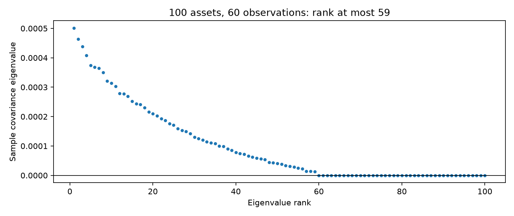
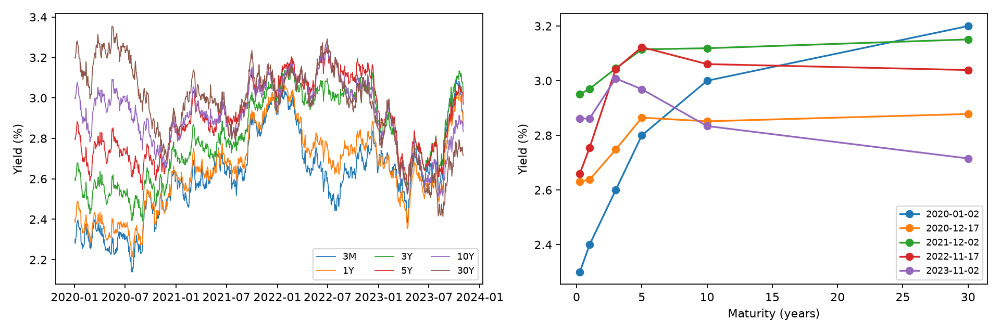
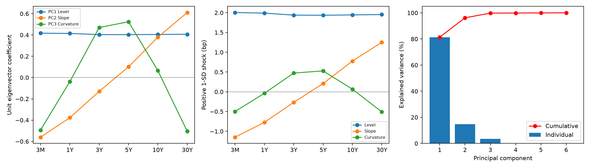
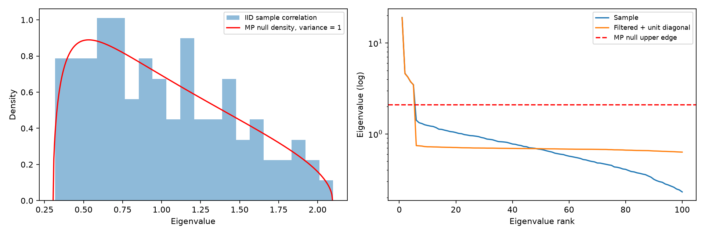
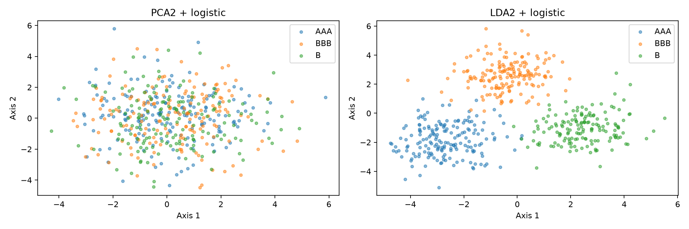

# Chapter 06. 비지도 학습: 차원 축소(Dimensionality Reduction)와 금융 리스크 분해

> 금융 머신러닝 교재 · 본문 서술 → 수식 유도 → 완전한 실행 코드 → 실제 결과 → 금융 리스크 해석

## 이 장을 시작하며

자산을 더 많이 편입하면 분산투자 기회는 늘어난다. 그러나 관측 자료가 그대로인 상태에서 자산 수만 늘리면 추정해야 할 공분산도 빠르게 늘어난다. 채권의 경우 만기별 금리 여섯 개가 서로 독립적으로 움직이지 않는다. 여러 만기가 함께 상승하거나, 장단기금리차가 벌어지거나, 중기 구간만 다르게 움직이는 공통 패턴이 존재할 수 있다. 차원 축소는 이처럼 많은 관측 변수를 더 적은 수의 변동 방향으로 표현하는 방법이다.

이번 장에서는 금융 시계열의 공분산 행렬을 직접 분해한다. 먼저 표본 수가 부족할 때 공분산이 왜 역행렬을 갖지 못하는지 증명하고, 분산 최대화 문제에서 PCA의 고유값 방정식을 유도한다. 이어서 여섯 만기 국채 금리를 생성해 Level·Slope·Curvature를 해석한다. SVD와 랜덤 행렬 이론을 이용한 노이즈 억제를 연결한 다음, 신용등급 정보를 사용하는 LDA와 비교한다.

모든 국채 금리·주식 수익률·신용등급 자료는 **교육용 합성 데이터**다. 실제 시장의 관측 결과로 제시하지 않는다. 특히 PC1·PC2·PC3의 금융적 모양을 분명히 확인할 수 있도록 금리 변화의 생성 구조를 설계했다. 실제 시장에서는 같은 순서와 모양이 자동으로 보장되지 않는다. 기존 장의 집필 구조와 이번 필수 요구사항을 적용하며, 본문 코드 전체를 별도의 독립 실행 파일로도 제공한다.

## 원본 슬라이드 매핑과 표기 규칙

| 원본 PDF 쪽 | 원본 주제 | 이번 장의 금융 확장 |
|---|---|---|
| 331–336 | 차원의 저주·피처 선택과 추출 | 6.1: 고차원 포트폴리오와 공분산 순위 |
| 337–344 | PCA·공분산·고유값 분해 | 6.2: 중심화와 라그랑주 유도 |
| 345–350 | PCA API·범용 실습 | 6.3: 국채 기간구조로 전면 대체 |
| 351–355 | 신용 데이터 차원 축소 | 6.6: 합성 신용등급의 PCA·LDA 비교 |
| 356–360 | LDA | 6.6: 클래스 간·내 산포와 일반화 고유값 |
| 361–372 | SVD·Truncated SVD | 6.4: 공분산과의 연결·저순위 재구성 |
| 373–375 | 비음수 행렬 분해 | 6.7: 금융 부호 자료에서의 적용 범위 |
| 요청에 따른 확장 | RMT·금리 위험 | 6.3, 6.5: DV01 분해와 MP 노이즈 억제 |

이 장에서 **T는 관측 시점 수, N은 자산 또는 만기 수**다. 따라서 행렬 X는 T×N이고 표본 공분산의 분모는 T−1이다. 요청에 제시된 Σ=XᵀX/(N−1)은 N을 ‘관측 수’로 정의했을 때 맞는 공식이다. 동일한 N을 자산 수와 관측 수로 혼용하면 오류가 생기므로, 아래에서는 두 표기를 먼저 대응시키고 이후 T−1로 통일한다.

$$\hat{\Sigma}=\frac{1}{n_{obs}-1}X^{T}X=\frac{1}{T-1}X^{T}X.$$

문헌에서 관측 수를 N으로 표기한 경우에만 다음처럼 읽는다.

$$N_{obs}=T\quad\Longrightarrow\quad \hat{\Sigma}=\frac{1}{N_{obs}-1}X^{T}X.$$

## 6.1 차원의 저주와 금융 포트폴리오의 한계

### 6.1.1 차원이 커지면 왜 자료가 부족해지는가

각 피처를 열 개 구간으로 나누면 2차원 공간은 100개 셀이지만 10차원은 100억 개 셀이다. 관측 수가 일정하면 고차원에서 대부분의 셀이 비어 버린다. 공분산 추정에서도 자유도가 빠르게 증가한다. 대칭행렬이므로 N개 자산의 분산·공분산 모수 수는 다음과 같다.

$$p_{cov}=\frac{N(N+1)}{2}.$$

100개 자산이면 5,050개, 1,000개 자산이면 500,500개다. 행렬을 계산할 수 있다는 사실과 그 행렬을 안정적으로 추정할 수 있다는 사실은 다르다.

거리의 직관도 달라진다. 두 독립 표준정규 N차원 벡터의 차이는 각 좌표에서 분산 2를 갖는다. 제곱 유클리드 거리를 D²라고 하면 다음이 성립한다.

$$D^2=\sum_{j=1}^{N}(x_j-y_j)^2,\qquad E[D^2]=2N,\qquad \operatorname{Var}(D^2)=8N.$$

$$\frac{\operatorname{SD}(D^2)}{E[D^2]}=\sqrt{\frac{2}{N}}\longrightarrow 0.$$

절대 거리는 커지지만 상대적 변동은 줄어든다. 무관한 피처를 계속 추가하면 가까움과 멂의 상대적 구분이 약해질 수 있다. 이 계산은 독립 정규 피처에 대한 설명이며 모든 금융 거리 분포에 보편적으로 성립한다는 뜻은 아니다.

### 6.1.2 중심화하면 최대 순위가 T−1인 이유

원래 수익률 행렬을 R이라고 하고 각 열 평균을 제거하는 중심화 행렬 H를 정의한다. 1은 길이 T의 모든 원소가 1인 벡터다.

$$H=I_T-\frac{1}{T}\boldsymbol{1}\boldsymbol{1}^{T},\qquad X=HR.$$

H는 대칭이고 H²=H이며 H1=0이다. 상수 방향 하나가 제거되므로 순위가 T−1이다. 따라서 다음 상한을 얻는다.

$$\operatorname{rank}(X)\leq\min(T-1,N).$$

XᵀX와 X는 영공간이 같다. Xv=0이면 XᵀXv=0이고, 역으로 XᵀXv=0이면 아래 내적에 의해 Xv=0이다.

$$\boldsymbol{v}^{T}X^{T}X\boldsymbol{v}=\|X\boldsymbol{v}\|_2^2=0.$$

그러므로 공분산의 순위도 X와 같고 다음이 성립한다.

$$\operatorname{rank}(\hat{\Sigma})=\operatorname{rank}(X)\leq T-1.$$

$$N>T-1\quad\Longrightarrow\quad \det(\hat{\Sigma})=0.$$

사용자가 제시한 N>T이면 반드시 특이행렬이다. 더 강하게, **N=T인 경우에도 중심화한 공분산은 특이행렬**이다. N<T여도 완전히 중복된 자산이나 선형 종속 관계가 있으면 특이할 수 있다. 결측치를 자산쌍마다 다른 날짜로 계산하는 pairwise 공분산은 이와 별개로 양의 준정부호 성질까지 잃을 수 있으므로 공통 관측 구간의 행렬과 구별해야 한다.

### 6.1.3 표본에서 위험이 0인 포트폴리오의 착시

영공간의 비영벡터 v는 표본에서 아래 위험을 갖는다.

$$\boldsymbol{v}^{T}\hat{\Sigma}\boldsymbol{v}=0.$$

하지만 모집단 공분산이 σ²I이면 실제 분산은 양수다.

$$\boldsymbol{v}^{T}\Sigma_{true}\boldsymbol{v}=\sigma^2\|\boldsymbol{v}\|_2^2>0.$$

표본에서 우연히 상쇄되는 방향을 찾았을 뿐 무위험 거래를 발견한 것이 아니다. 최소분산 포트폴리오의 익숙한 식도 가역성을 전제한다.

$$\boldsymbol{w}_{GMV}=\frac{\Sigma^{-1}\boldsymbol{1}}{\boldsymbol{1}^{T}\Sigma^{-1}\boldsymbol{1}}.$$

의사역행렬을 넣는다고 추정 오차가 자동으로 해결되지 않는다. 자산 수 축소, 팩터 공분산, 수축 추정, 투자 비중 제약 등을 별도로 고려해야 한다.

다음 실험은 60일·100자산에서 순위 59와 영공간 차원 41을 확인한다. 영벡터를 총절대비중 1로 정규화하지만 순투자 비중 합을 1로 강제하지는 않는다. 즉 자금 배분 전략이 아니라 표본 영위험 방향의 진단 실험이다. 수치 오차 때문에 표본 분산이 아주 작은 음수로 출력될 수 있다.

```python
from pathlib import Path
import json, platform, importlib.metadata
import numpy as np
import pandas as pd
import matplotlib
matplotlib.use('Agg')
import matplotlib.pyplot as plt
from sklearn.decomposition import PCA, TruncatedSVD
from sklearn.preprocessing import StandardScaler
from sklearn.discriminant_analysis import LinearDiscriminantAnalysis
from sklearn.linear_model import LogisticRegression
from sklearn.pipeline import Pipeline
from sklearn.metrics import accuracy_score, balanced_accuracy_score, f1_score, confusion_matrix

OUT=Path(__file__).resolve().parent if '__file__' in globals() else Path.cwd()
(OUT/'assets').mkdir(parents=True,exist_ok=True)
results={}
def records(frame): return json.loads(frame.to_json(orient='records',double_precision=12))
def savefig(name):
    plt.tight_layout();plt.savefig(OUT/'assets'/name,dpi=160);plt.close()
```

```python
rng=np.random.default_rng(6001)
T,N=60,100
returns=rng.normal(0,.01,(T,N))
centered=returns-returns.mean(axis=0)
cov=centered.T@centered/(T-1)
eigenvalues,eigenvectors=np.linalg.eigh(cov)
rank=int(np.linalg.matrix_rank(cov))
assert rank==T-1
null_weight=eigenvectors[:,0];null_weight/=np.abs(null_weight).sum()
future=rng.normal(0,.01,(3000,N))
results['singular']=[dict(T=T,N=N,rank=rank,nullity=N-rank,
    sample_variance=float(null_weight@cov@null_weight),
    true_variance=float(.01**2*(null_weight@null_weight)),
    future_variance=float(np.var(future@null_weight,ddof=1)))]
results['distances']=[]
for p in [2,10,100,1000]:
    differences=rng.normal(0,np.sqrt(2),(2000,p))
    squared=np.sum(differences**2,axis=1)
    results['distances'].append(dict(dimension=p,squared_distance_CV=float(squared.std()/squared.mean()),
        theoretical_CV=float(np.sqrt(2/p))))
plt.figure(figsize=(9,3.8));plt.plot(np.arange(1,N+1),eigenvalues[::-1],'o',ms=3)
plt.axhline(0,color='black',lw=.8);plt.xlabel('Eigenvalue rank');plt.ylabel('Sample covariance eigenvalue')
plt.title('100 assets, 60 observations: rank at most 59');savefig('fig01_singular.png')
```

| T | N | rank | nullity | sample_variance | true_variance | future_variance |
| --- | --- | --- | --- | --- | --- | --- |
| 60 | 100 | 59 | 41 | -2.1561e-22 | 0.00000167 | 0.00000165 |


| dimension | squared_distance_CV | theoretical_CV |
| --- | --- | --- |
| 2 | 1.03704147 | 1.00000000 |
| 10 | 0.44771229 | 0.44721360 |
| 100 | 0.14032732 | 0.14142136 |
| 1000 | 0.04295426 | 0.04472136 |




## 6.2 PCA의 수학적 유도

### 6.2.1 중심화와 공분산 행렬

각 날짜의 관측 벡터를 rₜ라고 하면 피처별 평균과 중심화는 다음과 같다.

$$\bar{\boldsymbol{r}}=\frac{1}{T}\sum_{t=1}^{T}\boldsymbol{r}_t,\qquad \boldsymbol{x}_t=\boldsymbol{r}_t-\bar{\boldsymbol{r}}.$$

$$\hat{\Sigma}_{ij}=\frac{1}{T-1}\sum_{t=1}^{T}(r_{ti}-\bar{r}_i)(r_{tj}-\bar{r}_j),\qquad \hat{\Sigma}=\frac{X^{T}X}{T-1}.$$

평균을 제거하지 않은 XᵀX는 변동뿐 아니라 평균 수준을 포함한다. PCA가 찾으려는 것은 평균에서 벗어나는 방향이다. 미래 자료를 변환할 때에는 미래 평균을 새로 빼지 않고 훈련 평균을 사용한다.

중심화와 표준화는 다르다. 중심화는 평균만 제거하고, 표준화는 표준편차로도 나눈다. 모든 국채 만기의 변화가 bp라는 같은 단위라면 공분산 PCA가 실제 변동 크기를 반영한다. 각 만기를 표준화한 상관행렬 PCA는 원래 변동이 작은 만기에도 같은 총분산을 배정한다. 어느 쪽이 맞는지는 분석 목적에 달려 있다.

### 6.2.2 첫 주성분의 분산 최대화

길이 N의 축 벡터 w에 데이터를 투영하면 점수 z=Xw를 얻는다. X가 중심화되어 있으므로 점수 평균도 0이다.

$$\widehat{\operatorname{Var}}(X\boldsymbol{w})=\frac{(X\boldsymbol{w})^{T}(X\boldsymbol{w})}{T-1}=\boldsymbol{w}^{T}\hat{\Sigma}\boldsymbol{w}.$$

w의 길이를 무제한 늘리면 분산도 무제한 커지므로 단위 길이 제약을 둔다.

$$\max_{\boldsymbol{w}}\boldsymbol{w}^{T}\hat{\Sigma}\boldsymbol{w}\quad\mathrm{subject\ to}\quad \boldsymbol{w}^{T}\boldsymbol{w}=1.$$

라그랑주 함수를 구성한다. 이 절의 λ는 길이 제약에 대한 승수다.

$$\mathcal{L}(\boldsymbol{w},\lambda)=\boldsymbol{w}^{T}\hat{\Sigma}\boldsymbol{w}-\lambda(\boldsymbol{w}^{T}\boldsymbol{w}-1).$$

공분산이 대칭이므로 이차형식의 미분은 2Σw다. w와 λ에 대해 각각 미분해 0으로 놓는다.

$$\nabla_{\boldsymbol{w}}\mathcal{L}=2\hat{\Sigma}\boldsymbol{w}-2\lambda\boldsymbol{w}=0.$$

$$\frac{\partial\mathcal{L}}{\partial\lambda}=-(\boldsymbol{w}^{T}\boldsymbol{w}-1)=0.$$

따라서 최적 축의 후보는 공분산 고유벡터다.

$$\hat{\Sigma}\boldsymbol{w}=\lambda\boldsymbol{w}.$$

양변에 wᵀ를 곱하면 승수가 그 방향의 분산과 같음을 알 수 있다.

$$\boldsymbol{w}^{T}\hat{\Sigma}\boldsymbol{w}=\lambda\boldsymbol{w}^{T}\boldsymbol{w}=\lambda.$$

정지점이라는 사실만으로 최대점이라는 결론이 나오지는 않는다. 공분산의 직교 고유벡터를 vⱼ, 고유값을 내림차순 λ₁≥…≥λN≥0으로 두고 임의의 단위 w를 고유기저에서 전개한다.

$$\boldsymbol{w}=\sum_{j=1}^{N}a_j\boldsymbol{v}_j,\qquad \sum_{j=1}^{N}a_j^2=1.$$

$$\boldsymbol{w}^{T}\hat{\Sigma}\boldsymbol{w}=\sum_{j=1}^{N}\lambda_ja_j^2\leq\lambda_1\sum_{j=1}^{N}a_j^2=\lambda_1.$$

그러므로 최대 고유값의 고유벡터가 첫 주성분 축이다. 최대 고유값이 중복이면 그 고유공간의 어떤 단위 벡터도 최대점이므로 축이 유일하지 않다.

### 6.2.3 두 번째 이후 축과 분산 설명력

두 번째 축은 첫 축에 직교한다는 조건을 추가한 같은 문제다. 고유기저 전개에서 a₁=0이므로 최대 분산은 λ₂다. 이를 반복하면 상위 k개 고유벡터로 이루어진 Vₖ를 얻는다.

$$Z_k=XV_k,\qquad V_k^{T}V_k=I_k.$$

점수 공분산은 대각행렬이다.

$$\frac{Z_k^{T}Z_k}{T-1}=V_k^{T}\hat{\Sigma}V_k=\operatorname{diag}(\lambda_1,\ldots,\lambda_k).$$

이는 훈련 표본의 주성분 점수가 서로 무상관이라는 뜻이다. 무상관은 일반적으로 독립보다 약한 조건이다. 정규성 등 추가 조건 없이 독립적인 경제 충격이라고 단정하면 안 된다. 미래 구간에서 같은 축으로 계산한 점수들이 무상관일 필요도 없다.

$$EVR_j=\frac{\lambda_j}{\sum_{l=1}^{N}\lambda_l},\qquad CEVR_k=\frac{\sum_{j=1}^{k}\lambda_j}{\operatorname{tr}(\hat{\Sigma})}.$$

원자료 공간의 재구성은 다음과 같다. 평균은 마지막에 되돌린다.

$$\hat{X}_k=XV_kV_k^{T},\qquad \hat{R}_k=\hat{X}_k+\boldsymbol{1}\bar{\boldsymbol{r}}^{T}.$$

PCA는 원래 피처 중 일부를 남기는 선택이 아니라 원래 피처의 선형결합을 만드는 추출이다. Chapter 05의 Lasso가 원래 팩터 이름을 유지하며 일부 계수를 0으로 만든 것과 다르다. scikit-learn의 PCA는 기본적으로 중심화하지만 피처별 표준편차로 나누지는 않으며, 본 실습은 공분산 단위 보존을 위해 whitening도 사용하지 않는다. [PCA API 문서](https://scikit-learn.org/stable/modules/generated/sklearn.decomposition.PCA.html).

## 6.3 국채 금리 기간구조: Level·Slope·Curvature

### 6.3.1 금리 수준과 금리 변화 중 무엇을 분해하는가

만기는 3개월, 1년, 3년, 5년, 10년, 30년이다. 금리 수준은 %로 보관하고 일별 차이를 bp로 변환한다. 예를 들어 3.00%에서 3.05%로 움직이면 변화는 5bp다.

$$\Delta y_{t,j}^{bp}=100\left(y_{t,j}^{percent}-y_{t-1,j}^{percent}\right).$$

수준 PCA는 장기간 금리 수준의 공통 추세를 설명하는 데 사용할 수 있지만, 단기 채권 손익 위험을 분해하려는 이번 목적에는 일별 변화 PCA가 더 직접적이다. 누적 수준의 비정상성이 만드는 큰 분산을 일별 충격 분산과 혼동하지 않는다.

합성 변화는 세 개의 직교 만기 모양과 작은 만기별 잡음으로 만든다.

$$\Delta\boldsymbol{y}_t=B\boldsymbol{f}_t+\boldsymbol{\epsilon}_t,\qquad B^{T}B=I_3.$$

요인 점수의 표준편차는 각각 5, 2, 1bp이고 만기별 잡음의 표준편차는 0.15bp다. B의 열은 수준·기울기·곡률의 원형을 QR 분해로 직교화한 것이다. 각 요인의 5bp 등은 **점수의 크기**이며 모든 만기 금리가 일괄 5bp 움직인다는 뜻이 아니다. 각 만기의 변화는 점수에 해당 고유벡터 계수를 곱한 값이다.

기간구조의 두 가지 가로축도 구별한다. 원금리 곡선은 실제 만기 연수를 사용한다. 주성분 그림은 여섯 만기를 같은 간격의 범주로 표시해 계수 비교를 쉽게 한다. PCA 자체는 이 여섯 열을 관측 피처로 처리하며 만기 사이의 간격을 자동으로 반영하지 않는다.

```python
rng=np.random.default_rng(6002)
maturities=['3M','1Y','3Y','5Y','10Y','30Y']
years=np.array([.25,1,3,5,10,30])
templates=np.column_stack([np.ones(6),[-1,-.7,-.3,.1,.6,1],[-1,-.1,.9,1,.1,-1]])
basis,_=np.linalg.qr(templates)
for j in range(3):
    if basis[:,j]@templates[:,j]<0: basis[:,j]*=-1
assert np.allclose(basis.T@basis,np.eye(3))
days=1000
factors=rng.normal(size=(days,3))*np.array([5.,2.,1.])
changes=factors@basis.T+rng.normal(0,.15,(days,6))
dates=pd.bdate_range('2020-01-02',periods=days+1)
initial=np.array([2.3,2.4,2.6,2.8,3.,3.2])
levels=np.vstack([initial,initial+np.cumsum(changes,axis=0)/100])
yield_frame=pd.DataFrame(levels,index=dates,columns=maturities)
yield_frame.index.name='date'
delta=yield_frame.diff().dropna()*100
train=delta.iloc[:750].copy();test=delta.iloc[750:].copy()
assert train.index.max()<test.index.min()
yield_frame.to_csv(OUT/'synthetic_yields_percent.csv')
delta.to_csv(OUT/'yield_changes_bp.csv')
results['splits']=[dict(split=k,rows=len(d),start=str(d.index.min().date()),end=str(d.index.max().date()))
    for k,d in [('train',train),('future_test',test)]]
fig,axes=plt.subplots(1,2,figsize=(12,4))
for c in maturities: axes[0].plot(yield_frame.index,yield_frame[c],label=c,lw=.8)
axes[0].set_ylabel('Yield (%)');axes[0].legend(ncol=3,fontsize=8)
for idx in [0,250,500,750,1000]:
    axes[1].plot(years,yield_frame.iloc[idx],marker='o',label=str(yield_frame.index[idx].date()))
axes[1].set(xlabel='Maturity (years)',ylabel='Yield (%)');axes[1].legend(fontsize=8)
savefig('fig02_yields.png')
```

| split | rows | start | end |
| --- | --- | --- | --- |
| train | 750 | 2020-01-03 | 2022-11-17 |
| future_test | 250 | 2022-11-18 | 2023-11-02 |




처음 750개 변화 관측치에서 평균과 축을 학습하고 뒤의 250개는 재구성 평가에만 사용한다. 목표 라벨이 없는 비지도 분석도 미래 분포로 전처리하면 평가 시점에서 사용할 수 없던 정보가 반영될 수 있다. 따라서 여기서도 시간 경계를 지킨다.

### 6.3.2 PCA와 직접 고유값 계산을 대조하기

코드는 scikit-learn의 PCA와 NumPy 공분산 고유값을 대조한다. 모든 여섯 축을 적합하는 이유는 설명력의 분모와 생략한 위험까지 확인하기 위해서다. 실제 축소에는 앞의 세 열만 사용한다. `components_`는 행에 축을 저장하므로 전치하여 만기×축 행렬로 바꾼다.

고유벡터의 부호는 임의다. v가 해이면 −v도 같은 고유값의 해다. 부호를 바꾸면 점수도 함께 반대로 바꾸어야 재구성은 같다.

$$\hat{\Sigma}(-\boldsymbol{v})=\lambda(-\boldsymbol{v}),\qquad (-z)(-\boldsymbol{v})=z\boldsymbol{v}.$$

이 실습에서는 PC1의 전체 방향을 양수, PC2의 단기를 음수·장기를 양수, PC3의 중기를 양수로 맞춘다. **축 순서를 바꾸거나 원하는 모양으로 회전시키지는 않는다.** 이미 얻은 고유벡터의 전체 부호만 통일하고 패턴은 별도로 검사한다. 점수는 부호 조정한 축으로 다시 계산한다.

```python
pca=PCA(n_components=6,svd_solver='full',whiten=False).fit(train)
vectors=pca.components_.T.copy()
for j in range(3):
    if vectors[:,j]@templates[:,j]<0: vectors[:,j]*=-1
Xc=train.to_numpy()-pca.mean_
scores=Xc@vectors
test_scores=(test.to_numpy()-pca.mean_)@vectors
sample_cov=Xc.T@Xc/(len(train)-1)
evalues=np.linalg.eigvalsh(sample_cov)[::-1]
assert np.allclose(evalues,pca.explained_variance_)
assert np.allclose(sample_cov@vectors,vectors*evalues)
assert np.allclose(np.cov(scores,rowvar=False),np.diag(evalues),atol=1e-10)
assert np.all(vectors[:,0]>0)
assert vectors[0,1]<0<vectors[-1,1]
assert vectors[0,2]<0 and vectors[-1,2]<0 and vectors[2,2]>0 and vectors[3,2]>0
ratios=pca.explained_variance_ratio_
results['explained']=[dict(PC=f'PC{j+1}',eigenvalue_bp2=float(evalues[j]),
    explained_pct=float(100*ratios[j]),cumulative_pct=float(100*ratios[:j+1].sum())) for j in range(6)]
loadings=pd.DataFrame(vectors[:,:3],index=maturities,columns=['PC1_Level','PC2_Slope','PC3_Curvature'])
results['loadings']=records(loadings.reset_index(names='maturity'))
loadings.to_csv(OUT/'yield_pca_axes.csv',index_label='maturity')
shock=vectors[:,:3]*np.sqrt(evalues[:3])
results['shocks']=records(pd.DataFrame(shock,index=maturities,columns=['Level_1SD_bp','Slope_1SD_bp','Curvature_1SD_bp']).reset_index(names='maturity'))
reconstruction=scores[:,:3]@vectors[:,:3].T+pca.mean_
test_reconstruction=test_scores[:,:3]@vectors[:,:3].T+pca.mean_
results['reconstruction']=[dict(split=k,RMSE_bp=float(np.sqrt(np.mean((a-b)**2))))
    for k,a,b in [('train',train.to_numpy(),reconstruction),('future_test',test.to_numpy(),test_reconstruction)]]
fig,axes=plt.subplots(1,3,figsize=(14,4))
for j,name in enumerate(['Level','Slope','Curvature']):
    axes[0].plot(np.arange(6),vectors[:,j],marker='o',label=f'PC{j+1} {name}')
    axes[1].plot(np.arange(6),shock[:,j],marker='o',label=name)
for ax in axes[:2]:ax.set_xticks(np.arange(6),maturities);ax.axhline(0,color='gray',lw=.7);ax.legend(fontsize=7)
axes[0].set_ylabel('Unit eigenvector coefficient');axes[1].set_ylabel('Positive 1-SD shock (bp)')
axes[2].bar(np.arange(1,7),ratios*100,label='Individual');axes[2].plot(np.arange(1,7),np.cumsum(ratios)*100,'ro-',label='Cumulative')
axes[2].set(xlabel='Principal component',ylabel='Explained variance (%)');axes[2].legend()
savefig('fig03_components.png')
```

| PC | eigenvalue_bp2 | explained_pct | cumulative_pct |
| --- | --- | --- | --- |
| PC1 | 23.06515989 | 81.37284903 | 81.37284903 |
| PC2 | 4.20035872 | 14.81867708 | 96.19152611 |
| PC3 | 1.01481608 | 3.58022558 | 99.77175169 |
| PC4 | 0.02306261 | 0.08136384 | 99.85311553 |
| PC5 | 0.02161913 | 0.07627133 | 99.92938685 |
| PC6 | 0.02001532 | 0.07061315 | 100.00000000 |


| maturity | PC1_Level | PC2_Slope | PC3_Curvature |
| --- | --- | --- | --- |
| 3M | 0.41720905 | -0.56030887 | -0.49428234 |
| 1Y | 0.41418214 | -0.37733918 | -0.03835907 |
| 3Y | 0.40364655 | -0.12973117 | 0.47001701 |
| 5Y | 0.40294005 | 0.10106413 | 0.52400226 |
| 10Y | 0.40471823 | 0.37902368 | 0.06509497 |
| 30Y | 0.40657311 | 0.61070945 | -0.50446193 |


### 6.3.3 금융 분석 리포트

실행 결과 PC1은 **81.3728%**, PC2는 **14.8187%**, PC3는 **3.5802%**를 설명했다. 상위 세 성분의 누적 설명력은 **99.7718%**다. 이 수치는 훈련 구간의 여섯 만기 금리 변화에 대한 결과다.

PC1은 모든 만기 계수가 양수이고 크기가 비슷하다. 양의 점수는 전체 금리 상승, 음의 점수는 전체 하락이다. 완전히 같은 계수가 아니므로 엄밀히는 ‘근사적인 평행이동’이다. 만기별로 약간의 차이가 남아도 공통 방향이 강하면 수준 요인으로 해석할 수 있다.

PC2는 단기 계수가 음수이고 장기 계수가 양수다. 양의 충격은 단기 하락과 장기 상승을 동반하여 장단기 스프레드를 확대하는 방향이다. 음의 충격은 반대 방향이다. PC2 점수 자체가 30년−3개월 스프레드와 동일한 단위를 가진 동일 변수는 아니다. 스프레드 변화에 대한 해당 요인의 기여는 아래처럼 두 만기 계수의 차이를 곱해야 한다.

$$\Delta(y_{30Y}-y_{3M})_{PC2}=z_2(v_{30Y,2}-v_{3M,2}).$$

PC3는 3개월과 30년 끝단에서 음수, 3년과 5년 중간 구간에서 양수다. 양의 점수는 중기 금리가 양 끝단에 비해 높아지는 나비형 왜곡을 뜻한다. ‘곡률 상승’이라는 말은 어느 구간을 배에 두고 어느 쪽을 양수로 정했는지에 따라 의미가 바뀌므로 부호 정의를 함께 제시해야 한다. 1년과 10년은 전환 구간이어서 계수가 작게 나타난다.

고유벡터의 큰 절댓값은 그 축의 점수 한 단위가 해당 만기에 크게 반영된다는 뜻이다. 고유벡터 계수만 보고 경제적 충격 크기를 판단하면 안 된다. 각 축을 한 표준편차만큼 움직였을 때의 만기별 bp 충격은 다음과 같다.

$$\boldsymbol{s}_j^{1SD}=\sqrt{\lambda_j}\boldsymbol{v}_j.$$

| maturity | Level_1SD_bp | Slope_1SD_bp | Curvature_1SD_bp |
| --- | --- | --- | --- |
| 3M | 2.00369659 | -1.14834052 | -0.49793053 |
| 1Y | 1.98915947 | -0.77334822 | -0.03864219 |
| 3Y | 1.93856102 | -0.26588114 | 0.47348611 |
| 5Y | 1.93516799 | 0.20712868 | 0.52786982 |
| 10Y | 1.94370792 | 0.77680057 | 0.06557543 |
| 30Y | 1.95261619 | 1.25163538 | -0.50818526 |




첫 세 축으로 금리 변화 행렬을 재구성한 오차도 확인한다. 훈련 구간 설명력이 높다는 사실만으로 이후 구간 재구성 오차가 같다고 가정하지 않는다.

| split | RMSE_bp |
| --- | --- |
| train | 0.10377122 |
| future_test | 0.10630818 |


실제 금리 자료에서는 관측 기간, 정책 국면, 만기 선택, 수준과 차분의 선택, 표준화 여부에 따라 축이 달라진다. Level·Slope·Curvature라는 이름을 먼저 강제하고 수치를 끼워 맞추기보다, 부호와 크기·스프레드 민감도를 보고 이름을 붙여야 한다. 고유값이 비슷한 축들은 추정창이 바뀔 때 서로 회전할 수 있으므로 개별 축뿐 아니라 부분공간의 안정성도 확인한다.

### 6.3.4 시장 설명력에서 포트폴리오 위험으로

같은 금리 공분산이라도 보유 채권의 민감도가 다르면 중요한 요인도 다르다. 만기별 DV01 벡터 d를 ‘해당 만기 금리가 1bp 상승할 때 손실이 발생하는 양의 금액’으로 정의하자. 숏 포지션은 음의 DV01을 가질 수 있다. 작은 금리 변화에 대한 1차 손익은 다음과 같다.

$$\Delta P\approx-\boldsymbol{d}^{T}\Delta\boldsymbol{y}^{bp}.$$

중심화한 금리 변화가 Vz로 표현되므로 PC별 손익 노출 b는 아래와 같다.

$$\boldsymbol{b}=-V^{T}\boldsymbol{d},\qquad \Delta P-E[\Delta P]\approx\sum_j b_jz_j.$$

훈련 표본에서 점수 공분산이 대각행렬이므로 손익 분산은 요인별 합으로 분해된다.

$$\widehat{\operatorname{Var}}(\Delta P)=\boldsymbol{d}^{T}\hat{\Sigma}\boldsymbol{d}=\sum_{j=1}^{N}\lambda_jb_j^2.$$

$$RC_j^{variance}=\frac{\lambda_jb_j^2}{\sum_l\lambda_lb_l^2}.$$

이 비중은 **포트폴리오 분산 기여율**이며 λj/Σλ라는 시장 전체 분산 설명력과 다르다. 수준 위험을 헤지한 포트폴리오에서는 시장 전체에서 작아 보이는 곡률 성분이 중요할 수 있다. 특히 특정 생략 축과 거의 나란한 DV01을 가진 포트폴리오는 그 축의 고유값이 작아도 자신의 위험 대부분을 해당 축에 노출한다.

```python
portfolios={'Long_bonds':np.array([1000,2000,7000,10000,14000,18000]),
    'Butterfly':np.array([-3000,-6000,22000,18000,-8000,-18000])}
results['risk']=[]
results['risk_summary']=[]
for name,dv01 in portfolios.items():
    exposure=-vectors.T@dv01
    contribution=evalues*exposure**2
    direct=float(dv01@sample_cov@dv01)
    assert np.isclose(contribution.sum(),direct)
    for j in range(6):results['risk'].append(dict(portfolio=name,PC=f'PC{j+1}',
        exposure_currency_per_bp=float(exposure[j]),variance_share_pct=float(100*contribution[j]/direct)))
    results['risk_summary'].append(dict(portfolio=name,full_daily_SD=float(np.sqrt(direct)),
        top3_daily_SD=float(np.sqrt(contribution[:3].sum())),
        omitted_variance_pct=float(100*contribution[3:].sum()/direct),
        future_realized_SD=float(np.std(-test.to_numpy()@dv01,ddof=1))))
pd.DataFrame(results['risk']).to_csv(OUT/'portfolio_risk_components.csv',index=False)
```

| portfolio | PC | exposure_currency_per_bp | variance_share_pct |
| --- | --- | --- | --- |
| Long_bonds | PC1 | -21084.87089339 | 91.47105766 |
| Long_bonds | PC2 | -15086.63750907 | 8.52818538 |
| Long_bonds | PC3 | 209.84394511 | 0.00039863 |
| Long_bonds | PC4 | -1120.81153890 | 0.00025844 |
| Long_bonds | PC5 | -689.95359143 | 0.00009180 |
| Long_bonds | PC6 | -212.83593190 | 0.00000809 |
| Butterfly | PC1 | -1840.36314432 | 5.14675590 |
| Butterfly | PC2 | 11114.92927106 | 34.18769619 |
| Butterfly | PC3 | -30044.97132970 | 60.35329338 |
| Butterfly | PC4 | -11152.24409669 | 0.18897439 |
| Butterfly | PC5 | -8999.98339465 | 0.11536969 |
| Butterfly | PC6 | 2449.25684606 | 0.00791045 |


| portfolio | full_daily_SD | top3_daily_SD | omitted_variance_pct | future_realized_SD |
| --- | --- | --- | --- | --- |
| Long_bonds | 105878.39042567 | 105878.20072753 | 0.00035833 | 114644.89333972 |
| Butterfly | 38959.64370246 | 38898.76951904 | 0.31225453 | 41427.13076318 |


`Long_bonds`는 모든 만기에 양의 DV01을 둔 사례, `Butterfly`는 중기 양수·단기와 장기 음수의 사례다. 금액 단위는 임의의 동일 통화 단위다. `top3_daily_SD`는 **상위 세 성분 합으로 계산한 일별 손익 표준편차**다. 미래 실현 표준편차는 훈련 위험 추정치와 별개로 계산한다. 큰 충격의 채권 볼록성, 만기 사이의 보간, 신용·유동성 위험은 이 1차 금리 위험 근사에 포함하지 않는다.

## 6.4 SVD와 Truncated SVD의 금융 응용

### 6.4.1 직사각형 행렬을 직접 분해하기

공분산의 고유값 분해는 정방행렬을 다룬다. SVD는 T×N의 직사각형 데이터 행렬을 직접 분해한다. 공분산 기호와 혼동하지 않도록 특이값 행렬은 D라고 쓴다. 일반 교재의 X=UΣVᵀ에서 가운데 Σ에 해당한다.

$$X=UDV^{T}.$$

full SVD에서 U는 T×T 직교행렬, V는 N×N 직교행렬, D는 T×N의 직사각 대각행렬이다. 대각에는 음이 아닌 특이값 s₁≥s₂≥…가 들어간다.

$$U^{T}U=UU^{T}=I_T,\qquad V^{T}V=VV^{T}=I_N.$$

순위 r에 대한 compact SVD는 Uᵣ: T×r, Dᵣ: r×r, Vᵣ: N×r만 보관한다. 이 직사각형 Uᵣ와 Vᵣ는 열이 직교 정규이지만 UᵣUᵣᵀ나 VᵣVᵣᵀ가 전체 항등행렬인 것은 아니다.

$$X=U_rD_rV_r^{T},\qquad U_r^{T}U_r=V_r^{T}V_r=I_r.$$

중심화한 X에 대해 오른쪽 특이벡터는 PCA 축이다. 이를 직접 대입해 확인한다.

$$X^{T}X=VD^{T}U^{T}UDV^{T}=VD^{T}DV^{T}.$$

$$\hat{\Sigma}=V_r\operatorname{diag}\left(\frac{s_1^2}{T-1},\ldots,\frac{s_r^2}{T-1}\right)V_r^{T}.$$

$$\lambda_j=\frac{s_j^2}{T-1},\qquad XV_r=U_rD_r.$$

따라서 고유값은 bp², 특이값은 bp 단위에 관측 수의 누적 크기가 반영된 값이다. 고유값을 특이값과 동일한 숫자로 읽으면 안 된다. N이 큰 금융 패널에서는 N×N 공분산을 명시적으로 만들지 않고 데이터 행렬의 SVD를 사용하는 것이 유리할 수 있다.

### 6.4.2 저순위 근사와 재구성 오차

상위 k개 특이값만 남기는 truncated SVD는 다음과 같다.

$$X_k=U_kD_kV_k^{T}.$$

프로베니우스 노름에서 최적 rank-k 근사라는 Eckart–Young 성질을 갖는다.

$$\min_{\operatorname{rank}(A)\leq k}\|X-A\|_F^2=\|X-X_k\|_F^2=\sum_{j=k+1}^{r}s_j^2.$$

오차가 버린 특이값 제곱합이 되는 이유는 서로 직교한 rank-1 성분들의 제곱노름이 더해지기 때문이다. 다른 rank-k 행렬이 더 작은 오차를 만들 수 없다는 최적성은 가장 큰 k개 특이방향의 에너지를 보존하는 원리다. 이 목적은 원자료의 제곱 재구성 오차이며 포트폴리오 손실이나 신용 분류 오차를 직접 최소화하지 않는다.

### 6.4.3 TruncatedSVD는 자동 중심화를 하지 않는다

`TruncatedSVD`는 희소행렬을 효율적으로 처리하기 위해 입력을 자동 중심화하지 않는다. 원자료 R의 비중심 2차 모멘트는 다음과 같이 평균 성분을 포함한다.

$$R^{T}R=X^{T}X+T\bar{\boldsymbol{r}}\bar{\boldsymbol{r}}^{T}.$$

금리 수준처럼 큰 양의 평균이 있으면 첫 특이벡터가 변동보다 평균 곡선에 크게 영향을 받을 수 있다. 입력을 같은 훈련 평균으로 중심화하면 PCA와 같은 상위 부분공간을 구한다. 랜덤화 알고리즘에서는 근사 오차가 있을 수 있으므로 수치 허용오차를 둔다. [TruncatedSVD API](https://scikit-learn.org/stable/modules/generated/sklearn.decomposition.TruncatedSVD.html).

아래 코드는 축의 부호가 달라도 같은 부분공간인지 검사하기 위해 VVᵀ 투영행렬을 비교한다. 고유값이 중복인 경우에도 개별 축 비교보다 타당한 방법이다. 원금리 수준의 비중심 SVD와 중심화한 수준 PCA의 첫 축도 비교하되, 변화 PCA와 섞어서 비교하지 않는다.

```python
U,s,Vt=np.linalg.svd(Xc,full_matrices=False)
assert np.allclose(U.T@U,np.eye(6)) and np.allclose(Vt@Vt.T,np.eye(6))
assert np.allclose((U*s)@Vt,Xc)
assert np.allclose(s**2/(len(train)-1),evalues)
rank3=(U[:,:3]*s[:3])@Vt[:3]
frobenius_squared=float(np.linalg.norm(Xc-rank3,'fro')**2)
assert np.isclose(frobenius_squared,np.sum(s[3:]**2))
svd=TruncatedSVD(n_components=3,algorithm='randomized',n_iter=10,random_state=42).fit(Xc)
projector=svd.components_.T@svd.components_
pca_projector=vectors[:,:3]@vectors[:,:3].T
assert np.allclose(projector,pca_projector,atol=1e-8)
raw_svd=TruncatedSVD(n_components=3,random_state=42).fit(yield_frame.iloc[:751])
centered_level_pca=PCA(n_components=3).fit(yield_frame.iloc[:751])
cosine=float(abs(raw_svd.components_[0]@centered_level_pca.components_[0]))
results['svd']=[dict(reconstruction_error_squared=frobenius_squared,
    discarded_singular_values_squared=float(np.sum(s[3:]**2)),
    projector_max_difference=float(np.max(np.abs(projector-pca_projector))),
    raw_SVD_vs_centered_level_PCA_axis_cosine=cosine)]
pd.DataFrame(scores[:,:3],index=train.index,columns=['Level','Slope','Curvature']).to_csv(OUT/'yield_pca_train_scores.csv')
```

| reconstruction_error_squared | discarded_singular_values_squared | projector_max_difference | raw_SVD_vs_centered_level_PCA_axis_cosine |
| --- | --- | --- | --- |
| 48.45809520 | 48.45809520 | 5.5511e-16 | 0.86167746 |


`raw_SVD_vs_centered_level_PCA_axis_cosine`은 두 단위 축 내적의 절댓값이다. 1에 가깝더라도 중심화 여부가 일반적으로 중요하지 않다는 결론은 아니다. 해당 표본의 평균 모양과 변동 방향이 우연히 비슷할 수 있기 때문이다. 중심화한 변화 자료의 SVD와 PCA 부분공간 일치는 별도의 `projector_max_difference` 열로 검증한다.

## 6.5 랜덤 행렬 이론과 공분산 노이즈 억제

### 6.5.1 무상관 자료에도 퍼진 고유값이 나온다

모집단 상관행렬이 항등행렬이면 모든 모집단 고유값은 1이다. 그러나 유한 표본의 상관행렬 고유값은 1에 정확히 모이지 않는다. 표본 잡음 때문에 넓은 구간에 퍼진다. 작은 고유값을 역수로 사용하는 포트폴리오 최적화에서는 이 퍼짐이 비중 불안정으로 증폭될 수 있다.

Marčenko–Pastur 법칙은 관측과 차원이 함께 커지고 비율이 일정한 고차원 극한에서 백색 잡음 표본 공분산의 고유값 분포를 설명한다. 자산 수를 N, 유효 표본 수를 T_eff로 두고 q=N/T_eff를 사용한다. 이 실습에서는 중심화를 고려해 T_eff=T−1을 사용하지만 이는 점근식에 대한 유한 표본 적용 관례이며 정확한 유한 표본 분포는 아니다.

$$q=\frac{N}{T_{eff}},\qquad \lambda_{\pm}=\sigma_{noise}^{2}(1\pm\sqrt{q})^2.$$

q≤1일 때 연속 밀도는 다음과 같다.

$$p_{MP}(\lambda)=\frac{\sqrt{(\lambda_+-\lambda)(\lambda-\lambda_-)}}{2\pi q\sigma_{noise}^{2}\lambda},\qquad \lambda_-\leq\lambda\leq\lambda_+.$$

구간 밖의 밀도는 0이다. q>1이면 같은 연속 부분에 더해 0에 확률질량이 생긴다.

$$P(\lambda=0)=1-\frac{1}{q}\quad(q>1).$$

이는 앞에서 증명한 N>T일 때의 영고유값과 연결된다. 금융 상관행렬에서 잡음의 영향을 고유값 분포로 살펴본 초기 연구로 [Laloux 외, Noise Dressing of Financial Correlation Matrices](https://arxiv.org/abs/cond-mat/9810255)를 참고할 수 있다.

이 법칙의 단순형은 독립·동일한 분산의 관측 구조와 적절한 모멘트 조건을 전제한다. 모든 항목이 반드시 정규분포여야만 하는 것은 아니지만, 강한 시계열 의존·이분산·두꺼운 꼬리가 있는 금융 자료에 기본 식을 무조건 적용할 수는 없다. [금융 자료에서의 RMT와 강건 추정 연구](https://arxiv.org/abs/physics/0503007)는 이러한 분포 가정의 중요성을 다룬다.

### 6.5.2 경계 안이면 정말 ‘순수 노이즈’인가

MP 상한을 넘는 고유값은 백색 잡음 기준에서 큰 공통 성분의 후보로 볼 수 있다. 그러나 상한을 넘었다고 경제적 인과 요인이 입증되지는 않는다. 상한 안의 작은 경제적 신호는 잡음과 구별되지 않을 수 있고, 유한 표본의 최대 고유값은 이론적 경계를 조금 넘을 수 있다. 따라서 ‘순수 노이즈 제거’는 실제로 **선택한 귀무모형 아래 잡음으로 취급하는 성분의 억제**다.

상관행렬의 대각이 1이라는 이유만으로 신호를 제외한 잔여 잡음 분산도 반드시 1인 것은 아니다. 강한 시장 요인이 전체 분산 일부를 차지하면 잔여 bulk의 분산은 더 작아진다. 실무에서는 bulk의 분포를 이용해 잡음 분산을 추정하거나 강건 추정·블록 기반 대조를 고려할 수 있다.

여기서는 해석 가능한 기준 실험을 위해 σ_noise²=1의 백색 상관 귀무모형 상한을 그대로 사용한다. 신호가 포함된 자료에서는 보수적 후보 경계일 수 있으며 최적의 경계 추정법이라고 주장하지 않는다. 실제 생성 공분산은 결과 평가에만 사용하고 필터의 경계 선택에는 넣지 않는다.

### 6.5.3 0으로 삭제하는 대신 bulk 고유값을 평균화하기

하위 고유값을 모두 0으로 만들면 저순위 행렬이 되어 역행렬이 다시 존재하지 않는다. 위험 방향을 완전히 없애는 부작용도 있다. 본 실습은 MP 상한 이하로 분류한 m개 고유값을 평균값으로 교체한다.

$$\bar{\lambda}_{noise}=\frac{1}{m}\sum_{j\in\mathcal{B}}\lambda_j.$$

$$\tilde{\lambda}_j=\bar{\lambda}_{noise}\quad(j\in\mathcal{B}),\qquad \tilde{\lambda}_j=\lambda_j\quad(j\notin\mathcal{B}).$$

잡음으로 간주한 방향의 제각각인 크기를 같게 만들면서 총 고유값 합을 보존한다. 이때 해당 부분공간의 임의 회전에 결과가 의존하지 않게 된다.

$$\tilde{C}=V\operatorname{diag}(\tilde{\lambda})V^{T}.$$

재구성한 행렬의 대각은 개별적으로 1이 아닐 수 있으므로 다시 상관행렬로 정규화한다.

$$C_{clean}=D^{-1/2}\tilde{C}D^{-1/2},\qquad D=\operatorname{diag}(\tilde{C}_{11},\ldots,\tilde{C}_{NN}).$$

대각 원소가 양수이면 이 합동변환은 양의 정부호를 보존한다. 다만 정규화 후의 고유값·고유벡터가 정규화 전과 완전히 같지는 않다. ‘상위 성분 보존’은 일차 재구성 단계의 설명이지 최종 정규화 결과의 정확한 스펙트럼 보존을 뜻하지 않는다.

공분산으로 되돌릴 때는 학습 수익률의 표준편차 벡터 s를 사용한다.

$$\hat{\Sigma}_{clean}=\operatorname{diag}(\boldsymbol{s})C_{clean}\operatorname{diag}(\boldsymbol{s}).$$

### 6.5.4 상관행렬 필터링과 포트폴리오 비교 실행

먼저 500개 관측·100개 자산의 독립 잡음 상관행렬을 MP 밀도와 비교한다. 이어 시장 공통 성분 0.15, 같은 그룹 공통 성분 0.15, 개별 성분 0.70을 가진 모집단 상관행렬에서 수익률을 생성한다. 각 그룹은 20개 자산이다. 대각합은 1이고 다른 그룹 간 상관은 0.15, 같은 그룹 내 서로 다른 자산의 상관은 0.30이다.

여기서 ‘시장 성분 하나와 그룹 다섯 개’라는 생성 설명이 고유값 신호 여섯 개를 뜻하지는 않는다. 전체 공통 벡터가 그룹 지시벡터들의 공간 안에 있으므로 그 공통 부분의 순위는 최대 5다.

```python
rng=np.random.default_rng(6003)
obs,assets=500,100
q=assets/(obs-1)
lower=(1-np.sqrt(q))**2;upper=(1+np.sqrt(q))**2
null_data=rng.normal(size=(obs,assets))
null_values=np.linalg.eigvalsh(np.corrcoef(null_data,rowvar=False))
groups=np.arange(assets)//20
true_corr=.15*np.ones((assets,assets))+.15*(groups[:,None]==groups[None,:])+.7*np.eye(assets)
chol=np.linalg.cholesky(true_corr)
raw=rng.normal(size=(obs,assets))@chol.T*.01
future_raw=rng.normal(size=(2000,assets))@chol.T*.01
std=raw.std(axis=0,ddof=1)
C=np.corrcoef(raw,rowvar=False)
lam,V=np.linalg.eigh(C)
signal=lam>upper
clean_lam=lam.copy()
if (~signal).any(): clean_lam[~signal]=lam[~signal].mean()
clean_pre=(V*clean_lam)@V.T
diagonal=np.sqrt(np.diag(clean_pre))
clean=clean_pre/np.outer(diagonal,diagonal)
assert np.allclose(np.diag(clean),1)
assert np.linalg.eigvalsh(clean).min()>0
assert np.isclose(clean_lam.sum(),lam.sum())
cov_raw=C*np.outer(std,std);cov_clean=clean*np.outer(std,std)
results['rmt']=[dict(q=q,MP_lower=lower,MP_upper=upper,
    candidate_signal_count=int(signal.sum()),noise_eigenvalue_mean=float(clean_lam[~signal][0]),
    null_outside_count=int(np.sum((null_values<lower)|(null_values>upper))))]
results['denoising']=[]
for name,corr,covariance in [('Sample',C,cov_raw),('Filtered',clean,cov_clean)]:
    ones=np.ones(assets);w=np.linalg.solve(covariance,ones);w/=ones@w
    results['denoising'].append(dict(model=name,correlation_Frobenius_error=float(np.linalg.norm(corr-true_corr,'fro')),
        condition_number=float(np.linalg.cond(covariance)),gross_exposure=float(np.abs(w).sum()),
        estimated_daily_SD_bp=float(np.sqrt(w@covariance@w)*10000),
        true_daily_SD_bp=float(np.sqrt(w@(.01**2*true_corr)@w)*10000),
        future_daily_SD_bp=float(np.std(future_raw@w,ddof=1)*10000)))
fig,axes=plt.subplots(1,2,figsize=(12,4))
grid=np.linspace(lower+1e-6,upper-1e-6,400)
density=np.sqrt((upper-grid)*(grid-lower))/(2*np.pi*q*grid)
axes[0].hist(null_values,bins=20,density=True,alpha=.5,label='IID sample correlation')
axes[0].plot(grid,density,'r',label='MP null density, variance = 1')
axes[0].set(xlabel='Eigenvalue',ylabel='Density');axes[0].legend(fontsize=8)
axes[1].semilogy(np.arange(1,assets+1),lam[::-1],label='Sample')
axes[1].semilogy(np.arange(1,assets+1),np.linalg.eigvalsh(clean)[::-1],label='Filtered + unit diagonal')
axes[1].axhline(upper,color='red',ls='--',label='MP null upper edge')
axes[1].set(xlabel='Eigenvalue rank',ylabel='Eigenvalue (log)');axes[1].legend(fontsize=8)
savefig('fig04_rmt.png')
pd.DataFrame(clean).to_csv(OUT/'denoised_correlation.csv',index=False)
```

| q | MP_lower | MP_upper | candidate_signal_count | noise_eigenvalue_mean | null_outside_count |
| --- | --- | --- | --- | --- | --- |
| 0.20040080 | 0.30507784 | 2.09572376 | 5 | 0.68304361 | 1 |




| model | correlation_Frobenius_error | condition_number | gross_exposure | estimated_daily_SD_bp | true_daily_SD_bp | future_daily_SD_bp |
| --- | --- | --- | --- | --- | --- | --- |
| Sample | 4.32884951 | 82.14995966 | 2.50965301 | 38.25752141 | 49.57432284 | 50.44065201 |
| Filtered | 2.92283176 | 32.03699040 | 1.73057644 | 40.25951025 | 46.05805445 | 46.48475000 |


이 실행에서 MP 상한을 넘은 후보는 **5개**였다. 독립 잡음 실험에서도 경계 밖 고유값이 **1개** 나왔으므로 경계를 확정적 신호 판별선으로 취급해서는 안 된다. 필터 후 참 상관행렬과의 프로베니우스 오차는 **4.3288 → 2.9228**, 미래 최소분산 포트폴리오의 일별 표준편차는 **50.4407bp → 46.4847bp**였다.

`gross_exposure`는 비중 절댓값 합이다. 최소분산 해는 순비중 합 1만 제약하고 숏이나 레버리지를 제한하지 않았다. 따라서 1을 넘을 수 있다. `estimated_daily_SD_bp`는 모형 안의 예측 위험, `true_daily_SD_bp`는 합성 생성 공분산으로 계산한 위험, `future_daily_SD_bp`는 독립적인 뒤 표본의 실현 위험이다. 실제 시장에서는 참 공분산을 알 수 없으므로 가운데 열을 관측할 수 없다.

이 실험에서의 개선을 모든 시장에 일반화하지 않는다. 공통 요인이 급변하거나 잡음 가정이 틀리면 필터가 유용한 정보를 제거할 수 있다. 단순히 표본 내 최소 위험이 가장 작은 모델을 선택하면 잡음에 과적합한 공분산을 선호할 수 있다는 점이 핵심이다.

## 6.6 PCA와 LDA: 분산 보존과 신용등급 분리의 차이

### 6.6.1 LDA는 지도학습이다

PCA는 X만으로 축을 학습한다. LDA(Linear Discriminant Analysis)는 각 관측치의 클래스 y를 사용한다. 이 장에 함께 등장하지만 LDA 자체는 비지도 학습이 아니다. 또한 여기서 LDA는 토픽 모델인 Latent Dirichlet Allocation과 다른 알고리즘이다.

신용등급 AAA·BBB·B가 있다고 하자. 기업 규모나 경기 노출 때문에 재무변수가 크게 움직이더라도 그 방향이 등급을 구분하는 것은 아닐 수 있다. 반대로 총분산이 작은 비율 간 차이가 등급을 잘 분리할 수 있다. PCA는 첫 방향을 선호할 수 있고 LDA는 두 번째 방향을 찾도록 목적함수가 설계된다.

### 6.6.2 클래스 간·내 산포행렬

관측 수를 M, 클래스 수를 C, 클래스 c의 표본 수를 n_c, 클래스 평균을 μ_c, 전체 평균을 μ라고 하자. 클래스 내 산포는 각 표본이 자신의 클래스 중심에서 얼마나 떨어져 있는지를 합한다.

$$S_W=\sum_{c=1}^{C}\sum_{i:y_i=c}(\boldsymbol{x}_i-\boldsymbol{\mu}_c)(\boldsymbol{x}_i-\boldsymbol{\mu}_c)^{T}.$$

클래스 간 산포는 클래스 중심들이 전체 평균에서 얼마나 떨어져 있는지를 표본 수로 가중한다.

$$S_B=\sum_{c=1}^{C}n_c(\boldsymbol{\mu}_c-\boldsymbol{\mu})(\boldsymbol{\mu}_c-\boldsymbol{\mu})^{T}.$$

전체 산포는 두 행렬의 합이다. 각 표본의 전체 평균 편차를 클래스 내 편차와 클래스 평균 편차로 나누면 교차항은 클래스 내 편차합이 0이므로 사라진다.

$$S_T=\sum_i(\boldsymbol{x}_i-\boldsymbol{\mu})(\boldsymbol{x}_i-\boldsymbol{\mu})^{T}=S_W+S_B.$$

이들은 분모를 생략한 산포행렬이다. 공분산과 정확히 같은 정규화 상수를 쓴다고 가정하지 않는다. 정규화 상수를 일관되게 선택하면 고유값의 척도는 달라도 판별 방향은 유지되는 경우가 있다.

### 6.6.3 Fisher 기준과 일반화 고유값 유도

어떤 방향 w로 투영했을 때 클래스 중심들은 멀리 떨어지고 같은 클래스 관측치들은 좁게 모이는 것이 바람직하다. 이를 분산비로 쓴다.

$$J_F(\boldsymbol{w})=\frac{\boldsymbol{w}^{T}S_B\boldsymbol{w}}{\boldsymbol{w}^{T}S_W\boldsymbol{w}}.$$

분자만 최대화하면 클래스 내부 산포가 큰 방향도 선택될 수 있다. 분모로 나눔으로써 클래스 내부 잡음에 비해 얼마나 잘 분리되는지를 측정한다. w의 배율은 비율에서 상쇄되므로 wᵀS_Ww=1을 제약으로 둘 수 있다.

$$\mathcal{L}_{LDA}=\boldsymbol{w}^{T}S_B\boldsymbol{w}-\gamma(\boldsymbol{w}^{T}S_W\boldsymbol{w}-1).$$

$$\nabla_{\boldsymbol{w}}\mathcal{L}_{LDA}=2S_B\boldsymbol{w}-2\gamma S_W\boldsymbol{w}=0.$$

$$S_B\boldsymbol{w}=\gamma S_W\boldsymbol{w}.$$

이것이 일반화 고유값 문제다. S_W가 가역이면 S_W⁻¹S_B의 고유문제로 쓸 수 있지만 수치 구현에서 역행렬을 직접 만들 필요는 없다. 대칭성을 유지하려면 S_W의 역제곱근으로 whitening한 문제를 생각할 수 있다.

$$S_W^{-1/2}S_BS_W^{-1/2}\boldsymbol{u}=\gamma\boldsymbol{u},\qquad \boldsymbol{w}=S_W^{-1/2}\boldsymbol{u}.$$

두 클래스일 때 S_B는 두 평균 차이의 외적에 비례하므로 판별 방향은 다음과 같다.

$$\boldsymbol{w}\propto S_W^{-1}(\boldsymbol{\mu}_1-\boldsymbol{\mu}_2).$$

고차원·소표본에서는 S_W도 특이할 수 있다. 이때 SVD 기반 해법이나 적절한 수축이 필요하다. scikit-learn의 기본 SVD solver는 명시적 공분산 역행렬 없이 판별축을 구하며, shrinkage는 지원하는 다른 solver와 함께 검토해야 한다. [LDA 사용자 가이드](https://scikit-learn.org/stable/modules/lda_qda.html).

### 6.6.4 왜 최대 차원이 클래스 수−1인가

클래스 평균 편차들의 가중합은 0이다.

$$\sum_{c=1}^{C}n_c(\boldsymbol{\mu}_c-\boldsymbol{\mu})=0.$$

따라서 C개의 평균 편차 벡터는 최대 C−1개의 독립 방향을 만든다.

$$\operatorname{rank}(S_B)\leq C-1,\qquad k_{LDA}\leq\min(p,C-1).$$

등급이 세 개이면 최대 두 개의 판별축이다. 이진 부도 라벨이라면 최대 한 개다. PCA는 이 클래스 수 제약을 받지 않고 중심화 자료의 순위까지 축을 가질 수 있다.

### 6.6.5 같은 신용등급 자료로 비교하기

합성 자료는 여섯 개 금융 피처를 사용한다. `DebtRatio`와 `InterestBurden`에는 공통 규모 요인과 서로 반대 방향의 신용 신호가 들어간다. `CurrentRatio`와 `CashCoverage`에도 공통 경기 요인과 반대 신호를 넣는다. `LogAssets`와 `SalesCycleScore`는 큰 공통 변동을 보조적으로 측정한다. 이 설계는 높은 분산과 높은 분류력이 다른 개념임을 분명히 보여주기 위한 것이다.

세 등급의 표본을 생성한 뒤 앞의 1,000개 날짜에서만 전처리·축·분류기를 학습하고 뒤의 500개를 평가한다. 각 날짜의 합성 차주는 하나이며 등급은 해당 시점의 라벨이다. 미래 부도기간이 붙은 패널 실험으로 해석하지 않는다. 미래 등급이나 부도를 표적으로 바꾼다면 라벨 확정 기간에 맞는 gap을 추가해야 한다.

세 비교 모델은 전체 여섯 피처+로지스틱, PCA 두 축+로지스틱, LDA 두 축+로지스틱이다. 마지막 분류기를 통일해 전처리의 영향을 비교한다. 모든 Pipeline은 훈련 자료에서만 표준화를 학습한다. LDA는 `fit(X, y)` 단계에서 훈련 등급을 사용하지만 평가 등급은 축 학습에 전달하지 않는다.

```python
rng=np.random.default_rng(6004)
count=1500
rating=rng.integers(0,3,count)
rating_names=np.array(['AAA','BBB','B'])
centers=np.array([[-1.2,-.6],[0,1.2],[1.2,-.6]])
credit=centers[rating]+rng.normal(0,.45,(count,2))
size=rng.normal(0,3,count);cycle=rng.normal(0,3,count)
features=pd.DataFrame({
    'DebtRatio':120+20*size+8*credit[:,0],
    'InterestBurden':30+5*size-2*credit[:,0],
    'CurrentRatio':180+25*cycle+10*credit[:,1],
    'CashCoverage':60+8*cycle-3.2*credit[:,1],
    'LogAssets':25+size+rng.normal(0,.1,count),
    'SalesCycleScore':cycle+rng.normal(0,.1,count)})
features['date']=pd.bdate_range('2017-01-02',periods=count)
features['rating']=rating_names[rating]
columns=list(features.columns[:6])
a=features.iloc[:1000];b=features.iloc[1000:]
rating_models={
 'All six features':Pipeline([('scale',StandardScaler()),('classifier',LogisticRegression(C=10,max_iter=3000))]),
 'PCA2 + logistic':Pipeline([('scale',StandardScaler()),('reduce',PCA(n_components=2)),('classifier',LogisticRegression(C=10,max_iter=3000))]),
 'LDA2 + logistic':Pipeline([('scale',StandardScaler()),('reduce',LinearDiscriminantAnalysis(n_components=2,solver='svd')),('classifier',LogisticRegression(C=10,max_iter=3000))])}
results['credit']=[]
for name,model in rating_models.items():
    model.fit(a[columns],a.rating)
    prediction=model.predict(b[columns])
    results['credit'].append(dict(model=name,accuracy=float(accuracy_score(b.rating,prediction)),
        balanced_accuracy=float(balanced_accuracy_score(b.rating,prediction)),
        macro_F1=float(f1_score(b.rating,prediction,average='macro'))))
fig,axes=plt.subplots(1,2,figsize=(12,4))
for ax,name in zip(axes,['PCA2 + logistic','LDA2 + logistic']):
    model=rating_models[name]
    projection=model[:-1].transform(b[columns])
    for label in rating_names:
        mask=b.rating.eq(label).to_numpy();ax.scatter(projection[mask,0],projection[mask,1],s=12,alpha=.5,label=label)
    ax.set(title=name,xlabel='Axis 1',ylabel='Axis 2');ax.legend()
savefig('fig05_lda.png')
S=StandardScaler().fit_transform(a[columns]);labels=a.rating.to_numpy();mean=S.mean(axis=0)
SW=np.zeros((6,6));SB=np.zeros((6,6))
for label in np.unique(labels):
    group=S[labels==label];mu=group.mean(axis=0);diff=group-mu
    SW+=diff.T@diff;SB+=len(group)*np.outer(mu-mean,mu-mean)
assert np.allclose(SW+SB,(S-mean).T@(S-mean))
results['lda_diagnostics']=[dict(classes=3,SB_rank=int(np.linalg.matrix_rank(SB)),
    maximum_discriminant_dimensions=2,
    PCA2_explained_pct=float(rating_models['PCA2 + logistic'].named_steps['reduce'].explained_variance_ratio_.sum()*100))]
cm=confusion_matrix(b.rating,rating_models['LDA2 + logistic'].predict(b[columns]),labels=rating_names)
results['credit_confusion']=records(pd.DataFrame(cm,columns=['pred_AAA','pred_BBB','pred_B']).assign(actual=rating_names))
features.to_csv(OUT/'synthetic_credit_ratings.csv',index=False)
```

| classes | SB_rank | maximum_discriminant_dimensions | PCA2_explained_pct |
| --- | --- | --- | --- |
| 3 | 2 | 2 | 98.78183049 |


| model | accuracy | balanced_accuracy | macro_F1 |
| --- | --- | --- | --- |
| All six features | 0.98000000 | 0.98046679 | 0.98028942 |
| PCA2 + logistic | 0.34000000 | 0.34536375 | 0.32818133 |
| LDA2 + logistic | 0.98200000 | 0.98233945 | 0.98212770 |


| pred_AAA | pred_BBB | pred_B | actual |
| --- | --- | --- | --- |
| 173 | 2 | 3 | AAA |
| 2 | 166 | 0 | BBB |
| 1 | 1 | 152 | B |




PCA 두 축은 훈련 피처 총분산의 **98.7818%**를 보존했지만 평가 정확도는 **34.0%**였다. LDA 두 축의 평가 정확도는 **98.2%**, 전체 여섯 피처 모델은 **98.0%**였다. 높은 분산 보존과 등급 판별 정보 보존이 다를 수 있음을 보여준다.

그림의 색은 결과 확인을 위한 평가 등급이다. PCA는 그 색을 보지 않고 축을 만들었다. LDA는 과거의 등급 정보로 축을 만들었지만 그림 속 평가 등급은 학습에 쓰지 않았다. 혼동행렬의 행은 실제 등급, 열은 예측 등급이다.

이 결과는 LDA가 언제나 PCA보다 낫다는 증거가 아니다. 등급 라벨이 부정확하거나 표본이 적거나 미래 관계가 변하면 지도축도 과적합할 수 있다. LDA 분류 모형의 공통 클래스 공분산 가정과 선형 경계가 맞지 않는 문제도 있다. 여기서는 신용 신호가 저분산 방향에 있는 생성 구조이므로 PCA의 정보 손실이 크게 드러난다.

| 비교 항목 | PCA | LDA |
|---|---|---|
| 축 학습 입력 | 피처 X | 피처 X와 클래스 y |
| 목적 | 전체 투영 분산 최대화 | 클래스 간/내 산포비 최대화 |
| 고유값 문제 | Σw=λw | S_Bw=γS_Ww |
| 최대 차원 | min(T−1, p) | min(p, C−1) |
| 금융 해석 | 공통 시장·금리 변동 방향 | 등급을 구분하는 재무 조합 |
| 주요 위험 | 낮은 분산의 중요한 신호 삭제 | 라벨 오류·표본 부족·지도 과적합 |
| 평가 | 재구성·위험 보존·후속 성능 | 미래 분류 성능·등급별 오류 |

## 6.7 금융 차원 축소를 운영에 연결하기

PCA의 높은 누적 설명력은 미래 예측 능력이나 모든 포지션의 리스크 보존을 뜻하지 않는다. 금리 분석에서는 공분산 PCA의 단위를 유지하고, 보유 포트폴리오의 DV01을 해당 축에 투영해야 한다. 위험을 생략할 경우 생략한 분산 기여도도 같이 보고한다.

실제 국채 자료로 바꿀 때에는 동일한 통화·수익률 정의·관측 시각의 기간구조를 구성한다. 고정만기 금리와 개별 채권의 만기수익률을 무분별하게 섞으면 종목 교체 효과가 요인으로 나타날 수 있다. 관측이 없는 만기의 보간 방법과 휴장일 처리를 기록한다. 공개된 미래 금리나 전 구간의 평균·표준편차를 과거 모형에 쓰지 않는다.

축의 부호는 추정할 때마다 바뀔 수 있으므로 이전 축과의 내적을 이용해 부호를 정렬한다. 고유값 간격이 좁을 때는 부호 정렬만으로 부족하다. 두 개 이상의 축이 서로 회전할 수 있으므로 해당 부분공간의 투영행렬이나 주각도를 확인한다. 단일 PC의 해석이 불안정한 상황에서 이전의 Level·Slope·Curvature 라벨을 무조건 유지해서는 안 된다.

원본 끝부분의 NMF는 입력과 요인을 비음수로 제한하는 별도의 분해다. 금리 변화와 수익률에는 양수·음수가 자연스럽게 존재한다. 음수 데이터를 편의상 임의 상수로 옮겨 NMF에 넣으면 분석 목표가 달라질 수 있다. 비음수 거래금액이나 노출량처럼 해당 제약이 의미 있는 데이터에서 별도로 검토해야 하며, 이 장의 부호 있는 금리 충격 분해를 대체하지 않는다.

## 6.8 실행 파일과 검증 결과

마지막 블록은 표와 패키지 버전을 저장한다. 모든 랜덤 생성기의 시드를 고정했으며 앞 장의 데이터 파일을 읽지 않는다. 독립 실행 파일에는 위의 모든 코드가 같은 순서로 포함되어 있다.

```python
results['python']=platform.python_version()
results['versions']={p:importlib.metadata.version(p) for p in ['numpy','pandas','scikit-learn','matplotlib']}
results['checks']=['centered_rank_T_minus_1','PCA_eigen_equation','PCA_scores_uncorrelated',
    'Level_Slope_Curvature_sign_patterns','risk_variance_additivity','SVD_reconstruction',
    'Eckart_Young_error','PCA_SVD_projector_equivalence','denoised_positive_definite',
    'denoised_unit_diagonal','LDA_scatter_decomposition','chronological_holdouts']
(OUT/'results.json').write_text(json.dumps(results,ensure_ascii=False,indent=2),encoding='utf-8')
(OUT/'requirements.txt').write_text('\n'.join(f'{p}=={v}' for p,v in results['versions'].items())+'\n',encoding='utf-8')
for key in ['explained','loadings','risk_summary','rmt','denoising','credit']:
    print('\n'+key+'\n'+pd.DataFrame(results[key]).to_string(index=False))
print('\nAll numerical checks passed.')
```

Python 3.12.14에서 실행했다.

| package | version |
| --- | --- |
| numpy | 2.3.5 |
| pandas | 3.0.1 |
| scikit-learn | 1.9.0 |
| matplotlib | 3.11.1 |


```text
python -m pip install -r requirements.txt
python chapter06_examples.py
```

금리 수준 CSV의 단위는 %, 변화 CSV는 bp, 공분산 고유값은 bp²다. `yield_pca_axes.csv`는 부호를 정렬한 단위 축, `yield_pca_train_scores.csv`는 그 축의 훈련 점수, `portfolio_risk_components.csv`는 포트폴리오별 분산 기여율이다. `denoised_correlation.csv`는 대각을 1로 재정규화한 최종 상관행렬이다. `synthetic_credit_ratings.csv`에는 라벨이 포함되지만 입력 피처 목록에서 명시적으로 제외했다.

코드는 중심화 순위, 고유값 방정식, 점수 공분산 대각화, 세 금리 요인 부호, 위험 분산 합산, SVD 재구성, 버린 특이값 제곱합, PCA·SVD 부분공간 일치, 필터 행렬의 양의 정부호와 단위 대각, LDA 산포 분해를 직접 검사한다. HTML은 수식과 그림을 내장한 오프라인 열람본이고 Markdown은 수정용 원고다.

다른 자료로 스크립트를 재실행하면 CSV·JSON·그림은 갱신되지만 이미 집필한 결과표와 금융 해석이 자동으로 다시 작성되지는 않는다. 자료나 파라미터를 바꿨다면 원고도 새 결과에 맞춰 검토해야 한다.
