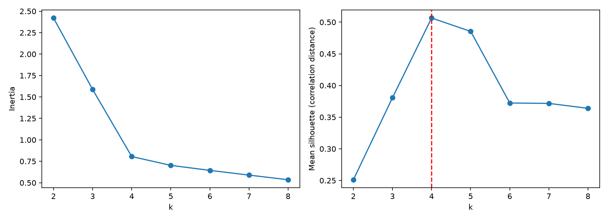
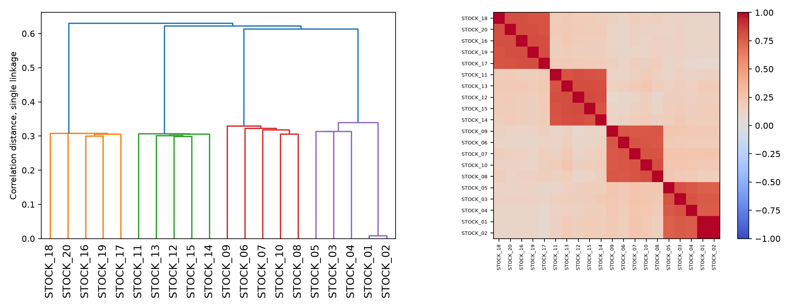
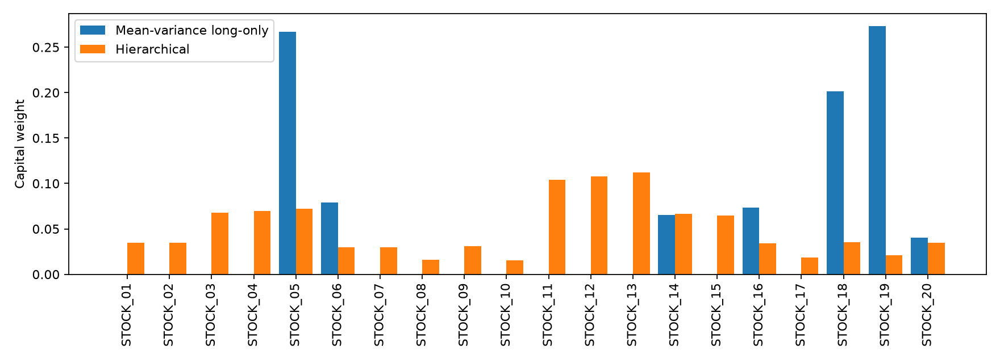
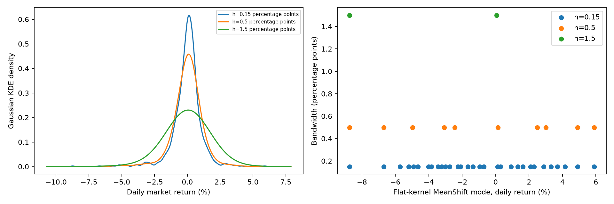
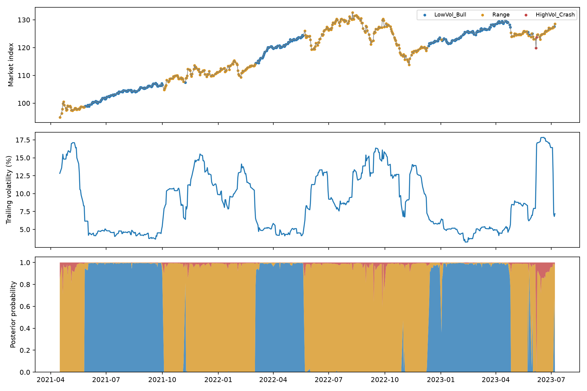
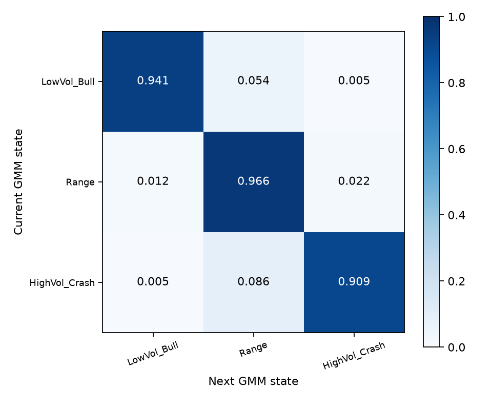

# Chapter 07. 비지도 학습: 금융 군집화(Clustering)와 시장 국면(Regime) 식별

> 금융 머신러닝 교재 · 금융 문제 → 쉬운 직관 → 수식 유도 → 전체 실행 코드 → 실제 결과와 해석

## 이 장에서 던지는 두 가지 질문

첫 번째 질문은 “20개 종목을 샀다면 정말 20가지 위험에 분산투자한 것인가?”이다. 서로 비슷하게 움직이는 종목을 많이 보유하면 종목 수는 많아도 같은 위험을 반복해서 보유할 수 있다. 군집화는 수익률의 움직임이 비슷한 종목들을 묶어 포트폴리오의 실질적인 구조를 드러낸다.

두 번째 질문은 “오늘의 시장은 평온한 상승장인가, 방향이 약한 횡보장인가, 높은 변동성의 하락장인가?”이다. 시장을 언제나 같은 평균과 분산으로 설명하기는 어렵다. 시장 국면을 구분하면 같은 가격 변화도 서로 다른 위험 환경에서 해석할 수 있다.

두 질문은 관측 단위가 다르다. **자산 군집화에서는 종목 하나가 표본이고, 국면 군집화에서는 날짜 하나가 표본**이다. 데이터를 전치해야 하는 이유부터 서로 다르다. 이 장은 단순한 2차원 점 구름을 만드는 대신 주식 수익률 행렬과 시간 순서가 있는 시장 지수로 이 차이를 설명한다.

모든 종목과 시장 자료는 교육용 합성 데이터다. 실제 종목의 시세나 검증된 투자 성과로 제시하지 않는다. 군집화 모형은 입력의 유사성을 발견하며, 경제적 의미는 이후에 확인해서 붙인다. 특히 GMM 자체에는 시간 전이 모형이 없으므로, 국면 식별과 국면 간 전이 추정을 분리해 구현한다.

## 원본 슬라이드 매핑

| 원본 PDF 쪽 | 원본 내용 | 금융 교재 구성 |
|---|---|---|
| 376–382 | 군집화 개요·K-Means | 7.1–7.3: 자산배분과 상관거리 |
| 383–387 | 범용 K-Means 실습 | 7.3: 20개 주식 수익률 군집으로 대체 |
| 388–398 | 실루엣 분석·군집 수 선택 | 7.3: k=2~8 비교와 결과 해석 |
| 399–407 | Mean Shift·KDE·대역폭 | 7.5: 시장 수익률의 밀도·꼬리 분석 |
| 408–412 | Mean Shift 구현 | 7.5: 실제 커널 차이를 구분한 코드 |
| 413–418 | GMM·EM·API | 7.6: 시장 잠재 국면과 EM 유도 |
| 419–427 | GMM 비교 실습 | 7.7: 수익률·변동성의 3국면 분석 |
| 요청에 따른 확장 | 포트폴리오·체제 전이 | 7.4, 7.8: 계층적 배분과 전이행렬 |

## 7.1 군집화가 금융에서 필요한 이유

### 7.1.1 평균–분산 최적화의 장점과 추정 오차

마코위츠 평균–분산 접근은 기대수익과 위험의 교환관계를 수학적으로 표현한다. 종목 비중을 w, 기대수익 벡터를 μ, 공분산을 Σ, 위험회피 계수를 γ>0으로 두면 다음 형태의 목적함수를 쓸 수 있다. 모든 수익률과 공분산은 같은 기간 단위를 사용해야 한다.

$$\min_{\boldsymbol{w}}\frac{\gamma}{2}\boldsymbol{w}^{T}\Sigma\boldsymbol{w}-\boldsymbol{\mu}^{T}\boldsymbol{w},\qquad \boldsymbol{1}^{T}\boldsymbol{w}=1.$$

첫 항은 포트폴리오 분산에 대한 비용, 두 번째 항은 기대수익에 대한 보상이다. 비중 합을 1로 두되 음수 비중을 허용하면 숏을 포함한다. 라그랑주 승수 η를 도입해 미분하면 다음과 같다.

$$\mathcal{L}=\frac{\gamma}{2}\boldsymbol{w}^{T}\Sigma\boldsymbol{w}-\boldsymbol{\mu}^{T}\boldsymbol{w}+\eta(\boldsymbol{1}^{T}\boldsymbol{w}-1).$$

$$\gamma\Sigma\boldsymbol{w}-\boldsymbol{\mu}+\eta\boldsymbol{1}=0.$$

$$\boldsymbol{w}=\frac{1}{\gamma}\Sigma^{-1}(\boldsymbol{\mu}-\eta\boldsymbol{1}).$$

제약식을 대입하면 η도 정해진다.

$$\eta=\frac{\boldsymbol{1}^{T}\Sigma^{-1}\boldsymbol{\mu}-\gamma}{\boldsymbol{1}^{T}\Sigma^{-1}\boldsymbol{1}}.$$

문제는 μ와 Σ를 정확히 알 수 없다는 것이다. 표본 공분산의 작은 고유값은 역행렬에서 큰 역수가 되고, 그 방향에 대한 작은 추정 오차가 큰 비중 변화로 이어질 수 있다. 공분산 오차를 E라고 하면 작은 교란의 일차 근사는 다음과 같다.

$$(\Sigma+E)^{-1}\approx\Sigma^{-1}-\Sigma^{-1}E\Sigma^{-1}.$$

역행렬이 양쪽에서 오차를 증폭한다. 서로 거의 같은 두 종목이 있으면 “A를 크게 사고 B를 크게 팔면 위험이 거의 상쇄된다”는 표본상 해가 나올 수 있다. 실제로는 미세한 관계 변화나 비용으로 결과가 크게 달라질 수 있다.

이것이 모든 평균–분산 최적화가 반드시 한 종목에 100% 투자한다는 뜻은 아니다. 제약 없는 해에서는 과도한 롱·숏과 레버리지로, 롱온리에서는 일부 자산에 집중된 경계해로 나타날 수 있다. 기대수익 오차도 집중의 중요한 원인이다. 공분산 수축, 비중 상한, turnover 제약 등으로 완화할 수 있으며 군집화는 그 대안 중 하나다.

### 7.1.2 종목 수보다 위험 묶음의 수를 보기

은행주 10개와 기술주 10개를 같은 비중으로 보유했더라도 두 집단이 위기 때 함께 하락한다면 두 개의 독립 위험도 아닐 수 있다. 군집화는 먼저 비슷하게 움직이는 자산을 모으고, 그 집단들 사이와 집단 내부에서 자본을 배분하게 해준다.

계층 구조를 이용하면 “전체 → 큰 위험 집단 → 작은 집단 → 개별 종목” 순서로 비중을 나눌 수 있다. 역공분산 행렬을 직접 사용하지 않고 부분집단의 위험을 비교하는 접근은 추정 오차에 대한 민감도를 줄일 수 있다. 다만 군집 역시 추정된 상관관계에서 나오므로 시장 변화에 영향을 받는다. Hierarchical Risk Parity의 원래 제안은 [López de Prado의 연구](https://papers.ssrn.com/sol3/papers.cfm?abstract_id=2708678)를 참고한다.

## 7.2 수익률의 거리: 크기와 방향을 구별하기

### 7.2.1 원수익률의 유클리드 거리가 놓치는 것

두 종목의 T일 수익률 벡터를 rᵢ와 rⱼ라고 하자. 원수익률 유클리드 거리는 다음과 같다.

$$d_{raw}(i,j)=\sqrt{\sum_{t=1}^{T}(r_{ti}-r_{tj})^2}.$$

이 거리는 절대 수익률 차이에 민감하다. 예를 들어 B의 수익률이 매일 A의 두 배라면 두 종목의 상관계수는 1이지만 유클리드 거리는 0이 아니다. 비슷한 방향으로 움직이는 두 종목이 단지 변동성 크기가 다르다는 이유로 멀게 보인다. 평균 수익률 차이도 거리에 들어간다.

원수익률 거리가 언제나 틀린 것은 아니다. 절대 손익 추종오차가 목적이면 의미가 있다. 하지만 **공통 위험 방향을 묶는 자산 군집화**에서는 평균과 크기를 제거한 상관관계가 더 적합한 출발점일 수 있다. 반대로 상관거리만으로는 변동성 크기를 알 수 없으므로 자산배분 단계에서는 공분산을 다시 사용한다.

### 7.2.2 상관계수를 거리로 바꾸는 공식 유도

각 수익률 벡터의 평균을 제거한 뒤 길이를 1로 맞춘다. 상수 수익률처럼 분산이 0인 자산은 이 계산 전에 처리해야 한다.

$$\boldsymbol{u}_i=\frac{\boldsymbol{r}_i-\bar{r}_i\boldsymbol{1}}{\|\boldsymbol{r}_i-\bar{r}_i\boldsymbol{1}\|_2}.$$

같은 날짜의 공통 관측치로 계산하면 두 단위 벡터의 내적이 Pearson 상관계수다. 표본 공분산과 표준편차의 T−1 인자는 분자·분모에서 상쇄된다.

$$\rho_{ij}=\boldsymbol{u}_i^{T}\boldsymbol{u}_j.$$

단위 벡터 간 제곱거리를 전개한다.

$$\|\boldsymbol{u}_i-\boldsymbol{u}_j\|_2^2=\boldsymbol{u}_i^{T}\boldsymbol{u}_i+\boldsymbol{u}_j^{T}\boldsymbol{u}_j-2\boldsymbol{u}_i^{T}\boldsymbol{u}_j=2(1-\rho_{ij}).$$

이 거리를 2로 나누면 0부터 1 사이의 상관거리가 된다.

$$d_{ij}=\frac{1}{2}\|\boldsymbol{u}_i-\boldsymbol{u}_j\|_2=\sqrt{\frac{1}{2}(1-\rho_{ij})}.$$

| 상관계수 | 거리 | 해석 |
|---|---|---|
| +1 | 0 | 같은 방향으로 완전히 함께 움직임 |
| 0 | 약 0.7071 | 선형 상관이 없음 |
| −1 | 1 | 완전히 반대 방향으로 움직임 |

거리의 삼각부등식은 같은 공통 표본에서 만든 단위 벡터의 유클리드 거리이므로 성립한다. 서로 다른 날짜 쌍으로 계산한 상관행렬이나 양의 준정부호가 아닌 임의 행렬에는 이 해석을 그대로 적용할 수 없다. 완전히 같은 정규화 경로를 가진 서로 다른 종목의 거리는 0일 수 있다.

음의 상관 자산은 멀리 떨어진다. 이는 같은 움직임을 묶는 목적에 맞으며 음의 상관이 나쁘다는 뜻은 아니다. 오히려 포트폴리오의 헤지 자산일 수 있다. 절댓값 상관을 사용하는 다른 정의는 반대 움직임을 가까이 묶으므로 경제적 목적과 거리의 의미가 달라진다.

### 7.2.3 K-Means에 거리행렬을 그대로 넣으면 안 되는 이유

`KMeans.fit(D)`를 호출하면 알고리즘은 D를 사전 계산 거리행렬로 해석하지 않는다. 각 종목의 ‘다른 종목들에 대한 거리 목록’을 새로운 피처 벡터로 취급하고 그 목록끼리의 유클리드 거리를 최소화한다. 이는 위에서 정의한 dᵢⱼ와 다른 문제다.

이번 실습은 각 종목 벡터를 uᵢ/2로 만들어 K-Means에 입력한다. 그러면 입력 벡터 사이의 유클리드 거리가 상관거리와 정확히 같다. 이 데이터의 모양은 **20종목×500거래일**이다. 실루엣 계산에는 동일한 상관거리행렬을 `metric='precomputed'`로 전달한다. 원리와 코드의 거리 정의가 맞는지 `assert`로 확인한다.

## 7.3 K-Means, Inertia, Elbow와 실루엣

### 7.3.1 K-Means가 반복하는 두 단계

K개의 군집 C₁,…,Cₖ와 중심 μ₁,…,μₖ를 찾는 목적함수는 군집 내부 제곱거리 합이다. 이 값을 Inertia라고 부른다. 여기서 xᵢ는 종목 i의 정규화 수익률 벡터다.

$$J=\sum_{k=1}^{K}\sum_{i\in C_k}\|\boldsymbol{x}_i-\boldsymbol{\mu}_k\|_2^2.$$

첫 단계는 중심을 고정한 뒤 각 종목을 가장 가까운 중심에 할당하는 것이다.

$$c_i\leftarrow\operatorname{argmin}_{k}\|\boldsymbol{x}_i-\boldsymbol{\mu}_k\|_2^2.$$

두 번째 단계는 군집을 고정한 뒤 중심을 해당 종목 벡터들의 평균으로 바꾸는 것이다. 중심에 대한 미분을 0으로 놓으면 이를 얻는다.

$$\frac{\partial J}{\partial\boldsymbol{\mu}_k}=2\sum_{i\in C_k}(\boldsymbol{\mu}_k-\boldsymbol{x}_i)=0,\qquad \boldsymbol{\mu}_k=\frac{1}{|C_k|}\sum_{i\in C_k}\boldsymbol{x}_i.$$

각 단계는 목적함수를 늘리지 않는 방향으로 진행하지만 전체 최적해를 보장하지는 않는다. 초기 중심에 따라 국소해가 달라지므로 여러 초기값을 사용한다. 코드에서는 `n_init=50`을 명시한다. 평균 중심은 원래 단위 구면 위에 있을 필요가 없으며, 여기서는 별도의 spherical K-Means를 사용하지 않는다. [KMeans API](https://scikit-learn.org/stable/modules/generated/sklearn.cluster.KMeans.html).

### 7.3.2 Elbow는 왜 보조 판단인가

K가 늘면 군집을 더 잘게 나눌 수 있으므로 최적으로 달성 가능한 Inertia는 증가하지 않는다. K=20이면 종목 하나가 군집 하나가 되어 0이 될 수 있다. 따라서 가장 작은 Inertia를 주는 K를 고르는 방법은 의미가 없다.

$$\Delta_K=J_{K-1}-J_K.$$

Elbow Method는 K를 늘릴 때 개선량 Δ가 크게 줄어드는 굴곡점을 찾는다. 예를 들어 3→4에서 크게 개선되고 4→5부터 작은 개선만 있다면 4를 검토한다. 그러나 굴곡이 분명하지 않을 수 있고 눈으로 판단하는 주관성도 있으므로 실루엣과 경제적 해석을 함께 본다.

### 7.3.3 실루엣 계수를 하나씩 풀어 보기

종목 i에 대해 a(i)는 같은 군집의 다른 종목들과의 평균거리다. 작을수록 군집 안에서 잘 어울린다.

$$a(i)=\frac{1}{|C_{c_i}|-1}\sum_{j\in C_{c_i},\ j\ne i}d_{ij}.$$

b(i)는 다른 각 군집까지의 평균거리 중 가장 작은 값이다. 즉 “내 군집을 떠난다면 가장 가까운 후보 군집”까지의 거리다.

$$b(i)=\min_{l\ne c_i}\frac{1}{|C_l|}\sum_{j\in C_l}d_{ij}.$$

실루엣은 두 값을 상대 비교한다.

$$s(i)=\frac{b(i)-a(i)}{\max(a(i),b(i))},\qquad -1\leq s(i)\leq 1.$$

a=0.2, b=0.6이면 s≈0.667이다. 자신의 군집이 다른 후보보다 상당히 가깝다. a와 b가 비슷하면 0 근처여서 경계에 있는 종목이다. a>b이면 음수여서 다른 군집과 더 가까울 수 있다. 원소가 하나인 군집은 a를 정의할 수 없으므로 구현에서는 해당 실루엣을 0으로 처리한다. 평균 실루엣은 모든 종목의 s를 평균한 값이다.

$$\bar{s}=\frac{1}{N}\sum_{i=1}^{N}s(i).$$

이는 주어진 거리에서 군집의 응집·분리를 평가하는 값이지 미래 수익률이나 분산투자 성과 점수가 아니다. 후보 K를 지나치게 많이 탐색하면 같은 표본 구조에 맞추게 되므로 이후 기간의 군집 안정성도 별도로 평가할 수 있다. [silhouette_score 문서](https://scikit-learn.org/stable/modules/generated/sklearn.metrics.silhouette_score.html).

### 7.3.4 20개 주식 수익률 행렬 실습

750일 수익률을 생성하고 앞의 500일에서 상관관계와 군집을 학습한다. 나머지 250일은 포트폴리오 위험 비교에 사용한다. 생성 구조에는 네 개 공통 집단이 있지만 알고리즘에는 그 집단 라벨을 주지 않는다. 거의 중복되는 첫 두 종목을 추가해 공분산 역행렬의 민감도도 확인한다.

```python
from pathlib import Path
import json, platform, importlib.metadata
import numpy as np
import pandas as pd
import matplotlib
matplotlib.use('Agg')
import matplotlib.pyplot as plt
from scipy.spatial.distance import pdist, squareform
from scipy.cluster.hierarchy import linkage, leaves_list, dendrogram
from scipy.optimize import minimize
from scipy.special import logsumexp, ndtr
from scipy.stats import multivariate_normal
from sklearn.cluster import KMeans, MeanShift
from sklearn.metrics import silhouette_score, adjusted_rand_score
from sklearn.preprocessing import StandardScaler
from sklearn.mixture import GaussianMixture

OUT=Path(__file__).resolve().parent if '__file__' in globals() else Path.cwd()
(OUT/'assets').mkdir(parents=True,exist_ok=True)
results={}
def records(frame):return json.loads(frame.to_json(orient='records',double_precision=12))
def savefig(name):
    plt.tight_layout();plt.savefig(OUT/'assets'/name,dpi=160);plt.close()
```

```python
rng=np.random.default_rng(7001)
T,N=750,20
tickers=[f'STOCK_{i+1:02d}' for i in range(N)]
groups=np.repeat(np.arange(4),5)
market=rng.normal(size=(T,1));sector=rng.normal(size=(T,4));noise=rng.normal(size=(T,N))
vol=np.repeat([.012,.018,.009,.016],5)
R=(np.sqrt(.15)*market+np.sqrt(.65)*sector[:,groups]+np.sqrt(.20)*noise)*vol+.0003
R[:,1]=R[:,0]+rng.normal(0,.0002,T)
returns=pd.DataFrame(R,index=pd.bdate_range('2019-01-02',periods=T),columns=tickers)
train=returns.iloc[:500];test=returns.iloc[500:]
assert train.index.max()<test.index.min()
correlation=train.corr().to_numpy();cov=train.cov().to_numpy()
D=np.sqrt(np.clip((1-correlation)/2,0,1));np.fill_diagonal(D,0)
asset_vectors=train.to_numpy().T.copy()
asset_vectors-=asset_vectors.mean(axis=1,keepdims=True)
asset_vectors/=2*np.linalg.norm(asset_vectors,axis=1,keepdims=True)
assert np.allclose(squareform(pdist(asset_vectors)),D,atol=1e-8)
results['k_search']=[];fits={}
for k in range(2,9):
    model=KMeans(n_clusters=k,n_init=50,random_state=42).fit(asset_vectors)
    score=silhouette_score(D,model.labels_,metric='precomputed')
    fits[k]=model
    results['k_search'].append(dict(k=k,inertia=float(model.inertia_),silhouette=float(score)))
best=max(results['k_search'],key=lambda row:(row['silhouette'],-row['k']))['k']
labels=fits[best].labels_
results['cluster_members']=records(pd.DataFrame({'stock':tickers,'cluster':labels,'synthetic_group_audit':groups}))
results['cluster_summary']={'best_k':int(best),'silhouette':float(silhouette_score(D,labels,metric='precomputed')),
    'ARI_against_generation':float(adjusted_rand_score(groups,labels))}
results['splits']=[dict(dataset='stocks',split=name,rows=len(d),start=str(d.index.min().date()),end=str(d.index.max().date())) for name,d in [('train',train),('test',test)]]
returns.to_csv(OUT/'synthetic_stock_returns.csv',index_label='date')
fig,ax=plt.subplots(1,2,figsize=(11,4));search=pd.DataFrame(results['k_search'])
ax[0].plot(search.k,search.inertia,'o-');ax[0].set(xlabel='k',ylabel='Inertia')
ax[1].plot(search.k,search.silhouette,'o-');ax[1].axvline(best,ls='--',color='red');ax[1].set(xlabel='k',ylabel='Mean silhouette (correlation distance)')
savefig('fig01_k_selection.png')
```

| k | inertia | silhouette |
| --- | --- | --- |
| 2 | 2.42064719 | 0.25119230 |
| 3 | 1.58742691 | 0.38073086 |
| 4 | 0.80560601 | 0.50652313 |
| 5 | 0.70252451 | 0.48542790 |
| 6 | 0.64415931 | 0.37234910 |
| 7 | 0.58910876 | 0.37172726 |
| 8 | 0.53504093 | 0.36393344 |


후보 중 평균 실루엣이 가장 높은 K는 **4**, 실루엣은 **0.506523**였다. 이 선택은 훈련 수익률에서만 이루어졌다. 생성 집단과의 사후 비교 ARI는 **1.0000**지만 해당 정답을 군집 선택에 사용하지 않았다.



| stock | cluster | synthetic_group_audit |
| --- | --- | --- |
| STOCK_01 | 2 | 0 |
| STOCK_02 | 2 | 0 |
| STOCK_03 | 2 | 0 |
| STOCK_04 | 2 | 0 |
| STOCK_05 | 2 | 0 |
| STOCK_06 | 0 | 1 |
| STOCK_07 | 0 | 1 |
| STOCK_08 | 0 | 1 |
| STOCK_09 | 0 | 1 |
| STOCK_10 | 0 | 1 |
| STOCK_11 | 3 | 2 |
| STOCK_12 | 3 | 2 |
| STOCK_13 | 3 | 2 |
| STOCK_14 | 3 | 2 |
| STOCK_15 | 3 | 2 |
| STOCK_16 | 1 | 3 |
| STOCK_17 | 1 | 3 |
| STOCK_18 | 1 | 3 |
| STOCK_19 | 1 | 3 |
| STOCK_20 | 1 | 3 |


군집 번호 0, 1, 2, 3에는 우열이나 산업명이 없다. 다른 초기값이나 라이브러리 실행에서 번호 자체는 바뀔 수 있다. `synthetic_group_audit`는 생성 정답과의 비교를 위한 열이며 K 선택이나 적합에는 쓰지 않았다. 실제 금융 자료에서는 산업·사업구조·시장 노출을 검토해 군집의 의미를 해석해야 한다.

## 7.4 군집을 자산배분으로 연결하기

### 7.4.1 K-Means와 계층 군집은 다른 결과물이다

K-Means는 미리 정한 K개 묶음을 만든다. 계층 군집은 가까운 자산 또는 집단을 차례로 합쳐 나무를 만든다. 따라서 자산 간 유사성이 여러 단계로 어떻게 연결되는지 볼 수 있다.

이번 계층 예제는 같은 상관거리에서 single linkage를 사용한다. 두 집단 A와 B 사이의 거리는 가장 가까운 구성원 쌍의 거리다.

$$d(A,B)=\min_{i\in A,\ j\in B}d_{ij}.$$

이 방법은 가까운 연결을 따라 길게 이어지는 chaining 현상이 있을 수 있다. linkage 선택은 경제적 구조와 안정성에 영향을 준다. 코드는 상관거리를 직접 연결한 뒤 leaf 순서를 사용하고 재귀 이분한다. 원 논문의 모든 구현 선택을 복제했다고 주장하지 않는 **HRP 방식의 계층적 배분 실습**이다. K-Means에서 선택한 K를 이 나무에 강제로 적용하지는 않는다.

### 7.4.2 집단 위험을 계산하고 비중을 나누기

집단 C 내부의 임시 비중은 개별 분산 역수에 비례하도록 계산한다.

$$q_i=\frac{1/\sigma_i^2}{\sum_{j\in C}1/\sigma_j^2},\qquad V_C=\boldsymbol{q}^{T}\Sigma_C\boldsymbol{q}.$$

정렬된 집단을 좌우 L·R로 나눈 뒤 위험이 작은 쪽에 더 많은 비중을 준다.

$$\alpha_L=\frac{V_R}{V_L+V_R},\qquad \alpha_R=\frac{V_L}{V_L+V_R}.$$

왜 위험이 작은 쪽의 분자에 반대편 위험이 들어가는가? 두 집단의 공분산을 무시한 국소 문제에서 좌측 비중을 α로 놓으면 분산은 α²V_L+(1−α)²V_R다. 이를 미분하면 아래 해가 나온다.

$$\frac{d}{d\alpha}\left[\alpha^2V_L+(1-\alpha)^2V_R\right]=2\alpha V_L-2(1-\alpha)V_R=0.$$

집단 간 공분산이 실제로 0이라는 뜻은 아니다. 이 재귀 규칙은 전체 공분산 최적화의 정확한 해가 아닌 휴리스틱이다. 이름에 Risk Parity가 있어도 최종 모든 자산의 Euler 위험 기여도가 정확히 같아지는 것은 아니다. 비중 합은 1이며 양의 집단 분산에서는 롱온리 비중을 얻는다.

### 7.4.3 평균–분산과 비교하고 집중도를 읽기

동일 비중, 제약 없는 최소분산, 제약 없는 평균–분산, 롱온리 평균–분산, 계층적 배분을 같은 훈련 공분산에서 계산한다. 위험회피 계수 γ는 10으로 고정한다. 모델마다 기대수익 사용 여부와 제약이 다르므로 미래 변동성 하나만으로 공정한 수익·위험 우열을 결론내리지 않는다.

여기서 비중은 평가 기간 동안 일정하게 유지하는 가상 일별 재조정 포트폴리오다. 거래비용은 반영하지 않았다. 누적 수익률 성과를 홍보하는 백테스트가 아니라 비중과 실현 위험의 진단이다.

```python
tree=linkage(squareform(D,checks=True),method='single',optimal_ordering=True)
order=leaves_list(tree)
def cluster_variance(indices,covariance):
    sub=covariance[np.ix_(indices,indices)]
    w=1/np.diag(sub);w/=w.sum()
    return float(w@sub@w)
def hierarchical_weights(covariance,ordered_indices):
    w=np.ones(len(covariance));pending=[list(ordered_indices)]
    while pending:
        cluster=pending.pop()
        if len(cluster)<2:continue
        middle=len(cluster)//2;left=cluster[:middle];right=cluster[middle:]
        vl=cluster_variance(left,covariance);vr=cluster_variance(right,covariance)
        alpha=vr/(vl+vr)
        w[left]*=alpha;w[right]*=1-alpha
        pending.extend([left,right])
    return w
hrp=hierarchical_weights(cov,order)
mu=train.mean().to_numpy();gamma=10.
ones=np.ones(N)
gmv=np.linalg.solve(cov,ones);gmv/=gmv.sum()
def unrestricted_mv(expected):
    inv_mu=np.linalg.solve(cov,expected);inv_one=np.linalg.solve(cov,ones)
    lagrange=(ones@inv_mu-gamma)/(ones@inv_one)
    return (inv_mu-lagrange*inv_one)/gamma
def long_only_mv(expected):
    fit=minimize(lambda w:float(gamma/2*w@cov@w-expected@w),np.ones(N)/N,
        jac=lambda w:gamma*cov@w-expected,method='SLSQP',bounds=[(0,1)]*N,
        constraints={'type':'eq','fun':lambda w:w.sum()-1,'jac':lambda w:ones},
        options={'ftol':1e-12,'maxiter':2000})
    if not fit.success:raise RuntimeError(fit.message)
    return fit.x
weights={'Equal':np.ones(N)/N,'GMV unrestricted':gmv,'MeanVariance unrestricted':unrestricted_mv(mu),
    'MeanVariance long-only':long_only_mv(mu),'Hierarchical':hrp}
results['allocation']=[]
for name,w in weights.items():
    assert np.isclose(w.sum(),1)
    future=test.to_numpy()@w
    results['allocation'].append(dict(model=name,max_absolute_weight=float(np.abs(w).max()),
        gross_exposure=float(np.abs(w).sum()),train_annual_vol_pct=float(np.sqrt(w@cov@w*252)*100),
        test_annual_vol_pct=float(future.std(ddof=1)*np.sqrt(252)*100)))
assert np.all(hrp>=0)
perturbed=mu.copy();perturbed[0]+=.0001
results['sensitivity']=[dict(model=name,L1_weight_change=float(np.abs(fun(perturbed)-fun(mu)).sum()))
    for name,fun in [('MeanVariance unrestricted',unrestricted_mv),('MeanVariance long-only',long_only_mv)]]
results['sensitivity'].append(dict(model='Hierarchical (does not use mean)',L1_weight_change=0.))
results['cov_condition']=float(np.linalg.cond(cov))
pd.DataFrame(weights,index=tickers).to_csv(OUT/'portfolio_weights.csv',index_label='stock')
results['weights']=records(pd.DataFrame({'stock':tickers,'hierarchical_weight':hrp,'long_only_MV_weight':weights['MeanVariance long-only']}))
fig,axes=plt.subplots(1,2,figsize=(13,5))
dendrogram(tree,labels=tickers,ax=axes[0],leaf_rotation=90);axes[0].set_ylabel('Correlation distance, single linkage')
im=axes[1].imshow(correlation[np.ix_(order,order)],vmin=-1,vmax=1,cmap='coolwarm')
axes[1].set_xticks(range(N),np.array(tickers)[order],rotation=90,fontsize=6);axes[1].set_yticks(range(N),np.array(tickers)[order],fontsize=6)
fig.colorbar(im,ax=axes[1]);savefig('fig02_hierarchy.png')
plt.figure(figsize=(11,4));x=np.arange(N)
plt.bar(x-.2,weights['MeanVariance long-only'],.4,label='Mean-variance long-only')
plt.bar(x+.2,hrp,.4,label='Hierarchical')
plt.xticks(x,tickers,rotation=90);plt.ylabel('Capital weight');plt.legend();savefig('fig03_allocation.png')
```



| model | max_absolute_weight | gross_exposure | train_annual_vol_pct | test_annual_vol_pct |
| --- | --- | --- | --- | --- |
| Equal | 0.05000000 | 1.00000000 | 12.57841837 | 11.69563349 |
| GMV unrestricted | 1.97189578 | 4.93551733 | 10.70908089 | 10.89305143 |
| MeanVariance unrestricted | 1.52738022 | 10.83467104 | 27.41149122 | 27.23106128 |
| MeanVariance long-only | 0.27328739 | 1.00000000 | 16.20379841 | 15.93386467 |
| Hierarchical | 0.11238689 | 1.00000000 | 11.05336299 | 10.64363092 |


훈련 공분산의 조건수는 **73206.55**였다. 제약 없는 최소분산 해의 최대 절대 비중은 **197.19%**였다. 롱온리 평균–분산은 최대 **27.33%**, 계층 배분은 최대 **11.24%**였다. 이 실행에서는 계층 배분의 미래 연율화 변동성이 **10.6436%**로 나왔지만 다른 위험회피 수준·자료·제약에서의 성과를 보장하지 않는다.

`max_absolute_weight`가 1을 넘으면 한 자산의 절대 비중이 순자본의 100%를 넘는다. `gross_exposure`는 비중 절댓값 합이다. 1보다 크면 숏·레버리지가 포함되며, 순비중 합 1과 총노출 1은 다르다. 훈련 변동성보다 미래 변동성이 높거나 낮을 수 있으므로 두 열을 함께 본다.

| model | L1_weight_change |
| --- | --- |
| MeanVariance unrestricted | 489.94321920 |
| MeanVariance long-only | 0.00004811 |
| Hierarchical (does not use mean) | 0.00000000 |


민감도 표에서는 첫 번째 종목의 일별 기대수익만 1bp 높이고 공분산을 고정했다. 비중 차이 절댓값 합을 제시한다. 계층적 배분이 이 실험에서 0인 것은 기대수익을 아예 사용하지 않기 때문이다. 공분산이나 군집 구조의 변화에도 둔감하다는 뜻은 아니다.

| stock | hierarchical_weight | long_only_MV_weight |
| --- | --- | --- |
| STOCK_01 | 0.03476317 | 0.00000000 |
| STOCK_02 | 0.03464274 | 0.00000000 |
| STOCK_03 | 0.06809384 | 1.1427e-17 |
| STOCK_04 | 0.06968266 | 0.00000000 |
| STOCK_05 | 0.07200315 | 0.26713247 |
| STOCK_06 | 0.02990285 | 0.07877779 |
| STOCK_07 | 0.02967579 | 7.5751e-18 |
| STOCK_08 | 0.01574131 | 0.00000000 |
| STOCK_09 | 0.03087809 | 0.00000000 |
| STOCK_10 | 0.01517313 | 6.9682e-18 |
| STOCK_11 | 0.10425528 | 0.00000000 |
| STOCK_12 | 0.10756964 | 1.4764e-18 |
| STOCK_13 | 0.11238689 | 8.5809e-18 |
| STOCK_14 | 0.06674332 | 0.06549996 |
| STOCK_15 | 0.06456491 | 7.9952e-18 |
| STOCK_16 | 0.03395304 | 0.07364032 |
| STOCK_17 | 0.01861692 | 1.3227e-17 |
| STOCK_18 | 0.03544467 | 0.20114096 |
| STOCK_19 | 0.02096152 | 0.27328739 |
| STOCK_20 | 0.03494705 | 0.04052112 |




종목별 비중을 균등하게 만드는 것과 위험을 분산하는 것은 다르다. 변동성이 작은 자산에 높은 비중을 줄 수 있지만 같은 군집에 여러 자산이 있으면 군집 전체 비중도 확인해야 한다. 실제 운영에서는 비중 상한·유동성·거래비용·군집 재편에 따른 turnover를 추가 검증한다.

## 7.5 Mean Shift와 KDE: 수익률의 밀도 봉우리 찾기

### 7.5.1 먼저 시장 시계열을 만든다

앞 절은 종목을 묶었지만 지금부터는 시장의 날짜를 분석한다. 생성 과정에는 저변동 상승, 중간 변동 횡보, 고변동 하락의 세 잠재 상태가 있다. 상태가 일정 확률로 다음 날까지 지속되도록 전이행렬을 사용해 합성 시계열을 만든다. 생성 상태는 감사용이며 KDE·GMM의 피처로 넣지 않는다.

각 날짜의 관측 피처는 당일 수익률과 과거 20일 수익률의 연율화 표준편차다. 수익률의 단위는 %, 변동성도 연율화 %다.

$$v_t=100\sqrt{252}\sqrt{\frac{1}{19}\sum_{s=t-19}^{t}(r_s-\bar{r}_{t,20})^2}.$$

이 값은 t일 수익률을 포함하므로 t일 장 마감 이후에 이용 가능하다. 과거 20일을 쓰는 후행 피처이며 미래 20일 변동성이 아니다. 첫 19일은 계산할 수 없어 제외한다. 앞의 1,100개 유효 날짜에서 학습하고 뒤의 날짜는 평가한다.

```python
rng=np.random.default_rng(7002)
days=1700
transition_true=np.array([[.98,.018,.002],[.02,.965,.015],[.02,.05,.93]])
latent=np.zeros(days,dtype=int)
for t in range(1,days):latent[t]=rng.choice(3,p=transition_true[latent[t-1]])
daily_mu=np.array([.0012,.0,-.007]);daily_sigma=np.array([.003,.009,.028])
market_returns=daily_mu[latent]+daily_sigma[latent]*rng.normal(size=days)
market=pd.DataFrame({'return':market_returns,'latent_audit':latent},index=pd.bdate_range('2017-01-02',periods=days))
assert (market['return']>-1).all()
market['price']=100*(1+market['return']).cumprod()
market['return_pct']=market['return']*100
market['vol20_annual_pct']=market['return'].rolling(20).std(ddof=1)*np.sqrt(252)*100
market=market.dropna().copy()
development=market.iloc[:1100];future_market=market.iloc[1100:]
feature_names=['return_pct','vol20_annual_pct']
scaler=StandardScaler().fit(development[feature_names])
X=scaler.transform(development[feature_names]);Xfuture=scaler.transform(future_market[feature_names])
results['splits'] += [dict(dataset='market',split=name,rows=len(d),start=str(d.index.min().date()),end=str(d.index.max().date()))
    for name,d in [('train',development),('test',future_market)]]
market.to_csv(OUT/'synthetic_market_regimes.csv',index_label='date')
```

| dataset | split | rows | start | end |
| --- | --- | --- | --- | --- |
| stocks | train | 500 | 2019-01-02 | 2020-12-01 |
| stocks | test | 250 | 2020-12-02 | 2021-11-16 |
| market | train | 1100 | 2017-01-27 | 2021-04-15 |
| market | test | 581 | 2021-04-16 | 2023-07-07 |


### 7.5.2 히스토그램에서 KDE로

히스토그램은 수익률을 구간으로 나누고 각 구간의 빈도를 센다. 구간의 시작점과 폭을 바꾸면 모양이 달라진다. KDE는 각 관측 수익률 위에 작은 확률밀도 함수를 하나씩 놓고 평균한다. 미리 정규분포 하나의 평균·분산만 가정하지 않는다는 점에서 비모수적이다.

1차원 자료 x₁,…,xₙ과 대역폭 h>0에 대해 다음과 같다.

$$\hat{f}_h(x)=\frac{1}{nh}\sum_{i=1}^{n}K\left(\frac{x-x_i}{h}\right).$$

가우시안 커널은 다음과 같다.

$$K(u)=\frac{1}{\sqrt{2\pi}}\exp\left(-\frac{u^2}{2}\right).$$

p차원에서는 hᵖ로 정규화하고 다변량 가우시안 커널을 쓴다.

$$\hat{f}_h(\boldsymbol{x})=\frac{1}{nh^p}\sum_i K\left(\frac{\boldsymbol{x}-\boldsymbol{x}_i}{h}\right),\qquad K(\boldsymbol{u})=(2\pi)^{-p/2}e^{-\|\boldsymbol{u}\|^2/2}.$$

여러 단위를 가진 피처를 함께 사용한다면 스케일과 대역폭 행렬을 고려해야 한다. 이번 대역폭 비교는 시장 일별 수익률 한 변수에서 수행하므로 h의 단위가 명확하다. h=0.5는 수익률 **0.5%포인트** 폭을 뜻한다.

### 7.5.3 Mean Shift의 가중평균 이동식 유도

가우시안 KDE가 증가하는 방향으로 현재 위치 x를 조금씩 옮겨 밀도 봉우리를 찾을 수 있다. 지수 커널의 미분을 계산하면 밀도 그래디언트는 다음 형태다.

$$\nabla\hat{f}_h(\boldsymbol{x})=\frac{1}{nh^{p+2}}\sum_i K\left(\frac{\boldsymbol{x}-\boldsymbol{x}_i}{h}\right)(\boldsymbol{x}_i-\boldsymbol{x}).$$

커널 가중평균에서 현재 위치를 뺀 벡터를 m(x)라고 하자.

$$\boldsymbol{m}(\boldsymbol{x})=\frac{\sum_iK((\boldsymbol{x}-\boldsymbol{x}_i)/h)\boldsymbol{x}_i}{\sum_iK((\boldsymbol{x}-\boldsymbol{x}_i)/h)}-\boldsymbol{x}.$$

$$\boldsymbol{m}(\boldsymbol{x})=h^2\frac{\nabla\hat{f}_h(\boldsymbol{x})}{\hat{f}_h(\boldsymbol{x})},\qquad \boldsymbol{x}_{new}=\boldsymbol{x}+\boldsymbol{m}(\boldsymbol{x}).$$

즉 주변 관측치의 커널 가중평균으로 이동한다. 가까운 수익률은 큰 가중치를, 먼 수익률은 작은 가중치를 받는다. 여러 시작점이 같은 봉우리로 수렴하면 같은 모드의 영역으로 묶을 수 있다. 반복을 멈추는 허용오차와 봉우리 병합 기준도 실제 구현 결과에 영향을 준다. [Mean Shift 이론 검토 논문](https://arxiv.org/abs/1503.00687).

scikit-learn의 `MeanShift`는 **flat kernel**을 사용한다. 반경 안의 표본을 같은 가중치로 취급하는 API 결과를 가우시안 가중평균 코드와 동일하다고 설명하면 안 된다. 본문은 가우시안 이동식을 NumPy로 직접 구현하고, 라이브러리의 flat-kernel 결과는 별도의 열과 그림으로 표시한다. [MeanShift API](https://scikit-learn.org/stable/modules/generated/sklearn.cluster.MeanShift.html).

### 7.5.4 대역폭과 두꺼운 꼬리의 관계

h가 작으면 관측치 근처의 세부 봉우리를 많이 만든다. 극단 수익률 몇 개가 별도의 모드처럼 나타날 수 있지만, 그것이 반복되는 독립 시장 국면이라는 뜻은 아니다. h가 크면 가까운 봉우리를 합치고 중심부를 매끄럽게 만든다. 또한 관측치 주변으로 확률을 넓게 퍼뜨려 특정 꼬리 경계 밖 확률을 오히려 키울 수도 있다. “큰 h는 언제나 꼬리를 작게 만든다”는 설명은 맞지 않는다.

부드러운 밀도에 대한 대표적인 점근 근사는 편향이 h² 수준, 분산이 1/(nhᵖ) 수준이라는 것이다. 대역폭은 세부 구조 보존과 표본 잡음 억제의 교환관계를 만든다.

$$\operatorname{Bias}[\hat{f}_h(x)]=O(h^2),\qquad \operatorname{Var}[\hat{f}_h(x)]=O\left(\frac{1}{nh^p}\right).$$

가우시안 KDE는 유한 표본에서 가우시안들의 합이므로 점근적인 power-law 꼬리를 증명하거나 자동 추정하는 도구가 아니다. 관측된 꼬리 구간을 부드럽게 보여줄 수 있지만 데이터 밖 극단 위험 추정에는 추가적인 꼬리 모형이 필요할 수 있다. 낮은 밀도의 극단 영역을 찾는 것과 밀도 봉우리 군집을 찾는 것도 서로 다른 목적이다.

일별 수익률이 −3%보다 작을 확률은 가우시안 CDF Φ를 이용해 정확하게 적분할 수 있다.

$$\hat{P}(X<-3)=\frac{1}{n}\sum_i\Phi\left(\frac{-3-x_i}{h}\right).$$

다음 코드는 세 h에서 이 꼬리 확률과 flat-kernel 군집 수를 비교한다. h는 실습 비교용으로 미리 정했고 평가 기간의 수익을 보고 선택하지 않는다.

```python
sample=development.return_pct.to_numpy()
grid=np.linspace(sample.min()-2,sample.max()+2,1200)
bandwidths=[.15,.5,1.5]
results['bandwidth']=[]
fig,axes=plt.subplots(1,2,figsize=(12,4))
for h in bandwidths:
    u=(grid[:,None]-sample[None,:])/h
    density=np.exp(-u**2/2).mean(axis=1)/(h*np.sqrt(2*np.pi))
    axes[0].plot(grid,density,label=f'h={h} percentage points')
    tail=float(ndtr((-3-sample)/h).mean())
    ms=MeanShift(bandwidth=h,bin_seeding=True,max_iter=500).fit(sample[:,None])
    results['bandwidth'].append(dict(bandwidth_percentage_points=h,
        flat_kernel_MeanShift_clusters=int(len(ms.cluster_centers_)),
        Gaussian_KDE_probability_below_minus3pct=tail))
    axes[1].scatter(ms.cluster_centers_[:,0],np.repeat(h,len(ms.cluster_centers_)),s=35,label=f'h={h}')
def gaussian_mean_shift(seed,values,h,max_iter=1000,tol=1e-7):
    x=float(seed)
    for iteration in range(max_iter):
        logw=-.5*((x-values)/h)**2;w=np.exp(logw-logw.max())
        new=float(w@values/w.sum())
        if abs(new-x)<tol:return new,iteration+1,True
        x=new
    return x,max_iter,False
results['gaussian_modes']=[]
for seed in [-3.,0.,3.]:
    mode,iterations,converged=gaussian_mean_shift(seed,sample,.5)
    results['gaussian_modes'].append(dict(start_return_pct=seed,mode_return_pct=mode,iterations=iterations,converged=converged))
results['empirical_left_tail']=float(np.mean(sample<-3))
axes[0].set(xlabel='Daily market return (%)',ylabel='Gaussian KDE density');axes[0].legend(fontsize=7)
axes[1].set(xlabel='Flat-kernel MeanShift mode, daily return (%)',ylabel='Bandwidth (percentage points)')
axes[1].legend();savefig('fig04_bandwidth.png')
```

| bandwidth_percentage_points | flat_kernel_MeanShift_clusters | Gaussian_KDE_probability_below_minus3pct |
| --- | --- | --- |
| 0.15000000 | 31 | 0.01999027 |
| 0.50000000 | 10 | 0.01981806 |
| 1.50000000 | 2 | 0.05063482 |


| start_return_pct | mode_return_pct | iterations | converged |
| --- | --- | --- | --- |
| -3.00000000 | 0.10355147 | 37 | True |
| 0.00000000 | 0.10355146 | 24 | True |
| 3.00000000 | 0.10355167 | 34 | True |


훈련 관측에서 일별 수익률이 −3% 미만인 경험 빈도는 **2.0000%**였다. KDE 추정은 대역폭에 따라 달라진다. 가우시안 이동식의 수렴 결과와 flat-kernel 군집 수를 같은 알고리즘의 출력으로 혼동하지 않는다.



수익률 한 변수의 모드는 시간 순서를 보지 않는다. 멀리 떨어진 두 날짜가 비슷한 수익률이면 같은 영역에 들어갈 수 있다. 이 결과를 그대로 장기간 지속되는 체제라고 부르기 전에 변동성과 시간 구조를 함께 보아야 한다.

## 7.6 GMM과 EM: 여러 확률분포가 섞인 시장

### 7.6.1 단일 정규분포가 충분하지 않을 수 있는 이유

조용한 날과 위기 날의 변동성이 다르면 전체 기간의 수익률을 정규분포 하나로 맞추는 모형이 중요한 차이를 놓칠 수 있다. 여러 분산의 정규분포를 섞으면 단일 정규분포보다 뾰족한 중심이나 두꺼운 꼬리를 근사할 수 있다. 그러나 유한 가우시안 혼합도 극단부에서 진정한 멱법칙 분포가 되는 것은 아니다.

GMM은 각 관측 xₜ가 보이지 않는 성분 zₜ 중 하나에서 나왔다고 가정한다. 성분 k의 비중은 πₖ, 평균은 μₖ, 공분산은 Σₖ다.

$$P(z_t=k)=\pi_k,\qquad \pi_k\geq0,\qquad \sum_{k=1}^{K}\pi_k=1.$$

$$p(\boldsymbol{x}_t)=\sum_{k=1}^{K}\pi_k\mathcal{N}(\boldsymbol{x}_t\mid\boldsymbol{\mu}_k,\Sigma_k).$$

혼합은 다봉 분포를 표현할 수 있지만 **성분 수 K와 밀도 봉우리 수는 같을 필요가 없다.** 평균이 가까우면 여러 성분이 하나의 봉우리처럼 보일 수 있다. 시장 국면 3개를 가정했다고 수익률 히스토그램에 반드시 봉우리 3개가 나타나는 것은 아니다.

p차원 정규밀도는 다음과 같다.

$$\mathcal{N}(\boldsymbol{x}\mid\boldsymbol{\mu},\Sigma)=\frac{\exp[-\frac{1}{2}(\boldsymbol{x}-\boldsymbol{\mu})^{T}\Sigma^{-1}(\boldsymbol{x}-\boldsymbol{\mu})]}{(2\pi)^{p/2}|\Sigma|^{1/2}}.$$

공분산을 성분별로 다르게 허용하면 방향과 폭이 다른 타원형 분포를 표현한다. 동일한 유클리드 중심거리로 자르는 K-Means보다 유연하지만 추정 모수도 늘어난다.

### 7.6.2 왜 EM이 필요한가

관측 로그우도는 합의 로그를 포함한다.

$$\ell(\theta)=\sum_{t=1}^{n}\log\left[\sum_{k=1}^{K}\pi_k\mathcal{N}(\boldsymbol{x}_t\mid\boldsymbol{\mu}_k,\Sigma_k)\right].$$

어느 관측이 어느 성분에서 나왔는지 알고 있다면 각 성분의 가중 평균과 공분산을 계산하면 된다. 하지만 그 소속도 모르고 분포 모수도 모른다. EM은 현재 모수로 소속 확률을 계산한 뒤 그 확률을 가중치로 모수를 다시 계산한다.

완전자료 지시변수 zₜₖ는 관측 t가 k에 속하면 1이다. 이를 알 때 로그우도는 단순한 가중합이 된다.

$$\ell_c(\theta)=\sum_t\sum_k z_{tk}[\log\pi_k+\log\mathcal{N}(\boldsymbol{x}_t\mid\boldsymbol{\mu}_k,\Sigma_k)].$$

### 7.6.3 E-step: 소속 확률 계산

베이즈 정리를 적용하면 responsibility라고 부르는 소속 확률 γₜₖ를 얻는다.

$$\gamma_{tk}=P(z_t=k\mid\boldsymbol{x}_t,\theta^{old})=\frac{\pi_k^{old}\mathcal{N}(\boldsymbol{x}_t\mid\boldsymbol{\mu}_k^{old},\Sigma_k^{old})}{\sum_l\pi_l^{old}\mathcal{N}(\boldsymbol{x}_t\mid\boldsymbol{\mu}_l^{old},\Sigma_l^{old})}.$$

분자는 ‘그 국면이 나타날 비중×그 국면에서 오늘 관측이 나타날 밀도’다. 모든 성분의 분자로 나누므로 각 날짜의 확률 합은 1이다. 예를 들어 [0.7, 0.25, 0.05]면 상승장에 강하게 기울지만 완전히 확정한 것은 아니다. 최대값 성분을 선택하면 hard label, 확률을 유지하면 soft assignment다.

### 7.6.4 M-step: 가중 평균·분산·비중 갱신

E-step의 γ를 고정하면 완전자료 로그우도의 조건부 기댓값 Q를 최대화한다.

$$Q(\theta\mid\theta^{old})=\sum_t\sum_k\gamma_{tk}[\log\pi_k+\log\mathcal{N}(\boldsymbol{x}_t\mid\boldsymbol{\mu}_k,\Sigma_k)].$$

성분의 유효 표본 수는 정수가 아닐 수 있다.

$$N_k=\sum_t\gamma_{tk}.$$

π에 대한 항은 ΣNₖlogπₖ이고 합이 1이라는 제약을 둔다. 라그랑주 미분은 Nₖ/πₖ−η=0이다. 합 제약에 의해 η=n이므로 다음을 얻는다.

$$\pi_k^{new}=\frac{N_k}{n}.$$

평균에 대한 미분에는 공분산 역행렬과 가중 잔차합이 나타난다.

$$\frac{\partial Q}{\partial\boldsymbol{\mu}_k}=\Sigma_k^{-1}\sum_t\gamma_{tk}(\boldsymbol{x}_t-\boldsymbol{\mu}_k)=0.$$

$$\boldsymbol{\mu}_k^{new}=\frac{1}{N_k}\sum_t\gamma_{tk}\boldsymbol{x}_t.$$

공분산은 새로운 평균에서의 가중 제곱편차다. Aₖ를 가중 외적합으로 놓고 정밀도 Ωₖ=Σₖ⁻¹로 쓰면 Q의 해당 항은 아래처럼 된다.

$$A_k=\sum_t\gamma_{tk}(\boldsymbol{x}_t-\boldsymbol{\mu}_k^{new})(\boldsymbol{x}_t-\boldsymbol{\mu}_k^{new})^{T}.$$

$$Q_k=\frac{N_k}{2}\log|\Omega_k|-\frac{1}{2}\operatorname{tr}(\Omega_kA_k)+constant.$$

Ω에 대한 미분을 0으로 놓으면 NₖΩₖ⁻¹−Aₖ=0이므로 다음을 얻는다.

$$\Sigma_k^{new}=\frac{A_k}{N_k}.$$

분모는 Nₖ−1이 아니다. 여기서는 불편 표본분산이 아니라 최대우도 추정을 하고 있기 때문이다.

### 7.6.5 로그우도가 증가하는 이유와 한계

임의의 성분 확률 qₜₖ를 넣고 Jensen 부등식을 적용하면 로그우도의 하한을 만들 수 있다.

$$\log\sum_k p(\boldsymbol{x}_t,z_t=k)\geq\sum_k q_{tk}\log\frac{p(\boldsymbol{x}_t,z_t=k)}{q_{tk}}.$$

E-step에서 현재 사후확률을 q로 선택하면 현재 모수에서 하한과 로그우도가 맞닿는다. M-step은 q를 고정하고 하한을 높인다. 따라서 정확한 EM 갱신은 로그우도를 감소시키지 않는다. 그러나 전역 최적해 보장은 없으며 초기값에 따라 다른 해에 도달할 수 있다.

한 성분이 한 관측에 달라붙으며 공분산이 0으로 수축하면 우도가 발산하는 문제가 있다. 실무 구현은 공분산 대각에 작은 양수를 추가하는 `reg_covar`, 여러 초기값, 최소 표본과 수렴 여부 확인 등을 사용한다. 다음 직접 구현은 합성 자료에서 정규화 없는 EM 30회의 단조 증가를 검사하는 교육용 코드이며 일반 입력에 대한 모든 퇴화 상황을 처리하는 생산용 구현은 아니다.

확률밀도를 직접 곱하면 언더플로가 발생할 수 있으므로 로그 공간에서 `logsumexp`를 사용한다. 최종 국면 적합에는 안정화된 `GaussianMixture`를 사용한다.

```python
def expectation(data,pi,means,covariances):
    log_joint=np.column_stack([np.log(pi[k])+multivariate_normal.logpdf(data,mean=means[k],cov=covariances[k]) for k in range(len(pi))])
    normalizer=logsumexp(log_joint,axis=1)
    return np.exp(log_joint-normalizer[:,None]),float(normalizer.sum())
def maximization(data,responsibilities):
    nk=responsibilities.sum(axis=0);pi=nk/len(data)
    means=responsibilities.T@data/nk[:,None];covs=[]
    for k in range(len(nk)):
        diff=data-means[k]
        covs.append((diff.T*responsibilities[:,k])@diff/nk[k])
    return pi,means,np.array(covs)
initial_means=KMeans(n_clusters=3,n_init=20,random_state=8).fit(X).cluster_centers_
pi=np.ones(3)/3;means=initial_means;covs=np.repeat(np.eye(2)[None,:,:],3,axis=0)
results['manual_em']=[]
resp,old_ll=expectation(X,pi,means,covs)
for iteration in range(1,31):
    pi,means,covs=maximization(X,resp)
    resp,new_ll=expectation(X,pi,means,covs)
    assert new_ll>=old_ll-1e-7
    assert np.allclose(resp.sum(axis=1),1)
    results['manual_em'].append(dict(iteration=iteration,log_likelihood=new_ll,improvement=new_ll-old_ll))
    old_ll=new_ll
```

| iteration | log_likelihood | improvement |
| --- | --- | --- |
| 1 | -2503.03768817 | 1111.14878413 |
| 2 | -2479.81839965 | 23.21928852 |
| 3 | -2476.82105901 | 2.99734064 |
| 4 | -2475.95613915 | 0.86491986 |
| 5 | -2475.53429294 | 0.42184622 |
| 6 | -2475.28529631 | 0.24899663 |
| 7 | -2475.12742021 | 0.15787610 |
| 8 | -2475.02286893 | 0.10455127 |
| 9 | -2474.95112026 | 0.07174868 |
| 10 | -2474.90028067 | 0.05083959 |
| 11 | -2474.86316660 | 0.03711407 |
| 12 | -2474.83528035 | 0.02788625 |
| 13 | -2474.81370709 | 0.02157327 |
| 14 | -2474.79649423 | 0.01721285 |
| 15 | -2474.78229252 | 0.01420171 |
| 16 | -2474.77014209 | 0.01215044 |
| 17 | -2474.75934086 | 0.01080122 |
| 18 | -2474.74936065 | 0.00998021 |
| 19 | -2474.73979157 | 0.00956908 |
| 20 | -2474.73030380 | 0.00948777 |
| 21 | -2474.72062031 | 0.00968349 |
| 22 | -2474.71049644 | 0.01012387 |
| 23 | -2474.69970406 | 0.01079238 |
| 24 | -2474.68801853 | 0.01168553 |
| 25 | -2474.67520739 | 0.01281113 |
| 26 | -2474.66101993 | 0.01418746 |
| 27 | -2474.64517696 | 0.01584297 |
| 28 | -2474.62736054 | 0.01781642 |
| 29 | -2474.60720322 | 0.02015733 |
| 30 | -2474.58427701 | 0.02292620 |


30회 직접 갱신은 수식 검증용이다. 이 값과 최종 라이브러리 모형의 수렴 횟수가 같아야 하는 것은 아니다. 초기 공분산과 시작점, 정규화, 종료 기준이 다르기 때문이다.

## 7.7 수익률·변동성으로 3대 시장 국면 식별

### 7.7.1 입력 단위와 시간 정보

당일 수익률은 보통 몇 % 이하이고 연율화 변동성은 수십 %일 수 있다. 코드에서는 두 피처를 훈련 평균과 표준편차로 표준화한다. full-covariance GMM은 이론상 가역적인 선형 스케일 변환에 대응할 수 있지만 수치 조건과 공분산 정규화의 의미는 스케일에 영향을 받는다.

모형의 성분 평균과 공분산은 해석을 위해 원래 % 단위로 복원한다. 표준화 척도의 대각행렬을 S, 평균을 m이라고 하면 다음과 같다.

$$\boldsymbol{\mu}_{raw}=\boldsymbol{m}+S\boldsymbol{\mu}_{std},\qquad \Sigma_{raw}=S\Sigma_{std}S.$$

피처 두 개가 모두 수치상 % 단위라도 하나는 일별 수익률, 하나는 후행 연율화 변동성이라는 의미 차이가 있다. 공분산 대각 첫 항은 일별 수익률(%포인트)의 제곱 단위다. 두 번째 항은 **변동성 피처가 날짜별로 얼마나 변하는지**의 분산이며, 수익률 분산 자체가 아니다.

### 7.7.2 군집 번호에 금융 이름 붙이기

GMM의 성분 번호는 임의이므로 먼저 훈련 성분의 평균을 확인한다. 평균 변동성이 가장 높은 성분을 고변동 후보로 고르고, 나머지 중 평균 수익률이 높은 성분을 상승 후보로 정한다. 마지막 성분을 중간 국면으로 이름 붙인다.

이 규칙은 경제적 해석을 위한 사후 명명이지 모형이 국면 이름을 학습하는 지도학습이 아니다. 고변동 성분의 평균 수익률이 음수인지, 상승 성분의 평균이 양수인지, 변동성 순서가 맞는지를 별도로 검사한다. 맞지 않으면 ‘폭락장’이라는 이름을 억지로 붙여서는 안 된다. K=3은 이번 과제의 사전 설정이며 자료로 최적 성분 수를 증명한 것이 아니다.

`Range`도 평균이 정확히 0이라는 뜻은 아니다. 저변동 상승 후보보다 방향성이 약한 중간 변동 국면으로 해석하고 실제 평균을 함께 읽는다. 한 국면 안에서 매일 같은 방향으로 수익률이 발생하는 것도 아니다.

### 7.7.3 전체 코드와 모수 보고서

`covariance_type='full'`은 성분마다 2×2 공분산을 추정한다. `n_init=20`으로 여러 초기값을 시도하고 수렴을 검사한다. 20일 변동성은 날짜가 겹치므로 관측이 독립이라는 단순 GMM의 가정과 맞지 않는 측면이 있다. 여기서는 주변 분포를 근사하는 기술적 국면 모형으로 사용한다. [GaussianMixture API](https://scikit-learn.org/stable/modules/generated/sklearn.mixture.GaussianMixture.html).

```python
gmm=GaussianMixture(n_components=3,covariance_type='full',n_init=20,max_iter=1000,
    reg_covar=1e-6,tol=1e-5,random_state=42).fit(X)
assert gmm.converged_
raw_means=scaler.inverse_transform(gmm.means_)
raw_covs=gmm.covariances_*scaler.scale_[None,:,None]*scaler.scale_[None,None,:]
crash=int(np.argmax(raw_means[:,1]));remaining=[k for k in range(3) if k!=crash]
bull=max(remaining,key=lambda k:raw_means[k,0]);side=next(k for k in remaining if k!=bull)
ordered=[bull,side,crash];names=['LowVol_Bull','Range','HighVol_Crash']
results['regime_fit']=[]
for name,k in zip(names,ordered):
    results['regime_fit'].append(dict(regime=name,component=int(k),weight=float(gmm.weights_[k]),
        mean_daily_return_pct=float(raw_means[k,0]),mean_annual_vol_pct=float(raw_means[k,1]),
        variance_return_pct2=float(raw_covs[k,0,0]),variance_vol_pct2=float(raw_covs[k,1,1]),
        covariance_return_vol_pct2=float(raw_covs[k,0,1])))
train_prob=gmm.predict_proba(X)[:,ordered];future_prob=gmm.predict_proba(Xfuture)[:,ordered]
assert np.allclose(future_prob.sum(axis=1),1)
train_state=train_prob.argmax(axis=1);future_state=future_prob.argmax(axis=1)
results['regime_empirical']=[]
for split,frame,hard in [('train',development,train_state),('test',future_market,future_state)]:
    for j,name in enumerate(names):
        selected=frame.iloc[np.flatnonzero(hard==j)]
        results['regime_empirical'].append(dict(split=split,regime=name,days=len(selected),fraction=len(selected)/len(frame),
            mean_daily_return_pct=float(selected.return_pct.mean()),variance_return_pct2=float(selected.return_pct.var(ddof=1)),
            mean_annual_vol_pct=float(selected.vol20_annual_pct.mean())))
results['gmm_diagnostics']={'converged':bool(gmm.converged_),'iterations':int(gmm.n_iter_),
    'train_average_loglik_standardized':float(gmm.score(X)),'test_average_loglik_standardized':float(gmm.score(Xfuture)),
    'future_uncertain_fraction':float(np.mean(future_prob.max(axis=1)<.6)),
    'label_shapes_match':bool(raw_means[bull,0]>0 and raw_means[crash,0]<0 and raw_means[bull,1]<raw_means[side,1]<raw_means[crash,1])}
prediction=future_market.copy()
for j,name in enumerate(names):prediction['prob_'+name]=future_prob[:,j]
prediction['regime']=np.array(names)[future_state]
prediction.to_csv(OUT/'future_regime_probabilities.csv',index_label='date')
fig,axes=plt.subplots(3,1,figsize=(12,8),sharex=True)
colors=['#2878b5','#d89521','#c44242']
axes[0].plot(future_market.index,future_market.price,color='gray',lw=.8)
for j,name in enumerate(names):
    mask=future_state==j;axes[0].scatter(future_market.index[mask],future_market.price[mask],s=9,color=colors[j],label=name)
axes[0].set_ylabel('Market index');axes[0].legend(ncol=3,fontsize=8)
axes[1].plot(future_market.index,future_market.vol20_annual_pct);axes[1].set_ylabel('Trailing volatility (%)')
axes[2].stackplot(future_market.index,future_prob.T,labels=names,colors=colors,alpha=.8);axes[2].set_ylabel('Posterior probability')
savefig('fig05_regimes.png')
```

| regime | component | weight | mean_daily_return_pct | mean_annual_vol_pct | variance_return_pct2 | variance_vol_pct2 | covariance_return_vol_pct2 |
| --- | --- | --- | --- | --- | --- | --- | --- |
| LowVol_Bull | 0 | 0.16257251 | 0.12574794 | 5.06466818 | 0.09692023 | 0.61266906 | -0.00826348 |
| Range | 2 | 0.65345784 | 0.06285462 | 12.39075068 | 0.57165831 | 5.89965423 | -0.00254444 |
| HighVol_Crash | 1 | 0.18396965 | -0.34370975 | 29.33581174 | 4.14422745 | 101.60254977 | -2.48714540 |


추정 일별 평균수익률은 저변동 상승 후보 **0.1257%**, 중간 국면 **0.0629%**, 고변동 하락 후보 **-0.3437%**였다. 평균 연율화 변동성은 각각 **5.06%**, **12.39%**, **29.34%**였다. 부호와 변동성 순서 검사 결과는 **True**다. 모형은 **101회** 반복 후 수렴했다. 미래 날짜 중 최대 소속확률이 0.6 미만인 비율은 **0.86%**다.

표의 `weight`는 훈련 전체에서 추정한 성분 혼합 비중이다. 오늘 그 국면일 확률은 `predict_proba`의 날짜별 사후확률이며 서로 다른 숫자다. `variance_return_pct2`는 성분의 일별 수익률 분산, `variance_vol_pct2`는 성분의 후행 변동성 피처 분산, 마지막 열은 두 피처의 공분산이다. 공분산이 음수면 해당 성분 내에서 수익률이 낮은 관측이 더 높은 변동성과 연결되는 방향을 나타낸다.

`regime_empirical`은 최대 사후확률로 날짜를 한 군집에 넣은 뒤 실제 관측치의 평균과 표본분산을 계산한 값이다. 부드러운 확률로 적합한 GMM 모수와 다를 수 있으므로 두 표를 섞어 읽지 않는다.

| split | regime | days | fraction | mean_daily_return_pct | variance_return_pct2 | mean_annual_vol_pct |
| --- | --- | --- | --- | --- | --- | --- |
| train | LowVol_Bull | 183 | 0.16636364 | 0.12804037 | 0.10004142 | 5.07018071 |
| train | Range | 734 | 0.66727273 | 0.06352657 | 0.58681201 | 12.46672340 |
| train | HighVol_Crash | 183 | 0.16636364 | -0.39315667 | 4.47186210 | 30.98579673 |
| test | LowVol_Bull | 250 | 0.43029260 | 0.09572604 | 0.09256722 | 4.80880616 |
| test | Range | 329 | 0.56626506 | 0.02734624 | 0.52989860 | 11.68321600 |
| test | HighVol_Crash | 2 | 0.00344234 | 0.28793141 | 16.61278197 | 14.44018561 |


이번 미래 구간에서 고변동 하락 성분으로 최대확률 분류된 날짜는 **2일뿐**이다. 그 두 날의 평균수익률은 양수였으며, 2개 관측치로 계산한 분산은 매우 불안정하다. 따라서 이 평가 구간만으로 폭락장 식별의 일반화 성능을 충분히 검증했다고 말할 수 없다. 더 긴 위기 포함 기간의 검증이 필요하며, 좋은 결과가 나오도록 시드나 구간을 바꾸지 않고 이 한계를 그대로 기록했다. ‘고변동 하락’은 훈련 성분의 특징에 붙인 이름으로, 그 성분에 배정된 모든 미래 날짜가 반드시 하락한다는 뜻이 아니다.



맨 위 색은 해당 날짜의 최대 확률 국면이며, 맨 아래는 세 국면의 확률 전체다. 색이 바뀌는 날에는 확률의 우열이 얼마나 컸는지 함께 확인한다. 작은 차이로 국면 이름이 바뀌었다고 매번 자산을 전량 교체하면 거래비용과 변동이 커질 수 있다.

이 그림은 당일 마감 정보를 사용한 **당일 국면 식별**이다. 오늘의 급락을 본 뒤 오늘을 폭락장으로 분류했다고 급락을 사전에 예측한 것은 아니다. 다음 날 포지션을 결정하는 데 활용할 수는 있지만 체결 시점·거래비용·전략 검증을 추가해야 한다.

또한 20일 변동성은 급락 이후 한동안 높게 남는다. 따라서 시장이 반등해도 고변동 국면 확률이 유지될 수 있다. 이는 곧바로 분류 오류라고 단정할 수 없으며 후행 피처가 정의한 위험 상태와 잠재 경제 체제의 차이다.

원단위 변동성은 양수지만 가우시안 성분의 수학적 지지집합은 음수까지 포함한다. 이 실습은 관측 영역의 국면 분류에 사용하며 해당 모형에서 금리나 변동성 시나리오를 그대로 생성하지 않는다. 양수 제약이 중요한 응용에서는 로그 변동성 변환 등도 검토하되, 그 경우 원단위 평균·분산 복원은 이 장의 단순 선형 변환 공식과 달라진다.

## 7.8 GMM을 넘어 체제 전이를 어떻게 다룰 것인가

### 7.8.1 GMM에는 시간 전이가 없다

표준 GMM은 날짜 순서를 바꿔도 같은 주변 분포 문제를 적합한다. 전날이 상승장이었다는 사실을 오늘 소속 확률 계산에 직접 사용하지 않는다. 따라서 GMM만 적합한 결과를 Markov regime-switching 모형이나 HMM이라고 부르면 안 된다.

이번 교재는 GMM으로 국면을 식별한 뒤, 훈련 국면 라벨의 인접 날짜를 세어 **기술적인 전이행렬**을 추가한다. 상태 i 다음에 j가 나온 횟수를 nᵢⱼ라고 하자.

$$n_{ij}=\sum_{t=1}^{T-1}1[\hat{z}_t=i,\hat{z}_{t+1}=j].$$

관측되지 않은 전이에 확률 0이 되는 문제를 줄이기 위해 각 셀에 1을 더한다. 이는 행별 균등 Dirichlet 사전분포를 사용하는 Laplace 평활화다.

$$\hat{A}_{ij}=\frac{n_{ij}+1}{\sum_l n_{il}+K},\qquad \sum_j\hat{A}_{ij}=1.$$

대각은 같은 상태의 지속 확률, 비대각은 다른 상태로 이동한 빈도에 기반한 확률이다. GMM의 혼합 비중 π와 전이행렬 A는 다르다. π는 전체 분포에서의 혼합 비율이고 A는 현재 상태를 조건으로 한 이동 규칙이다.

### 7.8.2 지속기간과 다음 날 확률

시간에 따라 일정한 1차 Markov 전이를 가정하면 상태 i의 지속기간은 탈출확률 1−Aᵢᵢ인 기하분포를 따른다. 기대 지속기간은 다음과 같다.

$$E[D_i]=\frac{1}{1-A_{ii}}.$$

예를 들어 Aᵢᵢ=0.95이면 평균 20일이다. 이는 해당 가정에서의 수치이며 실제 추정 국면의 기간 분포가 반드시 기하분포라는 뜻은 아니다. 겹치는 20일 변동성 피처 자체가 국면 지속성을 만들어낼 수도 있다.

현재의 GMM 확률 행벡터를 pₜ라고 하면 간단한 다음 날 후보 확률은 아래처럼 만들 수 있다.

$$\tilde{\boldsymbol{p}}_{t+1}=\boldsymbol{p}_t\hat{A}.$$

이 조합은 소프트 현재 확률과 하드 라벨로 추정한 전이를 결합한 근사다. 상태 불확실성과 방출분포·전이를 공동 추정하는 HMM의 필터링과는 다르다. HMM에서는 이전 필터 확률을 전이시킨 사전확률에 오늘 관측의 방출밀도를 곱해 갱신한다.

$$\alpha_t(j)\propto p(\boldsymbol{x}_t\mid z_t=j)\sum_i\alpha_{t-1}(i)A_{ij}.$$

이 식은 확장 방향을 보여주기 위한 것이며 아래 코드가 HMM을 구현한다는 뜻은 아니다. 실제 경제 체제 전이를 모형화하려면 HMM·Markov-switching 모형이나 상태 지속기간을 별도로 다루는 접근을 검토할 수 있다.

### 7.8.3 훈련에서 전이를 추정하고 미래에서 확인하기

전이횟수는 훈련 기간 안의 인접 날짜에서만 센다. 미래 기간 라벨로 행렬을 다시 적합하지 않는다. 다음 날 GMM 라벨에 대한 log loss를 훈련 상태 비율만 예측하는 기준과 비교한다.

$$LogLoss=-\frac{1}{M}\sum_{t=1}^{M}\log\tilde{p}_{t+1,\hat{z}_{t+1}}.$$

이 평가는 **다음 날 모형 라벨의 지속성을 얼마나 잘 예측하는가**를 측정한다. 독립적으로 확인한 실제 경제 체제의 정답률이나 투자 수익률은 아니다. 특히 당일과 다음 날의 변동성 입력이 크게 겹치므로 낮은 log loss에 기계적인 지속성도 반영된다.

```python
counts=np.zeros((3,3),dtype=int)
for a,b in zip(train_state[:-1],train_state[1:]):counts[a,b]+=1
transition=(counts+1)/(counts.sum(axis=1,keepdims=True)+3)
assert np.allclose(transition.sum(axis=1),1)
results['transition']=records(pd.DataFrame(transition,columns=names).assign(from_regime=names))
results['transition_counts']=records(pd.DataFrame(counts,columns=names).assign(from_regime=names))
results['durations']=[dict(regime=name,geometric_expected_days=float(1/(1-transition[i,i]))) for i,name in enumerate(names)]
prior=np.bincount(train_state,minlength=3)/len(train_state)
one_step=future_prob[:-1]@transition
targets=future_state[1:]
nll=float(-np.log(np.maximum(one_step[np.arange(len(targets)),targets],1e-15)).mean())
base_nll=float(-np.log(prior[targets]).mean())
results['transition_evaluation']=[dict(model='Soft current GMM x hard-label transition',next_label_logloss=nll),
    dict(model='Training state frequencies',next_label_logloss=base_nll)]
results['warning']='Transition evaluation predicts the next GMM label, not an independently verified economic state.'
fig,ax=plt.subplots(figsize=(6,5));im=ax.imshow(transition,vmin=0,vmax=1,cmap='Blues')
for i in range(3):
    for j in range(3):ax.text(j,i,f'{transition[i,j]:.3f}',ha='center',va='center',color='white' if transition[i,j]>.5 else 'black')
ax.set_xticks(range(3),names,rotation=20,fontsize=8);ax.set_yticks(range(3),names,fontsize=8)
ax.set(xlabel='Next GMM state',ylabel='Current GMM state');fig.colorbar(im,ax=ax);savefig('fig06_transitions.png')
```

| LowVol_Bull | Range | HighVol_Crash | from_regime |
| --- | --- | --- | --- |
| 174 | 9 | 0 | LowVol_Bull |
| 8 | 710 | 15 | Range |
| 0 | 15 | 168 | HighVol_Crash |


| LowVol_Bull | Range | HighVol_Crash | from_regime |
| --- | --- | --- | --- |
| 0.94086022 | 0.05376344 | 0.00537634 | LowVol_Bull |
| 0.01222826 | 0.96603261 | 0.02173913 | Range |
| 0.00537634 | 0.08602151 | 0.90860215 | HighVol_Crash |


| regime | geometric_expected_days |
| --- | --- |
| LowVol_Bull | 16.90909091 |
| Range | 29.44000000 |
| HighVol_Crash | 10.94117647 |


| model | next_label_logloss |
| --- | --- |
| Soft current GMM x hard-label transition | 0.15436035 |
| Training state frequencies | 1.00806292 |




전이확률은 추정 기간이 달라지면 바뀔 수 있다. 경제적 체제 변화가 일어났는데 과거 전이행렬을 고정하면 지속 확률을 과신할 수 있다. 이 장에서는 한 번의 시간 분할로 작동 원리를 보여주며, 실무에서는 확장창·이동창의 재추정과 상태 이름 정렬을 검증해야 한다.

## 7.9 세 군집 알고리즘을 금융 문제에 맞게 선택하기

| 항목 | K-Means | Mean Shift | GMM |
|---|---|---|---|
| 핵심 질문 | 어떤 중심과 가까운가? | 어느 밀도 봉우리로 모이는가? | 어느 확률 성분에서 나왔을 가능성이 큰가? |
| 중요한 설정 | K, 피처 표현과 거리 | 대역폭·커널·모드 병합 | 성분 수·공분산 구조·정규화 |
| 이번 금융 입력 | 종목별 정규화 수익률 경로 | 시장 일별 수익률 | 날짜별 수익률·후행 변동성 |
| 출력 | 종목의 하드 군집 | 수익률 밀도 모드 | 국면별 모수와 날짜별 소속 확률 |
| 주의점 | 원수익률 크기·초기값·군집 수 | 꼬리 관측을 작은 모드로 오해 | 성분 이름 임의·시간 전이 없음 |

상관군집은 위험 묶음을 드러내지만 미래 상관이 유지될 것이라고 보장하지 않는다. Mean Shift는 K를 직접 정하지 않지만 대역폭이라는 중요한 선택을 대신 요구한다. GMM은 확률을 주지만 그 확률은 선택한 모형 안에서의 값이며 경제 체제의 확정적 진실이 아니다.

군집 기반 자산배분을 운영에 연결하려면 같은 종목의 시간 정렬, 상장폐지·생존 편향, 비동시 거래, 결측과 변동성 0, 거래비용을 처리해야 한다. 시장 국면을 사용하는 전략은 t일 마감까지의 입력으로 t+1일 이후 의사결정을 하도록 설계해야 한다. 국면별 평균이 좋았다는 이유만으로 같은 자료에서 전략을 고르고 성과를 보고하면 선택 편향이 생긴다.

이 장의 두 금융 문제를 합치는 것은 다음 단계다. 예를 들어 국면별 공분산을 추정해 군집 배분을 조정할 수 있지만, 국면별 표본이 작아져 공분산 오차가 다시 커질 수 있다. 따라서 군집화가 추정 문제를 완전히 없애는 것이 아니라 구조를 부여하여 다루기 쉽게 만든다는 점을 기억해야 한다.

## 7.10 실행·결과 파일과 재현

아래 마지막 블록은 결과와 실행 버전을 저장한다. 모든 코드 블록을 위에서부터 실행하거나 독립 실행 파일을 사용하면 된다. 합성 데이터를 직접 생성하므로 앞 장의 데이터 파일은 필요하지 않다.

```python
results['python']=platform.python_version()
results['versions']={p:importlib.metadata.version(p) for p in ['numpy','pandas','scipy','scikit-learn','matplotlib']}
results['checks']=['correlation_distance_equals_normalized_Euclidean','chronological_splits',
    'portfolio_weights_sum_one','hierarchical_nonnegative','manual_EM_likelihood_monotone',
    'posterior_rows_sum_one','GMM_converged','transition_rows_sum_one']
(OUT/'results.json').write_text(json.dumps(results,ensure_ascii=False,indent=2),encoding='utf-8')
(OUT/'requirements.txt').write_text('\n'.join(f'{p}=={v}' for p,v in results['versions'].items())+'\n',encoding='utf-8')
for key in ['k_search','allocation','bandwidth','regime_fit','transition']:
    print('\n'+key+'\n'+pd.DataFrame(results[key]).to_string(index=False))
print('\nGMM diagnostics:',results['gmm_diagnostics'])
print('All numerical checks passed.')
```

Python 3.12.14에서 실행했다.

| package | version |
| --- | --- |
| numpy | 2.3.5 |
| pandas | 3.0.1 |
| scipy | 1.18.1 |
| scikit-learn | 1.9.0 |
| matplotlib | 3.11.1 |


```text
python -m pip install -r requirements.txt
python chapter07_examples.py
```

`synthetic_stock_returns.csv`는 20개 종목의 일별 소수 수익률, `portfolio_weights.csv`는 비교 모델의 종목 비중, `synthetic_market_regimes.csv`는 시장 입력과 감사용 잠재 상태다. `future_regime_probabilities.csv`에는 미래 평가 구간의 세 국면 확률과 hard label이 있다. 잠재 감사 라벨은 적합에 사용하지 않는다.

코드는 상관거리와 정규화 유클리드 거리의 일치, 비중 합, 계층 비중의 비음수성, 직접 EM 로그우도의 단조 증가, 사후확률 합, GMM 수렴, 전이행렬 행 합을 검사한다. HTML에는 수식과 그림이 내장되어 오프라인으로 읽을 수 있다. Markdown은 수정용 원고이며 그림 폴더와 함께 보관한다.

다른 자료로 스크립트를 실행하면 CSV·JSON·그림이 갱신된다. 이미 작성된 본문 표와 해석은 자동으로 다시 집필되지 않으므로 변경한 결과에 맞춰 함께 수정해야 한다.
