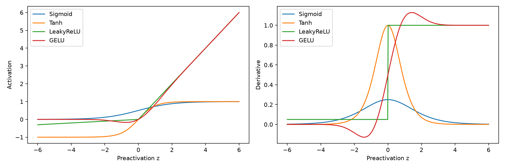
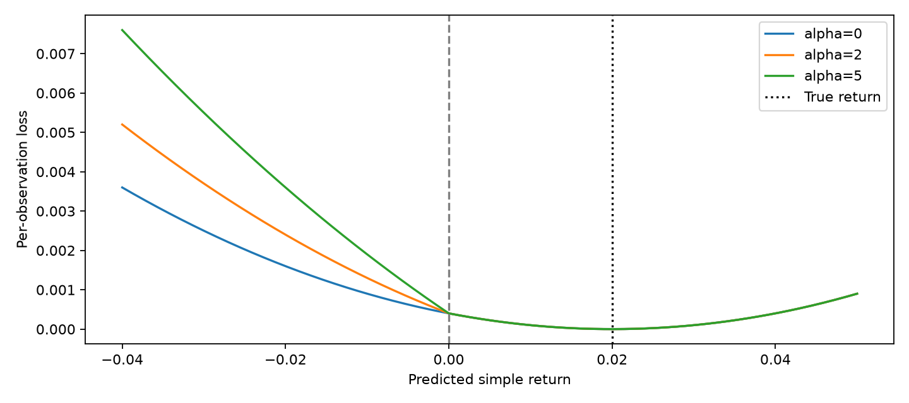
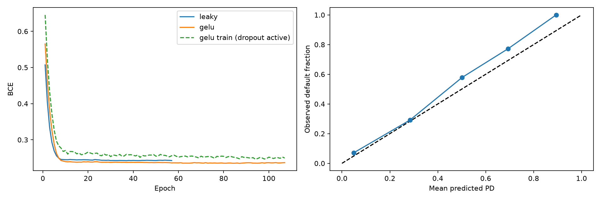

# Chapter 08. 금융 딥러닝의 기초: 다층 퍼셉트론(MLP)과 금융 비대칭 손실함수

> 금융 문제 → 쉬운 예시 → 수식 유도 → 완전한 PyTorch 코드 → 실행 결과 → 금융 해석

## 이 장을 시작하며

앞 장까지는 선형 회귀, 트리, 앙상블, 차원 축소와 군집화를 다뤘다. 이번 장은 여러 층의 선형 변환과 비선형 활성화 함수를 연결하는 인공신경망으로 확장한다. 목표는 단순히 층을 많이 쌓는 것이 아니다. **피처 간 교차 효과를 어떻게 표현하고, 어떤 오류를 줄이도록 학습하며, 미래 시점에서 성능을 어떻게 확인하는가**를 이해하는 것이다.

주요 예제는 두 가지다. 수익률 회귀에서는 방향을 틀린 예측에 추가 패널티를 주는 사용자 정의 손실을 구현한다. 신용 리스크에서는 6대 재무비율을 입력해 다음 1년의 부도 확률을 추정한다. 두 예제는 표적과 의사결정이 다르므로 손실도 분리한다. 방향성 손실을 0·1 부도 라벨에 그대로 적용해서는 안 되는 이유까지 설명한다.

모든 자료는 합성 데이터다. 특정 기업의 실제 부도 확률이나 시장에서 검증한 투자 성과로 제시하지 않는다. 기존 장의 용어와 재무 피처를 유지하되, 이번 장의 구현 프레임워크는 요청의 실습 요구에 맞춰 **PyTorch**로 통일한다. TensorFlow를 동시에 요구하는 코드가 아니며 독자는 한 프레임워크로 전체 과정을 실행할 수 있다.

첨부 원본은 전통 머신러닝 내용을 중심으로 끝나므로, 이 딥러닝 장에 대응하는 원본 슬라이드 번호를 만들어내지 않는다. 아래 항목은 사용자가 요청한 확장 내용의 본문 매핑이다.

| 요청 항목 | 본문 |
|---|---|
| 금융 비선형 교차 효과와 MLP | 8.1 |
| XOR·단층 구조의 한계 | 8.1.3–8.1.4 |
| 연쇄 법칙과 역전파 | 8.2 |
| Sigmoid·Tanh·LeakyReLU·GELU | 8.3 |
| 비대칭·방향성 손실 | 8.4–8.5 |
| 신용 MLP 전체 파이프라인 | 8.6–8.8 |
| 저장·재로딩·차주 추론 | 8.9 |

## 8.1 금융에서 신경망을 도입하는 이유

### 8.1.1 같은 지표 변화라도 다른 조건에서는 의미가 달라진다

금리가 오르면 모든 주식이 일정한 비율로 하락할까? 인플레이션 기대, 성장률, 기업의 부채 구조, 현금흐름이 다르면 영향도 달라질 수 있다. 기업 부채비율이 높더라도 영업현금흐름이 충분하면 위험이 상대적으로 작을 수 있다. 반대로 높은 부채비율과 낮은 이자보상배율이 동시에 나타나면 각 지표를 따로 볼 때보다 위험이 크게 높아질 수 있다.

이를 교차 효과라고 한다. 두 피처 x₁, x₂의 곱이 결과에 영향을 주는 단순한 예를 보자.

$$y=\beta_0+\beta_1x_1+\beta_2x_2+\beta_{12}x_1x_2+\epsilon.$$

x₁의 효과는 미분하면 β₁+β₁₂x₂다. 즉 x₂의 상태에 따라 x₁의 영향이 바뀐다.

$$\frac{\partial E[y\mid\boldsymbol{x}]}{\partial x_1}=\beta_1+\beta_{12}x_2.$$

일반 선형 회귀에 x₁x₂를 새 피처로 직접 넣으면 이 특정 효과는 표현할 수 있다. 선형 회귀라는 이름은 입력 함수가 반드시 직선이어야 한다는 뜻이 아니라 계수에 대해 선형이라는 뜻이다. 하지만 변수가 많아지면 가능한 곱·구간·고차항을 사람이 모두 지정하기 어렵다. MLP는 숨겨진 표현을 학습하여 다양한 비선형 결합을 구성한다.

### 8.1.2 CAPM·APT와의 관계

시장 초과수익만 사용하는 단순 회귀 구조는 다음과 같다.

$$r_i-r_f=\alpha_i+\beta_i(r_M-r_f)+\epsilon_i.$$

여러 요인으로 확장하면 다음 형태다.

$$r_i-r_f=\alpha_i+\sum_{j=1}^{p}\beta_{ij}f_j+\epsilon_i.$$

이 식은 선형 요인 노출의 설명이며 CAPM·APT의 경제 이론 자체와 임의의 예측 회귀를 동일시해서는 안 된다. 고정 계수의 단순한 표현에서는 요인 간 상호작용이나 문턱 효과를 별도로 추가해야 한다. MLP를 사용한다고 경제 이론이 대체되거나 인과관계가 확인되는 것도 아니다. 더 유연한 함수 근사 방법이 추가되는 것이다.

표 형태의 금융 데이터에서는 트리 앙상블이나 규제 회귀가 더 나을 수도 있다. 표본이 작고 잡음이 큰 상황에서 신경망의 유연성은 과적합 위험이 된다. 이번 신용 예제에는 로지스틱 회귀 기준 모델을 함께 둔다.

### 8.1.3 단층 퍼셉트론과 금융 XOR

단층 퍼셉트론은 입력의 가중합을 하나의 문턱과 비교한다.

$$z=\boldsymbol{w}^{T}\boldsymbol{x}+b,\qquad \hat{y}=1[z>0].$$

두 피처라면 경계는 직선이다. 다음은 금융적 해석을 붙인 논리 실험이다. x₁은 가격 모멘텀의 양의 방향 여부, x₂는 거시 신호의 양의 방향 여부다. 두 신호가 서로 반대면 방향 불일치에 따른 변동성 확대 후보를 1로 정의한다. 실제 시장에서 반드시 성립하는 경제 법칙이 아니라 구조적 표현력을 살펴보는 라벨 규칙이다.

| 가격 방향 x₁ | 거시 방향 x₂ | 불일치·변동성 확대 후보 |
|---|---|---|
| 0 | 0 | 0 |
| 0 | 1 | 1 |
| 1 | 0 | 1 |
| 1 | 1 | 0 |

이것이 XOR이다. 0·1 두 신호가 다를 때만 1이 된다. 직선으로는 대각선에 놓인 양성 두 경우와 음성 두 경우를 분리할 수 없다. 대수적으로도 모순을 확인할 수 있다. (0,0)이 음성이려면 b<0, (1,0)과 (0,1)이 양성이려면 w₁+b>0과 w₂+b>0이다. 두 부등식을 더하면 w₁+w₂+2b>0이고, b<0이므로 w₁+w₂+b>−b>0이다. 따라서 (1,1)을 음성으로 만들 수 없다.

실무에서 말하는 ‘양방향 변동성 돌파’가 언제나 XOR인 것은 아니다. 단일 수익률이 상단 또는 하단 문턱을 벗어나는 조건은 두 꼬리의 합집합이다. 두 개의 이진 신호가 서로 다른 경우라는 XOR과 구분해야 한다. 공통점은 하나의 선형 경계로 표현하기 어려운 분리된 영역을 다룬다는 것이다.

### 8.1.4 숨은 층은 어떻게 해결하는가

ReLU를 이용한 두 숨은 노드를 직접 구성해 보자.

$$h_1=\max(0,x_1-x_2),\qquad h_2=\max(0,x_2-x_1),\qquad \hat{y}=h_1+h_2.$$

0·1 입력에서 서로 같으면 둘 다 0이다. 다르면 한 노드만 1이 된다. 숨은 층이 ‘상방 불일치’와 ‘하방 불일치’를 나누고 출력층이 두 경우를 합친다. 실제 MLP는 이러한 가중치를 데이터로 학습한다. 아래 수작업 신경망은 표현 가능성의 증명이며 학습 성공률 실험은 아니다.

```python
from pathlib import Path
import copy, json, random, platform, importlib.metadata
import numpy as np
import pandas as pd
import matplotlib
matplotlib.use('Agg')
import matplotlib.pyplot as plt
import torch
from torch import nn
from torch.utils.data import Dataset, DataLoader
from sklearn.impute import SimpleImputer
from sklearn.preprocessing import RobustScaler, StandardScaler
from sklearn.linear_model import LogisticRegression
from sklearn.metrics import log_loss, brier_score_loss, average_precision_score, roc_auc_score, confusion_matrix

OUT=Path(__file__).resolve().parent if '__file__' in globals() else Path.cwd()
(OUT/'assets').mkdir(parents=True,exist_ok=True)
torch.set_num_threads(1)
torch.use_deterministic_algorithms(True)
DEVICE=torch.device('cpu')
def seed_all(seed=8001):
    random.seed(seed);np.random.seed(seed);torch.manual_seed(seed)
seed_all()
results={}
def records(frame):return json.loads(frame.to_json(orient='records',double_precision=12))
def savefig(name):
    plt.tight_layout();plt.savefig(OUT/'assets'/name,dpi=160);plt.close()
```

```python
bits=np.array([[0,0],[0,1],[1,0],[1,1]],dtype=float)
xor=np.array([0,1,1,0])
linear=LogisticRegression(C=100).fit(bits,xor)
hidden1=np.maximum(bits[:,0]-bits[:,1],0)
hidden2=np.maximum(bits[:,1]-bits[:,0],0)
score=hidden1+hidden2
assert np.array_equal((score>.5).astype(int),xor)
results['xor']=records(pd.DataFrame({'price_up':bits[:,0],'macro_up':bits[:,1],
    'divergence_breakout_label':xor,'linear_probability':linear.predict_proba(bits)[:,1],
    'hidden_up_divergence':hidden1,'hidden_down_divergence':hidden2,'nonlinear_output':score}))
```

| price_up | macro_up | divergence_breakout_label | linear_probability | hidden_up_divergence | hidden_down_divergence | nonlinear_output |
| --- | --- | --- | --- | --- | --- | --- |
| 0.00000000 | 0.00000000 | 0 | 0.50000000 | 0.00000000 | 0.00000000 | 0.00000000 |
| 0.00000000 | 1.00000000 | 1 | 0.50000000 | 0.00000000 | 1.00000000 | 1.00000000 |
| 1.00000000 | 0.00000000 | 1 | 0.50000000 | 1.00000000 | 0.00000000 | 1.00000000 |
| 1.00000000 | 1.00000000 | 0 | 0.50000000 | 0.00000000 | 0.00000000 | 0.00000000 |


### 8.1.5 다층 퍼셉트론의 일반식

입력을 a⁽⁰⁾=x라고 쓰면 층 l은 다음 두 작업을 수행한다.

$$\boldsymbol{z}^{(l)}=W^{(l)}\boldsymbol{a}^{(l-1)}+\boldsymbol{b}^{(l)},\qquad \boldsymbol{a}^{(l)}=\phi_l(\boldsymbol{z}^{(l)}).$$

이전 층 노드 수가 dₗ₋₁, 현재 층 노드 수가 dₗ이면 W는 dₗ×dₗ₋₁, b는 dₗ 차원이다. 미니배치 코드는 관측을 행에 놓으므로 행렬곱은 A·Wᵀ 형태로 계산된다.

활성화 없이 선형층만 여러 개 쌓으면 하나의 선형 변환으로 합쳐진다.

$$W_2(W_1\boldsymbol{x}+\boldsymbol{b}_1)+\boldsymbol{b}_2=(W_2W_1)\boldsymbol{x}+(W_2\boldsymbol{b}_1+\boldsymbol{b}_2).$$

비선형 활성화가 필요한 이유다. 회귀 출력층은 보통 실수 한 개를 그대로 내고, 이진 부도 분류는 실수 logit 한 개를 낸 뒤 Sigmoid로 확률로 바꾼다.

## 8.2 역전파: 손실의 책임을 각 가중치에 전달하기

### 8.2.1 연쇄 법칙을 한 경로에서 보기

가중치 w가 바뀌면 가중합 z가 바뀌고, 활성화 h와 예측값이 바뀌어 손실 L이 바뀐다. 이 영향을 작은 미분들의 곱으로 나누는 것이 연쇄 법칙이다.

$$\frac{\partial L}{\partial w}=\frac{\partial L}{\partial\hat{y}}\frac{\partial\hat{y}}{\partial h}\frac{\partial h}{\partial z}\frac{\partial z}{\partial w}.$$

숨은 노드 하나인 회귀 예제를 생각하자.

$$z=w_1x_1+w_2x_2+b,\qquad h=\tanh(z),\qquad \hat{y}=vh+c,\qquad L=\frac{1}{2}(\hat{y}-y)^2.$$

각 미분은 차례로 예측오차, 출력 가중치, Tanh 기울기, 입력값이다.

$$\frac{\partial L}{\partial w_j}=(\hat{y}-y)\,v\,(1-h^2)\,x_j.$$

출력층 가중치와 절편은 다음과 같다.

$$\frac{\partial L}{\partial v}=(\hat{y}-y)h,\qquad \frac{\partial L}{\partial c}=\hat{y}-y.$$

숨은 절편은 입력 xⱼ에 해당하는 항이 1이다.

$$\frac{\partial L}{\partial b}=(\hat{y}-y)v(1-h^2).$$

역전파는 마지막 손실에서 시작해 이러한 공통 중간값을 재사용하면서 모든 가중치의 미분을 효율적으로 계산한다. 자동미분이 수식을 없애는 것은 아니다. 우리가 정의한 계산 그래프에 연쇄 법칙을 적용한다.

### 8.2.2 여러 층의 행렬 유도

층의 가중합에 대한 손실 미분을 δ⁽ˡ⁾라고 정의한다.

$$\boldsymbol{\delta}^{(l)}=\frac{\partial L}{\partial\boldsymbol{z}^{(l)}}.$$

출력에서 시작해 이전 층으로 이동하면 다음 관계를 얻는다. 원소별 곱을 ⊙로 표시한다.

$$\boldsymbol{\delta}^{(l)}=(W^{(l+1)T}\boldsymbol{\delta}^{(l+1)})\odot\phi_l'(\boldsymbol{z}^{(l)}).$$

특정 가중치는 현재 노드의 δ와 이전 층 활성화의 곱이다.

$$\frac{\partial L}{\partial W^{(l)}_{ij}}=\delta_i^{(l)}a_j^{(l-1)}.$$

행렬 형태에서는 외적이 된다.

$$\frac{\partial L}{\partial W^{(l)}}=\boldsymbol{\delta}^{(l)}\boldsymbol{a}^{(l-1)T},\qquad \frac{\partial L}{\partial\boldsymbol{b}^{(l)}}=\boldsymbol{\delta}^{(l)}.$$

배치 손실을 평균했다면 각 관측의 미분을 합한 뒤 배치 크기 B로 나눈다. 코드의 `.mean()`이나 기본 loss reduction이 이 평균화를 수행하므로 추가로 B를 또 나누지 않는다.

### 8.2.3 이진 교차엔트로피의 출력 미분

logit z의 확률은 p=Sigmoid(z)다. 이진 교차엔트로피는 다음과 같다.

$$p=\frac{1}{1+e^{-z}},\qquad L_{BCE}=-y\log p-(1-y)\log(1-p).$$

p에 대한 미분과 Sigmoid의 미분을 곱하면 중간 항이 상쇄된다.

$$\frac{\partial L}{\partial p}=-\frac{y}{p}+\frac{1-y}{1-p},\qquad \frac{\partial p}{\partial z}=p(1-p).$$

$$\frac{\partial L}{\partial z}=p-y.$$

따라서 출력 Sigmoid와 BCE를 결합한 경우를 숨은 층의 반복적인 Sigmoid 포화와 똑같이 설명해서는 안 된다. 수치적으로 안정적인 구현은 확률을 따로 계산해 로그를 취하는 대신 logit에서 직접 계산한다.

$$L_{BCE}(z,y)=\max(z,0)-zy+\log(1+e^{-|z|}).$$

PyTorch의 `BCEWithLogitsLoss`에는 Sigmoid를 적용하기 전 logit을 넣는다. 예측 결과를 사용자에게 확률로 제공할 때에만 Sigmoid를 적용한다. [PyTorch BCEWithLogitsLoss 문서](https://docs.pytorch.org/docs/stable/generated/torch.nn.BCEWithLogitsLoss.html).

### 8.2.4 직접 미분·자동미분·수치미분을 대조하기

다음 코드는 작은 금융 점수 회귀를 가정해 세 방법의 기울기를 비교한다. 중앙차분은 w를 아주 조금 증가·감소시켜 손실 차이를 보는 방법이다.

$$\frac{\partial L}{\partial w_j}\approx\frac{L(\boldsymbol{w}+\varepsilon\boldsymbol{e}_j)-L(\boldsymbol{w}-\varepsilon\boldsymbol{e}_j)}{2\varepsilon}.$$

너무 큰 ε는 근사 오차를, 너무 작은 ε는 부동소수점 소거 오차를 만들 수 있다. 여기서는 float64와 ε=10⁻⁶을 사용한다. 신경망 전체를 수치미분으로 훈련하려는 것이 아니라 역전파 구현을 검증하는 용도다.

```python
x=torch.tensor([.4,-.7],dtype=torch.float64)
w=torch.tensor([.3,-.2],dtype=torch.float64,requires_grad=True)
b=torch.tensor(.1,dtype=torch.float64,requires_grad=True)
v=torch.tensor(.8,dtype=torch.float64,requires_grad=True)
c=torch.tensor(-.1,dtype=torch.float64,requires_grad=True)
y=torch.tensor(.2,dtype=torch.float64)
z=w@x+b;h=torch.tanh(z);prediction=v*h+c
loss=.5*(prediction-y)**2;loss.backward()
manual=(prediction.detach()-y)*v.detach()*(1-h.detach()**2)*x
assert torch.allclose(w.grad,manual)
def scalar_loss(weights):
    return .5*(.8*np.tanh(weights@x.numpy()+.1)-.1-.2)**2
eps=1e-6;finite=[]
for j in range(2):
    plus=w.detach().numpy().copy();minus=plus.copy();plus[j]+=eps;minus[j]-=eps
    finite.append((scalar_loss(plus)-scalar_loss(minus))/(2*eps))
assert np.allclose(finite,manual.numpy(),atol=1e-9)
results['backprop']=records(pd.DataFrame({'weight':['w1','w2'],'manual':manual.numpy(),'autograd':w.grad.numpy(),'finite_difference':finite}))
activations={'Sigmoid':nn.Sigmoid(),'Tanh':nn.Tanh(),'LeakyReLU':nn.LeakyReLU(.05),'GELU':nn.GELU()}
grid=torch.linspace(-6,6,500,requires_grad=True)
fig,axes=plt.subplots(1,2,figsize=(12,4))
results['activation_gradients']=[]
for name,fn in activations.items():
    output=fn(grid);derivative=torch.autograd.grad(output.sum(),grid)[0]
    axes[0].plot(grid.detach(),output.detach(),label=name);axes[1].plot(grid.detach(),derivative,label=name)
    for value in [-5.,0.,5.]:
        point=torch.tensor(value,requires_grad=True);out=fn(point)
        grad=torch.autograd.grad(out,point)[0]
        results['activation_gradients'].append(dict(activation=name,input=value,derivative=float(grad)))
for ax in axes:ax.set_xlabel('Preactivation z');ax.legend()
axes[0].set_ylabel('Activation');axes[1].set_ylabel('Derivative');savefig('fig01_activations.png')
```

| weight | manual | autograd | finite_difference |
| --- | --- | --- | --- |
| w1 | -0.00671649 | -0.00671649 | -0.00671649 |
| w2 | 0.01175386 | 0.01175386 | 0.01175386 |


## 8.3 활성화 함수와 기울기 소실

### 8.3.1 Sigmoid와 Tanh

Sigmoid의 값은 0과 1 사이이며 도함수 최대값은 1/4이다.

$$\sigma(z)=\frac{1}{1+e^{-z}},\qquad \sigma'(z)=\sigma(z)(1-\sigma(z))\leq\frac{1}{4}.$$

Tanh는 −1과 1 사이이고 0을 중심으로 대칭이다.

$$\tanh(z)=\frac{e^z-e^{-z}}{e^z+e^{-z}},\qquad \tanh'(z)=1-\tanh^2(z).$$

두 함수 모두 |z|가 커지면 포화되어 도함수가 0에 가까워진다. 부채비율 수백 단위와 ROA 한 자리 수를 변환 없이 섞어 넣으면 일부 노드의 가중합이 쉽게 큰 절댓값을 가질 수 있다. 적절한 전처리가 필요한 이유다.

역전파에서 작은 도함수를 여러 번 곱하면 초기 층의 변화 신호가 작아질 수 있다. 가중치의 영향이 1 정도라고 단순화하면 Sigmoid 도함수 10개의 곱은 최대 (1/4)¹⁰≈9.54×10⁻⁷이다. 실제 미분은 가중치 행렬도 곱해지므로 항상 이 숫자로 줄어든다는 뜻은 아니다.

$$\|\boldsymbol{\delta}^{(l)}\|\leq\|\boldsymbol{\delta}^{(L)}\|\prod_{k=l}^{L-1}\|W^{(k+1)}\|\,\|\operatorname{diag}(\phi_k'(\boldsymbol{z}^{(k)}))\|.$$

곱이 작아지면 소실, 커지면 폭주 가능성이 생긴다. 활성화 외에도 초기화, 층 수, 스케일, 정규화, 잔차 연결 등이 영향을 준다.

### 8.3.2 LeakyReLU

ReLU는 음수 입력을 0으로 만든다. LeakyReLU는 음수 쪽에도 작은 기울기 a를 남긴다.

$$\phi(z)=\max(z,az),\qquad 0<a<1.$$

z>0에서는 도함수가 1, z<0에서는 a다. 0에서는 미분이 유일하지 않으며 구현이 정한 값을 사용한다. 이번 실습은 a=0.05다. 영업적자·음의 현금흐름 같은 음수 입력에 대한 정보가 한 노드에서 완전히 차단되는 현상을 완화할 수 있다. 그러나 원래 금융 피처가 음수라는 사실과 숨은 노드의 가중합이 음수라는 사실은 다르다. 학습 후의 선형결합을 활성화한다는 점을 기억해야 한다.

음수 영역 기울기가 0이 아니라고 기울기 소실이 완전히 없어지는 것은 아니다. 여러 층에서 a가 반복해서 곱해지면 작아질 수 있다.

### 8.3.3 GELU

GELU는 입력에 표준정규 누적분포함수 Φ를 곱한다.

$$GELU(z)=z\Phi(z).$$

정규밀도 φ를 이용하면 도함수는 다음과 같다.

$$GELU'(z)=\Phi(z)+z\varphi(z),\qquad \varphi(z)=\frac{1}{\sqrt{2\pi}}e^{-z^2/2}.$$

ReLU처럼 0에서 갑자기 꺾이지 않고 부드럽게 입력을 조절한다. 다만 음의 큰 입력에서 기울기가 0에 가까워질 수 있고 일부 음수 구간의 도함수는 음수다. LeakyReLU처럼 음수 쪽에 일정한 양의 기울기를 보장하는 함수가 아니다. GELU의 Φ는 활성화 함수의 구성 요소이며 금융 수익률이 정규분포라고 가정하는 검정이 아니다. [GELU 원 논문](https://arxiv.org/abs/1606.08415), [PyTorch GELU](https://docs.pytorch.org/docs/stable/generated/torch.nn.GELU).

| 항목 | LeakyReLU | GELU |
|---|---|---|
| 음수 영역 | 고정된 작은 기울기 | 입력 위치에 따라 달라짐 |
| 0 부근 | 꺾이는 지점 존재 | 부드러움 |
| 금융적 사용 | 단순하고 안정적인 비교 기준 | 부드러운 비선형 상호작용 후보 |
| 선택 기준 | 같은 시간 검증에서 비교 | 같은 시간 검증에서 비교 |

어느 함수가 금융 데이터에서 항상 더 낫다고 정할 수는 없다. 신용 실습은 동일한 초기화 시드·구조·검증 구간으로 두 함수를 비교한다.

| activation | input | derivative |
| --- | --- | --- |
| Sigmoid | -5.00000000 | 0.00664806 |
| Sigmoid | 0.00000000 | 0.25000000 |
| Sigmoid | 5.00000000 | 0.00664803 |
| Tanh | -5.00000000 | 0.00018156 |
| Tanh | 0.00000000 | 1.00000000 |
| Tanh | 5.00000000 | 0.00018156 |
| LeakyReLU | -5.00000000 | 0.05000000 |
| LeakyReLU | 0.00000000 | 0.05000000 |
| LeakyReLU | 5.00000000 | 1.00000000 |
| GELU | -5.00000000 | -0.00000714 |
| GELU | 0.00000000 | 0.50000000 |
| GELU | 5.00000000 | 1.00000715 |




## 8.4 금융 비대칭 손실과 방향성 패널티

### 8.4.1 MSE와 Cross-Entropy를 정확히 이해하기

MSE는 실제 수익률과 예측 수익률의 **부호를 포함한 차이**를 제곱한다. 절댓값만 맞추는 손실은 아니다. 실제 +2%에 대해 +1%를 예측하면 오차는 1%포인트, −1%를 예측하면 3%포인트이므로 후자에 더 큰 손실을 준다.

그러나 MSE는 거래 규칙의 경제적 손익을 직접 최적화하지 않는다. 예를 들어 실제 +0.1%인데 −0.1%를 예측한 작은 방향 오류와 실제 +5%인데 +3%를 예측한 큰 크기 오류는 거래 방식에 따라 중요도가 달라질 수 있다. 방향에 따라 포지션이 바뀌는 전략에서는 부호 오류를 별도로 다룰 이유가 있다.

Cross-Entropy도 방향 라벨로 학습하면 방향을 직접 다룬다. 다만 기본 형태에서는 실제 수익률 크기나 거래비용을 모르므로 +0.1%와 +5%를 같은 상승 클래스의 사건으로 취급할 수 있다. 두 손실의 맹점은 ‘부호를 전혀 모른다’가 아니라 **경제적 비용 구조를 자동으로 포함하지 않는다**는 것이다.

### 8.4.2 과소·과대 예측 비용이 다른 비대칭 제곱손실

실제보다 작게 예측하는 과소예측의 비용을 c_under, 과대예측 비용을 c_over라고 하자. 다음 손실을 만들 수 있다.

$$L_{asym}=\left(c_{under}1[\hat{y}<y]+c_{over}1[\hat{y}\geq y]\right)(y-\hat{y})^2.$$

경계 밖에서 예측값에 대한 미분은 선택된 가중치에 2(예측−실제)를 곱한 값이다.

$$\frac{\partial L_{asym}}{\partial\hat{y}}=2c_{side}(\hat{y}-y).$$

예측과 실제가 같은 지점에서는 두 방향 모두 0으로 연결된다. c_under>c_over이면 과소예측을 더 강하게 밀어 올린다. 위험금액이나 변동성의 과소예측이 더 비싼 사례에 사용할 수 있다. 수익률 과소예측이 언제나 손실이라는 뜻은 아니므로 업무별 비용 정의를 먼저 정해야 한다. 이런 비대칭 손실의 최적 예측은 일반적인 조건부 평균과 달라질 수 있다.

### 8.4.3 요청한 방향성 손실의 정의

부호가 반대이면 y·ŷ<0이다. 따라서 다음 hinge 항은 반대 방향일 때만 양수가 된다.

$$L_{dir}(y,\hat{y})=(y-\hat{y})^2+\alpha\max(0,-y\hat{y}),\qquad \alpha\geq0.$$

배치에서는 각 관측의 손실을 평균한다. MSE는 평균인데 방향성 항만 합으로 처리하면 배치 크기에 따라 상대 가중치가 바뀌므로 동일한 reduction을 사용해야 한다.

$$\bar{L}_{dir}=\frac{1}{B}\sum_{i=1}^{B}\left[(y_i-\hat{y}_i)^2+\alpha\max(0,-y_i\hat{y}_i)\right].$$

같은 부호면 추가 항은 0이다. 반대 부호면 −yŷ가 양수이므로 실제 수익률과 예측 수익률의 곱의 크기만큼 패널티가 생긴다. α는 이 상대적 중요도를 조절한다. 고정한 실제 y에 대해 양·음 어느 예측 방향을 더 벌하는지 달라진다는 의미의 방향 불일치 비용이다. 동시에 실제와 예측의 부호를 모두 뒤집으면 손실이 같으므로 하락 위험만 별도로 더 크게 벌하는 손실은 아니다.

### 8.4.4 그래디언트를 단계별로 유도하기

부호가 같으면 MSE 미분만 남는다. 반대이면 추가 항 −αyŷ를 미분한 −αy가 더해진다.

$$\frac{\partial L_{dir}}{\partial\hat{y}}=2(\hat{y}-y)-\alpha y\,1[y\hat{y}<0].$$

배치 평균에서는 이 미분을 B로 나눈다. 실제 y가 양수이고 예측이 음수이면 추가 미분은 음수다. 경사하강은 미분을 빼므로 예측값을 양수 방향으로 더 강하게 움직인다. 실제 y가 음수이고 예측이 양수이면 반대로 밀어 준다.

정확히 yŷ=0이면 hinge의 꺾임이 생길 수 있다. PyTorch ReLU는 입력 0에서 도함수를 0으로 선택한다. 실제가 0이면 패널티는 모든 예측에서 0이다. 예측이 0이고 실제가 0이 아니어도 패널티는 0이지만 MSE 미분 −2y는 남는다.

### 8.4.5 단위와 목적의 한계

수익률을 소수에서 %로 모두 100배하면 두 항 모두 10,000배가 된다. α의 상대 의미는 같지만 손실과 그래디언트의 절대 크기는 달라진다. 학습률·옵티마이저의 수치 설정에도 영향을 줄 수 있으므로 단위를 기록해야 한다.

방향성 항은 틀린 부호의 횟수를 직접 세는 함수가 아니다. 반대 부호라도 예측 크기가 작으면 패널티가 작고, 큰 예측이면 커진다. 예측을 0 근처로 축소하는 방향으로 작동할 수도 있다. 이 손실을 줄였다고 방향 정확도나 순손익이 반드시 개선되는 것은 아니다.

부도확률에 이 식을 그대로 적용하면 문제가 있다. 부도 라벨 y∈{0,1}, 예측 확률 p∈[0,1]이면 −yp≤0이므로 방향성 항이 항상 0이다. 부도 분류에는 BCE, 비용 민감 학습, 임곗값 정책 등을 별도로 사용해야 한다.

```python
class DirectionalMSE(nn.Module):
    def __init__(self,alpha=2.):
        super().__init__()
        if alpha<0:raise ValueError('alpha must be nonnegative')
        self.alpha=alpha
    def forward(self,pred,target):
        if pred.shape!=target.shape:raise ValueError('Shape mismatch')
        return ((pred-target).square()+self.alpha*torch.relu(-target*pred)).mean()
class AsymmetricMSE(nn.Module):
    def __init__(self,under_weight=3.,over_weight=1.):
        super().__init__();self.under_weight=under_weight;self.over_weight=over_weight
    def forward(self,pred,target):
        weights=torch.where(pred<target,self.under_weight,self.over_weight)
        return (weights*(pred-target).square()).mean()
targets=torch.tensor([.02,.02,-.02,-.02],dtype=torch.float64)
preds=torch.tensor([.01,-.01,.01,-.01],dtype=torch.float64,requires_grad=True)
objective=DirectionalMSE(2.)(preds,targets);objective.backward()
expected=(2*(preds.detach()-targets)-2*targets*(targets*preds.detach()<0))/len(targets)
assert torch.allclose(preds.grad,expected)
assert torch.autograd.gradcheck(DirectionalMSE(2.),(preds.detach().requires_grad_(),targets))
results['directional_examples']=records(pd.DataFrame({'true_return':targets.numpy(),'prediction':preds.detach().numpy(),
    'MSE':(preds.detach()-targets).square().numpy(),'direction_penalty_alpha2':(2*torch.relu(-targets*preds.detach())).numpy(),
    'mean_loss_gradient':preds.grad.numpy()}))
curve=np.linspace(-.04,.05,500);actual=.02
plt.figure(figsize=(9,4))
for alpha in [0,2,5]:plt.plot(curve,(curve-actual)**2+alpha*np.maximum(0,-actual*curve),label=f'alpha={alpha}')
plt.axvline(0,color='gray',ls='--');plt.axvline(actual,color='black',ls=':',label='True return')
plt.xlabel('Predicted simple return');plt.ylabel('Per-observation loss');plt.legend();savefig('fig02_directional_loss.png')
```

| true_return | prediction | MSE | direction_penalty_alpha2 | mean_loss_gradient |
| --- | --- | --- | --- | --- |
| 0.02000000 | 0.01000000 | 0.00010000 | 0.00000000 | -0.00500000 |
| 0.02000000 | -0.01000000 | 0.00090000 | 0.00040000 | -0.02500000 |
| -0.02000000 | 0.01000000 | 0.00090000 | 0.00040000 | 0.02500000 |
| -0.02000000 | -0.01000000 | 0.00010000 | 0.00000000 | 0.00500000 |




표의 수익률은 소수 단위다. `mean_loss_gradient`는 4개 관측 평균 손실의 미분이므로 개별 손실 미분의 1/4이다. `gradcheck`는 hinge 경계 밖에서 사용자 정의 손실의 자동미분을 수치적으로 확인한다.

## 8.5 부도확률과 비대칭 의사결정은 분리한다

부도를 놓치는 비용과 정상 차주를 거절하는 비용은 다를 수 있다. 그렇다고 확률을 추정하는 BCE를 반드시 클래스 가중 손실로 바꿔야 하는 것은 아니다. 확률을 추정한 뒤 비용에 맞는 의사결정 문턱을 선택하는 방법도 있다.

오탐 비용을 C_FP, 미탐 비용을 C_FN이라 하고 정확한 예측의 추가 비용을 0으로 둔 단순한 이진 결정에서는 양성 결정의 기대비용은 C_FP(1−p), 음성 결정의 기대비용은 C_FNp다.

$$C_{FP}(1-p)<C_{FN}p\quad\Longleftrightarrow\quad p>\frac{C_{FP}}{C_{FP}+C_{FN}}.$$

실제 여신은 이자수익·회수율·한도·기간·거절의 기회비용이 들어가므로 이 단순식만으로 승인 정책을 완성하지 않는다.

양성 BCE에 가중치 w를 주면 출력 확률의 해석도 변할 수 있다. 실제 조건부 부도확률이 p일 때 기대 가중 손실을 최소화하는 출력 q는 다음과 같다.

$$R(q)=-wp\log q-(1-p)\log(1-q).$$

$$\frac{dR}{dq}=-\frac{wp}{q}+\frac{1-p}{1-q}=0\quad\Longrightarrow\quad q=\frac{wp}{1-p+wp}.$$

w≠1이면 일반적으로 q≠p다. 따라서 `pos_weight`를 사용한 출력을 검증 없이 원래 모집단의 부도확률이라고 부르면 안 된다. 이번 기본 신용 파이프라인은 **가중하지 않은 BCE**를 사용하고, Brier·log loss·보정 그림으로 확률 품질을 확인한다. 클래스 불균형은 AP와 재현율 관련 혼동행렬로 함께 본다.

## 8.6 6대 재무비율과 시간 분할

### 8.6.1 데이터 계약

앞 장과 연결되는 여섯 피처를 사용한다. 비율 정의를 일관되게 유지한다.

| 피처 | 의미 | 단위 |
|---|---|---|
| Debt_Ratio | 부채/자기자본 | % |
| Current_Ratio | 유동자산/유동부채 | % |
| Operating_Margin | 영업이익/매출 | % |
| Interest_Coverage | 영업이익/이자비용 | 배 |
| ROA | 앞 장과 같은 영업이익/총자산 대용비율 | % |
| Cashflow_to_Debt | 영업현금흐름/부채 | % |

실제 ROA는 자료 제공자에 따라 순이익 기준 등 정의가 다를 수 있다. 실습에서는 앞 장의 정의를 이어 쓰며 혼합하지 않는다. 합성 예제는 비율을 직접 생성하므로 완전한 재무제표 항등식을 만족하는 실제 회계자료는 아니다.

200개 기업 식별자를 2010~2024년의 연간 시나리오에 반복 관측한다. 기업의 일부 잠재 특성은 연도 사이에 유지된다. 높은 부채·낮은 이자보상, 적자·음의 현금흐름 조합에 비선형 위험 항을 넣어 부도 라벨을 생성한다.

합성 라벨은 각 연도의 조건부 1년 부도 사건을 독립적으로 뽑는 교육용 시나리오다. 한 번 부도난 기업이 자동 퇴출되는 흡수 상태나 실제 채무조정 과정을 구현한 생존 패널은 아니다. 같은 기업의 미래 평가이며 새로운 기업에 대한 일반화 실험도 아니다. 신규 차주 일반화를 확인하려면 기업 단위 분리를 추가해야 한다.

### 8.6.2 라벨이 확정된 뒤에만 검증한다

2010~2017년 입력을 훈련에 쓰면 마지막 라벨은 2018년에 확정된다. 검증 입력은 2019~2020년, 마지막 라벨은 2021년에 확정된다. 시험 입력은 2022~2024년이다. 중간 연도는 겹치는 라벨 정보를 피하기 위해 사용하지 않는다.

$$\max(t_{train}^{label\ end})<\min(t_{valid}^{input}),\qquad \max(t_{valid}^{label\ end})<\min(t_{test}^{input}).$$

`asof_date`는 해당 피처가 이용 가능하다고 가정한 시점이다. 실제 자료에서는 결산일이 아니라 공시·수집 지연까지 반영해야 한다. 합성 `oracle_probability`와 기업 식별자는 모델 입력에서 제외한다.

결측치는 훈련 중앙값으로 대체하고, 훈련 중앙값과 IQR을 사용하는 RobustScaler로 변환한다. 검증·시험에서 전처리기를 새로 적합하지 않는다. RobustScaler는 극단값의 스케일 영향을 줄일 뿐 극단값을 삭제하거나 모든 문제를 해결하지 않는다.

```python
rng=np.random.default_rng(8002)
FEATURES=['Debt_Ratio','Current_Ratio','Operating_Margin','Interest_Coverage','ROA','Cashflow_to_Debt']
company_quality=rng.normal(size=200)
rows=[]
for year in range(2010,2025):
    quality=.65*company_quality+.75*rng.normal(size=200)
    debt=np.exp(5.1-.45*quality+.25*rng.normal(size=200))
    current=np.exp(5+.28*quality+.2*rng.normal(size=200))
    margin=6+4*quality+3*rng.normal(size=200)
    coverage=3+1.4*quality+1.3*rng.normal(size=200)
    roa=3+1.7*quality+1.3*rng.normal(size=200)
    cash=9+5*quality+4*rng.normal(size=200)
    logits=-2.8+.004*(debt-150)-.006*(current-150)-.10*(margin-5)-.18*(coverage-3)-.12*(roa-3)-.04*(cash-8)
    logits+=1.1*((debt>220)&(coverage<1.5))+.5*((margin<0)&(cash<0))
    probability=1/(1+np.exp(-logits));label=rng.binomial(1,probability)
    frame=pd.DataFrame(np.column_stack([debt,current,margin,coverage,roa,cash]),columns=FEATURES)
    frame['company_id']=[f'COMPANY_{i+1:03d}' for i in range(200)]
    frame['asof_date']=pd.Timestamp(year,6,30);frame['label_end']=pd.Timestamp(year+1,6,30)
    frame['default_next_year']=label;frame['oracle_probability']=probability
    rows.append(frame)
credit=pd.concat(rows,ignore_index=True)
missing=rng.random((len(credit),6))<.02
credit.loc[:,FEATURES]=credit[FEATURES].mask(missing)
train=credit[credit.asof_date.dt.year<=2017].copy()
valid=credit[credit.asof_date.dt.year.between(2019,2020)].copy()
test=credit[credit.asof_date.dt.year>=2022].copy()
assert train.label_end.max()<valid.asof_date.min()
assert valid.label_end.max()<test.asof_date.min()
imputer=SimpleImputer(strategy='median').fit(train[FEATURES])
scaler=RobustScaler().fit(imputer.transform(train[FEATURES]))
def transform(frame):return scaler.transform(imputer.transform(frame[FEATURES])).astype(np.float32)
Xtrain,Xvalid,Xtest=map(transform,[train,valid,test])
ytrain=train.default_next_year.to_numpy(dtype=np.float32)
yvalid=valid.default_next_year.to_numpy(dtype=np.float32)
ytest=test.default_next_year.to_numpy(dtype=np.float32)
results['splits']=[dict(split=name,rows=len(d),companies=int(d.company_id.nunique()),
    first_date=str(d.asof_date.min().date()),last_date=str(d.asof_date.max().date()),
    defaults=int(d.default_next_year.sum()),default_rate=float(d.default_next_year.mean())) for name,d in [('train',train),('valid',valid),('test',test)]]
credit.to_csv(OUT/'synthetic_credit_panel.csv',index=False)
```

| split | rows | companies | first_date | last_date | defaults | default_rate |
| --- | --- | --- | --- | --- | --- | --- |
| train | 1600 | 200 | 2010-06-30 | 2017-06-30 | 230 | 0.14375000 |
| valid | 400 | 200 | 2019-06-30 | 2020-06-30 | 56 | 0.14000000 |
| test | 600 | 200 | 2022-06-30 | 2024-06-30 | 94 | 0.15666667 |


## 8.7 PyTorch 학습 파이프라인을 단계별로 만들기

### 8.7.1 Dataset과 DataLoader

Dataset은 ‘i번째 피처와 라벨을 어떻게 꺼낼 것인가’를 정의한다. DataLoader는 이를 배치로 묶고 학습 순서를 섞어 준다. 이번 입력은 B×6, 라벨은 B, 출력 logit도 B다. 출력이 B×1이고 라벨이 B이면 의도하지 않은 broadcasting이 발생할 수 있으므로 마지막 차원만 제거하는 `.squeeze(-1)`을 사용한다.

훈련 집합 내부를 섞는 것은 시간 검증을 무작위로 섞는 것과 다르다. 이미 과거로 확정된 훈련 자료의 순서만 바꾼다. 검증과 시험은 별도 시간 구간으로 유지한다. Windows와 노트북에서 재현하기 쉽도록 `num_workers=0`을 사용한다. [PyTorch DataLoader 문서](https://docs.pytorch.org/docs/stable/data).

### 8.7.2 nn.Module과 출력층

신용 MLP는 6→16→8→1 구조다. 첫 숨은 층 뒤에 dropout 0.1을 둔다. dropout은 훈련 때 일부 활성화를 무작위로 제거해 특정 경로의 의존을 줄이는 방법이다. 평가 때에는 꺼진다. 총 파라미터 수는 다음과 같다.

$$P=(6\cdot16+16)+(16\cdot8+8)+(8\cdot1+1)=257.$$

가중치는 Xavier uniform, 편향은 0으로 초기화한다. 이 선택이 LeakyReLU나 GELU에 항상 최적이라는 뜻은 아니며 동일한 비교 출발점으로 사용한다. 실제 성능에 따라 초기화와 폭·깊이를 검증할 수 있다.

### 8.7.3 Optimizer와 Training Loop

배치마다 다음 순서로 작업한다. 이전 기울기를 지우고, 순전파로 logit을 계산하고, BCE를 계산한 뒤, `backward()`로 미분을 만들고, `step()`으로 가중치를 갱신한다. PyTorch는 기본적으로 기울기를 누적하므로 의도적인 누적 학습이 아니라면 배치마다 초기화해야 한다.

AdamW는 기울기의 1차·2차 이동평균을 사용하고 가중치 감쇠를 별도로 적용한다. 개념적 갱신식은 다음과 같다.

$$m_t=\beta_1m_{t-1}+(1-\beta_1)g_t,\qquad v_t=\beta_2v_{t-1}+(1-\beta_2)g_t^2.$$

$$\hat{m}_t=\frac{m_t}{1-\beta_1^t},\qquad \hat{v}_t=\frac{v_t}{1-\beta_2^t}.$$

$$w_{t+1}=(1-\eta\lambda)w_t-\eta\frac{\hat{m}_t}{\sqrt{\hat{v}_t}+\varepsilon}.$$

코드는 학습률 0.002, weight decay 10⁻⁴를 사용한다. 모든 파라미터를 같은 optimizer 그룹에 넣었으므로 편향에도 decay가 적용된다. 편향을 감쇠에서 제외하는 다른 구현도 가능하지만 실제 코드와 설명을 일치시킨다.

### 8.7.4 검증과 Early Stopping

`model.eval()`은 dropout의 동작을 평가 모드로 바꾸지만 자동미분을 끄지는 않는다. `torch.no_grad()`는 평가 계산의 그래프 생성을 막는다. 두 기능이 다르므로 평가에서는 함께 사용한다.

검증 BCE가 이전 최적값보다 10⁻⁵ 이상 좋아지면 가중치를 깊은 복사로 저장한다. 20회 연속 유의한 개선이 없으면 중단한다. 마지막 epoch의 가중치가 아니라 **검증 손실이 가장 좋았던 가중치**를 복원한다. 단순히 state_dict 객체를 참조해 두면 이후 업데이트로 값이 바뀔 수 있으므로 `deepcopy`를 사용한다.

검증을 반복 이용하므로 검증 성능은 완전히 독립적인 최종 평가가 아니다. LeakyReLU·GELU 중 선택까지 검증에서 마친 뒤 시험 구간은 선택된 MLP에 대해 평가한다. 최대 200 epoch로 설정한다.

```python
class FinancialDataset(Dataset):
    def __init__(self,features,labels):
        self.X=torch.as_tensor(np.asarray(features),dtype=torch.float32)
        self.y=torch.as_tensor(np.asarray(labels),dtype=torch.float32)
        if self.X.ndim!=2 or self.y.shape!=(len(self.X),):raise ValueError('Invalid dataset shape')
        if not torch.isfinite(self.X).all():raise ValueError('Nonfinite features')
    def __len__(self):return len(self.y)
    def __getitem__(self,index):return self.X[index],self.y[index]
def make_loader(features,labels,shuffle,seed=42):
    generator=torch.Generator().manual_seed(seed)
    return DataLoader(FinancialDataset(features,labels),batch_size=64,shuffle=shuffle,
        generator=generator,num_workers=0,drop_last=False)
class FinancialMLP(nn.Module):
    def __init__(self,input_dim=6,activation='leaky',dropout=.1):
        super().__init__()
        def act():return nn.LeakyReLU(.05) if activation=='leaky' else nn.GELU()
        self.network=nn.Sequential(nn.Linear(input_dim,16),act(),nn.Dropout(dropout),
            nn.Linear(16,8),act(),nn.Linear(8,1))
        for layer in self.modules():
            if isinstance(layer,nn.Linear):
                nn.init.xavier_uniform_(layer.weight);nn.init.zeros_(layer.bias)
    def forward(self,x):return self.network(x).squeeze(-1)
def fit_model(model,train_loader,valid_loader,criterion,max_epochs=200,patience=20,lr=.002):
    model.to(DEVICE)
    optimizer=torch.optim.AdamW(model.parameters(),lr=lr,weight_decay=1e-4)
    best=float('inf');best_state=None;best_epoch=0;stale=0;history=[]
    for epoch in range(1,max_epochs+1):
        model.train();total=0.;count=0
        for batch_x,batch_y in train_loader:
            batch_x,batch_y=batch_x.to(DEVICE),batch_y.to(DEVICE)
            optimizer.zero_grad(set_to_none=True)
            prediction=model(batch_x);loss=criterion(prediction,batch_y)
            loss.backward();optimizer.step()
            total+=loss.item()*len(batch_y);count+=len(batch_y)
        model.eval();vtotal=0.;vcount=0
        with torch.no_grad():
            for batch_x,batch_y in valid_loader:
                batch_x,batch_y=batch_x.to(DEVICE),batch_y.to(DEVICE)
                vtotal+=criterion(model(batch_x),batch_y).item()*len(batch_y);vcount+=len(batch_y)
        val_loss=vtotal/vcount
        history.append(dict(epoch=epoch,train_loss=total/count,valid_loss=val_loss))
        if val_loss<best-1e-5:
            best=val_loss;best_state=copy.deepcopy(model.state_dict());best_epoch=epoch;stale=0
        else:stale+=1
        if stale>=patience:break
    if best_state is None:raise RuntimeError('No valid checkpoint')
    model.load_state_dict(best_state);model.eval()
    return history,best_epoch,best
def infer(model,features,probability=False):
    model.eval()
    with torch.no_grad():
        out=model(torch.as_tensor(features,dtype=torch.float32,device=DEVICE))
        if probability:out=torch.sigmoid(out)
    return out.cpu().numpy()
```

이 블록의 `fit_model`은 손실함수를 인자로 받으므로 뒤의 수익률 실험에도 같은 학습 절차를 적용한다. 일반화된 생산 라이브러리를 만드는 것이 아니라, 데이터·모형·손실·학습 루프의 역할을 분리해 보여주는 코드다.

## 8.8 부도확률 학습과 평가 결과

확률 평가에는 log loss와 Brier score를 사용한다. Brier는 확률과 0·1 라벨의 제곱오차 평균이다.

$$Brier=\frac{1}{n}\sum_i(p_i-y_i)^2.$$

AP는 부도 클래스의 정밀도·재현율 관계를 요약하고 ROC-AUC는 순위 구분을 본다. AP는 클래스 비율에 영향을 받으므로 시험 부도율과 함께 읽는다. 0.5 임곗값의 혼동행렬도 제시하지만 0.5가 여신의 최적 정책이라는 뜻은 아니다.

```python
credit_models={};histories={};results['activation_selection']=[]
for activation in ['leaky','gelu']:
    seed_all(8003)
    model=FinancialMLP(6,activation)
    history,epoch,best=fit_model(model,make_loader(Xtrain,ytrain,True),make_loader(Xvalid,yvalid,False),nn.BCEWithLogitsLoss())
    credit_models[activation]=model;histories[activation]=history
    results['activation_selection'].append(dict(activation=activation,best_epoch=epoch,epochs_run=len(history),valid_BCE=best))
chosen=min(results['activation_selection'],key=lambda r:r['valid_BCE'])['activation']
model=credit_models[chosen]
baseline=LogisticRegression(C=1,max_iter=2000).fit(Xtrain,ytrain)
def credit_metrics(name,target,p):
    cm=confusion_matrix(target,p>=.5,labels=[0,1]);tn,fp,fn,tp=cm.ravel()
    return dict(model=name,logloss=float(log_loss(target,p,labels=[0,1])),Brier=float(brier_score_loss(target,p)),
        AP=float(average_precision_score(target,p)),ROC_AUC=float(roc_auc_score(target,p)),
        TN=int(tn),FP=int(fp),FN=int(fn),TP=int(tp))
prob=infer(model,Xtest,True)
results['test_credit']=[credit_metrics('MLP selected on validation',ytest,prob),
    credit_metrics('Logistic baseline',ytest,baseline.predict_proba(Xtest)[:,1])]
results['selected_model']={'activation':chosen,'parameters':sum(p.numel() for p in model.parameters()),'test_base_rate':float(ytest.mean())}
torch.save(model.state_dict(),OUT/'credit_mlp_state.pt')
np.savez(OUT/'preprocessing.npz',median=imputer.statistics_,center=scaler.center_,scale=scaler.scale_)
metadata={'features':FEATURES,'activation':chosen,'input_dim':6,'dropout':.1,'threshold_example':.5}
(OUT/'model_config.json').write_text(json.dumps(metadata,indent=2),encoding='utf-8')
fig,axes=plt.subplots(1,2,figsize=(12,4))
for activation,h in histories.items():
    frame=pd.DataFrame(h);axes[0].plot(frame.epoch,frame.valid_loss,label=activation)
    if activation==chosen:axes[0].plot(frame.epoch,frame.train_loss,ls='--',label=activation+' train (dropout active)')
axes[0].set(xlabel='Epoch',ylabel='BCE');axes[0].legend()
bins=np.linspace(0,1,6);bin_ids=np.clip(np.digitize(prob,bins)-1,0,4)
results['calibration']=[]
for k in range(5):
    mask=bin_ids==k
    if mask.any():results['calibration'].append(dict(bin=k,count=int(mask.sum()),mean_probability=float(prob[mask].mean()),observed_rate=float(ytest[mask].mean())))
cal=pd.DataFrame(results['calibration'])
axes[1].plot([0,1],[0,1],'k--');axes[1].plot(cal.mean_probability,cal.observed_rate,'o-')
axes[1].set(xlabel='Mean predicted PD',ylabel='Observed default fraction');savefig('fig03_credit_training.png')
```

| activation | best_epoch | epochs_run | valid_BCE |
| --- | --- | --- | --- |
| leaky | 37 | 57 | 0.24226690 |
| gelu | 87 | 107 | 0.23489680 |


검증 BCE로 선택된 활성화는 **gelu**이며 모형 파라미터는 **257개**다. 시험 부도율은 **15.6667%**다. MLP의 시험 log loss는 **0.270272**, 로지스틱 회귀는 **0.263076**였다. 이번 실행에서는 기준 로지스틱 회귀가 더 낮은 log loss를 기록했다. 비선형 신경망이 더 복잡하다는 사실만으로 미래 성능 우월성을 주장할 수 없다.

| model | logloss | Brier | AP | ROC_AUC | TN | FP | FN | TP |
| --- | --- | --- | --- | --- | --- | --- | --- | --- |
| MLP selected on validation | 0.27027199 | 0.08171052 | 0.69529271 | 0.89542511 | 497 | 9 | 55 | 39 |
| Logistic baseline | 0.26307628 | 0.08159523 | 0.69581198 | 0.90505424 | 498 | 8 | 55 | 39 |


TN은 정상 차주를 정상으로, FP는 정상 차주를 고위험으로, FN은 부도 차주를 놓친 경우, TP는 부도 차주를 포착한 경우다. 표는 금액 가중 손실이 아니라 건수다. 높은 위험 차주가 소수이면 정확도만으로 비교하지 않는다.

| bin | count | mean_probability | observed_rate |
| --- | --- | --- | --- |
| 0 | 494 | 0.04893285 | 0.07085020 |
| 1 | 48 | 0.28390339 | 0.29166666 |
| 2 | 19 | 0.50162703 | 0.57894737 |
| 3 | 22 | 0.69387728 | 0.77272725 |
| 4 | 17 | 0.89386976 | 1.00000000 |




학습 곡선의 훈련 손실은 dropout이 켜진 배치 업데이트 도중 집계한 값이다. 검증은 dropout이 꺼진 epoch 말의 모델이므로 훈련 손실이 반드시 더 작아야 하는 것은 아니다. 보정 그림은 각 구간의 평균 예측확률과 실제 부도 비율을 비교한다. 45도 선에 가까울수록 해당 구간의 평균이 일치하지만 표본 수가 적은 구간은 불확실성이 크다. 이 그림만으로 확률이 완벽히 보정되었다고 선언하지 않는다.

## 8.9 방향성 손실을 실제 회귀 학습에 적용하기

손실의 수식과 그래디언트를 확인했더라도 실제 학습 결과가 좋아지는지는 별도 문제다. 네 개 거시·시장 점수의 비선형 상호작용으로 미래 수익률을 생성해 비교한다. 점수는 표준정규 대용 피처이며 실제 금리·환율 관측 자료가 아니다.

$$\mu_t=0.004x_{1,t}x_{2,t}-0.002x_{3,t}+0.001\max(0,x_{4,t}),\qquad r_{t+1}=\mu_t+\epsilon_{t+1}.$$

잡음 표준편차는 일별 1%다. 시간 순서대로 앞 1,000개를 훈련, 다음 250개를 검증, 마지막 450개를 시험에 사용한다. 독립적인 합성 1기간 수익률이며 실제 공시 지연을 가진 시계열로 해석하지 않는다. 피처 표준화는 훈련 구간에서만 적합한다.

α=0은 일반 MSE, α=2는 방향성 패널티를 추가한 경우다. 같은 초기화·구조·입력으로 비교하고 각 모형은 자신의 검증 목적함수로 early stopping한다. 목적함수가 다르므로 두 모형의 최저 검증 손실 숫자를 직접 비교해 우열을 정하지 않는다.

```python
rng=np.random.default_rng(8004)
macro_scores=rng.normal(size=(1700,4))
mu=.004*macro_scores[:,0]*macro_scores[:,1]-.002*macro_scores[:,2]+.001*np.maximum(macro_scores[:,3],0)
next_return=mu+rng.normal(0,.01,1700)
rs=StandardScaler().fit(macro_scores[:1000])
RX=rs.transform(macro_scores).astype(np.float32)
RY=(100*next_return).astype(np.float32)
results['regression']=[]
for alpha in [0.,2.]:
    seed_all(8005)
    reg=FinancialMLP(4,'leaky',dropout=0.)
    history,epoch,best=fit_model(reg,make_loader(RX[:1000],RY[:1000],True),
        make_loader(RX[1000:1250],RY[1000:1250],False),DirectionalMSE(alpha),max_epochs=180,patience=20)
    pred=infer(reg,RX[1250:]);truth=RY[1250:];wrong=pred*truth<0
    results['regression'].append(dict(alpha=alpha,best_epoch=epoch,
        test_RMSE_bp=float(np.sqrt(np.mean((pred-truth)**2))*100),
        test_direction_accuracy=float(np.mean(np.sign(pred)==np.sign(truth))),
        test_mean_direction_penalty_pct2=float(np.maximum(0,-truth*pred).mean()),
        wrong_sign_mean_absolute_actual_bp=float(np.abs(truth[wrong]).mean()*100),
        prediction_SD_pct=float(pred.std())))
pd.DataFrame({'MacroScore_1':macro_scores[:,0],'MacroScore_2':macro_scores[:,1],
    'MacroScore_3':macro_scores[:,2],'MacroScore_4':macro_scores[:,3],
    'realized_next_return':next_return}).to_csv(OUT/'synthetic_directional_returns.csv',index=False)
```

| alpha | best_epoch | test_RMSE_bp | test_direction_accuracy | test_mean_direction_penalty_pct2 | wrong_sign_mean_absolute_actual_bp | prediction_SD_pct |
| --- | --- | --- | --- | --- | --- | --- |
| 0.00000000 | 19 | 99.75094604 | 0.63777778 | 0.06034002 | 68.64854431 | 0.39532021 |
| 2.00000000 | 19 | 102.30525970 | 0.64000000 | 0.03524312 | 71.06156158 | 0.23331296 |


α=0에서 방향 정확도는 **63.7778%**, α=2에서는 **64.0000%**였다. RMSE는 **99.7509bp → 102.3053bp**로 악화되었다. 평균 방향성 패널티는 감소했지만 예측 표준편차도 **0.3953%포인트 → 0.2333%포인트**로 줄었다. 따라서 단순히 패널티가 줄었다는 이유만으로 투자 판단이 개선되었다고 결론내리지 않는다.

RMSE는 bp, 방향 정확도는 부호가 일치한 비율이다. 방향성 패널티 평균은 %포인트 제곱 단위다. `wrong_sign_mean_absolute_actual_bp`는 부호가 틀린 날짜에서 실제 수익률의 절댓값 평균이며 포트폴리오 손실 자체는 아니다. 예측 표준편차도 함께 출력해 단순히 예측을 0으로 축소했는지 살펴본다.

α는 훈련·검증 구간에서 업무 목적에 맞게 선택해야 한다. 시험 결과를 보고 α를 반복 변경하면 시험 구간이 더 이상 최종 검증이 아니다. 방향 정확도가 좋아도 거래비용·포지션 크기·헤지·체결 시점에 따라 손익은 다를 수 있다.

## 8.10 저장한 모델로 새로운 차주의 확률 계산하기

가중치만 저장해서는 재현이 되지 않는다. 피처 순서, 결측 대체값, 중심값, 스케일, 활성화 종류와 네트워크 구조를 함께 저장한다. 이번 구현은 `.pt`에 state_dict, `.npz`에 전처리 수치, JSON에 구조와 피처 이름을 저장한다.

새 차주의 재무비율을 같은 순서로 정렬하고 같은 전처리를 적용한 뒤 평가 모드에서 logit을 계산한다. Sigmoid로 부도확률을 얻는다. 저장 전후 전체 시험 예측이 일치하는지도 검사한다. `weights_only=True`는 저장한 tensor state를 로드하는 용도로 사용한다.

```python
config=json.loads((OUT/'model_config.json').read_text(encoding='utf-8'))
reloaded=FinancialMLP(config['input_dim'],config['activation'],config['dropout'])
reloaded.load_state_dict(torch.load(OUT/'credit_mlp_state.pt',map_location='cpu',weights_only=True))
prep=np.load(OUT/'preprocessing.npz')
borrower=pd.DataFrame([[280.,85.,-2.,.7,-1.,-3.]],columns=FEATURES)
raw=borrower[config['features']].to_numpy(dtype=float)
filled=np.where(np.isnan(raw),prep['median'],raw)
normalized=((filled-prep['center'])/prep['scale']).astype(np.float32)
assert np.allclose(normalized,transform(borrower))
pd_new=infer(reloaded,normalized,True)
assert np.allclose(infer(reloaded,Xtest,True),prob)
results['borrower']={'input':borrower.iloc[0].to_dict(),'predicted_PD':float(pd_new[0]),
    'illustrative_threshold':.5,'flag':bool(pd_new[0]>=.5)}
results['python']=platform.python_version()
results['versions']={p:importlib.metadata.version(p) for p in ['numpy','pandas','scikit-learn','matplotlib','torch']}
results['checks']=['manual_backprop_autograd_finite_difference','directional_gradient_check',
    'label_maturity_before_validation_and_test','checkpoint_restores_best_validation',
    'preprocessing_saved_and_reloaded','model_reloaded_predictions_match']
(OUT/'results.json').write_text(json.dumps(results,ensure_ascii=False,indent=2),encoding='utf-8')
requirements=[f'{p}=={v}' for p,v in results['versions'].items() if p!='torch']
requirements.append('torch=='+results['versions']['torch'].split('+')[0])
(OUT/'requirements.txt').write_text('\n'.join(requirements)+'\n',encoding='utf-8')
for key in ['splits','activation_selection','test_credit','regression']:
    print('\n'+key+'\n'+pd.DataFrame(results[key]).to_string(index=False))
print('\nBorrower PD:',results['borrower']['predicted_PD'])
print('All numerical checks passed.')
```

예시 차주의 입력은 부채비율 280%, 유동비율 85%, 영업이익률 −2%, 이자보상배율 0.7배, ROA 대용비율 −1%, 현금흐름/부채 −3%다. 저장 후 다시 불러온 모델의 예측 부도확률은 **74.1518%**다. 교육용 0.5 문턱의 위험 표시 결과는 **True**다. 이는 실제 여신 정책이 아니라 추론 과정의 재현 예제다.

이 출력은 합성 학습 모형의 결과이며 실제 여신 승인·거절이나 개별 차주의 객관적 확률로 사용하지 않는다. 변수 하나가 나쁘다는 이유로 신경망이 그 변수에 어떤 인과적 책임을 부여했다고 해석할 수도 없다. 설명가능성 분석은 별도 배경·방법·검증이 필요하다.

## 8.11 확인 문제와 해설

**문제 1. 활성화 없이 선형층 세 개를 쌓으면 XOR을 표현할 수 있는가?**

해설: 선형층과 편향은 합성해도 하나의 affine 변환이다. 표현력의 핵심은 층 수만이 아니라 중간 비선형성이다.

**문제 2. 실제 수익률이 +2%, 예측이 −1%, α=2일 때 개별 방향성 손실은 얼마인가?**

해설: 소수 단위에서 MSE는 (0.02−(−0.01))²=0.0009다. 추가 항은 2×0.0002=0.0004이므로 합은 0.0013이다. 예측에 대한 개별 미분은 2(−0.01−0.02)−2×0.02=−0.10이다. 배치 크기가 4인 평균 손실에서는 −0.025다.

**문제 3. 부도 라벨 1과 예측확률 0.1에 방향성 항을 쓰면 미탐 위험이 커지는가?**

해설: max(0,−1×0.1)=0이다. 방향성 손실은 양·음의 수익률을 위한 것이며 부도 오분류 비용에는 맞지 않는다.

**문제 4. Early Stopping 후 마지막 가중치를 저장하면 되는가?**

해설: 중단 직전 모델보다 이전 모델의 검증 성능이 좋았을 수 있다. 최적 검증 checkpoint를 복원하고 그 모델로 시험을 수행해야 한다.

**문제 5. GELU가 부드러우므로 LeakyReLU보다 금융 예측력이 항상 높은가?**

해설: 아니다. 부드러움은 함수의 성질이며 실제 예측력은 표본·구조·초기화·목적함수·검증에 달려 있다. 동일 조건의 미래 검증이 필요하다.

**코드 수정 실습.** 먼저 시험 구간을 열지 않은 상태에서 훈련·검증만 사용해 hidden width나 α 후보를 변경해 보라. 선택 기준과 후보를 기록하고 최종 시험은 마지막에 한 번 수행하라. 부도 분류에서 `pos_weight`를 추가한다면 출력의 확률 해석과 보정도 함께 비교하라. 단순히 재현율이 올라간 것만으로 원확률 추정이 좋아졌다고 결론내리지 않는다.

## 8.12 실행 환경과 파일 안내

Python 3.12.14에서 실행했다.

| package | version |
| --- | --- |
| numpy | 2.3.5 |
| pandas | 3.0.1 |
| scikit-learn | 1.9.0 |
| matplotlib | 3.11.1 |
| torch | 2.14.0+cpu |


CPU 환경에서 실행했으며 GPU가 필요하지 않다. 랜덤 시드와 결정적 알고리즘 설정을 고정했지만 운영체제·라이브러리 버전·하드웨어가 달라지면 미세한 수치 차이가 날 수 있다. 버전 고정은 재현성을 돕지만 모든 환경에서 비트 단위 일치를 보장하지 않는다.

```text
python -m pip install -r requirements.txt
python chapter08_examples.py
```

`chapter08_examples.py`에는 본문 코드 전체가 들어 있다. `synthetic_credit_panel.csv`는 재무비율과 라벨, `synthetic_directional_returns.csv`는 방향성 손실 회귀 자료다. `credit_mlp_state.pt`, `preprocessing.npz`, `model_config.json`은 함께 보관한다. `results.json`은 본문의 수치표 근거다.

HTML은 수식과 그림을 내장한 열람본, Markdown은 편집용 원고다. 데이터를 바꾸어 스크립트를 실행하면 결과 파일과 그림은 갱신되지만 본문 표와 해석은 자동으로 다시 집필되지 않으므로 함께 수정해야 한다.
