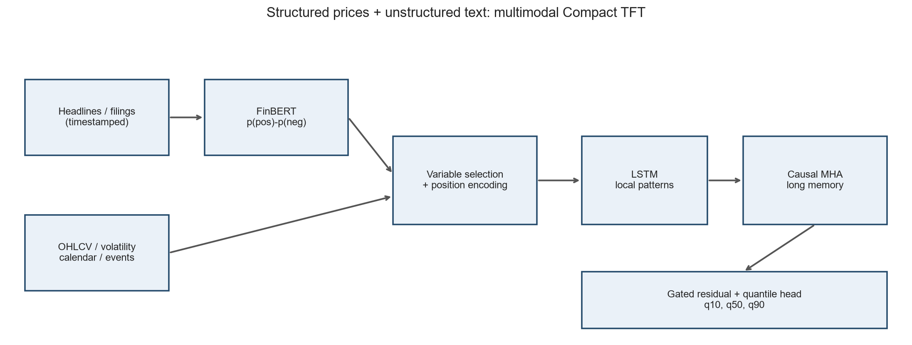
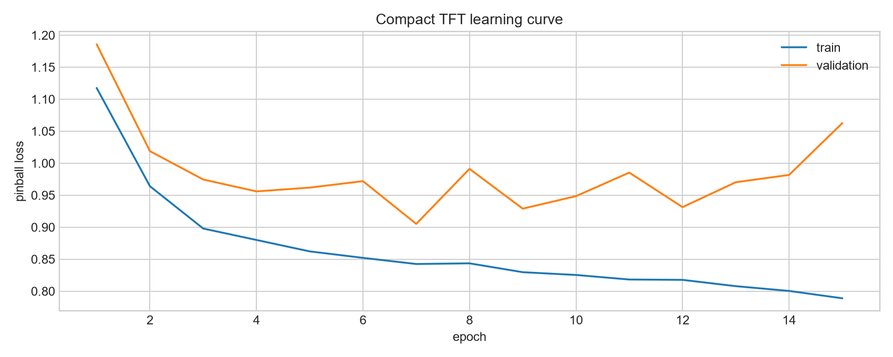
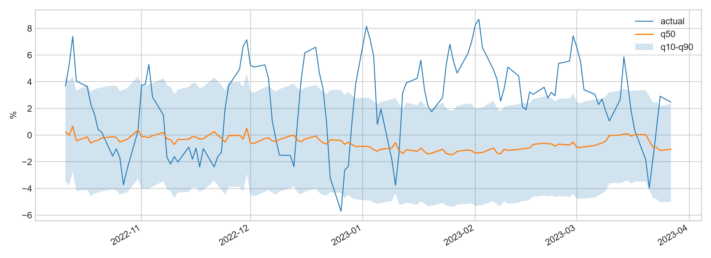
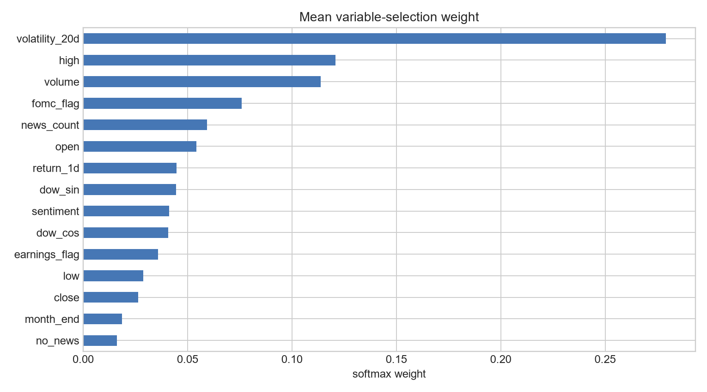
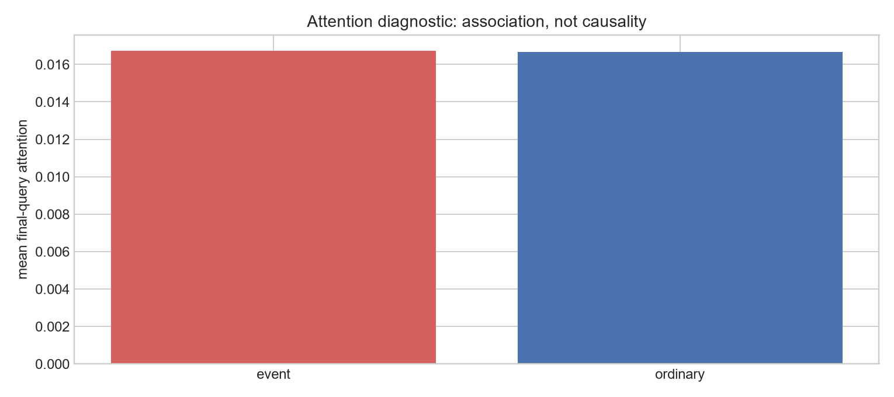

# Chapter 10. 최신 금융 AI: Transformer, Temporal Fusion Transformer와 금융 뉴스 감성 분석

> **학습 목표.** 이 장은 60영업일 가격 창 안에서 어느 날짜와 어느 변수를 볼 것인지 학습하는 모델을 만든다. 먼저 scaled dot-product attention을 행렬 수준에서 유도하고, multi-head attention과 위치·금융 캘린더 정보를 결합한다. 이어 FinBERT의 확률 출력을 시점이 보존된 감성 변수로 바꾸고, OHLCV·변동성·이벤트와 함께 Compact TFT에 입력한다. 마지막에는 분위수 예측, 변수 선택 가중치, 이벤트 어텐션을 구분해 해석한다.

이 장의 기본 실습은 외부 가격이나 뉴스를 내려받지 않는다. 재현 가능한 **합성 시장과 합성 감성 점수**를 사용한다. 별도 함수는 `ProsusAI/finbert`를 실제로 내려받아 영어 헤드라인을 평가할 수 있지만, 기본 실행 결과는 FinBERT의 출력이라고 주장하지 않는다. 이 구분은 모형보다 중요하다. 출처가 다른 점수를 같은 이름으로 저장하면 백테스트의 재현성과 감사 가능성이 사라진다.



## 10.1 금융 시계열에서 어텐션이 필요한 이유

RNN과 LSTM은 과거를 순서대로 압축한다. 반면 self-attention은 예측 기준일의 표현이 60일 전부터 오늘까지의 표현을 직접 비교하게 한다. 예를 들어 평상시의 20거래일 전보다 FOMC 성명 발표일의 금리 충격, 실적 발표일의 가이던스 하향, 신용등급 강등일이 더 관련 있다면 해당 날짜에 더 큰 가중치를 둘 수 있다. 거리만으로 중요도를 정하지 않는다는 것이 핵심이다.

길이가 (T), 입력 변수 수가 (d_{in})인 한 표본을 다음 행렬로 둔다.

$$X=[x_1^T;x_2^T;\ldots;x_T^T]\in\mathbb{R}^{T\times d_{in}}$$

학습 가능한 선형 사상으로 query, key, value를 만든다.

$$Q=XW_Q,\quad K=XW_K,\quad V=XW_V$$

$$W_Q,W_K\in\mathbb{R}^{d_{in}\times d_k},\qquad W_V\in\mathbb{R}^{d_{in}\times d_v}$$

시점 (t)의 query (q_t)와 과거 시점 (s)의 key (k_s)가 잘 맞는 정도는 내적이다.

$$e_{ts}=q_t^Tk_s$$

모든 key에 대한 점수를 확률처럼 합이 1이 되도록 바꾸면

$$\alpha_{ts}=\frac{\exp(e_{ts}/\sqrt{d_k})}{\sum_{u=1}^{T}\exp(e_{tu}/\sqrt{d_k})}$$

이고, 시점 (t)의 문맥 벡터는 value의 가중평균이다.

$$z_t=\sum_{s=1}^{T}\alpha_{ts}v_s$$

행렬로 한 번에 쓰면 scaled dot-product attention을 얻는다.

$$\operatorname{Attention}(Q,K,V)=\operatorname{softmax}\left(\frac{QK^T}{\sqrt{d_k}}\right)V$$

### 왜 (\sqrt{d_k})로 나누는가

(q_{t\ell})과 (k_{s\ell})이 평균 0, 분산 1이며 서로 독립이라고 가정한다. 내적은 (d_k)개의 곱을 더한 값이다.

$$q_t^Tk_s=\sum_{\ell=1}^{d_k}q_{t\ell}k_{s\ell}$$

각 곱의 평균은 0이고 분산은 1이므로

$$\operatorname{Var}(q_t^Tk_s)=\sum_{\ell=1}^{d_k}\operatorname{Var}(q_{t\ell}k_{s\ell})=d_k$$

따라서 표준편차는 (\sqrt{d_k})다. 차원이 커질수록 softmax 입력 절댓값이 커지고, 한 항목만 거의 1인 포화 상태가 된다. 포화된 softmax의 미분은 작아 학습이 둔해진다. 나누기 후 분산은

$$\operatorname{Var}\left(\frac{q_t^Tk_s}{\sqrt{d_k}}\right)=1$$

로 차원과 무관해진다. 다음 코드는 무작위 벡터에서 원 점수의 표준편차가 약 (\sqrt{d_k}), 스케일 점수의 표준편차가 약 1인지 직접 검증한다. 인과 마스크를 적용한 행별 가중치 합도 1인지 검사한다.

```python
def scaled_dot_product_attention(Q,K,V,causal=False):
    scores=Q@K.transpose(-2,-1)/math.sqrt(Q.size(-1))
    if causal:
        mask=torch.triu(torch.ones(scores.size(-2),scores.size(-1),dtype=torch.bool,device=scores.device),1)
        scores=scores.masked_fill(mask,float('-inf'))
    weights=torch.softmax(scores,dim=-1)
    return weights@V,weights

Q=torch.randn(2,6,16); K=torch.randn(2,6,16); V=torch.randn(2,6,8)
context,A=scaled_dot_product_attention(Q,K,V,True)
assert context.shape==(2,6,8) and torch.allclose(A.sum(-1),torch.ones(2,6),atol=1e-6)
for dk in (4,16,64,256):
    q=torch.randn(10000,dk); k=torch.randn(10000,dk); raw=(q*k).sum(1)
    print(f'dk={dk:3d} raw_std={raw.std():.3f} scaled_std={(raw/math.sqrt(dk)).std():.3f}')
```

실행에서 (d_k=4,16,64,256)일 때 원 점수 표준편차는 각각 2.038, 4.013, 7.992, 16.157이었고, 스케일 후에는 1.019, 1.003, 0.999, 1.010이었다. 이는 확률적 가정 아래의 유도를 수치로 확인한 결과이지, 학습된 금융 표현이 반드시 독립 정규분포라는 뜻은 아니다.

### 미래 누수를 막는 인과 마스크

각 시점에서 동시에 예측값을 만들 때는 (s>t)인 미래 key를 볼 수 없어야 한다. 허용되지 않는 점수에 (-\infty)를 더한다.

$$M_{ts}=0\quad(s\leq t),\qquad M_{ts}=-\infty\quad(s>t)$$

$$A=\operatorname{softmax}\left(\frac{QK^T}{\sqrt{d_k}}+M\right)$$

이 장의 최종 예측은 과거 60일 창의 마지막 query를 사용한다. 창 안의 모든 시점은 예측 기준일에 이미 알려져 있으므로 마지막 행만 보면 누수가 없다. 그래도 코드에는 상삼각 인과 마스크를 넣어 중간 시점 표현도 자신의 미래를 보지 못하게 했다. 마스크가 있어도 뉴스의 **발행 시각**이 의사결정 마감 후라면 누수다. 배열 마스크와 데이터 시각 통제는 별개의 방어선이다.

## 10.2 Multi-Head Attention과 시간 인코딩

하나의 내적 공간이 모든 금융 관계를 담당하면 금리 이벤트, 실적 충격, 단기 모멘텀, 변동성 군집을 같은 유사도 척도로 압축한다. Multi-head attention은 서로 다른 투영 행렬을 학습한다.

$$\operatorname{head}_i=\operatorname{Attention}(QW_i^Q,KW_i^K,VW_i^V)$$

$$\operatorname{MultiHead}(Q,K,V)=\operatorname{Concat}(\operatorname{head}_1,\ldots,\operatorname{head}_h)W^O$$

일반적으로 (d_k=d_v=d_{model}/h)로 두어 연결 후 폭을 (d_{model})로 되돌린다. 어떤 head는 최근 며칠에, 다른 head는 드문 이벤트 날짜에 집중할 **수 있는 표현력**을 얻는다. head마다 의미가 자동으로 분리된다고 보장되지는 않는다. 여러 head가 같은 패턴을 복제할 수도 있다.

PyTorch의 `MultiheadAttention(batch_first=True)` 입력은 `[배치, 시간, 임베딩]`이다. `average_attn_weights=False`로 두면 가중치가 `[배치, head, query 시간, key 시간]`으로 반환된다. 이 장은 마지막 query 행을 추출해 각 과거 날짜의 비중을 계산한다.

### 순서를 모르는 어텐션에 위치를 주입하기

내용 벡터만 쓰는 self-attention은 행을 같은 방식으로 순열하면 결과도 같은 방식으로 순열된다. 1일 전과 50일 전이라는 절대 위치를 자체적으로 모른다. 원래 Transformer의 사인·코사인 위치 인코딩은 다음과 같다.

$$PE(pos,2i)=\sin\left(\frac{pos}{10000^{2i/d_{model}}}\right)$$

$$PE(pos,2i+1)=\cos\left(\frac{pos}{10000^{2i/d_{model}}}\right)$$

짝수·홀수 차원에 서로 다른 주기의 파동을 넣는다. 가까운 위치는 비슷한 벡터를 가지면서도 각 위치가 구별된다. 이 장은 매 60일 창에서 `pos=0,...,59`를 사용하므로 **창 안의 상대 위치**를 뜻한다.

위치 인코딩만으로 월요일, 옵션 만기, 월말, FOMC 예정일을 알 수 없다. 달력 변수는 별도 입력이다. 주중 거래일 (d\in\{0,1,2,3,4\})는 순환형으로 만든다.

$$dow_{sin}=\sin(2\pi d/5),\qquad dow_{cos}=\cos(2\pi d/5)$$

금요일과 월요일이 숫자 4만큼 멀다는 잘못된 관계를 피한다. 월말은 0/1, 사전에 공표된 FOMC 일정도 known covariate로 취급할 수 있다. 실적일은 기업이 확정 일정을 발표한 뒤에만 known covariate다. 실제 실적 내용과 뉴스 감성은 발표 전에는 unknown observed covariate이므로 미래 구간에 채우면 안 된다.

```python
class SinusoidalPositionEncoding(nn.Module):
    def __init__(self,d_model,max_len=512):
        super().__init__(); pe=torch.zeros(max_len,d_model)
        pos=torch.arange(max_len,dtype=torch.float32).unsqueeze(1)
        div=torch.exp(torch.arange(0,d_model,2,dtype=torch.float32)*(-math.log(10000.0)/d_model))
        pe[:,0::2]=torch.sin(pos*div); pe[:,1::2]=torch.cos(pos*div)
        self.register_buffer('pe',pe.unsqueeze(0))
    def forward(self,x): return x+self.pe[:,:x.size(1)]

dates=pd.bdate_range('2020-01-01',periods=10); calendar=pd.DataFrame(index=dates)
calendar['dow_sin']=np.sin(2*np.pi*dates.dayofweek/5); calendar['dow_cos']=np.cos(2*np.pi*dates.dayofweek/5)
calendar['month_end']=dates.is_month_end.astype(float); print(calendar.head())
```

## 10.3 금융 뉴스에서 감성 점수 만들기

### 일반 단어 감성과 금융 문맥의 차이

“liability decreased”의 `liability`는 일반 문서에서 부정적으로 보일 수 있지만 재무 문맥에서는 부채 감소가 긍정적일 수 있다. “earnings beat estimates but guidance was cut”은 앞과 뒤의 극성이 충돌한다. 단순 긍정·부정 단어 수는 부정어, 비교 대상, 조건절, 금융 전문 용법을 충분히 표현하지 못한다.

FinBERT는 BERT 계열의 문맥 표현을 금융 감성 분류에 맞게 사전학습 또는 미세조정한 모델군을 가리킨다. 토크나이저가 헤드라인을 subword 토큰으로 나누고 `[CLS]` 위치의 문맥 표현 (h_{CLS})에 분류 선형층을 적용한다고 쓰자.

$$z=W_ch_{CLS}+b_c$$

$$p_c=\frac{\exp(z_c)}{\sum_{j\in\{neg,neu,pos\}}\exp(z_j)}$$

방향을 한 숫자로 줄이는 한 방법은

$$s=p_{pos}-p_{neg},\qquad -1\leq s\leq 1$$

이다. 중립일 가능성 (p_{neu}), 전체 엔트로피, 뉴스 건수도 버리지 않는 편이 좋다. (s=0)은 완전 중립일 수도 있고, 긍정과 부정이 각각 0.5인 충돌 상태일 수도 있다.

### 시점 정렬이 모델 선택보다 먼저다

오후 3시 의사결정이라면 그 이후 발행 기사는 그날 입력에 포함할 수 없다. 정정 기사는 최초 기사 시각으로 소급하지 않고 정정 시각부터 사용한다. 동일 기사를 여러 공급자가 재전송했다면 중복을 제거한다. 뉴스가 없는 날의 점수 0과 실제 중립 기사 점수 0을 구별하려고 `news_count`와 `no_news`를 함께 넣는다.

일별 단순 집계는

$$s_t^{daily}=\frac{1}{n_t}\sum_{j=1}^{n_t}s_{tj}$$

이다. 중요 매체, 최신성 또는 기업 관련도 (r_{tj}\)를 쓰면

$$s_t^{weighted}=\frac{\sum_j r_{tj}s_{tj}}{\sum_j r_{tj}}$$

로 확장할 수 있다. 가중치가 미래 수익률을 보고 정해지면 또 다른 누수이므로 사전에 고정하거나 훈련 구간에서만 학습한다.

아래 함수는 모델 설정의 `id2label`을 읽어 클래스 순서를 확인한다. 감성 클래스가 `[positive, negative, neutral]` 순서라고 하드코딩하지 않는다. `eval()`과 `torch.inference_mode()`로 dropout과 그래디언트를 끄고, 긴 입력은 128토큰에서 자른다. `ProsusAI/finbert`는 주로 영어 금융 문장용이다. 한국어 공시에는 검증된 한국어 금융 모델을 사용하거나 별도 라벨로 미세조정해야 하며, 기계번역은 추가 오차원이 된다.

```python
def score_headlines_finbert(frame,model_name='ProsusAI/finbert',batch_size=32):
    """Return probabilities and score=p_positive-p_negative; model labels are read safely."""
    try:
        from transformers import AutoTokenizer,AutoModelForSequenceClassification
    except ImportError as e: raise RuntimeError('pip install -r requirements-finbert.txt') from e
    tok=AutoTokenizer.from_pretrained(model_name)
    model=AutoModelForSequenceClassification.from_pretrained(model_name).to(DEVICE).eval()
    labels={int(k):str(v).lower() for k,v in model.config.id2label.items()}; rows=[]
    texts=frame['headline'].fillna('').astype(str).tolist()
    with torch.inference_mode():
        for i in range(0,len(texts),batch_size):
            enc=tok(texts[i:i+batch_size],padding=True,truncation=True,max_length=128,return_tensors='pt')
            p=model(**{k:v.to(DEVICE) for k,v in enc.items()}).logits.softmax(-1).cpu().numpy()
            for probs in p:
                row={f'p_{labels[j]}':float(probs[j]) for j in range(len(probs))}
                row['sentiment_score']=row.get('p_positive',0)-row.get('p_negative',0); rows.append(row)
    return pd.concat([frame.reset_index(drop=True),pd.DataFrame(rows)],axis=1)

def aggregate_news_before_cutoff(scored,cutoff_hour=15):
    x=scored.copy(); x['timestamp']=pd.to_datetime(x['timestamp'])
    x=x[x.timestamp.dt.hour<cutoff_hour].copy(); x['date']=x.timestamp.dt.normalize()
    return x.groupby('date').agg(sentiment=('sentiment_score','mean'),news_count=('headline','size')).reset_index()

finbert_input=os.getenv('FINBERT_INPUT')
if finbert_input:
    score_headlines_finbert(pd.read_csv(finbert_input)).to_csv(ROOT/'finbert_scored.csv',index=False)
```

`FINBERT_INPUT=news.csv` 환경변수로 실행하면 실제 사전학습 가중치를 다운로드해 `finbert_scored.csv`를 만든다. 입력 CSV에는 `timestamp,headline`이 필요하다. 기본 실습은 이 분기를 호출하지 않으므로 인터넷 없이 실행된다.

## 10.4 Temporal Fusion Transformer의 설계

TFT는 단순히 Transformer 이름을 붙인 시계열 모델이 아니다. 원 논문의 목적은 정적 공변량, 미래에도 알려진 입력, 과거에만 관측되는 입력을 함께 다루는 다중기간 분위수 예측이다. 핵심은 변수 선택, LSTM의 국소 처리, 장기 self-attention, 게이트, 분위수 출력이다.

### 입력의 세 집합

1. **정적 변수**: 종목, 업종, 국가, 신용등급처럼 한 예측 표본에서 변하지 않는다.
2. **known future 변수**: 달력, 공표된 휴장일, 확정된 정책회의 일정처럼 예측구간에도 미리 안다.
3. **observed 변수**: 가격, 거래량, 실현변동성, 발행 완료 뉴스 감성처럼 기준시점까지 관측한다.

뉴스 감성을 미래 날짜까지 0으로 채우고 “known”으로 취급해서는 안 된다. 0은 미래 뉴스가 중립이라는 강한 정보다. 미래에는 결측 마스크와 별도 생성 모형이 필요하다.

### 변수 선택 네트워크

시점마다 변수 (j)를 작은 변환망에 통과시켜 (v_t^{(j)})를 얻고, 선택 점수에 softmax를 적용한다.

$$\eta_t=\operatorname{softmax}(GRN_v([x_t^{(1)},\ldots,x_t^{(m)}]))$$

$$\widetilde{x}_t=\sum_{j=1}^{m}\eta_t^{(j)}v_t^{(j)},\qquad \sum_j\eta_t^{(j)}=1$$

가중치는 시점별로 달라질 수 있다. 실적일에는 감성과 거래량, 평상시에는 변동성과 가격 추세의 비중이 커질 수 있다. 이 가중치도 상관 기반 모델 내부 통계이며 경제적 인과 기여도는 아니다.

### GRN, GLU와 게이트 잔차

TFT의 Gated Residual Network는 비선형 변환을 쓸지 건너뛸지 학습한다. 간단히

$$u=ELU(W_1a+W_cc+b_1)$$

$$GLU(u)=\sigma(W_gu+b_g)\odot(W_hu+b_h)$$

$$GRN(a,c)=LayerNorm(a+GLU(W_2u+b_2))$$

로 이해할 수 있다. 입력과 출력 차원이 다르면 잔차 경로에 투영층을 둔다. 게이트가 0에 가까우면 복잡한 블록을 억제하고 잔차를 보존한다. 이 장 코드의 `GatedResidual`은 같은 목적을 가진 축약형이다.

### 국소 패턴과 장기 의존성의 결합

LSTM은 연속된 며칠의 변동성 군집과 단기 모멘텀을 순차 처리한다. 이어 인과적 MHA가 60일 창 전체에서 멀리 떨어진 이벤트를 비교한다. 잔차와 LayerNorm은 두 경로의 학습을 안정시킨다. 따라서 TFT는 “LSTM 대 Transformer”의 선택이 아니라 서로 다른 시간 규모를 결합한다.

### 분위수 손실

금융 예측은 점 하나보다 불확실성 구간이 필요하다. 오차 (u=y-\hat q_\tau)에 대한 pinball loss는

$$\rho_\tau(u)=\max(\tau u,(\tau-1)u)$$

이다. 전체 손실은 예측기간과 분위수에 대해 평균한다.

$$\mathcal{L}=\frac{1}{N|\mathcal{Q}|}\sum_{n=1}^{N}\sum_{\tau\in\mathcal{Q}}\rho_\tau(y_n-\hat q_{n,\tau})$$

(\tau=0.1,0.5,0.9)이면 중앙예측과 10–90% 구간을 얻는다. 코드에서는

$$\hat q_{0.1}=b-softplus(d_-),\quad \hat q_{0.5}=b,\quad \hat q_{0.9}=b+softplus(d_+)$$

로 만들어 분위수 교차를 구조적으로 막는다.

## 10.5 완전 실행 실습: OHLCV와 감성의 멀티모달 예측

합성 자료는 1,500영업일을 만들고 전일 감성과 이벤트의 상호작용이 다음 수익률에 약하게 영향을 주도록 했다. 이는 알고리즘 검증용이며 실제 시장 효율성이나 투자수익을 나타내지 않는다. 입력은 OHLCV, 1일 수익률, 20일 변동성, 감성, 뉴스 건수·결측, FOMC·실적 플래그, 요일 사인·코사인, 월말이다. 목표는 기준일 종가부터 5영업일 후 종가까지의 수익률(%포인트)이다.

훈련·검증·시험은 시간순으로 나누며 각 경계에 5일 label gap을 둔다. 스케일러는 훈련 구간에만 맞춘다. 각 표본 텐서는 `[batch, 60, 15]`이다.

```python
def make_synthetic_market(n=1500,seed=42):
    """Synthetic teaching market. sentiment is NOT FinBERT output."""
    rng=np.random.default_rng(seed); dates=pd.bdate_range('2018-01-02',periods=n)
    fomc=np.zeros(n); earnings=np.zeros(n); fomc[np.arange(30,n,42)]=1; earnings[np.arange(50,n,63)]=1
    latent=np.zeros(n); news=np.zeros(n); count=np.zeros(n)
    for t in range(1,n): latent[t]=.88*latent[t-1]+rng.normal(0,.55)
    available=rng.random(n)<.72; news[available]=np.tanh(latent[available]+rng.normal(0,.30,available.sum()))
    count[available]=rng.integers(1,5,available.sum()); ret=np.zeros(n); vol=np.full(n,.009)
    for t in range(1,n):
        event=fomc[t-1]+earnings[t-1]
        vol[t]=np.clip(.0015+.78*vol[t-1]+.13*abs(ret[t-1])+.0025*event,.004,.04)
        ret[t]=.00015+.10*ret[t-1]+.0035*news[t-1]*(1+1.2*event)+rng.normal(0,vol[t])
    close=100*np.exp(np.cumsum(ret)); open_=close*np.exp(rng.normal(0,.002,n)); spread=np.abs(rng.normal(.004,.002,n))
    high=np.maximum(open_,close)*(1+spread); low=np.minimum(open_,close)*(1-spread)
    volume=np.exp(15.5+.18*np.abs(ret)/(vol+1e-6)+.25*(fomc+earnings)+rng.normal(0,.25,n))
    df=pd.DataFrame({'open':open_,'high':high,'low':low,'close':close,'volume':volume,'return_1d':ret,
      'volatility_20d':pd.Series(ret,index=dates).rolling(20).std().bfill(),'sentiment':news,'news_count':count,
      'no_news':(count==0).astype(float),'fomc_flag':fomc,'earnings_flag':earnings},index=dates)
    df['dow_sin']=np.sin(2*np.pi*df.index.dayofweek/5); df['dow_cos']=np.cos(2*np.pi*df.index.dayofweek/5)
    df['month_end']=df.index.is_month_end.astype(float); df['target_5d_pct']=100*(df.close.shift(-5)/df.close-1)
    return df.dropna()

FEATURES=['open','high','low','close','volume','return_1d','volatility_20d','sentiment','news_count','no_news','fomc_flag','earnings_flag','dow_sin','dow_cos','month_end']
LOOKBACK=60; HORIZON=5; df=make_synthetic_market(); n=len(df)
train_end=int(n*.68); valid_start=train_end+HORIZON; valid_end=int(n*.83); test_start=valid_end+HORIZON
scaler=StandardScaler().fit(df.iloc[:train_end+1][FEATURES]); Xall=scaler.transform(df[FEATURES]).astype('float32')
yall=df.target_5d_pct.to_numpy('float32')
class WindowDataset(Dataset):
    def __init__(self,origins): self.origins=np.asarray(origins,dtype=int)
    def __len__(self): return len(self.origins)
    def __getitem__(self,i):
        t=self.origins[i]; return torch.from_numpy(Xall[t-LOOKBACK+1:t+1]),torch.tensor(yall[t]),t
train_idx=np.arange(LOOKBACK-1,train_end-HORIZON+1); valid_idx=np.arange(valid_start,valid_end-HORIZON+1)
test_idx=np.arange(test_start,n-HORIZON); train_ds,valid_ds,test_ds=map(WindowDataset,(train_idx,valid_idx,test_idx))
print('date split',df.index[train_idx[-1]],df.index[valid_idx[0]],df.index[test_idx[0]])
```

아래 `CompactTFT`는 교육 목적으로 직접 실행 가능한 **단일 예측기간 축약 구현**이다. 변수 선택, 사인 위치, LSTM, 인과적 multi-head attention, 게이트 잔차, 단조 분위수 헤드는 포함한다. 원 논문의 종목별 정적 컨텍스트 인코더, decoder의 다중 미래 입력, 여러 예측기간 출력은 생략했다. 따라서 이 코드를 원 논문의 완전 복제로 부르지 않는다.

```python
class VariableSelectionNetwork(nn.Module):
    def __init__(self,n_features,d_model):
        super().__init__(); self.embed=nn.ModuleList([nn.Linear(1,d_model) for _ in range(n_features)])
        self.selector=nn.Sequential(nn.Linear(n_features,d_model),nn.ELU(),nn.Linear(d_model,n_features))
    def forward(self,x):
        w=torch.softmax(self.selector(x),-1); v=torch.stack([f(x[...,j:j+1]) for j,f in enumerate(self.embed)],-2)
        return (w.unsqueeze(-1)*v).sum(-2),w
class GatedResidual(nn.Module):
    def __init__(self,d): super().__init__(); self.v=nn.Linear(d,d); self.g=nn.Linear(d,d); self.n=nn.LayerNorm(d)
    def forward(self,x,res): return self.n(res+torch.sigmoid(self.g(x))*self.v(x))
class CompactTFT(nn.Module):
    """One-horizon educational TFT subset, not the complete multi-horizon TFT."""
    def __init__(self,n_features,d=32,heads=4,dropout=.1):
        super().__init__(); self.vsn=VariableSelectionNetwork(n_features,d); self.pos=SinusoidalPositionEncoding(d,LOOKBACK)
        self.lstm=nn.LSTM(d,d,batch_first=True); self.local=GatedResidual(d)
        self.attn=nn.MultiheadAttention(d,heads,dropout=dropout,batch_first=True); self.ag=GatedResidual(d)
        self.ff=nn.Sequential(nn.Linear(d,2*d),nn.GELU(),nn.Dropout(dropout),nn.Linear(2*d,d)); self.fg=GatedResidual(d)
        self.out=nn.Linear(d,3)
    def forward(self,x,return_weights=False):
        s,vw=self.vsn(x); z=self.pos(s); l,_=self.lstm(z); l=self.local(l,z); T=x.size(1)
        mask=torch.triu(torch.ones(T,T,dtype=torch.bool,device=x.device),1)
        a,aw=self.attn(l,l,l,attn_mask=mask,need_weights=True,average_attn_weights=False)
        z=self.ag(a,l); z=self.fg(self.ff(z),z); raw=self.out(z[:,-1]); q50=raw[:,1]
        pred=torch.stack([q50-nn.functional.softplus(raw[:,0]),q50,q50+nn.functional.softplus(raw[:,2])],1)
        return (pred,vw,aw) if return_weights else pred
def pinball_loss(pred,y,quantiles=(.1,.5,.9)):
    e=y[:,None]-pred; q=torch.tensor(quantiles,device=pred.device)[None,:]
    return torch.maximum(q*e,(q-1)*e).mean()

model=CompactTFT(len(FEATURES)).to(DEVICE); opt=torch.optim.AdamW(model.parameters(),lr=1e-3,weight_decay=1e-4)
train_loader=DataLoader(train_ds,64,shuffle=True); valid_loader=DataLoader(valid_ds,128)
best=copy.deepcopy(model.state_dict()); best_loss=float('inf'); stale=0; history=[]
for epoch in range(1,51):
    model.train(); tr=[]
    for xb,yb,_ in train_loader:
        xb,yb=xb.to(DEVICE),yb.to(DEVICE); opt.zero_grad(); loss=pinball_loss(model(xb),yb)
        loss.backward(); nn.utils.clip_grad_norm_(model.parameters(),1.0); opt.step(); tr.append(loss.item())
    model.eval(); va=[]
    with torch.inference_mode():
        for xb,yb,_ in valid_loader: va.append(pinball_loss(model(xb.to(DEVICE)),yb.to(DEVICE)).item())
    row=(epoch,float(np.mean(tr)),float(np.mean(va))); history.append(row)
    if row[2]<best_loss-1e-5: best_loss=row[2]; best=copy.deepcopy(model.state_dict()); stale=0
    else: stale+=1
    if epoch==1 or epoch%5==0: print('epoch/train/valid',row)
    if stale>=8: break
model.load_state_dict(best)
```

`AdamW`의 가중치 감쇠, gradient clipping, 검증 pinball loss 기반 early stopping을 사용한다. 학습 순서 shuffle은 창 단위 훈련 표본의 최적화 순서만 섞는다. 검증·시험의 시간 경계나 창 내부 순서를 섞지 않는다.



## 10.6 평가와 해석

```python
test_loader=DataLoader(test_ds,128); preds=[]; ys=[]; origins=[]; attns=[]; varws=[]; model.eval()
with torch.inference_mode():
    for xb,yb,idx in test_loader:
        p,v,a=model(xb.to(DEVICE),True); preds.append(p.cpu().numpy()); ys.append(yb.numpy()); origins.append(idx.numpy())
        attns.append(a[:,:,-1,:].cpu().numpy()); varws.append(v.cpu().numpy())
pred=np.concatenate(preds); y=np.concatenate(ys); origins=np.concatenate(origins); attn=np.concatenate(attns); varw=np.concatenate(varws)
med=pred[:,1]; metrics={'MAE_pct_point':mean_absolute_error(y,med),'RMSE_pct_point':mean_squared_error(y,med)**.5,
 'Hit_ratio':np.mean(np.sign(y)==np.sign(med)),'P10_P90_coverage':np.mean((y>=pred[:,0])&(y<=pred[:,2])),
 'Mean_interval_width':np.mean(pred[:,2]-pred[:,0])}; print('TEST',metrics)
importance=pd.Series(varw.mean(axis=(0,1)),index=FEATURES).sort_values(ascending=False); print('VARIABLE SELECTION\n',importance)
event_weights=[]; normal_weights=[]
for b,t in enumerate(origins):
    win=df.iloc[t-LOOKBACK+1:t+1]; event=((win.fomc_flag+win.earnings_flag)>0).to_numpy(); w=attn[b].mean(0)
    event_weights.extend(w[event]); normal_weights.extend(w[~event])
attention_report={'event_mean_weight':float(np.mean(event_weights)),'normal_mean_weight':float(np.mean(normal_weights))}
attention_report['ratio']=attention_report['event_mean_weight']/attention_report['normal_mean_weight']; print('ATTENTION',attention_report)
sent_col=FEATURES.index('sentiment'); counter=[]
with torch.inference_mode():
    for xb,_,_ in test_loader:
        xb=xb.to(DEVICE); xb[:,:,sent_col]=0; counter.append(model(xb)[:,1].cpu().numpy())
counter=np.concatenate(counter); print('sentiment zero mean abs prediction change',np.mean(np.abs(med-counter)))
```

고정 seed의 실제 실행 결과는 다음과 같다.

| 지표 | 시험 결과 | 의미 |
| --- | ---: | --- |
| MAE | 3.0656%p | 5일 수익률 중앙예측의 평균 절대오차 |
| RMSE | 3.8018%p | 큰 오차에 더 민감한 제곱평균제곱근 오차 |
| 방향 적중률 | 44.90% | 실제와 중앙예측의 부호 일치율 |
| 10–90% 포함률 | 60.00% | 실제값이 예측구간 안에 든 비율 |
| 평균 구간 폭 | 7.0454%p | q90과 q10의 평균 차이 |

방향 적중률은 50%에도 못 미친다. 합성 과정에 감성 신호를 심었어도 잡음과 비정상 가격 수준, 제한된 표본, 최적화 오차 때문에 모델이 안정적인 방향 예측력을 얻지 못했다. 이를 투자전략 성과라고 해석할 수 없다. 10–90% 구간의 명목 포함률은 80%이지만 실제 포함률은 60%다. 확률 예측도 보정되지 않았다. 운영 전에는 별도 calibration 구간에서 conformal 보정이나 분위수 재보정을 해야 한다.



### 변수 선택 가중치

시험창 전체의 평균 선택 가중치는 20일 변동성 0.2792, 고가 0.1208, 거래량 0.1137, FOMC 플래그 0.0759 순이었다. 감성은 0.0413이었다. softmax 가중치이므로 한 시점에서 합은 1이다. 가격 네 변수는 서로 강하게 연관되어 중요도가 분산될 수 있다. 가중치가 낮다고 그 변수를 제거해도 성능이 유지된다는 뜻은 아니다.



감성 열을 시험 시점에 표준화 값 0으로 바꾼 민감도 진단에서 중앙예측의 평균 절대 변화는 0.0661%p였다. 이는 같은 학습 모델에 가한 반사실 입력 교란이다. 감성이 없는 모델을 다시 학습한 정식 ablation이나 감성의 인과효과가 아니다.

### FOMC·실적일에 실제로 집중했는가

각 시험창의 마지막 query가 이벤트 날짜에 준 평균 가중치는 0.016725, 일반 날짜는 0.016664였다. 비율은 1.0037이다. 거의 차이가 없다. “Transformer가 중요한 이벤트에 스스로 집중한다”는 말은 가능한 학습 메커니즘을 설명할 뿐, 어떤 학습 결과에도 자동으로 성립하는 사실이 아니다.



어텐션은 조건부 예측을 만드는 내부 혼합계수다. 변수 값, value 투영, 잔차 경로, 후속 비선형층이 최종 출력에 함께 작용한다. 큰 어텐션을 곧바로 “주가가 오른 원인”으로 제출하면 안 된다. 이벤트 삭제 재평가, 시간 블록 permutation, 여러 seed의 안정성, SHAP 같은 출력 민감도 도구를 함께 사용해야 한다.

### 그림과 결과 저장

```python
plt.style.use('seaborn-v0_8-whitegrid'); h=np.asarray(history)
fig,ax=plt.subplots(figsize=(10,4)); ax.plot(h[:,0],h[:,1],label='train'); ax.plot(h[:,0],h[:,2],label='validation'); ax.set(xlabel='epoch',ylabel='pinball loss',title='Compact TFT learning curve'); ax.legend(); fig.tight_layout(); fig.savefig(ASSET/'fig01_learning.png',dpi=170); plt.close(fig)
fig,ax=plt.subplots(figsize=(11,4)); take=min(120,len(y)); d=df.index[origins[:take]]; ax.plot(d,y[:take],label='actual',lw=1); ax.plot(d,med[:take],label='q50',lw=1.3); ax.fill_between(d,pred[:take,0],pred[:take,2],alpha=.2,label='q10-q90'); ax.set_ylabel('%'); ax.legend(); fig.autofmt_xdate(); fig.tight_layout(); fig.savefig(ASSET/'fig02_forecast.png',dpi=170); plt.close(fig)
fig,ax=plt.subplots(figsize=(9,5)); importance.sort_values().plot.barh(ax=ax,color='#4677b5'); ax.set(title='Mean variable-selection weight',xlabel='softmax weight'); fig.tight_layout(); fig.savefig(ASSET/'fig03_variable_selection.png',dpi=170); plt.close(fig)
fig,ax=plt.subplots(figsize=(9,4)); ax.bar(['event','ordinary'],[attention_report['event_mean_weight'],attention_report['normal_mean_weight']],color=['#d65f5f','#4c72b0']); ax.set(ylabel='mean final-query attention',title='Attention diagnostic: association, not causality'); fig.tight_layout(); fig.savefig(ASSET/'fig04_event_attention.png',dpi=170); plt.close(fig)
fig,ax=plt.subplots(figsize=(13,5)); ax.axis('off')
boxes=[(.02,.58,.16,.24,'Headlines / filings\n(timestamped)'),(.22,.58,.16,.24,'FinBERT\np(pos)-p(neg)'),(.02,.15,.16,.24,'OHLCV / volatility\ncalendar / events'),(.43,.36,.16,.28,'Variable selection\n+ position encoding'),(.64,.36,.14,.28,'LSTM\nlocal patterns'),(.82,.36,.16,.28,'Causal MHA\nlong memory'),(.64,.03,.34,.18,'Gated residual + quantile head\nq10, q50, q90')]
for x,y0,w,h0,label in boxes: ax.add_patch(plt.Rectangle((x,y0),w,h0,facecolor='#eaf1f8',edgecolor='#244a6b',lw=1.5)); ax.text(x+w/2,y0+h0/2,label,ha='center',va='center',fontsize=10)
for a,b in [((.18,.70),(.22,.70)),((.38,.70),(.43,.52)),((.18,.27),(.43,.45)),((.59,.50),(.64,.50)),((.78,.50),(.82,.50)),((.90,.36),(.82,.21))]: ax.annotate('',xy=b,xytext=a,arrowprops=dict(arrowstyle='->',lw=1.7,color='#555'))
ax.set_title('Structured prices + unstructured text: multimodal Compact TFT',fontsize=14); fig.tight_layout(); fig.savefig(ASSET/'fig05_architecture.png',dpi=170,bbox_inches='tight'); plt.close(fig)
pd.DataFrame({'date':df.index[origins],'actual':y,'q10':pred[:,0],'q50':med,'q90':pred[:,2]}).to_csv(ROOT/'test_predictions.csv',index=False)
pd.DataFrame(history,columns=['epoch','train_loss','valid_loss']).to_csv(ROOT/'training_history.csv',index=False)
importance.rename('mean_weight').to_csv(ROOT/'variable_selection_weights.csv'); print('saved to',ROOT)
result={'python':platform.python_version(),'torch':torch.__version__,'device':str(DEVICE),'seed':SEED,
 'samples':{'train':len(train_ds),'validation':len(valid_ds),'test':len(test_ds)},
 'date_split':{'train_origin_end':str(df.index[train_idx[-1]].date()),'validation_origin_start':str(df.index[valid_idx[0]].date()),'test_origin_start':str(df.index[test_idx[0]].date())},
 'metrics':{k:float(v) for k,v in metrics.items()},'attention':attention_report,
 'sentiment_zero_mean_abs_change':float(np.mean(np.abs(med-counter))),
 'top_variables':{k:float(v) for k,v in importance.head(8).items()},'epochs':len(history),
 'synthetic_data':True,'finbert_default_run':False}
(ROOT/'results.json').write_text(json.dumps(result,ensure_ascii=False,indent=2),encoding='utf-8')
```

## 10.7 실무 확장 체크리스트

### 데이터 계약

- 모든 기사에 최초 수신시각, 발행시각, 수정시각, 기업 매핑 버전을 저장한다.
- 가격 조정 방식, 거래소 달력, 타임존과 의사결정 cutoff를 고정한다.
- 기사 중복, 보도자료 재인용, 장전·장후 발표를 구분한다.
- 뉴스가 없는 상태와 중립 분류를 별도 변수로 둔다.
- FinBERT 모델 이름, revision, tokenizer, 클래스 매핑, 최대 길이를 버전 관리한다.

### 검증 설계

랜덤 K-Fold는 사용하지 않는다. 훈련 종료일 뒤에 검증, 그 뒤에 시험을 배치하고 목표 horizon만큼 gap을 둔다. 여러 시기에 대해 expanding-window 검증을 반복한다. 거래비용을 포함한 경제적 지표와 MAE·pinball loss를 함께 본다. 상승장 하나에서 얻은 감성 사전은 위기 구간에 그대로 적용하지 않는다.

### 모니터링

입력 결측률, 감성 분포, 토큰 길이, OOV/subword 패턴, 변수 선택 가중치, 예측구간 포함률을 시간에 따라 추적한다. 뉴스 공급자 변경이나 공시 양식 변경은 텍스트 분포를 급격히 바꿀 수 있다. 성능 저하가 없더라도 데이터 파이프라인이 바뀌면 재검증한다.

### 모델 리스크 문서화

의사결정 목적, 예측 기준시각, 입력 가용성, 학습 기간, 제외 기간, 하이퍼파라미터 선택 절차를 남긴다. 어텐션과 변수 선택 가중치는 진단 도구이며 인과 설명이 아님을 표시한다. 분위수 구간은 경험적 포함률로 보정 전후를 함께 보고한다. 영어 FinBERT를 한국어 공시에 적용했거나 번역을 거쳤다면 별도 검증 결과를 첨부한다.

## 10.8 연습문제

1. (d_k=64)일 때 스케일을 하지 않으면 내적 점수의 표준편차가 왜 약 8인지 유도하라. softmax가 포화될 때 (\partial\alpha_i/\partial e_j)가 어떻게 변하는지도 설명하라.
2. 60일 창의 마지막 query만 예측에 사용하면 인과 마스크가 없어도 직접 누수가 없는 조건을 쓰고, 중간 표현을 여러 예측시점에 재사용할 때 왜 마스크가 필요한지 설명하라.
3. 월요일과 금요일의 순환 거리를 `dayofweek` 정수와 사인·코사인 표현에서 비교하라.
4. (p_{pos}=0.45,p_{neu}=0.10,p_{neg}=0.45)와 (p_{pos}=0.05,p_{neu}=0.90,p_{neg}=0.05)는 모두 (s=0)이다. 이를 구별할 추가 변수를 설계하라.
5. 감성 0 치환 진단과 감성 변수를 제외하고 처음부터 다시 학습한 ablation이 다른 이유를 설명하라.
6. 명목 80% 분위수 구간의 시험 포함률이 60%라면 rolling calibration을 설계하라. 시험 정답을 보정 학습에 사용하지 않도록 날짜 흐름을 그려라.

## 10.9 참고 문헌과 구현 근거

- Vaswani, A. et al. (2017), [Attention Is All You Need](https://arxiv.org/abs/1706.03762). Scaled dot-product attention, multi-head attention, sinusoidal positional encoding의 원 출처.
- Lim, B., Arik, S. O., Loeff, N., Pfister, T. (2021), [Temporal Fusion Transformers for Interpretable Multi-horizon Time Series Forecasting](https://doi.org/10.1016/j.ijforecast.2021.03.012). 변수 선택, 게이트, 국소 순환층, 장기 어텐션, 분위수 예측의 근거.
- Araci, D. (2019), [FinBERT: Financial Sentiment Analysis with Pre-trained Language Models](https://arxiv.org/abs/1908.10063). 금융 도메인 사전학습과 감성 분류의 근거.
- PyTorch, [MultiheadAttention 공식 문서](https://docs.pytorch.org/docs/stable/generated/torch.nn.MultiheadAttention.html). `batch_first`, head별 가중치 반환 형상의 구현 근거.
- ProsusAI, [finBERT 공개 구현](https://github.com/ProsusAI/finBERT). 이 장의 선택적 모델 식별자와 실행 경로 참고.

이 자료의 합성 가격, 합성 뉴스 점수, 결과는 교육용이다. 금융상품 추천, 수익 보장, 실제 특정 종목의 전망이 아니다. 재현된 낮은 방향 적중률과 미보정 구간은 실패를 포함한 모델 검증 절차를 보여주기 위한 결과다.
